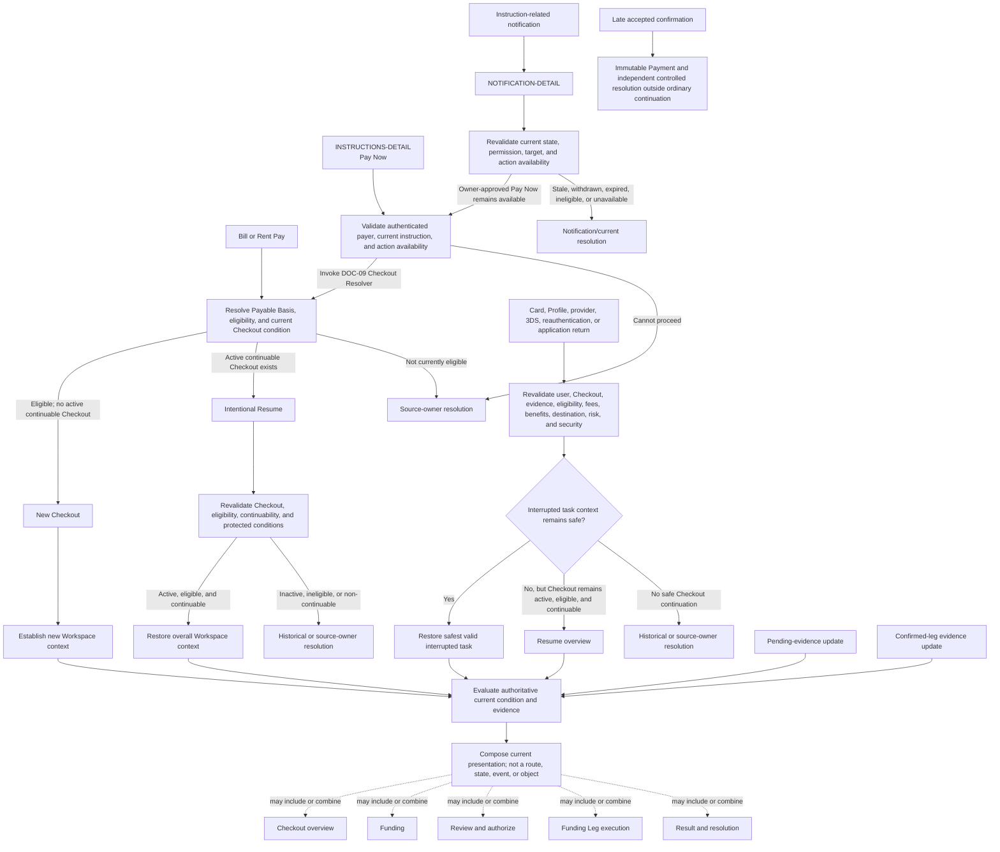
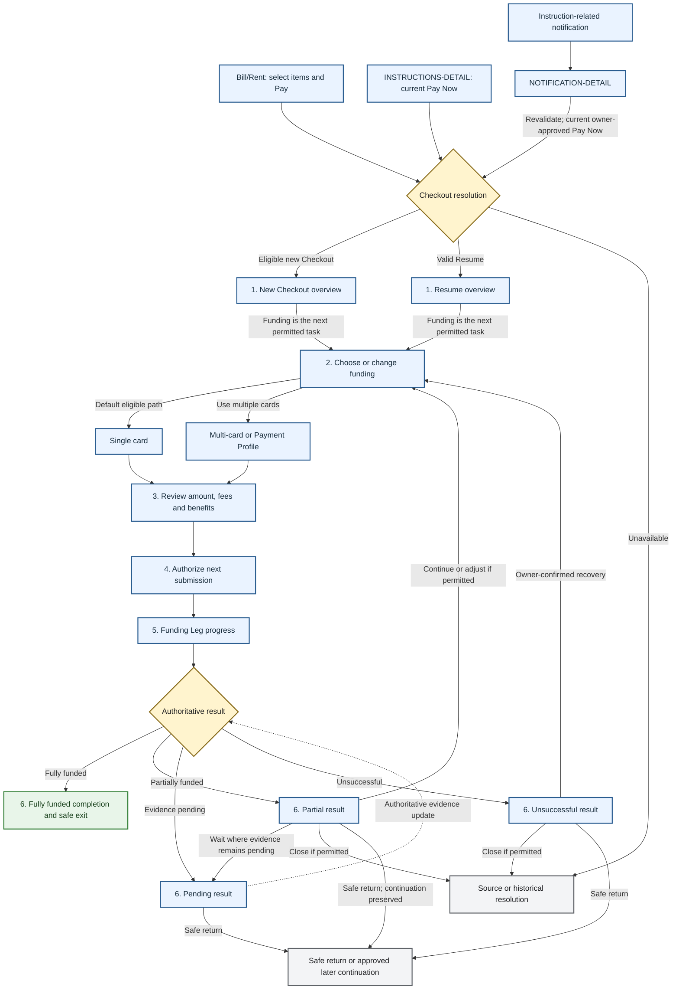

# DOC-06B - Navigation, IA & Route Taxonomy

| Document Control | Details |
| --- | --- |
| **Document ID** | `DOC-06B` |
| **Title** | Navigation, IA & Route Taxonomy |
| **Version** | `0.1.47` |
| **Status** | Founder Working Baseline |
| **Owner** | Product / Founder |
| **Reviewers** | Product Lead<br>Design Lead<br>Engineering Lead<br>Growth Lead<br>Privacy Lead<br>Operations Lead |
| **Approvers** | Project Owner<br>Product Lead |
| **Last Updated** | `2026-08-04` |
| **Classification** | Internal |
| **Related Documents** | DOC-06 User Journey, UX Flow & Service Blueprint<br>DOC-06A Core User Journeys & Service Blueprint<br>DOC-06C Bills, Rent & Tenancy UX Module<br>DOC-06D UX Requirements, Acceptance Criteria & Test Matrix<br>DOC-07 Content, Disclosure & User Authorization Specification<br>DOC-08 Notification, Receipt & Communication Rules<br>DOC-09 Payment Domain Architecture<br>DOC-10 Payout & Reconciliation<br>DOC-12 Bill Category, Document AI/OCR & Payee Verification Specification<br>DOC-13 Promotion Engine, Coupon, Voucher, Referral & Membership Specification<br>DOC-15 Privacy, Data Protection & Record Retention<br>DOC-18 Data Model, Transaction State, Audit Event & Reporting Specification<br>DOC-19 Security, Tokenization & Authentication<br>DOC-21 Monitoring, Incident Response & Operational SOPs<br>DOC-22 Admin Management Dashboard Operations Workflow |

---

## 1. Purpose

DOC-06B governs PayPlus global app navigation, information architecture, dashboard placement, route taxonomy, screen/component/action ID standards, and route completion tracking.

## 2. Scope Boundary

DOC-06B owns how app areas, routes, screens, views, sheets, components, actions, flows, and system touchpoints are named, grouped, opened, and routed at the product UX level.

DOC-06B does not own detailed Bills/rent/tenancy route behavior, which belongs to DOC-06C. It does not own checkout processing, payment instruction mechanics, evidence verification logic, data schema, notification delivery rules, privacy implementation, or admin workflow detail.

When drafting global non-Bills routes, DOC-06B should define the human-readable route-level UX baseline: route ID, entry points, destination relationships, user purpose, major sections, core visible fields and actions, view/filter structure, return behavior, and handoff rules. Exact visual styling and detailed lifecycle, status, payment, evidence, risk, notification, privacy, data, or admin logic remain in their owning documents and should be referenced rather than duplicated.

## 3. Completion Markers

| Area | Status | Notes |
| --- | --- | --- |
| Entrance and authentication | Defined behavior baseline | `ENTRANCE-ROOT`, the Login family, Registration, Recovery, and Account Activation handoffs are defined; final visual design, Entrance carousel configuration, and technical security mechanics remain open. |
| Bottom navigation | Working baseline | `HOME-ROOT`, Bills, `PAYPLUS-ACTION-SHEET`, Offers, and Me baseline exists; final visual design remains open. |
| Home dashboard | Partially defined | `HOME-ROOT` and section order exist; final card and visual details remain open. |
| Pay+ action sheet | Defined baseline | `PAYPLUS-ACTION-SHEET`, its five MVP actions, role direction, destination handoffs, availability behavior, and motion principles are defined; exact visual specification remains open. |
| Shortcut grid and More | Defined baseline | Home supports a default and maximum of 8 shortcuts including protected `More`; `MORE-ROOT` manages account-level shortcut preferences and approved secondary-service entry. Final visual design remains open. |
| Route taxonomy and ID standard | Working baseline | Stable product destination rules are defined; the canonical destination inventory is maintained in `docs/traceability/route-register.md`. |
| Non-Bills route registry | Working baseline | Requests, Instructions, Payment Profile, Activity, Receipts & Statements, Offers, Rewards, Referral, Me core child routes, Receiving Info, and the Archive hub/document route have route-level baselines; undefined destinations remain visible in the route register. |
| Notifications | Defined baseline | `NOTIFICATION-ROOT`, Inbox, Detail, and Settings behavior, entry/return rules, filters, archive visibility, and owning-domain handoffs are defined. Final visual styling remains open. |
| Payment Checkout | Partially defined | `PAYMENT-CHECKOUT` is defined as one persistent Checkout Workspace with Bill/Rent resolver entry, adaptive presentation, funding, review, execution, resolution, protected return, accessibility, and owner handoffs. |

---

## 4. Route Object Taxonomy

| Type | Definition |
| --- | --- |
| Area | Broad product area such as Home, Bills, Offers, Me, Requests, Instructions, Receipts, Cards, or Support. |
| Route | Navigable destination or deep-link target. |
| Screen | Full-page UI view rendered inside a route. |
| Tab / View | Role-aware, state-aware, or filtered view inside a screen. |
| Sheet / Modal | Temporary focused interaction, such as the Pay+ action sheet or confirmation modal. |
| Component | Reusable UI unit such as a card, badge, action row, timeline entry, or carousel card. |
| Flow | Ordered multi-step journey that may span routes, screens, sheets, and system touchpoints. |
| Action | User-triggered behavior such as Pay, Request, Remind Payer, Upload Evidence, Set Reminder, or Archive. |
| System Touchpoint | Automated validation, notification, audit event, risk routing, status update, OCR/autofill step, or integration handoff. |

### 4.1 Route Registry Table Standard

Route and screen registry tables should use this structure where practical.

| Column | Requirement |
| --- | --- |
| ID | Stable route, screen, component, or action ID. |
| Type | Area, Route, Screen, Tab/View, Sheet/Modal, Component, Flow, Action, or System Touchpoint. |
| Area | Parent product area. |
| Role | Payer, payee, admin, system, or mixed. |
| Opened By | Navigation element, action, notification, deep link, or system state. |
| User Purpose | Why the user is here. |
| Allowed Actions | Actions available from this object. |
| System Touchpoints | Major system actions triggered or displayed. |
| Owning Doc | Formal document owning detailed behavior. |
| Related IDs | Related requirements, states, events, notifications, or tests. |

### 4.2 Stable ID Standard

| Artifact | Pattern | Example |
| --- | --- | --- |
| UX requirement | UXREQ-06B-001 | UXREQ-06B-001 |
| Product route / destination | Semantic product name | OFFERS-ROOT, OFFERS-CARD-LIST |
| Screen | SCREEN-06B-{NAME} | SCREEN-06B-HOME-DASHBOARD |
| View | VIEW-06B-{NAME} | VIEW-06B-OFFERS-HUB |
| Sheet / Modal | SHEET-06B-{NAME} | SHEET-06B-PAYPLUS-ACTION |
| Component | COMP-06B-{NAME} | COMP-06B-SHORTCUT-GRID |
| User action | ACT-06B-{NAME}-{NNN} | ACT-06B-OPEN-PAYPLUS-001 |
| Event signal | EVT-06B-{NAME} | EVT-06B-SHORTCUT-TAPPED |
| Open question | OQ-06B-001 | OQ-06B-001 |

Product destination IDs remain independent of DOC-06B and must survive future document restructuring. Reserve `*-ROOT` for an independent area's main screen and use clear child-screen suffixes such as `*-LIST` or `*-DETAIL`. Ordinary entry points are recorded through source/action/destination/return transitions rather than permanent IDs. Document-scoped requirement, screen, component, action, and test IDs may still be assigned progressively for traceability.

### 4.3 Route Ownership Rule

Each route must have one primary owner. DOC-06B may list related documents, but related documents must not become duplicate owners of the same detailed route behavior.

| Route Work Item | DOC-06B Owns | Reference / Handoff Owner |
| --- | --- | --- |
| Route shell | Route ID, route purpose, entry points, destination relationship, major sections, empty state, and high-level allowed actions. | N/A |
| Request lifecycle | Route entry and where request lists open. | DOC-06A owns lifecycle, status meaning, acceptance, rejection, expiry, cancellation, and any later clarification/dispute extension if enabled. |
| Bills/rent request implementation | Global shortcut and route relationship. | DOC-06C owns `BILLS-PAY`, `BILLS-RECEIVE`, cards, details, request/remind-payer actions, and Bills-route handoff. |
| Payment/checkout route | Route ID, screen structure, entry/return behavior, interaction presentation, and handoffs. | DOC-09 owns Payment Domain architecture, monetary invariants, obligations, Checkout Workspace, funding execution, payer-authorization boundaries, Payments, and Payment Applications. DOC-07 owns Outcomes/Messages/CTAs; DOC-18 owns machine implementation. |
| Payment Profile route | Route shell, entry points, major screens, card/profile management purpose, and route handoff. | DOC-09 owns payment-time Funding Allocation and execution semantics. DOC-19 owns tokenization and security mechanics. |
| Notification destination | Route target for a notification tap. | DOC-08 owns notification IDs, channels, templates, preferences, and delivery rules. |
| Data/intelligence signal | Signal existence at route level. | DOC-18 owns event taxonomy, schema, lineage, analytics, and reporting. |

### 4.4 Canonical Product Destination Register

`docs/traceability/route-register.md` is the canonical inventory of product destinations. It records each destination's parent, type, purpose, primary owning document, and definition status without duplicating route behavior.

When this document or another route owner defines, renames, replaces, or materially advances a destination, the same integration change must update the route register, the affected parent/family status, DOC-06D test readiness, and the Mermaid route map where navigation changes. Components, filters, tabs, and ordinary entry actions must not be added as routes.

---

## 5. Authentication Entry, Logged-in Home Dashboard and Navigation IA

### 5.0 Entrance and Authentication Route Family

`ENTRANCE-ROOT` is the only unauthenticated app root. Log In and Create Account are actions within `ENTRANCE-ROOT`, not a second route. `ENTRANCE-CAROUSEL` is a screen component, not a route; tapping one of its approved public items opens the separately navigable `ENTRANCE-PROMOTION-DETAIL`.

| Destination | Type | Purpose | Definition Status |
| --- | --- | --- | --- |
| `ENTRANCE-ROOT` | Unauthenticated root screen | Present public PayPlus entry content and the Log In / Create Account actions. | Behavior baseline defined; visual design and carousel configuration open |
| `ENTRANCE-PROMOTION-DETAIL` | Public child screen | Display one approved public promotion, offer, announcement, or feature item and its permitted action. | Screen baseline defined; content/action configuration open |
| `AUTH-LOGIN` | Route family / entry resolver | Resolve an existing-user login into Fast or Full Login according to the current device and account context. | Resolver rules defined |
| `AUTH-LOGIN-FAST` | Child login screen | Reauthenticate a remembered eligible account through user-enabled device biometrics or password fallback. | Screen behavior defined; technical mechanics open |
| `AUTH-LOGIN-FULL` | Child login screen | Offer Google, Apple, or email/password login where Fast Login is unavailable or another account is selected. | Screen behavior defined; technical mechanics open |
| `AUTH-RECOVERY` | Reusable child flow | Recover an existing PayPlus login password or resolve account-access recovery through an approved controlled flow. | Product behavior and resolution baseline defined; detailed security, support, message, and notification mappings open |
| `AUTH-REGISTRATION` | Child registration flow | Complete Google, Apple, or email account creation and create a restricted account only after all account-creation gates pass. | Screen and account-creation baseline defined |
| `ACCOUNT-ACTIVATION` | Reusable orchestration flow | Coordinate the remaining phone, identity, and payment-passcode requirements for full registration. | Route, banner, and child handoffs defined |
| `PHONE-VERIFICATION` | Reusable `ACCOUNT-PROFILE` child flow | Verify or replace the account phone number through the approved method; Account Activation may invoke initial verification contextually. | Defined behavior baseline; security constants remain with DOC-19 |
| `IDENTITY-VERIFICATION` | Reusable `ACCOUNT-PROFILE` child flow | Complete first-time verification, resume processing, retry a failed attempt, or respond to an admin-required update; Account Activation may invoke it contextually. | Defined behavior baseline; provider mapping remains TBC |
| `PAYMENT-PASSCODE-SETTINGS` | Reusable `ACCOUNT-SECURITY` child flow | Set, change, or reset the six-digit payment passcode and manage the permitted card/profile confirmation preference; Account Activation may invoke Set contextually. | Defined behavior baseline; technical controls remain with DOC-19 |
| `HOME-ROOT` | Logged-in root screen | Provide the task-first dashboard after successful login or restricted-account creation. | Dashboard baseline defined; final UI pending |

#### Authentication Outcome and Resolution Rule

The Authentication route family applies the repository-wide decision chain:

```text
Business Rule and Current Context
    -> Decision or Evaluation
    -> Outcome
    -> Resolution Strategy
    -> DOC-07 Message and CTA
    -> DOC-08 Notification, when required
    -> DOC-18 Audit and Correlation
    -> DOC-06D / DOC-20 Acceptance Coverage
    -> Technical Implementation and Automated Test
```

DOC-06B owns route-level Outcomes and the permitted Resolution Strategies at the human-readable product level. A Resolution Strategy may continue, restart, redirect, wait, invoke controlled Support, or stop. It is not a route, persistent status, message, CTA, or notification, and it does not require a standalone software service.

Resolution must be capability-aware but disclosure-safe. PayPlus must use only currently permitted authentication or recovery capabilities and must not reveal whether an account or login method exists before the required assurance. A remembered device, phone number, identity record, or provider email is not sufficient recovery proof unless DOC-19 and the applicable owning rules permit it.

The current AUTH-family resolution baseline is:

| Flow | Evaluation focus | Permitted resolution baseline |
| --- | --- | --- |
| `AUTH-LOGIN` | Current session, remembered-account eligibility, enabled login method, device and security context. | Resume an approved session, open Fast Login, open Full Login, or require Recovery. |
| `AUTH-LOGIN-FAST` | Biometric availability/result, remembered email, password fallback, and another-account choice. | Continue login, use password fallback, use Full Login, open Recovery, cancel, or wait/retry where permitted. |
| `AUTH-LOGIN-FULL` | Selected linked login method, credentials/provider result, account eligibility, and protected return. | Continue login, try another method, open Recovery, offer Registration where appropriate, cancel, or use Support where required. |
| `AUTH-REGISTRATION` | Attempt validity, provider/email verification, uniqueness, consent, and account-creation result. | Continue, restart, redirect to Login/Recovery, try another method, cancel, or stop account creation. |
| `ACCOUNT-ACTIVATION` | Missing phone, identity, and passcode requirements and each child result. | Invoke a missing child, wait for processing, permit retry/help, remain restricted, or complete and return after revalidation. |
| `PHONE-VERIFICATION` | Phone input, possession verification, replacement controls, expiry, restriction, and interruption. | Continue, resend, restart, wait, use Support, or stop where controls prohibit continuation. |
| `IDENTITY-VERIFICATION` | Current five-state identity status, provider processing, retry eligibility, and admin-required update. | Start/continue, wait and view status, retry/get help, perform an approved update, or remain blocked. |
| `PAYMENT-PASSCODE-SETTINGS` | Set/Change/Reset mode, matching entry, reauthentication, registered-phone access, restriction, and save result. | Continue, correct, retry, use controlled recovery, wait for reconciliation, cancel, or return safely. |

These mappings refine handling only. They do not change existing login, account-creation, activation, verification, passcode, security, or return decisions.

#### 5.0.1 `ENTRANCE-ROOT`

The screen order is:

1. header with PayPlus logo, language action, and public Support and Terms actions;
2. `ENTRANCE-CAROUSEL`, showing only approved public and non-personalized content;
3. `Log In` and `Create Account`.

Language selection is a sheet or modal, not a route. Support and Terms handoffs must permit an anonymous-safe view. Carousel selection opens `ENTRANCE-PROMOTION-DETAIL`, which shows Back, title, approved image/content, applicable public terms, and one configured action. The action may open an approved public destination, `AUTH-LOGIN`, or `AUTH-REGISTRATION`; it must not expose personalized eligibility, claim a user-specific benefit, or reveal account information before authentication. Back restores the prior Entrance carousel position.

The exact Entrance carousel capacity, rotation, targeting, ordering, visual design, content classes, and permitted action configuration remain open. Future admin management belongs to DOC-22; promotion and offer meaning remains with DOC-13.

#### 5.0.2 Login Route Family

Tapping Log In invokes `AUTH-LOGIN`:

- resolve to `AUTH-LOGIN-FAST` when the device has a remembered account, the account has an eligible login method, and user-enabled biometric or password fast-login conditions remain valid;
- resolve to `AUTH-LOGIN-FULL` when Fast Login is unavailable, expired, revoked, or the user selects another account;
- bypass both child screens when an approved session can be resumed securely.

Fast-login eligibility lasts one month and is renewed by each successful login. Risk, device, credential, account, or security changes may revoke it earlier. PayPlus may remember the verified email identifier and approved device/session credential, but must never remember or store the plaintext password. The remembered email is masked on the pre-login screen.

On an eligible device, `AUTH-LOGIN-FAST` automatically presents the operating-system biometric prompt only where the user previously enabled biometric login. Cancellation, failure, or unavailability opens a slide-up sheet over a dimmed and blurred background containing:

1. masked remembered email;
2. password field with Forgot Password action;
3. device-appropriate `Use Fingerprint` or `Use Face ID` action;
4. `Log In`;
5. `Log In With Another Account`;
6. `Cancel`.

`Log In With Another Account` requires confirmation, revokes the current device session and refresh token, clears remembered account context, fast-login credential, and protected route history, then opens `AUTH-LOGIN-FULL`. It does not unlink account login methods. Cancel returns to `ENTRANCE-ROOT`.

`AUTH-LOGIN-FULL` shows Back, title, Continue with Google, Continue with Apple, and Continue with Email. Its Email view contains email, password, Forgot Password, Log In, and Cancel. The Email form is a view inside `AUTH-LOGIN-FULL`, not another route. Forgot Password opens `AUTH-RECOVERY`.

Provider identities use the stable provider-specific identifier. Matching email never creates, merges, transfers, or links an account. A linked provider may proceed through normal login and required step-up. An unlinked provider offers Create Account or Try Another Method without automatic email-based linking. Before the user proves control of an identifier, login and recovery errors must avoid confirming whether an account exists.

#### 5.0.3 `AUTH-RECOVERY`

`AUTH-RECOVERY` is one reusable flow for resetting an existing PayPlus login password or resolving account-access recovery through another approved method. It does not reset the Payment Passcode, recover Google or Apple credentials, create a provider-only user's first PayPlus password anonymously, change the primary email, merge accounts, or preserve authentication or payment authorization.

Invocation contexts are:

- Forgot Password from `AUTH-LOGIN-FAST` or the Email view in `AUTH-LOGIN-FULL`;
- a controlled Login or Registration conflict that permits Recovery without revealing account existence; and
- a protected destination that requires authentication before it can be reconsidered.

Recovery cases are internal modes or screen states inside `AUTH-RECOVERY`, not separate routes.

| Screen / state | Required product behavior |
| --- | --- |
| Recovery Start | Show Back, recovery title, a masked remembered email where permitted or editable email input, Continue, Try Another Login Method, Get Help, and Cancel. |
| Check Your Email | Show the submitted address subject to DOC-07 disclosure/masking rules and a neutral instruction to check email. Show `Cannot receive the email?`, a disabled `Resend` action with visible countdown, and clickable `Cannot Access This Email?`. Do not show `Open Email App` or an inline Change Email action; Back returns to Recovery Start for correction. |
| Link Validation | Validate the single-use deeplink silently. Show neutral loading only where needed and do not expose account, token, provider, restriction, or technical validation detail. |
| New Password | Show new-password and confirm-password fields, visibility controls, approved requirements, Confirm, and Cancel. Both entries must match before submission. |
| Recovery Resolution | Present only the safe next action permitted by the current Outcome, assurance, available capability, and control context. This is a conditional state, not a general error page or separate route. |
| Support-Authorized Setup | Permit restricted login-method setup only after approved Support recovery authorization. It does not create a normal authenticated session or bypass activation. |
| Recovery Complete | Confirm completion and session termination, then offer `Return to Log In` to `AUTH-LOGIN-FULL`. Successful reset does not log the user in. |

The Check Your Email presentation must behave equivalently where account, password, provider-link, restriction, or delivery eligibility cannot be disclosed. Exact wording, masking, Outcome IDs, Message IDs, CTA labels, and surface treatment belong to the DOC-07 Authentication slice.

##### Capability-Aware Recovery Resolution

Recovery evaluates the safest currently permitted path rather than presenting a raw-error catalogue.

| Situation / Outcome | Resolution Strategy | Product handling |
| --- | --- | --- |
| Recovery request accepted for neutral processing | Continue | Show Check Your Email without confirming account or password existence. |
| Reset link valid and an existing PayPlus password is eligible for reset | Continue | Open New Password in a restricted reset session. |
| Link invalid, expired, consumed, or reused | Restart | Permit Request New Link or Return to Login through the DOC-07 mapping. |
| Email inaccessible and an already-linked login method is safely usable | Redirect | Permit Try Another Login Method without exposing unverified linkage details. |
| Provider-only account has no PayPlus password | Redirect | Return to provider login or controlled Support; do not create a first password through anonymous Recovery. |
| Provider temporarily unavailable or cancelled | Redirect / Wait | Permit provider retry, another approved method, Provider Help, or Support as applicable. |
| No approved self-service method remains | Support | Begin controlled Support-assisted recovery. Phone OTP alone is insufficient. |
| Support cannot establish the required ownership assurance | Stop | Use a safe Recovery Not Permitted treatment without creating a security bypass or promising recovery. |
| Temporary security/service restriction or reset result is unconfirmed | Wait | Prevent unsafe duplicate submission, reconcile the result, and provide only an approved retry, return, or Support path. |
| Password reset completed | Redirect | Revoke affected sessions and authentication context, then return to `AUTH-LOGIN-FULL`. |

A trusted device, phone number, identity record, or provider-returned email may support risk or ownership assessment but is not an independent recovery capability unless DOC-19 expressly permits it. Support is a controlled final recovery capability, not an ordinary convenience option.

##### Security, Support, and Return Rules

- A reset deeplink is single-use and expiring. Exact validity, resend cooldown, retry, throttling, token, and abuse controls belong to DOC-19.
- A valid link creates a restricted password-reset session only.
- Anonymous reset requests must not revoke sessions, lock the account, change credentials, or reveal account/login-method existence.
- Successful reset revokes active sessions, refresh tokens, Fast Login eligibility, remembered authentication context, biometric login binding, effective device trust, and sensitive pending authorization state. Device records remain where required for audit.
- Google and Apple credential recovery remains provider-owned. A usable linked provider may authenticate normally, after which first-password setup remains an authenticated `ACCOUNT-SECURITY` flow.
- If the primary email is unavailable and no linked login method works, Recovery hands off to controlled Support. Detailed proof, cooling-off, approval, restriction, and case handling remain with DOC-19, DOC-21, and DOC-22.
- PayPlus may securely remember only an opaque intended destination during Recovery. After successful login, the destination and current permissions must be revalidated before return. Credentials, provider payloads, authorization results, and payment submission state must not be preserved.
- A payment return must revalidate the obligation, evidence, amount, fees, benefit selection, payment method, receiving destination, activation, payer authorization, and risk controls. Payment must never auto-submit after Recovery.

DOC-08 decides reset-link delivery and post-recovery security-notification treatment. DOC-18 owns recovery attempts, Outcomes, Resolution occurrences, correlations, session-revocation evidence, Support-case linkage, and audit lineage. DOC-20 owns detailed positive, neutral-equivalence, negative, expiry, replay, interruption, unconfirmed-result, accessibility, and return tests.

#### 5.0.4 Registration Attempt and Account Creation

`AUTH-REGISTRATION` offers Google, Apple, and Email paths:

- Google/Apple authenticates the provider, checks the stable provider identifier, uses a provider-confirmed verified email or verifies another entered email by OTP, checks primary-email uniqueness, captures referral context where applicable, records Terms/Privacy acceptance, and creates the restricted account;
- Email verifies the email by OTP, creates and confirms a password, captures referral context where applicable, records Terms/Privacy acceptance, and creates the restricted account.

A provider identity already linked to an account offers Continue to Log In. An unlinked provider whose proposed primary email already belongs to an account must stop account creation and direct the user to Login or Recovery; it must not link by email.

Before restricted-account creation, PayPlus records a temporary registration attempt, not an account:

- the attempt has its own attempt identifier and may retain temporary provider, email, phone, referral, consent, OTP, abuse-control, and audit context;
- it creates no account ID, dashboard, Inbox, user profile, referral attribution, login right, or financial permission;
- proposed email, phone, provider identity, and other login identifiers remain immediately available and are not reserved or occupied;
- killing or abandoning the app does not block an immediate new attempt using the same identifier;
- an old attempt may remain for up to 30 minutes of inactivity for cleanup and security purposes, without reserving an identifier; a new attempt may invalidate an earlier OTP and remains subject to rate limits;
- final restricted-account creation atomically rechecks verified primary-email and provider-identity uniqueness, required verification, Terms/Privacy acceptance, and attempt validity;
- only the successful creation transaction claims the identifiers and creates referral attribution where applicable.

Referral deeplink or QR context remains prefilled and non-editable. Manual referral code entry remains optional and may be retried or cleared before account creation. DOC-13 owns attribution and qualification meaning.

After account creation, show `Complete Your PayPlus Setup` with `Complete Now` and `Do It Later`. Complete Now opens `ACCOUNT-ACTIVATION`; Do It Later opens `HOME-ROOT` with the applicable persistent Action Required banner.

#### 5.0.5 `ACCOUNT-ACTIVATION`

`ACCOUNT-ACTIVATION` completes full registration; it is not labelled payment setup. It may open after restricted-account creation, from the Home Action Required banner, or when a financially restricted action detects an incomplete requirement. It presents only the missing requirements and routes to `PHONE-VERIFICATION`, `IDENTITY-VERIFICATION`, or `PAYMENT-PASSCODE-SETTINGS`.

Account Activation orchestrates these handoffs but does not own or duplicate the reusable child routes. `PHONE-VERIFICATION` and `IDENTITY-VERIFICATION` are canonically under `ACCOUNT-PROFILE`; `PAYMENT-PASSCODE-SETTINGS` is canonically under `ACCOUNT-SECURITY`. When Account Activation invokes a child, completion or cancellation returns to `ACCOUNT-ACTIVATION` with refreshed completion state. A child opened from its canonical parent returns to that parent.

| Missing requirement | Banner | Action |
| --- | --- | --- |
| Two or more | `Complete your PayPlus setup` | `Complete Now` |
| Phone only | `Verify your phone number` | `Verify Now` |
| Identity only | `Verify your identity` | `Verify Now` |
| Passcode only | `Set up Passcode` | `Set Up Now` |
| Nothing missing | Banner hidden | None |

All banner actions enter `ACCOUNT-ACTIVATION`, which focuses the applicable incomplete step. Completion removes the registration-level restriction and returns to the originating permitted context: Home remains on Home; an interrupted payment or controlled action returns to that action after revalidation. Completion does not bypass evidence, role, payment, provider, risk, compliance, or other feature-specific gates.

One verified primary email, one verified phone number, and one verified individual identity may each belong to only one active individual account. A phone or identity conflict discovered after restricted-account creation blocks activation and routes to Login, Recovery, or controlled Support handling without automatic account merging.

The reusable child-flow behavior is defined in Sections 5.17.4.2 and 5.17.4.3. Account Activation must consume those flows without duplicating their screens or statuses. Final OTP constants, provider contracts, credential storage, retry/lockout controls, support-assisted recovery proof, and other technical security mechanics remain with DOC-17, DOC-19, and DOC-22 as stated below.

#### 5.0.6 Return, Failure, and Ownership Rules

Normal successful login opens `HOME-ROOT`. An approved protected deeplink resumes its intended destination only after authentication and current access revalidation; invalid, expired, consumed, or unauthorized destinations fall back to the safest owning root or Home without exposing protected content. Logout returns to `ENTRANCE-ROOT` and clears protected route history.

DOC-07 owns the future canonical Authentication Outcome, Resolution, Message, and CTA Matrix. The mechanism, Outcome inventory, owner-approved Resolution Strategy field, and required matrix fields are mandatory, but exact IDs, approved copy, and final mappings remain open. DOC-06B owns the route-level Outcome meaning, permitted Resolution Strategies, action destination, and return behavior consumed by that matrix. In-flow authentication messages are not Inbox notifications unless DOC-08 separately defines a notifiable event.

DOC-06A owns journey sequence, DOC-07 owns user-facing content and disclosure, DOC-13 owns referral attribution, DOC-15 owns account/privacy handling, DOC-18 owns attempt/event/correlation data, DOC-19 owns security mechanics, DOC-20 owns detailed test implementation, and DOC-22 owns admin/support handling and Entrance content configuration.

### 5.1 Design Intent

The logged-in Home Dashboard is the default landing screen after login.

It must be task-first. It should prioritize urgent user actions, payment-related obligations, request status, payment instructions, and recent payment records before promotional discovery.

The dashboard is not a marketing page. Promotions, partner offers, hot offers, PayPlus events, and feature announcements may appear only through controlled placements and must not obscure payment tasks or status visibility.

This section defines the designated dashboard flow and layout baseline for MVP discussion. It is not the finalized UI design, visual design, component specification, or exact route-level screen specification. Exact UI details remain subject to later DOC-06B refinement and future design/specification work.

Visual references:

- `docs/diagrams/payplus-home-dashboard-mvp-wireframe.svg` is a companion wireframe for this section. It supports human and AI understanding of layout hierarchy but does not override this document.
- `docs/diagrams/routes/payplus-app-route-map.md` is the Level 0 Mermaid navigation map. Detailed Home, Bills, Requests, Instructions, Payment Profile, Activity/Receipts, Offers/Rewards/Referral, Me, and Archive route families are maintained in separate maps listed in `docs/diagrams/README.md`. They are discussion and alignment aids, not final UI design.

---

### 5.2 Bottom Navigation

MVP bottom navigation should use five primary destinations.

| Nav Item | Definition | Route Relationship | Current Status |
| --- | --- | --- | --- |
| Home | Default task-first dashboard. | Opens `HOME-ROOT`. | Discussion baseline |
| Bills | Bill, fee, rent, tenancy, and obligation record management area. | Opens Bills area covering saved bill/rent/tenancy records and their DOC-06C sub-routes. Requests, instructions, receipts, cards, referral, and More remain separate management routes or shortcut destinations unless explicitly embedded as contextual handoffs. | Discussion baseline |
| Pay+ | Central payment and request action. | Opens `PAYPLUS-ACTION-SHEET` for payment, setup, continuation, and payee-to-payer request-payment actions. | Defined behavior / final visual design open |
| Offers | Promotion and partner-offer discovery area. | Opens `OFFERS-ROOT`. Issued rewards and referral participation remain separate routes reached through contextual handoffs. | Working baseline |
| Me | Permanent account and user-control area. | Opens `ME-ROOT` for account information, security and privacy, Bills access, payments and records, rewards, Referral, preferences, support, About PayPlus, terms, and logout. | Core account child routes defined / other details pending |

`Pay+` should be visually treated as the primary center action in the bottom navigation.

---

### 5.3 Pay+ Action Sheet

Tapping `Pay+` should open `PAYPLUS-ACTION-SHEET`, a slide-up action sheet rather than an independent root route.

The sheet contains user-friendly entry actions only. It creates no request, obligation, instruction, payment, or payout by itself and must not expose internal implementation terms.

#### 5.3.1 MVP Layout and Motion Principles

The designated baseline is:

1. the sheet animates upward over the current screen;
2. the background is dimmed and blurred to focus attention while preserving context;
3. five icon-and-label actions use a two-row grid:
   - first row: `Pay a Bill`, `Pay Rent`;
   - second row: `Add Bill / Rent`, `Continue Payment`, `Request Payment`;
4. action icons and labels enter with the sheet animation;
5. the center `Pay+` button toggles the sheet open and closed;
6. closing reverses the opening motion.

The design must support reduced-motion accessibility and future additional action rows without changing the five MVP action meanings. Exact iconography, measurements, spacing, blur strength, motion duration, easing, and final styling remain open.

#### 5.3.2 Action and Destination Rules

| Action | Destination | Required Behavior |
| --- | --- | --- |
| `Pay a Bill` | `BILLS-PAY` | Open a temporary Bill/Fee/non-rent selection scope without overwriting the user's saved Bills filters. After selection, the Bill Pay action resolves the current Payable Basis, current eligibility, and current Checkout condition under Section 5.20. It may begin a new Checkout only when eligible and no active continuable Checkout exists for the same basis; otherwise it resumes/resolves the existing Checkout or remains in the source-owner context. |
| `Pay Rent` | `BILLS-PAY` | Open a temporary Rent/Tenancy selection scope with the same saved-filter rule, then apply the same Checkout resolver rule while preserving rent/tenancy context. |
| `Add Bill / Rent` | `BILLS-ADD` | Start evidence-backed setup. QR scan, file/photo upload, and manual entry remain inside this flow and are not standalone Pay+ payment actions. |
| `Continue Payment` | `INSTRUCTIONS-DETAIL` or `INSTRUCTIONS-ROOT` | Count active pending Payment Instructions and continuable incomplete Checkout Workspaces, including visible review-blocked items. With none, show the action disabled; with one, open its detail; with more than one, open the list. Review-blocked items remain visible but cannot continue until the blocking condition is resolved. |
| `Request Payment` | `REQUESTS-NEW` | Start a payee-to-payer Request linked to an evidence-backed bill, fee, rent, tenancy, invoice, or approved obligation. This action is available by default to all users because one account may act as payer and payee. |

`Request Payment` in this sheet does not start a payer-to-payee linking request. A payer may create a separate optional linking request from the relevant bill/rent detail, `BILLS-LINKING`, or another approved contextual request action. That request may create shared visibility or communication after acceptance, but it is not payment authorization and is not required for a payer-created direct obligation or payment.

#### 5.3.3 Completion, Availability, and Return Rules

- Standalone Pay+ `BILLS-ADD` completion should show a success state with `Pay Now` when the new obligation is payment-ready and `Back to Home`. If it is not payment-ready, show the current verification/readiness state and do not enable `Pay Now`.
- If `BILLS-ADD` was opened from `REQUESTS-NEW`, preserve the request-creation return behavior instead of showing the standalone Pay+ completion state.
- Completed, cancelled, archived, and terminally expired instructions are excluded from `Continue Payment` eligibility.
- A globally unavailable or unlaunched action may be hidden. A user-specific, temporary, or review restriction should leave the action visible but disabled with a safe explanation that does not expose internal risk logic.
- Selecting an action closes the sheet and hands control to the owning route. Cancelling or closing the sheet returns to the unchanged originating screen and must not reopen the sheet.
- Opening the sheet must not silently discard unsaved work or interrupt external authorization. The app should block opening or require a leave confirmation where needed.
- The sheet and destination routes must prevent duplicate activation, and every destination must revalidate evidence, eligibility, risk, authorization, payment, and payout gates owned by the relevant documents.

The Pay+ action sheet must not create wallet, stored-value, cashout, unsupported P2P, generic QR payment, or automatic recurring-payment behavior.

#### 5.3.4 Configuration and Data Handoffs

DOC-22 may enable or disable actions by module, category, market, launch phase, or approved user segment and must audit configuration changes. Admin controls must not rename, reorder, or redirect the confirmed action semantics or bypass destination gates.

Material privacy-safe signals for later DOC-18 specification include sheet opened, sheet dismissed, action availability evaluated, action selected, blocked-reason category, and destination-handoff result. These signals must not contain sensitive evidence, identity, card, bank, request, or payment values.

---

### 5.4 Home Dashboard Section Order

The Home Dashboard should use the following MVP section order.

| Order | Section | Definition | Display Rule | Route Relationship |
| ---: | --- | --- | --- | --- |
| 1 | Header | Greets the user and provides quick access to high-priority utilities. | Always shown. | Inbox and coupon/rewards icons route to their respective screens. |
| 2 | Important Notice / Action Required | Combined swipeable section for urgent actions, account messages, system messages, announcements, late handling from payer/payee, expiring tenancies, and other important updates. | Disappears if empty. User may collapse with a close button. Eligible item types are initially defined here and may be expanded later. | Each card routes to the relevant task, detail, or message route. |
| 3 | Shortcut Grid | Operational shortcuts for common management tasks. Must not duplicate Pay+ direct payment-start actions. | MVP default and maximum is 8 shortcuts including protected `More`. Users may keep fewer than 7 configurable shortcuts, but `More` remains present. | Each shortcut routes to its related management area. |
| 4 | Featured / What's New / Hot Offer | One combined carousel for approved PayPlus announcements, partner campaigns, feature updates, hot offers, and service events. | Must be admin-controllable. Use one combined carousel at this stage. | Routes to `OFFERS-ROOT`, `OFFER-DETAIL`, announcement detail, or the relevant feature route. |
| 5 | Upcoming Bills / Rent | Summary of upcoming bills, fees, rent, tenancy obligations, due reminders, and related next actions. | Show when active or saved obligations exist. Detailed card fields may be refined later. | Routes to Bills area or the specific bill/tenancy detail. |
| 6 | Recent Activity | Limited list of recent transactions and status records. | Show recent items only, capped by dashboard display rules. | Arrow or View More routes to Recent Activity detail page. |

Dashboard section order may be refined later only through explicit design review. This baseline intentionally places the Featured / What's New / Hot Offer carousel below shortcuts and above Upcoming Bills / Rent.

---

### 5.5 Header Utilities

| Element | Definition | Route Relationship |
| --- | --- | --- |
| Greeting | User recognition area. | No route required, or profile route if tapped. |
| Inbox icon | Notifications, messages, payment alerts, request updates, support replies, system notices, and announcements. | Opens `NOTIFICATION-INBOX`. Request-related inbox items may route to `REQUESTS-ROOT`, `REQUESTS-DETAIL`, or the linked Bills/rent context depending on item type. |
| Coupon / rewards icon | Shortcut to the user's issued coupons, vouchers, and other supported rewards. | Opens `REWARDS-ROOT`. |

---

### 5.6 Shortcut Grid

The shortcut grid provides quick access to common non-payment-start tasks.

Shortcut grid items are entry points, not independent feature owners. Each shortcut should open or deep-link to the relevant owning route, screen, sheet, or management area. The owning document for the destination continues to govern detailed behavior.

MVP shortcut grid:

| Shortcut | Definition | Route Relationship |
| --- | --- | --- |
| Requests | Requests that ask another party to accept, link to, review, or reject a bill, rent, tenancy, fee, invoice, or approved obligation context. A request is not a payment. | Opens `REQUESTS-ROOT`. |
| Instructions | Payment instructions / 付款指示 for pending pay-later setups, incomplete split-card payments, pending funding legs, expired instructions, and action-required instruction items. | Opens `INSTRUCTIONS-ROOT`. |
| Bills & Tenancies | Saved bills, fee records, rent records, tenancy records, evidence status, due dates, and obligation details. | Opens `BILLS-ROOT`. |
| Receipts | Payment receipts and statements. Proof of payment remains available from relevant Activity contexts for MVP. | Opens `RECEIPTS-ROOT`. |
| Reminders | User-set due reminders for bills, rent, tenancy obligations, and manual reminders. | Opens `BILLS-REMINDER-LIST`. |
| Cards | Payment Profile route for managing tokenized cards and saved split-card profiles. The shortcut is an entry point, not checkout. | Opens `PAYMENT-PROFILE-ROOT`. |
| Referral | Referral entry point for sharing the user's reusable referral link, monitoring attributed-referee qualification, and managing corresponding referrer or referee rewards where enabled. | Opens `REFERRAL-ROOT`. Referral campaigns may be promoted in `OFFERS-ROOT`, but attribution, progress, and referral reward claiming remain owned by the Referral route. |
| More | Opens remaining or secondary shortcuts and services. | Opens `MORE-ROOT`. |

Support should not be part of the initial eight dashboard shortcuts. Support remains accessible through `Me`, issue-specific status screens, and/or `More` if enabled.

Shortcut display must support:

- an admin-managed approved catalog, default set, default order, and availability rules;
- a maximum of 7 user-configurable Home shortcuts plus protected `More`;
- fewer than 7 configurable shortcuts where the user prefers;
- account-level user order and visibility preferences overriding the eligible admin default;
- `More` remaining present as the final shortcut and recovery entry;
- restore to the current eligible admin default.

Detailed user behavior is defined in Section 5.18. Admin configuration belongs in DOC-22. User preference, visibility, and privacy/data handling belong in DOC-15 and DOC-18.

---

### 5.7 Featured / What's New / Hot Offer Carousel

The dashboard should use one combined promotional and announcement carousel.

The carousel may include:

- PayPlus feature updates;
- partner announcements;
- card partner offers;
- hot offers;
- service events;
- category launch announcements;
- approved campaigns;
- important non-urgent announcements.

The carousel must be admin-controllable, including placement, priority, start/end date, targeting, enable/disable, approval status, and audit log.

Detailed promotion eligibility, coupon/voucher logic, reward entitlement, campaign budget, and reversal logic belong in DOC-13. Detailed admin placement control belongs in DOC-22. Personalization and marketing data handling belong in DOC-15.

---

### 5.8 Upcoming Bills / Rent

The Upcoming Bills / Rent section should summarize the user's next relevant obligations.

Initial dashboard card information may include:

- biller, payee, landlord, or obligation name;
- category;
- amount;
- due date or rent period;
- payment status;
- evidence status where relevant;
- next action.

Exact card layout, maximum visible items, empty state, and filtering rules remain open and should be refined in later DOC-06B/DOC-06C route-level work.

---

### 5.9 Recent Activity

The Recent Activity section should display a capped list of recent transactions and status records.

Activity is the event or lifecycle view of what happened in the user account. Receipt is a transaction confirmation record for a completed transaction. Statement is a periodic or account-level summary record.

Dashboard recent activity items should show:

- date;
- item;
- action;
- amount;
- status.

The section should include a button or arrow to the Recent Activity detail page.

User-facing activity statuses must follow `docs/traceability/status-display-reference-matrix.md` so dashboard Recent Activity, global Activity, Bills activity, checkout result, receipts, statements, notifications, and future admin views do not invent conflicting labels for the same system/domain status.

Detailed receipt content, retention, and notification linkage belong in DOC-08, DOC-11, DOC-15, and DOC-18.

---

### 5.10 Route IA Workplan and Placeholder Titles

The DOC-06 family must next define what users see, what buttons exist, what each button does, and how route areas interact. The following titles are intentionally preserved as the working map so the route-level UI discussion does not lose scope.

| Area | Purpose of Future DOC-06 Family Detail | Current Status |
| --- | --- | --- |
| Entrance and Authentication Routes | Maintain the defined `ENTRANCE-ROOT`, Login family, Registration, Recovery boundary, Account Activation, Phone Verification, Identity Verification, and Payment Passcode behavior; finalize Entrance carousel configuration, provider mapping, technical security controls, tests, and outcome-message IDs/copy. | Behavior baseline defined / technical controls and final design pending |
| Bottom Navigation Route Map | Define how `HOME-ROOT`, Bills, `PAYPLUS-ACTION-SHEET`, Offers, and Me relate to top-level routes and deep links. | Working baseline; final visual design open |
| Pay+ Action Sheet Detail | Maintain the confirmed five-action behavior, destinations, availability, completion, return, and configuration boundaries; finalize only the remaining exact visual specification. | Defined behavior / final visual design open |
| Bills Tab IA | Define bill, fee, rent, tenancy, evidence, reminder, payment history, and setup sections under the Bills route. | Working baseline / not finalized |
| Offers and Rewards IA | Define `OFFERS-ROOT` discovery, category collection routes, `OFFER-DETAIL`, separate issued-reward management, referral handoff, and placement behavior. | Offers child-list baseline defined / not final visual design |
| Me Area IA | `ME-ROOT` is the permanent account-control route. Its section order, established-route handoffs, core account child-route behavior, masking, reveal, state, and return boundaries are defined in Section 5.17. | Core account child routes defined / other details pending |
| More Shortcuts IA | Maintain `MORE-ROOT` shortcut management, reorder/arrangement, restore-default behavior, approved secondary-service entry, and protected access to More. | Defined baseline / final visual design open |
| Requests Route | Define standalone Requests route shell, creation flow, entry points, list grouping, high-level actions, and handoff to request lifecycle or Bills/rent request detail. The route is for party-linking and request management, not payment processing. | Working baseline / not finalized |
| Instructions Route | Define payment instruction / 付款指示 route shell, deliberate Payment Instruction versus incomplete Checkout Workspace display, edit boundaries, cancellation/archive behavior, and checkout handoff. | Working baseline / not finalized |
| Bills & Tenancies Route | Define saved obligation list, tenancy detail, evidence status, payee/landlord detail, due dates, and linked payment actions. | Title preserved / not finalized |
| Activity Route | Define global account-level financial activity route shell, including role-aware `Paid` / `Received` views, single-entry transaction lifecycle behavior, and status-display matrix handoff. | Route shell defined / not final UI |
| Receipts & Statements Route | Define the searchable receipt/statement list, direct download, shared PDF preview, return behavior, and re-issue handoff. | Root and preview behavior defined / not final PDF design |
| Reminders Route | Define due reminders, user-set reminders, notification settings, and reminder destinations. | Title preserved / not finalized |
| Payment Profile Route | Define tokenized card management, saved split-card profile management, card status, default card, profile action-required behavior, and checkout/instruction handoff. | Route shell defined / not final UI |
| Referral Route | Define `REFERRAL-ROOT`, referral attribution and progress presentation, role-sensitive entitlement list/detail/claim screens, registration handoff, and issued-reward handoff. Referral campaigns may be discovered through Offers, but Referral remains a separate route. | Child-screen behavior defined / not final visual design |
| Admin-Configurable UI Marker List | Mark app UI elements that require admin configuration later without drafting admin UI in DOC-06. | Title preserved / DOC-22 owns admin UI |

App UI elements that currently require admin configuration markers include Pay+ action visibility, shortcut visibility/order/defaults, Featured / What's New / Hot Offer carousel placement, Important Notice / Action Required item types, feature/module enablement, request-payment availability, and route-level gating by user type, category, launch phase, risk state, or compliance restriction.

---

---

### 5.11 Requests Route Shell

DOC-06B owns the standalone Requests route shell. DOC-06A owns request lifecycle, status meaning, acceptance, rejection, expiry, and cancellation rules. DOC-06C owns Bills/rent/tenancy-specific implementation when the request is linked to a bill, fee, rent, tenancy, invoice, or obligation record. DOC-08 owns notification routing and delivery rules.

#### 5.11.1 Route Definition

| Item | Requirement |
| --- | --- |
| Route label | Requests |
| Product destination | `REQUESTS-ROOT` |
| Purpose | Let users create, view, manage, and respond to requests that connect parties to an evidence-backed bill, fee, rent, tenancy, invoice, or approved obligation context. |
| Boundary | A request is not a payment. The route must not authorize, process, capture, settle, or complete payment. |
| Default behavior | Open `Received` unless the user's last selected Requests view is available. Action-required received requests should be visually prioritized inside `Received`, not treated as a separate route. |

#### 5.11.2 Request Definition

A request is a payer-created or payee-created acceptance/linking request sent to the other party for an evidence-backed bill, fee, rent, tenancy, invoice, or approved obligation context.

Requests do not equal payment. A payer may pay a valid payee or payout destination without payee acceptance where evidence, verification, risk, payout, and authorization gates pass. If the payer-created record is not accepted or linked by a PayPlus payee user, the payee should not receive in-app visibility or in-app notifications for that record. A payee-created request requires payer acceptance before the payer can authorize payment from that request.

MVP request types include:

| Request Type | Sender | Recipient | Meaning |
| --- | --- | --- | --- |
| Payee-created acceptance request | Payee, landlord, biller, or recipient | Payer | Recipient is asked to accept or reject an evidence-backed bill/rent/fee request before payment can proceed from that request. |
| Payer-created linking request | Payer | Payee, landlord, biller, or recipient | Recipient is asked to accept linkage to a payer-created evidence-backed bill/rent/fee context for two-sided visibility and communication. |
| Request reminder | Sender or system | Pending recipient | Recipient is reminded to act on an existing request. A reminder must not create a new request. |

Accepted requests link the parties to the accepted context and may enable later payment readiness where all other gates pass. Acceptance must not be treated as payment authorization.

#### 5.11.3 Request Lifecycle and Display Labels

The canonical request lifecycle and user-facing labels are:

| Underlying State | Sender Sees | Receiver Sees | Visibility Rule |
| --- | --- | --- | --- |
| `Draft` | `Draft` | Not visible | Sender can continue, edit, or discard. |
| `Pending Evidence Verification` | `Waiting for Verification` | Not visible | Request must not be delivered until evidence is verified. |
| `Pending Receiver Action` | `Reviewing` | `Awaiting` | Receiver can review and act. |
| `Accepted` | `Accepted` | `Accepted` | Parties are linked to the accepted context. |
| `Rejected` | `Rejected` | `Rejected` | Rejection reason should be retained where provided. |
| `Expired` | `Expired` | `Expired` | Sender may resend where allowed. |
| `Cancelled` | `Cancelled` | `Cancelled` where already visible | Sender cancelled the request. |

`Archived` is a visibility state, not a request status.

`Received`, `Sent`, and `Archived` are route views. Submission, sending, sharing, viewing, reminding, archiving, and restoration are request events or visibility transitions. Evidence status, obligation readiness, payment/payout status, and linked support/dispute case status remain governed by their owning domains.

#### 5.11.4 Entry Points

| Entry Point | Route Behavior |
| --- | --- |
| Dashboard `Requests` shortcut | Opens `REQUESTS-ROOT`. |
| Header Inbox icon | Opens Inbox first; request-related inbox items may route to `REQUESTS-ROOT`, `REQUESTS-DETAIL`, or linked Bills/rent context depending on item type. |
| Request notification | Routes to `REQUESTS-DETAIL` by default when a specific request exists. It may route to `REQUESTS-ROOT`, `BILLS-PAY`, `BILLS-RECEIVE`, or linked bill/rent detail only where DOC-08 routing rules require it. |
| `+ Create Request` in `REQUESTS-ROOT` | Opens `REQUESTS-NEW`. |
| Pay+ `Request Payment` | Opens `REQUESTS-NEW` for a payee-to-payer Request. It must not create an open money request, start a payer-to-payee linking request, or bypass evidence-backed context setup. |
| `Request` action on Bills/rent card or detail | Creates, sends, resends, or updates a request record for the selected verified context. It does not open `REQUESTS-ROOT` by default. |
| `Remind Payer` action on Bills/rent card or detail | Creates or sends a request reminder event against the existing request; it does not create a payment action or a new request. |
| App link, WhatsApp deeplink, QR code, or approved channel | Opens onboarding/login first where required, then routes to `REQUESTS-DETAIL` for the relevant request context. |

#### 5.11.5 `REQUESTS-ROOT` List Screen

`REQUESTS-ROOT` is the request inbox and management list. It should not show payment actions, evidence editing actions, or bill/rent edit actions directly.

Recommended screen order:

1. Header: `Requests`.
2. Top-right `+ Create Request` action.
3. Search and filter controls.
4. Segmented views: `Received`, `Sent`, `Archived`.
5. Request cards.
6. Empty state.

`Received`, `Sent`, and `Archived` are views or filters inside `REQUESTS-ROOT`, not separate routes. Exact visual design, filter density, and sort options remain open.

#### 5.11.6 Request Card

A request card should show enough information for the user to identify the request without exposing unnecessary sensitive details.

MVP card fields:

- received date or sent date;
- linked bill, fee, rent, or tenancy name;
- counterparty name;
- category: bill, fee, or rent;
- amount where applicable;
- payment due date where applicable;
- request expiry date where applicable;
- request status using role-aware display labels;
- primary action label: `Review` for received requests and `View` for sent requests.

Payment due date and request expiry date are separate fields. Payment due date relates to the underlying bill/rent/fee obligation. Request expiry date relates to the acceptance/linking request.

Sensitive fields must follow DOC-15 masking and role-based display rules. Detailed linked bill/rent fields remain in DOC-06C.

Card-level material actions such as accept, reject, cancel, resend, or remind should not appear directly on the card. Selecting a request card opens `REQUESTS-DETAIL`.

#### 5.11.7 Request Detail Screen

`REQUESTS-DETAIL` is its own DOC-06B screen. It must not be replaced by the linked DOC-06C bill/rent detail screen, because the request is a party-linking and request-management object, not the bill/rent record itself and not a payment.

| Item | Requirement |
| --- | --- |
| Product destination | `REQUESTS-DETAIL` |
| Optional traceability screen reference | `SCREEN-06B-REQUESTS-DETAIL` |
| Purpose | Let the user understand, respond to, or manage one request before opening any linked bill/rent/tenancy context. |
| Boundary | The screen manages request status and request actions only. Payment authorization, checkout, evidence editing, and bill/rent record maintenance remain in the owning routes. |
| Linked-context handoff | If a linked bill/rent/tenancy exists, show a clear button such as `View Bill Detail`, `View Rent Detail`, or `View Tenancy`. That button opens the relevant DOC-06C detail route. |
| Return behavior | If the user opens DOC-06C bill/rent detail from `REQUESTS-DETAIL`, editing, saving, or backing out should return the user to `REQUESTS-DETAIL` and refresh the request summary. |
| Payment handoff | If the linked context is payment-ready, the screen may show a handoff to the relevant payment entry point, but payment flow remains governed by DOC-09 and the related DOC-06C route. |

Recommended detail screen order:

1. Status header: request status, direction, request expiry date, and payment due date where relevant.
2. Request summary: category, sender or recipient, linked bill/rent/tenancy name, amount, and message/note.
3. Linked context section: `View Bill Detail`, `View Rent Detail`, or `View Tenancy`.
4. Action area.
5. Request activity.
6. Secondary archive action where allowed.

Role-aware detail actions:

| User Context | Primary Actions |
| --- | --- |
| Recipient / received pending request | Accept, reject with reason, open linked bill/rent detail where available. |
| Sender / draft request | Send, edit, cancel. |
| Sender / waiting for verification | View, edit where allowed, cancel. |
| Sender / pending receiver action | View, remind, cancel, share where allowed. |
| Sender / rejected or expired request | Edit, resend, cancel or archive where allowed. |
| Accepted request | View details, archive where allowed. |
| Archived request | Restore where allowed, view retained request detail subject to DOC-15 visibility and retention rules. |

`Remind` must create a notification/event against the existing request, not a new request. Reminder limits, cooldowns, expiry, escalation wording, and channel eligibility belong to DOC-08 and DOC-22.

Request activity may show system-visible request events such as created, submitted for verification, verified and sent, viewed, reminded, accepted, rejected with reason, expired, cancelled, archived, or restored.

#### 5.11.8 `REQUESTS-NEW` Creation Flow

`REQUESTS-NEW` is the controlled request creation flow. It may be opened from the `+ Create Request` action in `REQUESTS-ROOT`, Pay+ `Request Payment` for payee-to-payer Requests, or an approved contextual Bills/rent request action. Payer-to-payee linking begins contextually and must not be mistaken for the Pay+ action.

The flow must not create an open money request. It must link to an evidence-backed bill, fee, rent, tenancy, invoice, or approved obligation before sending. It must not perform payment quote, checkout, authorization, funding, settlement, payout, or refund actions.

| Field | Requirement |
| --- | --- |
| Product destination | `REQUESTS-NEW` |
| Optional traceability screen reference | `SCREEN-06B-REQUESTS-NEW` |
| Route type | Controlled creation flow / screen group |
| Primary owner | DOC-06B |
| Linked owner | DOC-06C owns `BILLS-ADD` and Bills/rent detail handoff. DOC-08 owns notification and delivery-channel rules. DOC-12 owns evidence verification. DOC-15 owns privacy and counterparty lookup boundaries. |
| Primary user goal | Create a request that asks another party to accept or link to an eligible evidence-backed obligation context. |
| Boundary | A request is not a payment. This route prepares and sends the request only after the required evidence gate passes. |

The route should use the following section order:

| Order | Section | What User Sees / Does | Route Behavior |
| ---: | --- | --- | --- |
| 1 | Start Request | Header `Create Request`; short context that the request must link to a bill, fee, or rent item. | Preserve entry source for return behavior and analytics. |
| 2 | Category and Direction | Category selection: bill, fee, or rent. Direction should be inferred where possible from role and entry source. | Payee-to-payer requires payer acceptance before payment from that request. Payer-to-payee is for optional linking/adoption unless a gate requires payee action. |
| 3 | Linked Context | Select existing bill/rent/tenancy context, or create a new one. | Existing context stays in `REQUESTS-NEW`. New context opens `BILLS-ADD`; completion returns to `REQUESTS-NEW` with the created context selected. |
| 4 | Linked Detail Review | Compact summary: name, category, amount, due date, counterparty/payee/payer where applicable, evidence status, and readiness/status badge. | If evidence is missing, rejected, expired, or action-required, route to the relevant DOC-06C evidence/setup path before submission. |
| 5 | Counterparty and Delivery | Select counterparty by PayPlus user ID or phone-number identifier; add optional note; select allowed delivery method where available. | Lookup must be privacy-safe. Delivery options may include in-app, app link, WhatsApp deeplink, QR code, or approved channel. |
| 6 | Review and Submit | Final review of request summary, linked context, receiver, delivery method, expiry/due information where applicable, and notices. | Primary CTA should be `Submit and send after verification`. If evidence is already accepted, the system may send immediately. |

Counterparty lookup rules:

- lookup may use PayPlus user ID or phone-number identifier;
- lookup should confirm that a potential receiver exists only with minimal, privacy-safe display;
- lookup must not expose unnecessary account, KYC/KYB, evidence, payment, risk, or relationship data before acceptance;
- if no PayPlus user is found or the receiver is not onboarded, the sender may use an approved share/invitation method where enabled;
- final privacy, masking, and authentication controls belong to DOC-15 and DOC-19.

Evidence gate and send rules:

- the request must not be sent to the receiver before linked evidence is verified or approved by exception;
- the receiver must not be notified or shown the request while evidence verification is pending;
- if evidence is already accepted, the request may be sent immediately after user submission;
- if evidence becomes accepted after submission, the system should send the request automatically using the approved delivery method;
- if evidence is rejected or requires correction, the sender should see action required and the receiver should not receive the request;
- the request should remain linked to the evidence verification outcome for audit and support.

Share and delivery rules:

- in-app delivery is preferred where both parties are active PayPlus users;
- app link, WhatsApp deeplink, QR code, or other approved channel may be offered where enabled;
- external share content must avoid sensitive request, evidence, payment, identity, and account details;
- accepted share links should route through authentication or onboarding before opening `REQUESTS-DETAIL`;
- share-link expiry, resend limits, reminder cooldown, and channel eligibility belong to DOC-08 and DOC-22.

Return behavior:

- from `BILLS-ADD`, successful creation returns to `REQUESTS-NEW` with the created context selected;
- cancelling `BILLS-ADD` returns to `REQUESTS-NEW` without changing the selected context;
- opening linked bill/rent detail from request review should return to `REQUESTS-NEW` or `REQUESTS-DETAIL` according to the entry source;
- after request submission, the user should route to `REQUESTS-DETAIL` for the created request.

Primary state behavior:

| State | Sender View | Receiver View |
| --- | --- | --- |
| Draft | Editable draft. | Not visible. |
| Pending evidence verification | Waiting for verification; edit/cancel where allowed. | Not visible. |
| Action required | Evidence or linked detail correction required. | Not visible. |
| Sent / reviewing | Request detail shows sent status and allowed remind/share actions. | Request appears as awaiting review. |
| Accepted / rejected / expired / cancelled | Request detail shows final or current request state and available follow-up actions. | Same underlying state, role-appropriate actions only. |

#### 5.11.9 Empty, Action-Required, and Archive Behavior

| State | Behavior |
| --- | --- |
| Empty `Received` | Explain that requests sent to the user will appear here. |
| Empty `Sent` | Explain that requests the user sends will appear here. Creation must happen through `REQUESTS-NEW` or the relevant bill/rent/request flow, not as a free-floating open money request. |
| Empty `Archived` | Explain that archived requests will appear here. |
| Archived | Archived requests disappear from active views but remain retrievable subject to retention, audit, and role-based access rules. |
| Expiring soon | Show priority in `Received` or `Sent` and route to `REQUESTS-DETAIL`. |

#### 5.11.10 Data and Intelligence Signals

DOC-06B should identify route-level signals only. Final event taxonomy, schema, lineage, model eligibility, and analytics ownership remain DOC-18.

Material signals include:

- Requests route opened;
- request card viewed;
- request detail opened;
- request creation started;
- existing bill/rent selected for request;
- new bill/rent setup opened from `REQUESTS-NEW`;
- request submitted for evidence verification;
- request auto-sent after evidence verification;
- request accepted, rejected, cancelled, expired, archived, or restored where applicable;
- request reminder sent;
- request shared through approved channel;
- request notification opened;
- request led to linked bill/rent context opened;
- request led to payment-start handoff in `BILLS-PAY` where applicable.

These signals should support service quality, funnel analysis, risk review, support investigation, and future approved AI-driven payment intelligence without turning Requests into a payment or open P2P feature.

#### 5.11.11 Open Items

| Item | Owner | Status |
| --- | --- | --- |
| Final visual card density, tab style, sort/filter design, and empty-state wording | Product / Design | Open |
| Final `REQUESTS-DETAIL` visual layout, field density, copy, and button order | Product / Design | Open |
| Final `REQUESTS-NEW` visual styling, field-level validation copy, counterparty lookup display copy, and share-button placement | Product / Design / Privacy / Security | Open |
| Resend, reminder cooldown, expiry, and escalation rules | Product / Operations / DOC-08 / DOC-22 | Open |

---

### 5.12 Payment Instructions Route

The user-facing route label may be `Payment Instructions` or `付款指示`.

The route manages two distinct item kinds: deliberate pay-later Payment Instructions and incomplete Checkout Workspaces that remain continuable. It is not the normal pay-now checkout route, not a bill/rent reminder route, not a request route, not full card management, and not payment history. Surfacing both item kinds in the same management route does not make an incomplete Checkout Workspace a Payment Instruction.

| Field | Requirement |
| --- | --- |
| Root product destination | `INSTRUCTIONS-ROOT` |
| Detail product destination | `INSTRUCTIONS-DETAIL` |
| Optional traceability screen reference | `SCREEN-06B-INSTRUCTIONS-DETAIL` |
| Primary owner | DOC-06B owns route shell, list/detail layout, entry points, high-level actions, and route handoff. |
| Payment owner | DOC-09 owns Payment Instruction and Checkout Workspace business meaning, funding and monetary invariants, payer-authorization boundaries, confirmed Payment creation, Payment Application, and continuation rules. DOC-06B owns route-level screen behavior and presentation. |
| Related owners | DOC-08 owns notification delivery; DOC-13 owns promotion quote impact; DOC-15 owns masking/privacy; DOC-18 owns schema/events; DOC-19 owns security/tokenization; DOC-22 owns admin controls. |

#### 5.12.1 Instruction Definition

A Payment Instruction is a deliberate user-created pay-later arrangement. It is not created merely because an immediate Checkout is interrupted, partly funded, failed, cancelled, or abandoned.

Payment instruction is created only where:

- the user intentionally creates a pay-later instruction within the allowed instruction window;
- the instruction requires user action before payment can proceed.

An immediate Checkout that has started execution but has not fully funded its Checkout Target remains an incomplete Checkout Workspace. It may appear in this route for continuation or archive behavior, but it retains its own Checkout identity and lifecycle. Normal completed payments belong to receipt/activity surfaces. A user who wants an alert without creating a pay-later arrangement should create a normal reminder.

#### 5.12.2 Instruction Types

| Managed Item | Meaning | User Edit Boundary |
| --- | --- | --- |
| Pending Payment Instruction | User intentionally set up a future/pay-later arrangement and no Provider Submission has been initiated for the related Checkout. | User may update the instruction's permitted setup before execution. When Checkout begins, DOC-09 target-lock and authorization rules apply. |
| Incomplete Checkout Workspace | Immediate payment execution started but the immutable Checkout Target was not fully funded. It is not a Payment Instruction. | User may continue or close/archive the continuable Checkout presentation. Confirmed Payments and Payment Applications remain immutable; the locked Checkout Target and Obligation Allocations cannot be reduced or redefined. |

`Pay Now` is not an instruction type and does not identify a predetermined Checkout. It is a Payment Instruction action that invokes the DOC-09 Checkout Resolver. Every attempt may have session, provider, or audit records, but only deliberate pay-later arrangements are Payment Instructions.

#### 5.12.3 Entry Points

| Entry Point | Route Behavior |
| --- | --- |
| Dashboard shortcut `Instructions` | Opens `INSTRUCTIONS-ROOT`. |
| Pay+ `Continue Payment` | Disabled when no active pending Payment Instruction or continuable incomplete Checkout Workspace exists; opens `INSTRUCTIONS-DETAIL` for exactly one or `INSTRUCTIONS-ROOT` for more than one. Review-blocked items remain visible but cannot continue. |
| Important Notice / Action Required card | Opens the relevant `INSTRUCTIONS-DETAIL` where a specific instruction exists. |
| Payment action notification | Opens `NOTIFICATION-DETAIL` first. After current-state and permission revalidation, an owner-approved instruction action may invoke the same DOC-09 Checkout Resolver. It must not bypass Notification Detail or identify a predetermined Checkout. |
| Checkout flow | Creates or updates a Payment Instruction only when the user deliberately chooses pay later. An interrupted or partly funded immediate Checkout returns as an incomplete Checkout Workspace without conversion into an instruction. |

#### 5.12.4 `INSTRUCTIONS-ROOT` List Screen

`INSTRUCTIONS-ROOT` displays existing instruction cards and provides the entry point for creating a new instruction. It should not process payment directly.

Recommended screen order:

1. Header: `Payment Instructions` or `付款指示`.
2. Top action: `+ Add Instruction`.
3. Filter row: `All`, `Pay Later`, `Incomplete`, `Archived`.
4. Managed-item card list.
5. Empty state.

Cards should be compact. They should not behave like a full payment summary or receipt, and must identify whether the item is a Payment Instruction or an incomplete Checkout Workspace.

MVP card fields:

- linked bill/rent/fee name;
- category;
- payee / recipient name;
- intended amount for a Payment Instruction, or immutable Checkout Target plus remaining target amount for an incomplete Checkout Workspace;
- item type and current user-facing condition;
- timing label:
  - pending instruction: `Pay on [date]`;
  - incomplete Checkout Workspace: `Expires in X days`, `Expires today`, or `Expired`.

Card action:

- `View Detail` opens `INSTRUCTIONS-DETAIL`.

The card should not show detailed quote, fee, promotion, or full payment profile status. Those belong in the instruction detail screen or DOC-09 checkout/review.

#### 5.12.5 `INSTRUCTIONS-DETAIL` Detail Screen

`INSTRUCTIONS-DETAIL` explains and controls one Payment Instruction or one incomplete Checkout Workspace. It is a context and management screen; actual payment submission remains in `PAYMENT-CHECKOUT` under DOC-09 domain rules.

For a pending instruction, show:

- linked bill/rent/fee;
- category;
- payee / recipient;
- payment amount;
- selected payment profile or card allocation summary;
- payment schedule;
- expiry countdown;
- instruction status.

Pending instruction allowed edits:

- change target bill/rent, with payment details recalculated through DOC-09;
- edit payment amount;
- change payment profile/card allocation;
- change payment schedule.

Pending instruction actions:

- `Pay Now`, invoking the DOC-09 Checkout Resolver after current instruction and payer validation;
- `Update Instruction`;
- `Cancel Instruction`.

Instruction `Pay Now` does not unconditionally create, activate, or resume Checkout. The route consumes the resolver result owned by DOC-09:

| Resolver result | Route-level treatment |
| --- | --- |
| An active Checkout remains eligible and continuable for the instruction's current Payable Basis | Resume that existing Checkout after revalidation. Do not create another Checkout. |
| No active continuable Checkout exists and current instruction, obligation, evidence, eligibility, timing, and control conditions permit creation | Enter an eligible New Checkout with the instruction and source-aware return context. |
| The action is stale, withdrawn, expired, ineligible, unavailable, or otherwise cannot proceed | Remain in `INSTRUCTIONS-DETAIL` or return the applicable instruction/source-owner resolution. Do not create, resume, or reactivate Checkout. |

Before route handoff, the presentation must use current owner-supplied validity and action availability. The Checkout Workspace must revalidate applicable fees, benefits, funding, destination, risk, security, and authorization conditions. No stale authorization is carried forward, and tapping `Pay Now` creates no silent Funding Leg or Provider Submission.

For an incomplete Checkout Workspace, show:

- linked bill/rent/fee;
- category;
- payee / recipient;
- total intended amount;
- funded amount where applicable;
- remaining amount;
- payment method or split-leg progress summary;
- failed, pending, or retry-required leg summary where applicable;
- expiry countdown;
- instruction status.

Incomplete Checkout actions:

- `Continue Payment`, routing to DOC-09 checkout/review for remaining eligible action;
- `Archive`.

Incomplete Checkout must not allow reduction or redefinition of the locked Checkout Target, Obligation Allocations, confirmed Payments, or Payment Applications. Permitted changes to unexecuted funding arrangements must remain within the locked Checkout Target and follow DOC-09 allocation-version and renewed-authorization rules. Closing or expiry ends continuation only and does not rewrite confirmed financial facts.

#### 5.12.6 Add Instruction Flow

`+ Add Instruction` starts an instruction setup flow, not a generic checkout shortcut.

The flow should:

1. require the user to select an existing eligible bill, fee, rent, or approved obligation;
2. route to `BILLS-ADD` if the user needs to add a new bill/rent first;
3. route into DOC-09 payment setup rules for amount, payment profile/card allocation, timing, quote, eligibility, and authorization boundary;
4. create a pending instruction only when the user confirms a pay-later setup within the allowed instruction window.

If the selected target bill/rent changes during a pending instruction edit, the payee, amount, payment readiness, fee, promotion eligibility, schedule, and available payment profile/allocation must be recalculated through DOC-09 before the instruction can be updated or paid.

#### 5.12.7 Reminder and Notification Boundary

A payment instruction may generate app notifications, action-required alerts, and system tasks, but it should not create a normal user-visible `BILLS-REMINDER-LIST` reminder record.

| Concept | Route / Owner |
| --- | --- |
| Bill/rent due-date reminder | DOC-06C `BILLS-REMINDER-LIST` / `BILLS-REMINDER-DETAIL`. |
| User manual bill/rent reminder | DOC-06C `BILLS-REMINDER-LIST` / `BILLS-REMINDER-DETAIL`. |
| Notification-backed Payment Instruction action alert | Enters `NOTIFICATION-DETAIL`; after current-state, authenticated-payer, permission, target, and action-availability revalidation, an owner-approved current CTA may invoke the DOC-09 Checkout Resolver. It does not enter `INSTRUCTIONS-DETAIL`, `PAYMENT-CHECKOUT`, or checkout/review directly. |

This avoids duplicate user functions:

- Reminders mean "remind me about an obligation."
- Payment Instructions mean "finish or manage a pending payment setup."
- Checkout means "submit payment."

#### 5.12.8 Payment Profile / Card Allocation Boundary

Payment instruction may display selected payment profile, masked card, or split allocation summary because that information is needed to understand the pending payment setup.

Payment instruction must not become the full Payment Profile management route.

Allowed route behavior:

- show whether the instruction uses a single-card payment or split-card payment;
- show masked card or payment-profile allocation summary;
- show if a selected card or profile is unavailable, expired, failed, or requires action;
- for pending single-card instructions, provide `Choose Card` or `Update Card`;
- for pending split-card instructions, provide `Choose Profile` or `Edit Profile`;
- for incomplete Checkout Workspaces, preserve confirmed Payment and Payment Application facts and route only to permitted continuation, closure, or correction actions.

Handoff behavior:

- actual checkout selection, split allocation for the current payment, quote recalculation, card-leg authorization, and payment submission are governed by DOC-09;
- reusable card and split-profile management belongs to `PAYMENT-PROFILE-ROOT`;
- tokenization, card-data security, PSP return handling, and PCI mechanics belong to DOC-19.

`Choose Card`, `Update Card`, `Choose Profile`, and `Edit Profile` should open `PAYMENT-PROFILE-ROOT` in instruction-context mode and return to `INSTRUCTIONS-DETAIL` with refreshed card/profile data after the permitted selection, setup, or edit action.

#### 5.12.9 Data and Intelligence Signals

DOC-06B should identify route-level signals only. Final event taxonomy, schema, lineage, model eligibility, and analytics ownership remain DOC-18.

Material signals include:

- Instructions route opened;
- instruction card viewed;
- instruction detail opened;
- add instruction started;
- target bill/rent selected;
- pending instruction created;
- pending instruction updated;
- pending instruction cancelled;
- incomplete Checkout Workspace continued;
- incomplete Checkout Workspace archived from active presentation;
- instruction expired;
- payment profile/card issue displayed;
- user routed from instruction to Payment Profile;
- user returned from Payment Profile to instruction with refreshed card/profile data;
- user routed from instruction to checkout/review;
- user returned from checkout/review to instruction where applicable;
- instruction led to successful funding, partial funding, failure, expiry, cancellation, or payout-ready funded portion.

These signals support funnel analysis, payment-friction analysis, support investigation, risk monitoring, operations, and future approved AI-driven payment intelligence.

#### 5.12.10 Open Items

| Item | Owner | Status |
| --- | --- | --- |
| Final visual layout, field density, and exact button labels distinguishing Payment Instruction cards from incomplete Checkout Workspace cards | Product / Design | Open |
| Final expiry window, expiry countdown wording, cancellation/archive rules, and restore rules | Product / Payments / Operations | Open |
| Exact visual copy, placement, and return-state UI for handoff among `INSTRUCTIONS-DETAIL`, `PAYMENT-PROFILE-ROOT`, and DOC-09 checkout. Route direction is clarified in `docs/diagrams/routes/payplus-instructions-route-map.md` and `docs/diagrams/routes/payplus-payment-profile-route-map.md`. | Product / Payments / Security | Open |
| Exact user-facing notification/message/CTA wording and semantics, plus timing, delivery, eligibility, and current action availability for Payment Instruction action alerts | DOC-07 for wording and CTA semantics; DOC-08 for timing, delivery, eligibility, and current action availability; Product / Payments as applicable | Open |

---

### 5.13 Payment Profile Route

The final user-facing route label is `Payment Profile`. The dashboard shortcut may remain `Cards`.

The route manages reusable payment setup objects. It is not checkout, not a wallet, not a stored-value account, and not a way to move money without an eligible evidence-backed obligation.

| Field | Requirement |
| --- | --- |
| Product destination | `PAYMENT-PROFILE-ROOT` |
| Primary owner | DOC-06B owns route shell, entry points, major screens, route handoff, and high-level user actions. |
| Payment owner | DOC-09 owns actual checkout selection, payment quote, split-card allocation for a payment, authorization, funding-leg submission, and payment states. |
| Security owner | DOC-19 owns PSP/acquirer tokenization, card-data security, PCI boundary, authentication, and token handling. |
| Related owners | DOC-07 owns wording; DOC-08 owns notifications; DOC-13 owns card-linked benefit rules; DOC-15 owns masking/privacy; DOC-18 owns schema/events; DOC-22 owns admin controls. |

#### 5.13.1 Route Structure

`PAYMENT-PROFILE-ROOT` should use a two-tab structure:

| Tab | Purpose | Working IDs |
| --- | --- | --- |
| Cards | Manage individual tokenized credit cards for the payer account. | `PAYMENT-CARD-LIST`, `PAYMENT-CARD-ADD`, `PAYMENT-CARD-DETAIL` |
| Profiles | Manage saved split-card allocation templates created from tokenized cards. | `PAYMENT-PROFILE-LIST`, `PAYMENT-PROFILE-ADD`, `PAYMENT-PROFILE-DETAIL` |

Payment profiles belong to the payer user account. Payees must not see payer cards, payer payment profiles, token references, or private funding data.

#### 5.13.2 Entry Points and Return Behavior

| Entry Point | Route Behavior |
| --- | --- |
| Dashboard shortcut `Cards` | Opens `PAYMENT-PROFILE-ROOT`. |
| `ME-ROOT` / Payments & Records | Opens `PAYMENT-PROFILE-ROOT` or the relevant card/profile screen. |
| Checkout add/change card | Opens card add or selection flow and returns to DOC-09 checkout. |
| Checkout choose/edit split profile | Opens profile selection or edit flow and returns to DOC-09 checkout. |
| `INSTRUCTIONS-DETAIL` payment profile action | Opens the relevant card/profile screen and returns to the instruction or checkout context according to the entry source. |

The route must preserve return context when opened from checkout, instruction detail, or profile editing.

#### 5.13.3 Root Visual Behavior

`PAYMENT-PROFILE-ROOT` should show:

- page title: `Payment Profile`;
- two tabs: `Cards` and `Profiles`;
- contextual return state where opened from checkout or instruction detail;
- clear empty states for no saved cards and no saved profiles;
- no balance, wallet, cashout, transfer, or payment authorization content.

When opened from the dashboard shortcut or `ME-ROOT`, the route behaves as a normal management area.

When opened from checkout or `INSTRUCTIONS-DETAIL`, the route behaves as a temporary management or selection support flow. After add/edit/select actions, the user should return to the originating checkout or instruction context with refreshed card/profile data.

#### 5.13.4 Cards Tab

Card list items should show:

- card nickname entered by the user;
- masked cardholder name only where returned or permitted by the PSP/acquirer;
- masked card number;
- expiry date;
- card brand where available;
- card status;
- default-card marker where applicable;
- remove action.

`PAYMENT-CARD-ADD` should route through the approved PSP/acquirer tokenization flow. PayPlus should store only the token/reference and permitted masked metadata. It must not store raw card number, CVV, magnetic-stripe data, or sensitive authentication data unless separately approved under final PCI scope.

A default card may be set for single-card checkout. It may be pre-selected in checkout, but the user must be able to change it before authorization.

Removing or updating a card should show a confirmation prompt by default. Payment-passcode confirmation should be optional where the user enables it in user settings. Additional step-up may still apply where PSP/acquirer, risk, or security rules require it. Removal should be implemented as archive/soft delete, not hard deletion.

#### 5.13.5 Profiles Tab

A payment profile means a saved split-card allocation template. It is not a stored balance and does not authorize future payment by itself.

Profile list items should show:

- profile name;
- number of cards;
- starred/frequent marker where set by the user;
- profile status;
- edit and remove actions.

Add/edit profile should support:

- profile name;
- base total payment amount for setup calculation;
- card slots, default 1 and maximum 6 for MVP;
- selected saved card per slot;
- payment amount per card;
- auto-calculated ratio per card;
- amount-to-ratio and ratio-to-amount recalculation while editing;
- save and cancel actions.

The saved reusable profile should store ratios as the reusable allocation basis. The base total amount is a setup/reference value and should not lock future checkout amount.

Validation rules:

- total allocation must equal the entered total amount for MVP;
- total allocation must not exceed the entered total amount;
- each card allocation must be positive;
- duplicate use of the same card in one profile should be blocked unless later explicitly approved;
- maximum card count is 6 for MVP unless a later approved change reduces or expands it.

When the Payment Profile capability is available and entered, present eligible profiles without silently preselecting or applying one. Starred or frequent profiles may appear first. Current-Checkout allocation remains a separate owner-confirmed capability. Direct entry where only one capability is available removes only the unnecessary capability-choice step; the payer must still complete the applicable selection or configuration within that capability.

#### 5.13.6 Invalid Card and Action-Required Behavior

If a card is removed, expired, suspended, invalid, or otherwise unavailable:

- the affected card remains visible where retention and masking rules allow;
- affected payment profiles remain visible but show `Action Required`;
- the user may select the profile in checkout, but checkout must warn that the profile is incomplete and cannot proceed until the affected card is replaced, removed, or updated;
- pending instructions using the affected card/profile should show action required;
- historical payments and receipts must not be changed.

Recommended warning meaning: the profile is incomplete because one card is unavailable, and the user must replace, remove, or update that card before payment.

#### 5.13.7 Checkout and Split-Card Boundary

`PAYMENT-PROFILE-ROOT` manages reusable setup only. DOC-09 checkout owns payment-time behavior.

For split-card payment, checkout should:

1. present a neutral choice between a saved Payment Profile and a current-Checkout split only when the applicable owners make both capabilities available and the payer intentionally expands from single-card funding;
2. derive current-Checkout allocation from the selected profile ratios and current Checkout Target, or from the payer's current-Checkout allocation choices, without treating a profile as authorization;
3. allow eligible amount or ratio adjustment before authorization, subject to DOC-09 allocation and locking rules;
4. allow saving the adjusted split as a new or updated profile only where the applicable owner permits it;
5. authorize and submit each applicable Funding Leg sequentially under DOC-09;
6. describe the Checkout as fully funded only when confirmed obligation-funded value reaches the Checkout Target, while preserving every immutable Payment created by an earlier confirmed Funding Leg, including after partial funding.

DOC-06B does not define card or Payment Profile eligibility. Each applicable current-Checkout allocation change remains traceable through the authoritative Funding Allocation Version history or the owner-approved equivalent audit record. Section 5.20 defines the complete Checkout Workspace treatment and return behavior.

Estimated card-linked benefits may be shown during checkout, but final eligibility must be recalculated per card leg before authorization under DOC-13 and DOC-09.

#### 5.13.8 Data and Intelligence Signals

DOC-06B should identify route-level signals only. Final event taxonomy, schema, lineage, model eligibility, and analytics ownership remain DOC-18.

Material signals include:

- Payment Profile route opened;
- card add started and tokenization returned;
- card nickname edited;
- card default set or changed;
- card removed, expired, suspended, or restored;
- profile created, edited, starred, unstarred, removed, or marked action-required;
- profile selected from checkout or instruction context;
- profile issue displayed;
- user returned to checkout or instruction after card/profile action.

These signals support checkout-friction analysis, card/profile usability, support investigation, risk monitoring, and future approved AI-driven payment intelligence.

#### 5.13.9 Open Items

| Item | Owner | Status |
| --- | --- | --- |
| Two-tab `Cards` / `Profiles` structure | Product / Design | Confirmed |
| Exact final card styling, field density, empty-state copy, and list visual design | Product / Design | Open |
| Final PSP/acquirer tokenization return behavior and permitted card metadata | Payments / Security / DOC-19 | Open |

---

### 5.14 Activity Route

Activity is the event and lifecycle view of what happened in a user's PayPlus account. It is not the same as a receipt, statement, internal audit log, or bill/rent-specific activity timeline.

DOC-06B owns the global Activity route shell. DOC-06C owns `BILLS-ACTIVITY` for one selected bill/rent record. DOC-08 owns receipt and statement communication. DOC-09, DOC-10, and DOC-11 own payment, payout, refund, reversal, and failure status meaning. DOC-18 owns final event taxonomy, IDs, schema, lineage, and analytics. DOC-22 owns admin operations and internal review history.

| Field | Requirement |
| --- | --- |
| User-facing route label | `Activity` |
| Product destinations | `ACTIVITY-ROOT`, `ACTIVITY-DETAIL` |
| Purpose | Let a user review account-level financial activity across payer and payee roles. |
| Boundary | Activity lists events and lifecycle status. It must not become the receipt/statement file library, the bill/rent-specific timeline, or an internal audit log. |

#### 5.14.1 Entry Points

| Entry Point | Destination |
| --- | --- |
| Dashboard Recent Activity arrow / View More | `ACTIVITY-ROOT` |
| `ME-ROOT` / Activity row | `ACTIVITY-ROOT` |
| Payment, payout, refund, return, or reversal notification | `ACTIVITY-DETAIL` where a specific transaction exists; otherwise `ACTIVITY-ROOT` |
| Checkout or payment result where activity review is needed | `ACTIVITY-DETAIL` for the submitted transaction where available |

Bill/rent `View Activities` opens DOC-06C `BILLS-ACTIVITY`, not `ACTIVITY-ROOT`. `BILLS-ACTIVITY` stays contextual to one bill/rent record.

#### 5.14.2 Root Views

`ACTIVITY-ROOT` should use role-aware views:

| View | Meaning |
| --- | --- |
| `All` | Mixed payer and payee account-level financial activity. |
| `Paid` | User acted as payer or funded a payment. |
| `Received` | User acted as payee/recipient and received or expects transfer/payout visibility. |

Refunds, reversals, returns, failures, and rejected outcomes should appear in the relevant view with mapped status labels. They should not have a separate top-level MVP view unless later product usage justifies it.

#### 5.14.3 Activity Root Screen Behavior

`ACTIVITY-ROOT` should behave like a bank or accounting activity list. It is designed for scanning transaction-like entries first, then expanding one entry only when the user wants more actions.

Recommended screen order:

1. Header: `Activity`.
2. Segmented views: `All`, `Paid`, `Received`.
3. Optional search or filter row if enabled.
4. Activity list, newest first, grouped by date where useful.
5. Empty state where no activity exists.

Each collapsed activity entry should show:

| Field | Requirement |
| --- | --- |
| Date | Activity or transaction date. |
| Rent / bill / fee name | Linked obligation, payment, or activity name. |
| Payee / payer name | Counterparty name, role-aware and masked where required. |
| Amount | Display as positive or negative to show debit/credit direction. |
| Status | User-facing mapped status from `docs/traceability/status-display-reference-matrix.md`. |

Amount direction should follow the user's account perspective:

| Scenario | Display Direction |
| --- | --- |
| User paid as payer | Negative amount, such as `-HK$8,000`. |
| User received as payee | Positive amount, such as `+HK$8,000`. |
| Refund returned to payer | Positive amount. |
| Return, reversal, or adjustment | Direction should follow the actual user account impact and mapped status. |

Interaction behavior:

| User Action | Behavior |
| --- | --- |
| Tap collapsed entry | Expand the entry into an activity card. |
| Tap expanded entry or `Close` | Collapse the activity card. |
| Tap `View Details` | Open `ACTIVITY-DETAIL`. |
| Tap receipt/proof download button | Directly download the available receipt/proof. |
| Tap invoice button, if shown | Directly download the permitted linked invoice. Evidence access remains governed by DOC-06C, DOC-12, and DOC-15. |

Expanded activity card should show the same core entry information plus available actions:

- `View Details`;
- `Download Receipt`, where available;
- `Download Proof`, where available;
- `View / Download Invoice`, only where linked invoice/evidence access is permitted;
- `Close`.

Button availability rules:

| Situation | Requirement |
| --- | --- |
| Receipt/proof unavailable | Hide the button by default. Show a disabled button only where useful with a clear, non-sensitive reason. |
| Invoice/evidence access not permitted | Hide restricted document buttons. Do not show sensitive denial details. |
| Invoice/evidence file permitted and relevant | Show direct download action. |

Permitted receipt, proof, invoice, or evidence viewing/downloading in Activity does not require an extra passcode or step-up prompt solely for opening or downloading the document. The user must still be authenticated and authorized for the document; restricted actions remain hidden.

One transaction should normally appear as one activity entry. Payment, settlement, payout, receipt, refund, return, and reversal milestones should update the same activity lifecycle where they belong to the same transaction, instead of creating duplicate entries that describe the same payment.

#### 5.14.4 Activity Detail

`ACTIVITY-DETAIL` should show:

- transaction ID or reference ID;
- payment reference ID where available;
- payout or transfer reference ID where available;
- bill/rent/fee/payment name;
- counterparty;
- amount with positive/negative direction from the user's account perspective;
- role/action label: `Paid` or `Received`;
- user-facing status from the status display reference matrix;
- linked bill/rent detail where applicable;
- masked payment method summary where allowed;
- receipt/proof download button where available;
- invoice or evidence access only where permitted;
- lifecycle timeline using mapped user-facing labels.

Recommended detail screen order:

1. Header with back button.
2. Status summary.
3. Main transaction summary.
4. Counterparty and linked bill/rent section.
5. Reference IDs section.
6. Lifecycle timeline.
7. Download receipt/proof section with available file actions and a `Close` or back action.

Route exit and return behavior:

| Action / Entry Context | Behavior |
| --- | --- |
| Open linked bill/rent detail | Route to `BILLS-DETAIL-BILL` or `BILLS-DETAIL-RENT`; back returns to `ACTIVITY-DETAIL`. |
| `Close` / back after opening from `ACTIVITY-ROOT` | Return to `ACTIVITY-ROOT` with the originating entry still available; preserving the expanded state is preferred where practical. |
| `Close` / back after opening from notification | Return to the prior app context. |
| Download receipt/proof | Direct download where available and permitted. |
| Receipt/proof unavailable | Hide the button by default, or show disabled only where useful with a clear, non-sensitive reason. |
| Invoice/evidence access not permitted | Hide restricted document buttons and avoid exposing sensitive denial details. |

The detail screen may show lifecycle milestones, but it must not expose raw backend status names as user-facing labels. Timeline wording should follow the status display reference matrix and the owning domain documents.

The Activity detail route should not display a linked request as the main context after a request has become an accepted bill/rent/payment context. If a request is relevant for support or audit, that relationship belongs in system records and controlled detail views, not the default activity list.

#### 5.14.5 Data and Intelligence Signals

DOC-06B identifies route-level signals only. Final event taxonomy, ID strategy, audit events, warehouse fields, model eligibility, and analytics rules belong in DOC-18.

Material route signals include:

- Activity route opened;
- Activity view selected;
- activity item opened;
- activity entry expanded or collapsed;
- receipt/proof downloaded from activity root or detail;
- invoice/evidence access opened from activity root or detail where permitted;
- linked bill/rent detail opened from activity detail;
- user viewed or acted after a failed, returned, refunded, reversed, or under-review activity status.

### 5.15 Receipts & Statements Route

`Receipts & Statements` is the route for transaction confirmation records and periodic/account summary files. The dashboard shortcut may remain `Receipts`.

Receipt is a transaction confirmation record for a completed transaction. Statement is a periodic or account-level summary record. Activity is the event/lifecycle view and remains separate.

DOC-06B owns the route, list, search, preview handoff, and entry points. DOC-08 owns receipt/statement content, notification, delivery, and re-issue communication. DOC-15 owns masking, retention, and privacy access. DOC-18 owns final document IDs, file metadata, versioning schema, lineage, and audit events. DOC-22 owns admin re-issue and correction operations.

| Field | Requirement |
| --- | --- |
| Full route label | `Receipts & Statements` |
| Dashboard shortcut label | `Receipts` |
| Product destinations | `RECEIPTS-ROOT`, `RECEIPT-DETAIL`, `STATEMENT-DETAIL` |
| Purpose | Let users find, preview, and download transaction receipts and account statements. |
| Boundary | This route is a file/document hub. It should not replace Activity, checkout, bill/rent activity, or internal audit history. |

#### 5.15.1 Entry Points

| Entry Point | Destination |
| --- | --- |
| Dashboard shortcut `Receipts` | `RECEIPTS-ROOT` |
| `ME-ROOT` / Receipts & Statements row | `RECEIPTS-ROOT` |
| Receipt notification | `RECEIPT-DETAIL` |
| Statement notification | `STATEMENT-DETAIL` |
| `ACTIVITY-DETAIL` receipt action | Direct file download or `RECEIPT-DETAIL` where an in-app PDF preview is needed |
| `ACTIVITY-DETAIL` proof action | Direct file download for MVP |
| DOC-06C `BILLS-ACTIVITY-DETAIL` receipt/proof action | Direct file download by default |

#### 5.15.2 Root Screen and Views

`RECEIPTS-ROOT` is the only substantive list-management screen in this route family. It should show, in order:

1. route header `Receipts & Statements`;
2. search control;
3. `All`, `Receipts`, and `Statements` views;
4. receipt and statement list items;
5. empty state where applicable.

`RECEIPTS-ROOT` should use:

| View | Meaning |
| --- | --- |
| `All` | Receipts and statements together. |
| `Receipts` | Transaction receipt records. |
| `Statements` | Periodic/account summary records. |

Search should cover available receipt and statement metadata, including but not limited to bill/fee/rent name, date, payer name, payee name, counterparty name, document name, receipt ID, and transaction reference. Search refines the current view and does not create another route.

If no receipt or statement is available in the selected view, show `No receipts or statements yet.` There is no user-facing create action because receipts and statements are system-generated records.

There should be no separate `Corrections` MVP view. If a receipt or statement must be replaced, PayPlus should re-issue a new version and retain the prior version under controlled recordkeeping.

#### 5.15.3 Receipt List Item

Receipt items should show:

- date of payment;
- bill/fee/rent name;
- counterparty;
- amount;
- role indicator `Paid` or `Received`;
- `View` button;
- `Download` button.

#### 5.15.4 Statement List Item

Statement items should show:

- date of issuance;
- statement name, such as `Pay+ Statement - June 2026`;
- `View` button;
- `Download` button.

#### 5.15.5 Receipt and Statement Detail

`RECEIPT-DETAIL` and `STATEMENT-DETAIL` are deep-linkable PDF-preview destinations, not separate information-heavy detail pages. Both should use the same in-app PDF-view behavior:

- `RECEIPT-DETAIL` opens the selected receipt PDF;
- `STATEMENT-DETAIL` opens the selected statement PDF;
- the preview shows only the PDF, `Close` or `Back`, and `Download`;
- required receipt and statement content follows DOC-08; exact PDF layout and visual design are defined later.

From `RECEIPTS-ROOT`, `View` opens the relevant in-app PDF preview. `Download` downloads the latest valid PDF directly without opening the preview. Closing a preview opened from `RECEIPTS-ROOT` returns to the same view and list position. Closing a preview opened from a notification returns to the prior app context; if no prior context exists, it returns to `RECEIPTS-ROOT`.

The MVP keeps separate detail route IDs for notification/deeplink routing and future flexibility, while using one shared preview behavior.

Permitted receipt and statement preview/download within an authenticated session does not require an extra passcode or step-up prompt solely because the file is viewed or downloaded. Protected data export under `PRIVACY-DATA-CONTROLS` remains a separate higher-assurance process.

#### 5.15.6 Re-Issue and Versioning

If a receipt or statement is wrong, replaced, or re-issued:

- the latest valid version should be shown by default;
- prior versions must be retained where required for audit, tax, support, and dispute handling;
- version number or issue timestamp should be stored;
- affected users should be notified where material;
- admin workflow and re-issue controls belong in DOC-22;
- final document metadata, lineage, versioning, and retention schema belong in DOC-18;
- notification and wording rules belong in DOC-08.

#### 5.15.7 Open Items

| Item | Owner | Status |
| --- | --- | --- |
| Final Activity visual styling, field density, search/filter behavior, grouping behavior, and empty-state copy | Product / Design | Open |
| Final receipt/statement PDF layout, visual design, export naming, and sharing controls | Product / Design / Finance / Legal | Open |
| Final receipt/statement re-issue policy and admin workflow | Product / Finance / Operations / DOC-22 | Open |

### 5.16 Offers and Rewards Routes

#### 5.16.1 Route Boundary and Register

Offers, issued rewards, and referral serve different user intentions and must not be treated as one route:

| Destination | Parent | Type | User-Facing Purpose | Owner | Definition Status |
| --- | --- | --- | --- | --- | --- |
| `OFFERS-ROOT` | Offers area | Root screen | Discover current Featured / Hot, card, Pay+, and partner offers. | DOC-06B | Defined baseline |
| `OFFERS-CARD-LIST` | `OFFERS-ROOT` | Child collection screen | View all Card Offers. | DOC-06B | Defined baseline |
| `OFFERS-PAYPLUS-LIST` | `OFFERS-ROOT` | Child collection screen | View and filter all Pay+ offers. | DOC-06B | Defined baseline |
| `OFFERS-PARTNER-LIST` | `OFFERS-ROOT` | Child collection screen | View and filter all partner offers. | DOC-06B | Defined baseline |
| `OFFER-DETAIL` | `OFFERS-ROOT` or an Offers child list | Route-addressable full-screen modal | Understand one offer and take its configured action. | DOC-06B; DOC-13 for offer logic | Defined baseline |
| `REWARDS-ROOT` | Rewards area | Root screen | Search, filter, and manage rewards already issued to the user, including launch-supported coupons, vouchers, external-partner instruments, and miles entitlements. | DOC-06B; DOC-13 for reward logic | Defined behavior |
| `REWARD-DETAIL` | `REWARDS-ROOT` | Route-addressable full-screen modal | View one issued reward's full details, terms, status, and permitted contextual action. Checkout, Referral, notification, and deeplink are alternative entry contexts, not route parents. | DOC-06B; DOC-13 for reward logic; DOC-09 for checkout | Defined behavior |
| `REFERRAL-ROOT` | Referral area | Root screen | Share the user's reusable referral link/code, select an active campaign where applicable, monitor attributed-referee qualification, and enter role-sensitive referral reward management. | DOC-06B; DOC-13 for referral logic | Defined baseline |
| `REFERRAL-REWARDS-LIST` | `REFERRAL-ROOT` | Child list screen | View the current user's corresponding referrer and referee reward entitlements through `Available to Claim` and `History` views. | DOC-06B; DOC-13 for entitlement logic | Defined behavior |
| `REFERRAL-ENTITLEMENT-DETAIL` | `REFERRAL-REWARDS-LIST` | Child detail screen | View one referral reward entitlement's campaign, benefit, conditions, claim deadline, usage expiry, and available action without displaying referral-party information. | DOC-06B; DOC-13 for entitlement logic | Defined behavior |
| `REFERRAL-REWARD-CLAIM` | `REFERRAL-ENTITLEMENT-DETAIL` | Confirmation flow | Confirm conversion of an approved referral entitlement into an issued reward instrument. | DOC-06B; DOC-13 for issuance logic | Defined behavior |

`OFFERS-ROOT` is a discovery route. `REWARDS-ROOT` is an issued-benefit management route. `REFERRAL-ROOT` is the PayPlus Referral Program management route for existing users participating as referrers and/or referral-reward beneficiaries. They may link to one another but must not redefine one another's behavior. Referral attribution does not create payer/payee linking, a Request, payment authority, or shared financial visibility.

What's New is not an Offers category by default. A dashboard What's New item should open its announcement or feature destination unless the item is also an approved offer governed by DOC-13.

Coupons, vouchers, external-partner benefits, and miles are reward-instrument classifications inside `REWARDS-ROOT`; they are not separate routes. A direct checkout discount, service-fee waiver, or special rate is not an issued reward and must not appear in `REWARDS-ROOT` unless DOC-13 creates a separate reward entitlement or instrument.

Navigation is defined by transition rather than by assigning an ID to every entry action:

| Source | User Action | Destination | Return Behavior |
| --- | --- | --- | --- |
| Bottom navigation | Tap `Offers` | `OFFERS-ROOT` | Normal bottom-navigation behavior. |
| Home Featured / Hot Offer | Tap an offer | `OFFER-DETAIL` | Return to Home and the prior carousel position. |
| `OFFERS-ROOT` | Tap any displayed offer | `OFFER-DETAIL` | Return to the same section and scroll position. |
| `OFFERS-ROOT` | Tap Card Offers `View More` | `OFFERS-CARD-LIST` | Return to the Card Offers section. |
| `OFFERS-ROOT` | Tap Pay+ Offers `View More` | `OFFERS-PAYPLUS-LIST` | Return to the Pay+ Offers section. |
| `OFFERS-ROOT` | Tap Partner Offers `View More` | `OFFERS-PARTNER-LIST` | Return to the Partner Offers section. |
| Any Offers child list | Tap an offer | `OFFER-DETAIL` | Return with search, filter, and scroll state preserved. |
| `OFFERS-ROOT` | Tap My Rewards banner | `REWARDS-ROOT` | Return to the prior Offers position. |
| Home rewards icon | Tap | `REWARDS-ROOT` | Return to Home. |
| `REWARDS-ROOT` | Tap a reward | `REWARD-DETAIL` | Return with the prior view and scroll state preserved. |
| DOC-09 checkout reward selector | Tap `View Details` for an eligible reward | `REWARD-DETAIL` | Close returns to the same checkout context without consuming, reserving, or selecting the reward. |
| Dashboard Referral shortcut or `Me` | Tap Referral | `REFERRAL-ROOT` | Return to the originating context. |
| `OFFER-DETAIL` | Take a referral-program action | `REFERRAL-ROOT` | Return to the originating offer where supported. |
| `REFERRAL-ROOT` | Tap `View Referral Rewards` | `REFERRAL-REWARDS-LIST` | Return to the selected campaign and prior Referral position. |
| `REFERRAL-REWARDS-LIST` | Tap a referral reward card or `View Details` | `REFERRAL-ENTITLEMENT-DETAIL` | Return with the selected tab and list position preserved. |
| `REFERRAL-ENTITLEMENT-DETAIL` | Tap `Claim Reward` | `REFERRAL-REWARD-CLAIM` | Cancel returns to entitlement detail. After issuance, `View Reward` opens `REWARD-DETAIL`; `Done` returns to `REFERRAL-REWARDS-LIST` with `History` selected and the issued item visible. |
| `REFERRAL-REWARDS-LIST` or `REFERRAL-ENTITLEMENT-DETAIL` | Tap `View Reward` for an issued instrument | `REWARD-DETAIL` | Return to the originating Referral context where supported. |
| Referral deeplink or QR | Open referral link as a prospective new user | Registration/onboarding with the referral code and campaign context prefilled | After successful registration attribution, continue the normal onboarding destination; this does not open a Referral child route. |
| Promotion or reward notification / approved deeplink | Open the referenced item | Relevant detail destination, or the corresponding root when no item is identified | Return to prior app context where available; otherwise use the corresponding root. |

#### 5.16.2 `OFFERS-ROOT` Screen

MVP screen order:

1. header with Back, title `Offers`, and Search icon;
2. My Rewards banner opening `REWARDS-ROOT`;
3. Featured / Hot Offers carousel, maximum 3 displayed offers;
4. Card Offers carousel, automatic slide, randomized order, maximum 4 displayed offers, and `View More`;
5. Pay+ Offers grid, maximum 6 displayed offers and `View More`;
6. Partner Offers grid, maximum 6 displayed offers and `View More`.

Randomized Card Offers must be selected only from active, approved, eligible-for-display offers after mandatory admin priority, targeting, consent, and compliance gates are applied. Exact refresh frequency and randomization method belong to later technical and admin specifications.

An offer may belong to more than one discovery collection where its characteristics genuinely overlap. Collection membership is display metadata and does not change DOC-13 eligibility or benefit rules. The same Offer ID should appear only once on a normal `OFFERS-ROOT` rendering, using its admin-configured primary placement, while remaining available in every relevant complete child collection. An audited admin override may intentionally repeat an offer on the root where approved.

The Search icon opens route-local search rather than a new route. Search should support offer title, partner or sponsor, offer category/label, eligible payment method, and relevant keywords without exposing internal rule fields. If no active offers match, show a no-offers state while keeping search reset and My Rewards available.

`View More` opens a dedicated collection route:

| Source Section | Destination | Required Screen Structure |
| --- | --- | --- |
| Card Offers | `OFFERS-CARD-LIST` | Back, title `Card Offers`, Search icon, and a single-column Card Offer list. No visible label filter is required for MVP. |
| Pay+ Offers | `OFFERS-PAYPLUS-LIST` | Back, title `Pay+ Offers`, Search icon, single-select label filters with `All` as default, and a single-column Pay+ offer list. |
| Partner Offers | `OFFERS-PARTNER-LIST` | Back, title `Partner Offers`, Search icon, single-select label filters with `All` as default, and a single-column partner-offer list. |

For this section, an **offer card** is only the UI component used to summarize an offer. A **payment card** is a credit/debit funding instrument, and a **Card Offer** is an offer whose eligibility depends on permitted payment-card attributes. These terms must not be used interchangeably.

All three child collection screens use this shared behavior:

1. Show Back, collection title, and Search in the header.
2. Open route-local Search without creating another route.
3. Show the applicable single-select label filters below Search where enabled.
4. Render each Offer ID once within the current child list.
5. Open `OFFER-DETAIL` when the user taps an offer card or `View Details`.
6. Preserve search, filter, loaded position, scroll position, and display order when returning from `OFFER-DETAIL`.
7. Show loading placeholders, a no-offers empty state, a no-match state with reset action, and a recoverable error with Retry where applicable.

Child-list ordering controls discovery position only. After mandatory approval, display-period, market, privacy, consent, targeting, compliance, and enablement gates, apply collection-specific admin pinning/priority, permitted personalization within that priority band, and then a deterministic fallback. Preserve the resulting order during the browsing session. Child lists do not randomize or provide user sorting for MVP; the limited root Card Offers carousel remains a separate placement behavior.

Label-filter values for Pay+ and Partner Offers remain open. Each relevant offer must carry one or more approved category/label references so filtering can be supported. DOC-13 owns the business metadata requirement, DOC-18 owns final schema, and DOC-22 owns label administration and placement controls.

Back from a collection route returns to `OFFERS-ROOT` at the originating section and prior scroll position. Back from `OFFERS-ROOT` returns to the prior app context where one exists; otherwise it returns to Home.

An offer card should show:

- partner or PayPlus identity;
- offer title;
- short benefit summary;
- applicable category or payment method where material;
- expiry or ending-soon information;
- concise availability or claim-method label;
- `View Details` action.

Material acceptance, claim, redemption, or payment actions should occur in `OFFER-DETAIL`, not directly on the discovery card.

Where a payment-method-sensitive offer hands off to checkout, `OFFER-DETAIL` may identify the offer as a candidate but must not finalize its selection. DOC-09 checkout evaluates the selected payment card/profile, DOC-13 automatically applies the single eligible Card Offer with the highest user value per payment card/funding leg, and checkout displays that result together with any separate eligible coupon/voucher/discount selection before authorization.

#### 5.16.3 `OFFER-DETAIL` Screen

`OFFER-DETAIL` opens as a full-screen modal that can also resolve as a notification or deeplink destination. Its screen structure is:

1. offer key visual;
2. Close icon;
3. offer title and sponsor;
4. offer details;
5. contextual action area.

Offer details should show:

1. offer title and sponsor;
2. benefit summary;
3. how the benefit is applied or delivered;
4. eligible bill, fee, rent, payment method, card, user, or partner conditions where applicable;
5. minimum amount, eligible amount cap, quota, frequency, or usage limit where user-relevant;
6. campaign period, claim period, and usage period as separate dates where they differ;
7. current eligibility, entitlement, claim, or availability outcome where known;
8. material terms, exclusions, and expandable full terms;
9. one contextual primary action and relevant secondary action.

The action target is configured by the offer and may open an approved campaign landing page, card-application flow, external link, in-app screen, referral route, or reward-redemption action. External targets must use approved destinations and must not expose sensitive PayPlus data in the URL or handoff.

The primary action depends on the DOC-13 benefit-delivery method:

| Benefit Context | User Action and Handoff |
| --- | --- |
| Direct checkout discount, fee waiver, or card-linked offer | `View Eligible Bills` or equivalent hands off to DOC-06C `BILLS-PAY`; `BILLS-PAY` remains outside the Offers route and DOC-09 owns checkout. |
| Redeemable coupon, voucher, or other reward | `Redeem` first checks current eligibility, campaign availability, quota, entitlement, and prior-redemption state under DOC-13. A successful redemption creates or confirms the reward entitlement/instrument. The primary button changes to non-actionable `Redeemed`, and `View My Reward` appears and opens `REWARDS-ROOT`. |
| Already redeemed reward | Show non-actionable `Redeemed` and `View My Reward`, which opens `REWARDS-ROOT`. |
| External partner benefit | Claim or eligibility confirmation precedes any approved QR, code, deeplink, or partner handoff. |
| Referral campaign | `View Referral` opens `REFERRAL-ROOT`; Offers does not manage invitations or progress. |

If redemption fails or the user is not eligible, no entitlement or reward instrument is created and the UI must show a clear, non-sensitive reason or next step. Closing an offer opened from an Offers route returns to the same search, filter, section, and list position. Closing an offer opened from Home, notification, or deeplink returns to the prior app context where available; otherwise it returns to `OFFERS-ROOT`.

#### 5.16.4 `REWARDS-ROOT` and `REWARD-DETAIL`

The user-facing label for `REWARDS-ROOT` is `My Rewards`. It manages issued reward instruments and is not a wallet, stored balance, transferable value, cashout right, campaign-discovery route, referral-progress route, or checkout owner.

`REWARDS-ROOT` has two route-local views:

- `Active`: non-terminal instruments shown with `Available`, `Action Required`, `In Progress`, or `Under Review` status as defined in the status-display reference matrix;
- `History`: terminal instruments shown with `Used`, `Credited`, `Expired`, or `Reversed` status.

Search is route-local and may match reward name, partner/program, source, and approved benefit wording. It must not search or expose redemption credentials or internal references. Instrument filters are `All`, `Coupons & Codes`, `Vouchers`, `Partner Benefits`, and `Miles`; these are classifications, not statuses. Any status filter must use the status-display reference matrix.

Active ordering is: Action Required; Available rewards within the configurable expiring-soon window by nearest expiry; other Available rewards by expiry with no-expiry items last; In Progress; Under Review. The default expiring-soon window is seven calendar days. History uses latest lifecycle event first. User sorting is not required for MVP.

A reward card is a component, not a route. It shows:

- reward name and benefit summary;
- source, program, or sponsor;
- instrument type;
- current user-facing status;
- relevant expiry, completion, or lifecycle date;
- `View Details`.

The card and `View Details` open `REWARD-DETAIL`. Cards must not reveal QR credentials, redemption codes, internal risk reasons, referral-party information, or partner payloads. Loading, no-rewards, no-active-rewards, no-history, no-match with reset, recoverable-error with Retry, and permitted cached read-only states must be supported. `Explore Offers` may appear only when no issued rewards exist; an empty Active view should preserve access to History.

`REWARD-DETAIL` opens as a full-screen modal and shows, in order:

1. Close control and reward key visual;
2. reward name and full benefit;
3. current status and safe explanation;
4. source, campaign, program, or sponsor;
5. instrument type, issue date, usage period, and expiry;
6. full eligibility, restrictions, limits, and usage method;
7. complete, expandable terms and conditions;
8. one contextual action only where meaningful.

Checkout coupons, vouchers, and discounts normally show `Available at checkout` and their conditions without a default direct-use action. Reward selection remains in the DOC-09 checkout after the payer selects a payment card or payment profile. If detail is opened from checkout, Close returns to the same checkout context without changing reward selection.

External instruments may expose only their configured action, such as `Show QR`, `Reveal Code`, permitted `Copy Code`, or `Open Partner`. Miles instruments show fulfilment progress and masked destination-account information where permitted, without a use action. `Action Required` may expose the action needed to resolve the issue. Held or terminal instruments show a safe explanation and no decorative use button.

Revealing or copying a credential, opening a partner destination, or viewing detail does not mark an instrument `Used`. Only an authoritative DOC-13 redemption or fulfilment result changes lifecycle status. On return from an external destination, PayPlus refreshes the same detail without assuming success. Unknown outcomes must prevent unsafe duplicate use until reconciled.

Closing detail restores its origin: Rewards preserves view, search, filter, list order, and scroll; Referral restores its prior context; checkout restores checkout; notification or deeplink returns to prior app context where available, otherwise to `REWARDS-ROOT`. Cached non-sensitive metadata may be read-only with last-updated information, but checkout use, credential reveal, and partner handoff require current revalidation unless a later approved fulfilment method explicitly permits otherwise.

#### 5.16.5 Referral Routes

PayPlus has one Referral Program. Every existing PayPlus user may act as a referrer without a separate program-enrolment action. The MVP supports one active referral campaign; later campaigns remain selectable as a route-local view rather than separate routes.

`REFERRAL-ROOT` screen order is:

1. header with Back, title `Referral`, and terms action;
2. campaign selector, hidden when only the MVP campaign is available;
3. selected campaign benefit, qualification, period, limit, and material-condition summary;
4. separate referrer and referee benefit explanation;
5. reusable personal referral code/link;
6. `Share`, `Copy Link`, and `Show QR` actions using approved external share channels;
7. attributed-referee qualification summary and list;
8. referral reward summary and `View Referral Rewards`;
9. no-active-campaign, no-attributed-referee, campaign-ended, and recoverable-error states.

Opening a system share sheet, copying a link, or displaying a QR does not identify a recipient and must not create an invitation card or user-facing `Awaiting acceptance`, `Accepted`, `Declined`, or `Expired` invitation status. A referee appears only after an eligible new user completes registration using a valid referral code/link.

The registration handoff must support:

- referral deeplink or QR context with the code shown, prefilled, and not editable;
- an optional manual referral-code field for ordinary registration;
- immediate validation before registration completion;
- invalid-code handling that lets the user re-enter the code or leave the field blank;
- immutable normal-user attribution after registration completes with a valid code;
- one MVP campaign without a campaign selector; where multiple campaigns are later enabled, manual entry requires campaign selection before code entry.

Exact registration, authentication, deeplink, QR-token, and technical return contracts remain owned by their applicable journey, privacy, security, and technical specifications.

Attributed-referee entries show the configured campaign, qualification progress, and a phone number with the middle half of digits masked; for an eight-digit Hong Kong number, use the MVP presentation `91****67`. They must not expose bills, rent, evidence, payment amounts, payment cards/profiles, KYC data, payee data, or internal risk reasons. Qualification display labels are `In Progress`, `Qualified`, `Not Qualified`, and `Under Review`, subject to the status-display reference matrix and future DOC-18 canonical mapping.

The masked referee phone belongs only to attributed-referee progress entries in `REFERRAL-ROOT`. It must not appear on a referral reward card, `REFERRAL-ENTITLEMENT-DETAIL`, `REFERRAL-REWARD-CLAIM`, or another reward screen.

##### `REFERRAL-REWARDS-LIST`

The list contains the current user's corresponding referrer and referee entitlements. It does not create a second issued-reward record or status family. The screen contains Back, title `Referral Rewards`, and two route-local tabs:

- `Available to Claim`: confirmed entitlements that the user may claim immediately;
- `History`: claimed or no-longer-claimable entitlements, including `Issued`, `Expired`, and `Reversed` presentations.

`Available to Claim` is ordered by earliest claim deadline; `History` is ordered by latest relevant lifecycle date. A tab with no items shows `No rewards available to claim` or `No reward history yet`; when neither tab has an item, show `No referral rewards yet` with a return action to `REFERRAL-ROOT`.

History records claim and issuance lifecycle only. Whether an issued coupon, voucher, or other reward has later been used remains owned by `REWARDS-ROOT` and `REWARD-DETAIL`.

A `REFERRAL-REWARD-CARD` is a screen component, not a route. It is an entry point to `REFERRAL-ENTITLEMENT-DETAIL` and displays reward name, benefit summary or amount, campaign name where useful, user-facing state, relevant claim/issuance/expiry/reversal date, and `View Details` or `View Reward` as applicable. It must not display referrer/referee identity, phone number, payment data, qualification transaction value, or internal review reason.

##### `REFERRAL-ENTITLEMENT-DETAIL`

The detail screen displays campaign name and identifier where useful, reward name, full reward description, benefit amount, current user-facing state, claim deadline where unclaimed, reward usage expiry as a separate date, user-facing eligibility and usage conditions, and the applicable `Claim Reward` or `View Reward` action. Internal terms-version identifiers remain hidden unless disclosure is required. No referrer/referee information appears on this screen.

##### `REFERRAL-REWARD-CLAIM`

The confirmation flow displays Close/Back, campaign name, reward name, full reward description, benefit amount, reward usage expiry, material usage conditions, `Claim Reward`, and Cancel. The claim deadline need not be repeated because entry is allowed only while the entitlement remains claimable.

Claim submission must prevent duplicate taps and present only transient progress, not a persistent user-facing `Processing` status. Success shows `Reward issued` with `View Reward`, which opens canonical `REWARD-DETAIL`, and `Done`, which returns to `REFERRAL-REWARDS-LIST` with `History` selected and the issued card visible. A repeated, concurrent, or uncertain claim must resolve to the existing result without issuing another reward.

##### Referral Reward Status Presentation

Normal user-facing labels are `Available to Claim`, `Issued`, `Expired`, and `Reversed`. `Under Review` is not a normal list tab or claim-processing state. If an administrator explicitly holds an already-claimed entitlement or issued reward, the item remains in `History`, becomes visually inactive, and may display `Under Review` until resolved. Internal processing and review reasons must not be exposed.

#### 5.16.6 Placement, Control, and Data Boundaries

DOC-13 owns campaign, offer, qualification, entitlement, benefit, instrument, redemption, stacking, budget, quota, reversal, and fulfilment logic. DOC-06B owns only the route presentation and handoffs defined here.

DOC-22 should later define admin controls for offer approval, placement, priority, scheduling, targeting, enable/disable, category/label filters, and exception handling. Dashboard What's New administration remains a separate placement concern. DOC-15 owns consent, permitted personalization, masking, and partner-data boundaries. Sensitive evidence-derived data must not be used for offer targeting unless expressly approved under DOC-15.

Material route-level signals for later DOC-18 specification include offer impression, search/filter use, offer open, claim attempt/result, reward open, use action, checkout handoff, referral handoff, referral share action, registration attribution, qualification outcome, entitlement availability, referral claim/issuance result, external fulfilment handoff, and return outcome. A share action is not proof of delivery or recipient identity. DOC-18 owns final event IDs, schema, lineage, analytics, and model-use metadata.

#### 5.16.7 Open Items

| Item | Owner | Status |
| --- | --- | --- |
| Final My Rewards icon | Product / Design | Open; user-facing label confirmed |
| Final Pay+ and Partner Offer label taxonomy and launch visibility | Product / Growth / Design | Open |
| Final offer/reward card styling, density, and empty-state copy | Product / Design | Open |
| Final personalized ranking and targeting scope | Product / Growth / Privacy | Open |
| Final membership-program route destination | Product / Growth | Open |
| Final launch partner activation, credential, fulfilment, and reconciliation method for each external reward | Product / Commercial / Operations / Engineering | Open; launch capability confirmed |
| Final referral campaign reward values, qualification conditions, payment/risk finality, technical deeplink/QR format, and multi-campaign visual design | Product / Growth / Risk / Design / Engineering | Open; admin-configurable baseline defined |

### 5.17 Me Route

#### 5.17.1 Route Definition

`ME-ROOT` is the permanent mixed-role account and user-control destination opened by the bottom-navigation `Me` button. It must remain present for MVP and must not be hidden, disabled, or replaced by `More`.

| Field | Definition |
| --- | --- |
| Route ID | `ME-ROOT` |
| Type | Top-level root route |
| Role | Mixed; one account may act as payer, payee, or both |
| Purpose | Let users view account information and reach account controls, records, settings, preferences, support, and established feature routes. |
| Primary owner | DOC-06B |
| Boundary | `ME-ROOT` is not a dashboard, inbox, payment/checkout route, wallet, balance screen, or owner of the feature behavior it links to. |

The route uses a vertically grouped settings-style list. It does not use payer/payee tabs, a role switch, a duplicate dashboard shortcut grid, or user-reorderable sections.

#### 5.17.2 Screen Order

The MVP screen order is:

1. **Header** - title `Me`; no Back button when opened through bottom navigation.
2. **Action Required** - compact banner for account, identity-verification, security, or Receiving Info issues only; hidden when empty.
3. **Account Information** - masked account summary; opens `ACCOUNT-PROFILE`.
4. **Security & Privacy** - `Login & Security` opens `ACCOUNT-SECURITY`; `Privacy & Data` opens `PRIVACY-DATA-CONTROLS`.
5. **Bills & Tenancies** - opens `BILLS-ROOT` without moving Bills ownership into Me.
6. **Payments & Records** - Payment Profile, Receiving Info, Activity, Receipts & Statements, and Archived Records.
7. **Rewards & Programs** - `My Rewards` opens `REWARDS-ROOT`; Membership remains hidden until its destination and launch behavior are defined and enabled.
8. **Referral Program** - opens `REFERRAL-ROOT` as a separate program area.
9. **Preferences & Settings** - Notification Settings, Language, and Theme.
10. **Help & Support** - opens `SUPPORT-ROOT`.
11. **About PayPlus** - About opens `ABOUT-ROOT`; Terms and Policies opens `TERMS-ROOT`.
12. **Log Out** - final button at the bottom of the screen.

Exact typography, spacing, icons, row density, banners, sheets, and visual design remain open.

#### 5.17.3 Destination Register and Transitions

The following register defines the new or newly confirmed Me destinations. Established destinations such as `BILLS-ROOT`, `PAYMENT-PROFILE-ROOT`, `ACTIVITY-ROOT`, `RECEIPTS-ROOT`, `REWARDS-ROOT`, and `REFERRAL-ROOT` retain their existing route ownership and definitions.

| Destination | Parent / Entry Context | Type | Purpose | Primary Route Owner | Definition Status |
| --- | --- | --- | --- | --- | --- |
| `ME-ROOT` | Bottom navigation | Root route | Permanent mixed-role account, records, settings, preferences, and support entry. | DOC-06B | Route shell defined; visual design pending |
| `ACCOUNT-PROFILE` | `ME-ROOT` Account Information | Child route | View permitted account/profile information, identity-verification status, controlled contact changes, and account closure. | DOC-06B | Route behavior defined; final visual design pending |
| `PHONE-VERIFICATION` | `ACCOUNT-PROFILE` | Reusable controlled flow | Verify or replace the account's primary phone number; Account Activation may invoke initial verification contextually. | DOC-06B | Defined behavior baseline; technical security constants pending |
| `IDENTITY-VERIFICATION` | `ACCOUNT-PROFILE` | Reusable controlled flow | Complete first-time verification, resume processing, retry after failure, or respond to an admin-required update; Account Activation may invoke the same flow contextually. | DOC-06B | Defined behavior baseline; provider mapping pending |
| `ACCOUNT-SECURITY` | `ME-ROOT` Security & Privacy | Child route | Manage enabled login methods, password setup/change, payment-passcode entry, permitted two-step verification, biometric unlock, trusted devices, and recovery/support entry. | DOC-06B | Route behavior defined; final visual design pending |
| `PAYMENT-PASSCODE-SETTINGS` | `ACCOUNT-SECURITY` Payment Passcode | Reusable child flow | Set, change, or reset the payment passcode and manage the optional passcode-confirmation preference for card/payment-profile changes; Account Activation may invoke Set contextually. | DOC-06B | Defined behavior baseline; technical security controls pending |
| `PRIVACY-DATA-CONTROLS` | `ME-ROOT` Security & Privacy | Child route | Manage approved privacy choices, access/export, correction, retention/deletion requests, and request history. | DOC-06B | Route behavior defined; legal/provider detail pending |
| `RECEIVING-INFO` | `ME-ROOT` Payments & Records | Child route / route family | Manage the user's private reusable receiving-information profiles. | DOC-06B | Route behavior defined; final visual design pending |
| `RECEIVING-INFO-LIST` | `RECEIVING-INFO` | Initial list screen | Display saved receiving-information cards and entry to add another profile. It renders immediately when the route opens and is not an additional navigation hop. | DOC-06B | Screen behavior defined; final visual design pending |
| `RECEIVING-INFO-DETAILS` | `RECEIVING-INFO-LIST` | Child detail route | View one masked receiving-information profile, its readiness, linked-context references, and permitted actions. | DOC-06B | Screen behavior defined; final visual design pending |
| `RECEIVING-INFO-SETUP` | `RECEIVING-INFO`, `RECEIVING-INFO-DETAILS`, or approved request context | Child setup flow | Add or edit one receiving-information profile, including method-specific fields, review, proof where required, confirmation, and return. | DOC-06B | Flow behavior defined; method/provider details pending |
| `ARCHIVED-ROOT` | `ME-ROOT` Payments & Records | Child root route | Enter the account archive area for archived obligations and archived/previous evidence documents. | DOC-06B | Defined baseline; final visual design pending |
| `ARCHIVED-BILLS-LIST` | `ARCHIVED-ROOT` | Child list screen | Search, filter, and review the user's archived bill/fee and rent obligations. | DOC-06C | Defined baseline; final visual design pending |
| `ARCHIVED-DOCS-LIST` | `ARCHIVED-ROOT` | Child list screen | Search, filter, and review archived or previous evidence documents under controlled access. | DOC-06B | Defined baseline; final visual design pending |
| `NOTIFICATION-SETTINGS` | `NOTIFICATION-ROOT`; direct entry from `ME-ROOT` Preferences & Settings | Child route | Manage permitted notification-channel and communication preferences. | DOC-06B / DOC-08 | Defined baseline; final visual design pending |
| `SUPPORT-ROOT` | `ME-ROOT` Help & Support | Root route | Enter the user support area. | DOC-06B | Purpose defined; detailed UI pending |
| `ABOUT-ROOT` | `ME-ROOT` About PayPlus | Root route | View PayPlus and app information. | DOC-06B | Purpose defined; content and detailed UI pending |
| `TERMS-ROOT` | `ME-ROOT` About PayPlus | Root route | View applicable terms, policies, and legal documents. | DOC-06B | Purpose defined; content and detailed UI pending |

Domain rules and content remain with the reference owners named in Sections 5.17.4 to 5.17.7; this register does not transfer those responsibilities to DOC-06B.

| Source | User action | Destination / behavior | Return behavior |
| --- | --- | --- | --- |
| Bottom navigation | Tap `Me` | `ME-ROOT` | Normal bottom-navigation behavior. |
| Account Information | Tap summary or row | `ACCOUNT-PROFILE` | Return with the masked summary refreshed and prior Me position preserved. |
| `ACCOUNT-PROFILE` | Tap phone-verification action | `PHONE-VERIFICATION` | Back or Cancel restores Account Information; completion returns with refreshed phone-verification status. |
| `ACCOUNT-PROFILE` | Tap the applicable identity action: Verify/Continue, View Status, Verify Again, Get Help, or Update Verification | `IDENTITY-VERIFICATION` or controlled Support where applicable | Back or Cancel restores Account Information; completion or provider result returns with refreshed verification status. |
| Security & Privacy | Tap `Login & Security` | `ACCOUNT-SECURITY` | Return to the same Me position. |
| `ACCOUNT-SECURITY` | Set or change password, or link or unlink Google/Apple | Complete the route-local credential/provider flow | Success returns with login-method state refreshed; Cancel preserves the prior configuration. |
| `ACCOUNT-SECURITY` | Tap `Payment Passcode` | `PAYMENT-PASSCODE-SETTINGS` | Return with the security summary and preference refreshed. |
| `ACCOUNT-SECURITY` | Change phone or email used by a security factor | `ACCOUNT-PROFILE` | Complete the controlled contact-change flow, then return to Login & Security. |
| Security & Privacy | Tap `Privacy & Data` | `PRIVACY-DATA-CONTROLS` | Return to the same Me position. |
| `PRIVACY-DATA-CONTROLS` | Correct a directly editable account field or open account closure | `ACCOUNT-PROFILE` | Return to the relevant Privacy & Data context after the account action. |
| `PRIVACY-DATA-CONTROLS` | Change notification channels | `NOTIFICATION-SETTINGS` | Return with the channel-preference summary refreshed. |
| Bills & Tenancies | Tap row | `BILLS-ROOT` | Return to the same Me position; Bills retains its own route state. |
| Payments & Records | Tap Payment Profile | `PAYMENT-PROFILE-ROOT` | Return with refreshed card/profile data and prior Me position preserved. |
| Payments & Records | Tap Receiving Info | `RECEIVING-INFO`, rendering `RECEIVING-INFO-LIST` | Return with the list state refreshed and prior Me position preserved. |
| `RECEIVING-INFO-LIST` | Tap `+` | `RECEIVING-INFO-SETUP` in add mode | Save returns to the refreshed list; Cancel returns without creating a profile. |
| `RECEIVING-INFO-LIST` | Tap a `RECEIVING-INFO-CARD` | `RECEIVING-INFO-DETAILS` | Back returns to the same list position and card state. |
| `RECEIVING-INFO-LIST` | Swipe left on a card | Reveal trailing `Edit` and `Archive` contextual actions | Swipe right, tap outside, or open another card to restore the normal card state. |
| `RECEIVING-INFO-DETAILS` | Tap `Edit` | `RECEIVING-INFO-SETUP` in edit mode | Save creates a new retained version and returns with refreshed details; Cancel preserves the current version. |
| Approved request or bill/rent context | Add or select receiving information | `RECEIVING-INFO` or `RECEIVING-INFO-SETUP` as required | Completion returns to the originating context without exposing the user's other saved profiles to the payer. |
| Payments & Records | Tap Activity | `ACTIVITY-ROOT` | Return with the prior Me position preserved. |
| Payments & Records | Tap Receipts & Statements | `RECEIPTS-ROOT` | Return with the prior Me position preserved. |
| Payments & Records | Tap Archived Records | `ARCHIVED-ROOT` | Return with the prior Me position preserved. |
| `ARCHIVED-ROOT` | Tap Archived Bills & Rent | `ARCHIVED-BILLS-LIST` | Return with the archive-root position preserved. |
| `ARCHIVED-ROOT` | Tap Archived Documents | `ARCHIVED-DOCS-LIST` | Return with the archive-root position preserved. |
| `ARCHIVED-DOCS-LIST` | Tap an archived-document entry | Open the route-local read-only document preview | Close/Back restores list position, search, and filters. |
| Archived-document preview | Tap View Linked Bill/Rent where permitted | Applicable `BILLS-DETAIL-BILL` or `BILLS-DETAIL-RENT` | Back restores the same archived-document preview and list state. |
| Rewards & Programs | Tap My Rewards | `REWARDS-ROOT` | Return with prior Rewards state and Me origin preserved. |
| Referral Program | Tap row | `REFERRAL-ROOT` | Return with prior Referral state and Me origin preserved. |
| Preferences & Settings | Tap Notification Settings | `NOTIFICATION-SETTINGS` | Return with updated preference summaries. |
| Preferences & Settings | Tap Language or Theme | Open route-local selection sheet/modal | Apply or cancel without creating another root route. |
| Help & Support | Tap row | `SUPPORT-ROOT` | Return to the same Me position. |
| About PayPlus | Tap About | `ABOUT-ROOT` | Return to the same Me position. |
| About PayPlus | Tap Terms and Policies | `TERMS-ROOT` | Return to the same Me position. |
| Log Out | Tap and confirm | End the current session and return to `ENTRANCE-ROOT` | Protected route history must not remain accessible after logout. |

Dashboard shortcuts and `ME-ROOT` may both link to an established route. The shortcut is a fast entry point; Me provides permanent account-level discoverability. The destination owner continues to govern its behavior.

#### 5.17.4 Account Information, Security, and Privacy

##### 5.17.4.1 Shared Child-Route Rules

- `ACCOUNT-PROFILE`, `ACCOUNT-SECURITY`, and `PRIVACY-DATA-CONTROLS` are mixed-role account routes; they do not use payer/payee tabs.
- Normal authenticated entry shows only permitted masked information and does not require payment-passcode entry merely to open a route.
- Revealing approved masked sensitive values in a prominent account or Receiving Info surface requires the existing PayPlus payment passcode or approved reauthentication, with stronger step-up where DOC-14, DOC-15, DOC-19, or provider rules require it.
- Changing existing sensitive identity, contact, security, credential, or receiving information requires payment passcode or approved reauthentication before the route-specific OTP, provider, review, or confirmation steps. First-time identity verification invoked during `ACCOUNT-ACTIVATION` does not require a payment passcode that the user may not yet have created.
- Ordinary evidence, invoice, receipt, statement, and payment-proof viewing or downloading within an authenticated permitted context does not require an extra passcode or step-up solely because the document is opened or downloaded.
- Payment-passcode confirmation does not make every stored field revealable. Passwords, payment passcodes, identity documents, provider payloads, secrets, raw credentials, evidence content, unrestricted audit data, and internal risk reasons remain unavailable.
- Revealed information must re-mask on route exit, app backgrounding, session expiry, or the future configured reveal timeout.
- Offline or stale-session mode may show approved cached masked information but must block reveal, export, profile/security changes, recovery changes, privacy-request submission, and account closure.
- A dependent-service failure affects only the relevant section, preserves the last valid state, and provides Retry or clear unavailable behavior.
- Material reveal, change, recovery, device, preference, privacy-request, export, and closure outcomes require audit events without sensitive values in ordinary analytics.

##### 5.17.4.2 `ACCOUNT-PROFILE` - Account Information

The user-facing title is `Account Information`. The MVP screen order is:

1. Header with Back;
2. account Action Required banner, hidden when empty;
3. Profile Details;
4. Contact Details;
5. Identity Verification;
6. Account Management, with `Close Account` at the bottom.

Profile Details show the editable nickname/display name and copyable PayPlus User ID. The nickname/display name is not a login identifier. Contact Details show masked registered phone and email plus their verification states.

Contact changes follow these MVP flows:

- changing phone first requires payment passcode or approved reauthentication, then OTP confirmation through the registered email, followed by SMS OTP verification of the new phone;
- changing email first requires payment passcode or approved reauthentication, then SMS OTP confirmation through the registered phone, followed by OTP or approved deeplink verification of the new email;
- successful change notifies the old and new contact channels where available;
- when trusted channels are unavailable, the user must enter approved support-assisted identity recovery rather than bypass verification.

###### `PHONE-VERIFICATION`

The flow is reusable from Account Information and Account Activation. Its modes are initial verification, replacement of an existing verified phone, resumption of an unexpired OTP attempt, and retry after expiry, delivery failure, or interruption. Hong Kong `+852` phone numbers are the only launch-supported numbers.

| Screen | Required elements | Behavior |
| --- | --- | --- |
| Phone entry | Back, title, reason for collection, `+852`, phone input, Continue, Cancel | Validate the supported format and uniqueness without identifying another account holder. |
| OTP verification | Masked number, OTP input, Verify, Resend, countdown, Change Number | Resend invalidates the prior OTP but does not reset abuse counters. |
| Completion | Verified masked number, confirmation, Continue or Done | Return to the invoking parent with refreshed status. |
| Failure | Safe explanation and applicable Retry, Resend, Change Number, or Support action | Use the DOC-07 outcome/message mapping and preserve the last authoritative account state. |

Initial verification requires an authenticated restricted account and SMS OTP but no existing payment passcode. Device token, push token, device attestation, or biometric capability may support abuse detection but does not prove phone possession. One verified phone may belong to only one active individual account; conflict copy may say the number is already occupied but must not identify who uses it.

For phone replacement, the old phone remains authoritative until the full sequence succeeds: payment passcode or approved reauthentication, OTP through the registered email, then SMS OTP to the new phone. Cancelling leaves the old phone unchanged. `ACCOUNT-PROFILE` shows only `Verified` or `Not Verified`; `Code Sent`, `Expired`, `Incorrect Code`, and `Delivery Failed` are route outcomes, not persistent account statuses. OTP length, validity, resend interval, attempt limits, cooldown, and velocity thresholds remain TBC for DOC-19.

###### `IDENTITY-VERIFICATION`

The flow supports first-time verification, resuming incomplete provider capture, provider processing, retry after `Failed`, an admin-required `Update Required` response, and read-only status confirmation when `Verified`.

| Screen | Required elements | Behavior |
| --- | --- | --- |
| Status and introduction | Back, title, current approved status, purpose, provider disclosure, privacy link, preparation requirements | Present only approved user-facing status and safe guidance. |
| Review and consent | Information categories, provider handoff explanation, consent or acknowledgement | Record required consent/acknowledgement before external capture. |
| Provider handoff | Approved Jumio or equivalent capture flow | Preserve origin, attempt, and correlation references without copying raw provider payload into route analytics. |
| Processing return | `Processing`, safe Close, View Status | Returning from the provider means submitted/processing, not successful verification; prevent duplicate submission. |
| Result | Approved status, safe explanation, applicable action | Use the mapping below and return to the invoking parent with refreshed state. |

| User-facing status | System meaning | User action |
| --- | --- | --- |
| `Not Verified` | Verification has not started, capture is incomplete, or an authorized admin reset the status. | `Verify Now` or `Continue Verification`. |
| `Processing` | Submission was acquired and the authoritative provider result or PayPlus policy decision is pending. | `View Status`; no duplicate submission. |
| `Verified` | Authoritative provider result and PayPlus policy checks passed. | No verification action. |
| `Failed` | Provider verification or a PayPlus policy check failed, including duplicate identity. | `Verify Again` and `Get Help`, subject to retry controls. |
| `Update Required` | An authorized admin review requires updated information. | `Update Verification`. |

First-time verification from Account Activation requires an authenticated restricted account but no pre-existing payment passcode. Returning from the provider does not prove success: an authoritative callback or retrieval plus PayPlus policy checks sets the final state. A duplicate identity fails PayPlus policy even if it is not a provider failure; safe copy may state that the identity is registered with another PayPlus account without exposing account details.

Once `Verified`, a user cannot voluntarily correct or repeat identity verification. An authorized administrator may set the status to `Not Verified` or `Update Required` under DOC-22 controls but cannot directly set `Verified`; `Verified` to `Not Verified` requires dual approval for MVP. Admin-required update may require payment passcode or approved reauthentication before new provider capture.

While processing, Home shows a dismissible banner below the header with `View Status`. A successful result shows a dismissible completion banner. `Failed` or `Update Required` shows an Action Required banner. Dismissal changes presentation only, not the underlying state or activation gate. Exact provider-result-to-PayPlus mapping remains TBC until provider selection and is owned by DOC-17, DOC-18, and DOC-22. Account Information never shows legal name, ID reference, identity attributes, identity documents, provider payloads, or internal risk reasons.

Account closure remains a controlled Account Information flow, not a Privacy & Data action and not immediate deletion. It must:

1. explain the loss of future payment, request, and account activity and continuing record-retention duties;
2. check unresolved instructions, payments, payouts, refunds, disputes, chargebacks, investigations, reviews, and legal/compliance holds;
3. require payment passcode plus 2FA;
4. create a closure request and confirmation record;
5. allow cancellation until operational finalization begins;
6. on completion, block new activity, terminate active sessions, notify verified channels, disable login, and retain required records.

Detailed account-closure screen layout remains open. Before final closure, the user should be prompted to obtain available records; later access follows controlled Support or privacy-request handling.

##### 5.17.4.3 `ACCOUNT-SECURITY` - Login & Security

The user-facing title is `Login & Security`. The MVP screen order is:

1. Login Methods, containing PayPlus Password, Google, and Apple;
2. Payment Passcode;
3. Two-Step Verification toggle;
4. Biometric Unlock toggle;
5. Trusted Devices;
6. Recovery and Security Support.

Login Methods follows these rules:

- PayPlus Password shows `Set Password` when the account has no local password and `Change Password` after one is set;
- Google and Apple each show `Link` or `Unlink` according to the current account linkage;
- the account's verified primary email remains unique and is not itself permission to link a provider;
- provider linking requires fresh approved reauthentication, successful authentication by that provider, explicit confirmation, audit, and security notification;
- provider unlinking requires fresh approved reauthentication and confirmation, and must be blocked if it would remove the account's final usable login method;
- a provider identity already linked to another PayPlus account cannot be reassigned through this route;
- matching Google/Apple and PayPlus email addresses never cause silent account creation, merging, or linking.

No separate MVP root is created for login-method management. Set/Change Password and provider Link/Unlink are focused flows under `ACCOUNT-SECURITY`. Exact provider integration, account-recovery mechanics, retry limits, and final screen design remain with the full authentication drafting and DOC-19.

Tapping Payment Passcode opens `PAYMENT-PASSCODE-SETTINGS`. Account Activation opens Set mode. Account Security opens the settings overview and shows Set when absent or Change, Reset, and the permitted card/payment-profile confirmation preference when a passcode exists.

| Mode | Screen sequence and required behavior |
| --- | --- |
| Set | Introduction; enter a six-digit passcode; enter the same passcode again; enable Confirm only when both entries are complete and match; show success and return. |
| Change | Verify the current passcode or complete approved fresh reauthentication; enter the new six-digit passcode twice; confirm; show success and return. |
| Reset | Select Forgot Passcode; complete fresh login reauthentication through password, linked Google, or linked Apple; verify an OTP sent to the registered verified Hong Kong phone; enter the new six-digit passcode twice; confirm; invalidate sensitive pending authorization state; notify available verified channels; return. |

The passcode is a masked six-digit numeric secret. Entries clear when the app backgrounds, the session expires, or the route closes. A mismatch saves neither entry. Cancel Set leaves activation incomplete; Cancel Change or Reset preserves the current passcode. Existing passcodes are never displayed or recoverable. Unknown save results must be reconciled before another attempt.

Email OTP alone is insufficient to reset a payment-authorizing passcode. If the registered phone is unavailable, the user enters controlled support-assisted recovery; its final proof and waiting-period rules remain TBC for DOC-19 and DOC-22. An administrator cannot read, select, retrieve, or reset a user's passcode.

The card/payment-profile passcode preference defaults to ordinary confirmation. Enabling it may use ordinary confirmation; disabling it requires the current passcode or approved reauthentication. Setting a passcode does not authorize payment. DOC-09 still requires a fresh payment passcode before payment authorization. Successful Change and Reset generate mandatory security notifications under DOC-08. Weak-code rules, retries, lockout, hashing, storage, recovery factors, and session revocation remain with DOC-19.

The Two-Step Verification toggle controls only permitted optional routine protection. It must not disable mandatory new-device 2FA, risk-triggered step-up, contact-change verification, account-closure verification, or provider-required authentication. SMS remains the MVP primary factor and email the fallback.

Biometric Unlock applies to the current device only, must be enabled by the user, and does not replace payment passcode or mandatory step-up. Where Fast Login is eligible, the operating-system biometric prompt may be presented automatically under Section 5.0.2. Each Trusted Devices entry provides `Remove`: removing another device revokes its trust and associated session; removing the current device requires confirmation and logs the user out. No separate Active Sessions list is required for MVP.

Recovery must not provide an unverified bypass. Forgotten password/passcode, unavailable trusted channels, or suspected compromise routes to the approved recovery or Support process. Exact retry limits, lockout periods, recovery factors, session duration, and security implementation remain with DOC-19.

##### 5.17.4.4 `PRIVACY-DATA-CONTROLS` - Privacy & Data

The user-facing title is `Privacy & Data`. The MVP screen order is:

1. Privacy Overview and notices;
2. Optional Data-Use Choices;
3. Request My Data;
4. Correct My Data;
5. Retention and Deletion;
6. Privacy-Request History;
7. contextual link to account closure in `ACCOUNT-PROFILE`.

Only genuine optional choices may use toggles. Launch-capable categories are direct marketing, personalization, and approved partner-data use, subject to final legal/privacy wording and enablement. Required account, service, payment, security, risk, fraud, compliance, tax, audit, dispute, and retention processing is explained but is not disableable.

Notification-channel selection remains in `NOTIFICATION-SETTINGS`; Privacy & Data owns the underlying consent or approved-purpose choice. Directly editable profile fields hand off to `ACCOUNT-PROFILE`. Correction of KYC, verified, historical, payment, payout, or evidence data creates a governed correction request and preserves the original audit record. A verified identity may reopen `IDENTITY-VERIFICATION` only after an authorized admin sets `Update Required` or `Not Verified`; the user cannot initiate voluntary re-verification.

Privacy-request history is a route-local section, not another route. User-facing request labels are `Submitted`, `In Progress`, `Action Required`, `Completed`, and `Unable to Complete`; internal states and service timelines remain TBC. Completed exports use authenticated, time-limited in-app download after reauthentication and must not be attached to ordinary email. Account closure and deletion of eligible data remain separate processes.

#### 5.17.5 Payments, Receiving Info, and Archived Records

`ACTIVITY-ROOT` already shows account-level financial activity across payer and payee roles. No separate receiving-activity route is required.

`RECEIVING-INFO` has a different purpose: it is the user's private library of reusable receiving-information profiles. A profile is an efficient source for selecting a destination when the user acts as payee; it is not the only valid source of payout information and is not the payout source of truth. A payer may use a valid recipient destination supplied outside PayPlus, including where the payee is not a PayPlus user.

The route should be available to eligible users because one account may act as payer, payee, or both. It is configuration, not transaction history, a wallet, a balance, a cashout feature, or a destination marketplace. Payers must not browse another user's saved profiles. A payer may see only the destination selected for a linked request, bill, rent, or payment context.

##### 5.17.5.1 Route and Screen Model

| Item | Rule |
| --- | --- |
| `RECEIVING-INFO` | Product route and entry destination from Me or an approved contextual flow. |
| `RECEIVING-INFO-LIST` | Initial screen rendered by the route; no separate user action is required to enter it. |
| `RECEIVING-INFO-CARD` | Reusable list component, not a route. |
| `RECEIVING-INFO-DETAILS` | Child route for one saved profile. |
| `RECEIVING-INFO-SETUP` | Child add/edit flow. |

Each saved profile must have a stable receiving-info ID linked to the user. Multiple active profiles are allowed. Editing creates a new retained version; archiving removes the profile from the active list but does not hard-delete it or change any existing request, obligation, payment, or payout snapshot.

##### 5.17.5.2 `RECEIVING-INFO-LIST`

The screen order is:

1. Header with Back and title `Receiving Info`.
2. Action Required banner, hidden when empty.
3. Saved `RECEIVING-INFO-CARD` list.
4. `+` action opening `RECEIVING-INFO-SETUP`.
5. Empty state with `Add Receiving Info`.

Each card should show:

- readiness status;
- optional user-defined nickname;
- recipient name;
- receiving method, such as bank or FPS;
- bank or provider name, which does not require masking;
- masked account number or receiving identifier.

Cards use the standard **swipe-to-reveal contextual actions** pattern, also called trailing swipe actions. Swipe left reveals `Edit` and `Archive`; swipe right, tapping outside, or opening another card restores the normal state. Only one card should expose actions at a time. `Archive` requires confirmation.

##### 5.17.5.3 `RECEIVING-INFO-DETAILS`

The detail route should show:

1. readiness status;
2. optional nickname;
3. recipient name;
4. receiving method;
5. bank or provider name;
6. masked account number or receiving identifier;
7. linked bill/rent references where applicable;
8. supporting-proof status where applicable;
9. last-updated date;
10. `Edit` and `Archive`.

Linked bill/rent references are informational. Editing or archiving the profile must not bulk-update or invalidate those records. Normal detail display remains masked. Edit mode may show the permitted full current values needed for correction; saving creates a new profile version rather than rewriting history.

Revealing permitted full current values or entering edit mode requires payment passcode or approved reauthentication. Opening the masked list or masked detail route does not.

##### 5.17.5.4 `RECEIVING-INFO-SETUP`

The add/edit flow is:

1. Select an enabled receiving method.
2. Enter method-specific details, including recipient name and the applicable bank, account, FPS, cheque, EPS, or future approved fields.
3. Review a masked destination summary and ownership declaration.
4. Run configured name matching, AI-assisted checks, and rule checks.
5. Upload supporting proof where a third-party personal account, company account, mismatch, or risk rule requires it.
6. Complete payment-passcode or approved reauthentication, plus any risk- or provider-required step-up.
7. Confirm and save.
8. Return to `RECEIVING-INFO` or the originating request/bill context with refreshed status.

AI or text matching may support review but must not be represented as bank validation. Exact method fields, provider checks, proof requirements, confidence thresholds, and review operations belong to DOC-10, DOC-12, DOC-14, DOC-18, DOC-19, and DOC-22.

##### 5.17.5.5 Readiness and Action Rules

| Condition | User-Facing Handling |
| --- | --- |
| Recipient name matches the user's verified identity under configured matching rules | `Ready to Receive`; this means PayPlus profile checks passed, not that the bank independently validated the account. |
| Third-party personal or company account requires proof/review | `Under Review`. |
| Review is approved | `Ready to Receive`. |
| Proof is missing/rejected, or a destination-attributable payout failure requires correction | `Action Required`. |
| Profile is archived | Hidden from the active list and retained as `Archived`. |
| Bank, rail, or system failure is transient and not attributable to the destination | Do not change profile readiness; keep the failure on the payout transaction. |

Internal risk, provider, and review reasons must not be displayed. Action Required should show only the permitted correction or support action.

##### 5.17.5.6 Request, Obligation, and Payment Boundary

Selecting a saved profile for a request, bill, rent, or payment must create a separate versioned destination snapshot for that context. The profile, obligation snapshot, and payment/payout snapshot are distinct records.

- A payee-created request must select a destination before sending. Only the selected destination is disclosed to the payer.
- Before payer acceptance, the payee may change the selected destination and send the latest request version.
- After payer acceptance, the payee cannot silently replace the destination. A changed destination requires a new request and new bill/rent record, which may link to the same evidence. The prior record is not auto-archived.
- A payer-created record with no linked PayPlus payee may use or change a valid destination without a request or payee handling, subject to normal recipient, evidence, payout, risk, compliance, and authorization checks.
- Where a payer-created record is linked to a PayPlus payee, the payer may change the destination without payee approval. The payee must be notified and may be offered a controlled option to review and save that destination to Receiving Info.
- A payer-selected destination that differs from an accepted payee-created request must not rewrite the accepted request. It is recorded separately on the payer's bill/payment context, shown to the payer before authorization, and notified to the linked payee.
- Payment authorization freezes the destination snapshot for that payment. A change after authorization requires renewed payer authorization and must not silently redirect the payout.
- Editing or archiving a source profile never changes an accepted request, existing obligation, authorized payment, or payout snapshot.

The accepted-request destination and any later payer-selected destination must remain traceable. DOC-06A owns journey lifecycle, DOC-06C owns Bills/rent implementation, DOC-09 owns authorization, and DOC-10 owns destination and payout rules.

##### 5.17.5.7 Archive Route Family

`ARCHIVED-ROOT`, labelled `Archived Records`, is a compact Me child hub for two different retained object types. It shows two permanent rows in this order:

1. `Archived Bills & Rent`, opening `ARCHIVED-BILLS-LIST`;
2. `Archived Documents`, opening `ARCHIVED-DOCS-LIST`.

Each row may show a privacy-safe count. A zero count does not hide the row. The root is navigation only and must not duplicate either child list, offer a global Restore action, or merge obligations with evidence.

`ARCHIVED-BILLS-LIST` contains archived bill/fee and rent obligations. A bill/fee is an obligation backed by an invoice or equivalent supporting document. Rent is an obligation backed by a tenancy or other rental document. Those source documents remain evidence and appear separately in `ARCHIVED-DOCS-LIST`; tenancy is not a duplicate archived obligation.

`ARCHIVED-DOCS-LIST`, labelled `Archived Documents`, contains:

- current evidence archived with its parent obligation, regardless of whether the archived obligation is later restorable; and
- evidence versions replaced by an accepted newer version.

`ARCHIVED-DOCS-LIST` must not contain active evidence, archived obligations themselves, receipts, statements, payment proof, requests, instructions, or financial activity. It uses a flat newest-first list rather than payer/payee tabs, folders, or obligation grouping.

The MVP screen order is:

1. header with Back, title `Archived Documents`, search icon, and filter icon;
2. applied-filter summary when applicable;
3. newest-first archived-document list;
4. the applicable empty, no-result, loading, unavailable, offline, or error state.

Search opens inline and may match permitted displayed metadata, including document/evidence label, linked bill/rent/tenancy name, permitted masked counterparty, evidence context, relevant date, and history label. It must not expose hidden OCR output, full identity or account data, or restricted extracted fields.

The route-local filter sheet supports:

- history label: `Archived` or `Previous version`;
- document context: `Bill` or `Tenancy`;
- date range;
- `Apply`, `Clear All`, and `Close`.

Each list entry represents one retained evidence set/version, which may contain one or more files. It shows the document/evidence label, linked obligation name, document context, permitted masked counterparty where applicable, relevant date, archive or supersession date, history label, and retained historical evidence outcome where useful. `Archived` and `Previous version` are history/visibility descriptors, not evidence-processing statuses.

Tapping an entry opens a route-local read-only preview, not another product destination for MVP. The preview may show the exact retained version, its files, permitted linked context, dates, history label, retained evidence outcome, and safe file metadata. Actions are `Download`, `View Linked Bill/Rent` when the linked obligation remains accessible, and `Close` / `Back`. `View Linked Bill/Rent` opens the applicable active or archived `BILLS-DETAIL-BILL` / `BILLS-DETAIL-RENT` mode and returns to the prior document-list state. The preview must not offer Restore, Edit, Upload, Share, Pay, Request, or ad hoc hard delete.

State behavior is:

| State | User-Facing Behavior |
| --- | --- |
| Empty | `No archived documents yet`; no upload action. |
| No results | `No matching archived documents`; offer Clear Search or Clear Filters. |
| Loading | Stable placeholders that do not reveal sensitive metadata. |
| List or preview failure | Neutral message with Retry where appropriate. |
| Permission changed | Explain that the document is no longer available without exposing restricted detail. |
| Offline | Permitted cached masked summaries may appear; preview/download remains unavailable unless securely supported. |
| Download failure | Keep the preview open and allow Retry. |

Ordinary permitted view/download does not require an additional passcode solely for document access. Every preview and download must still pass current session, ownership, role/linkage, approved-purpose, privacy, retention, and legal-restriction checks. Legal hold or retention may preserve a record but does not expand visibility.

Archive is a per-user visibility action. Archiving or restoring a linked obligation for one user must not archive it for the counterparty, break party linkage, rewrite the shared obligation, cancel completed history, or send a counterparty notification solely because of that personal visibility change.

DOC-06C owns `ARCHIVED-BILLS-LIST`, archived-detail mode, archive eligibility, restore, and readiness effects. DOC-12 owns evidence version and verification meaning. DOC-15 owns access, masking, retention, and lawful disposition. DOC-18 owns final canonical objects, per-user archive projections, version lineage, access/audit events, and analytics-safe metadata. DOC-22 owns future admin access, holds, overrides, and disposition workflow.

#### 5.17.6 Visibility, State, and Return Rules

- `ME-ROOT` itself has no global empty state because core account controls always exist.
- The MVP section order is fixed and is not user-reorderable.
- Core Account Information, Security & Privacy, Help & Support, About PayPlus, Terms and Policies, and Log Out access must not be hidden by ordinary admin placement controls.
- Optional rows may follow module enablement, launch phase, account restriction, and retained-record requirements. When retained records require user access, the relevant route should remain available in permitted read-only form.
- The Action Required banner must not duplicate bill, payment, request, reward, or evidence-specific task lists. It is limited to account, identity-verification, security, or Receiving Info issues and must not expose internal risk reasons.
- A dependent-service failure should affect only the relevant row or child route and should provide retry or clear unavailable behavior; it must not blank `ME-ROOT`.
- Restricted accounts should retain access to security, privacy, permitted records, terms, and support where legally and operationally allowed.
- Offline behavior may show approved cached masked summaries but must block sensitive reveal, export, material changes, or other actions requiring current validation.
- Child routes opened from Me return to Me with position preserved. The same routes opened from checkout, Instructions, notification, deeplink, or another contextual flow return to that originating context instead.

`More` remains separate from Me. Me governs account information, records, settings, preferences, and support. More governs dashboard shortcut management, reorder/arrangement, restore-default behavior, approved secondary-service entry, and protected access to shortcut management. Detailed behavior is defined in Section 5.18.

#### 5.17.7 Notification, Data, and Admin Handoffs

`NOTIFICATION-SETTINGS` manages permitted channel and communication preferences under DOC-08 and is a child of `NOTIFICATION-ROOT`. `ME-ROOT` is a direct entry point to Settings; it does not change route ownership. Settings is not the Inbox and must not allow mandatory service, security, payment, receipt, risk, compliance, or legal messages to be universally disabled.

Material route-level signals for later DOC-18 specification include Me opened, destination selected, account-action item opened, sensitive reveal attempted/completed/failed, preference changed, Receiving Info list/detail/setup opened, profile added/edited/archived, proof submitted, profile status changed, destination selected for a request or obligation, archived-document access, and logout completed. These signals must not copy sensitive values into analytics events. DOC-18 owns final event IDs, schema, lineage, audit classification, and model-use metadata.

DOC-22 may configure optional module visibility but must not hide `ME-ROOT` or the core account, security, privacy, support, legal, and logout controls. Exact admin workflow remains deferred to DOC-22.

#### 5.17.8 Open Items

| Item | Owner | Status |
| --- | --- | --- |
| Final visual design for Account Information, Login & Security, Privacy & Data, Receiving Info, Archived Records/Documents, Support, About, and Terms | Product / Design / Privacy / Security / Operations | Open; route behavior defined where stated |
| External provider results and PayPlus policy outcomes mapped to `Not Verified`, `Processing`, `Verified`, `Failed`, and `Update Required` | Product / Compliance / Security / Data | Open pending provider selection; five user-facing labels confirmed |
| Final privacy-request internal states, service timelines, export format/expiry, and legal wording | Privacy / Legal / Operations / Security | Open; route labels and protected delivery confirmed |
| Final authentication retry, lockout, session, recovery-factor, and reveal-timeout mechanics | Security / Engineering / Risk | Open; DOC-19 owner |
| Exact method-specific Receiving Info fields, external validation capability, identity-name normalization, third-party/company proof requirements, risk-based step-up rules, and review SLA | Payments / Operations / Privacy / Security | Open; route and core behavior defined |
| Final visual styling, density, and copy for `ARCHIVED-ROOT`, `ARCHIVED-BILLS-LIST`, and archived detail mode | Product / Design / Privacy | Open; route behavior defined |
| Final language options, theme options, selection controls, and accessibility behavior | Product / Design / Engineering | Open |
| Final support, About PayPlus, terms, policies, and app-version content | Product / Support / Legal / Design | Open |
| Final Membership route and launch behavior | Product / Growth | Open; hidden until defined and enabled |
| Final visual styling, icons, density, action copy, and confirmation copy | Product / Design | Open |

### 5.18 More Route

#### 5.18.1 Route Definition and Boundary

| Item | Requirement |
| --- | --- |
| Route label | More |
| Product destination | `MORE-ROOT` |
| Purpose | Manage Home shortcuts and open approved secondary services or route entries that are not currently shown on Home. |
| Entry point | Protected `More` shortcut on `HOME-ROOT`. |
| Structure | One root route with Normal and Manage Shortcuts modes. Manage mode is not a separate route. |
| Boundary | More is an entry and preference-management surface. It does not own the destination features, replace `ME-ROOT`, or change route permissions, eligibility, or business rules. |

`Home Shortcuts` and `Other Shortcuts & Services` are dynamic sections within `MORE-ROOT`, not child routes or permanent destination categories. Entries may move between these sections as Home placement changes, while every opened destination remains owned by its governing route family.

The Home default and maximum capacity is 8 shortcuts: up to 7 configurable shortcuts plus protected `More`. A user may keep fewer than 7 configurable shortcuts. `More` must remain visible as the final Home shortcut and cannot be removed, displaced, disabled, or reordered by the user.

| Source | User action | Destination / result | Return behavior |
| --- | --- | --- | --- |
| `HOME-ROOT` | Tap protected `More` | Open `MORE-ROOT` in Normal mode. | Back returns to Home with prior context preserved. |
| `MORE-ROOT` Normal mode | Tap `Edit` | Enter Manage Shortcuts mode in the same route. | Save or discard returns to Normal mode. |
| `MORE-ROOT` Normal mode | Tap an approved entry | Open the entry's owning destination. | Back returns to More with prior scroll/search context where practical. |
| Manage Shortcuts mode | Tap `Save` | Apply the effective account-level shortcut preference and return to Normal mode. | A later Back returns to Home, where the refreshed shortcut grid is visible. |
| Manage Shortcuts mode | Tap `Restore Default` | Load the current eligible admin default into the editable arrangement. | The restored arrangement is not applied until `Save`. |

#### 5.18.2 Normal Mode

The screen order is:

1. header with Back, title `More`, and Search;
2. `Home Shortcuts` section showing the user's current configurable Home shortcuts, with an `Edit` action;
3. `Other Shortcuts & Services` section listing approved route entries not currently shown on Home and approved secondary services.

Search should find approved entries by user-facing label or approved keyword without changing Home preferences. Tapping an entry opens its owning route. The default Other list excludes entries already on Home; if search returns one, it should be identified as `On Home` rather than presented as another addable object.

Initial approved secondary-service entries may include Activity, My Rewards, Receiving Info, Archived Records, and Support where enabled. Their owning routes remain authoritative.

#### 5.18.3 Manage Shortcuts Mode

Tapping `Edit` changes the screen to shortcut-management mode:

1. header with Back, title `Home Shortcuts`, and `Save`;
2. current configurable shortcuts with a corner remove control and drag-and-drop reordering;
3. other approved entries, with dashboard-eligible entries available to add;
4. `Restore Default` at the bottom.

Users may:

- remove a configurable shortcut from Home;
- reorder configurable shortcuts;
- add an eligible shortcut by dragging it into `Home Shortcuts`;
- use accessible `Add`, `Remove`, `Move Up`, and `Move Down` controls instead of drag-and-drop;
- save fewer than 7 configurable shortcuts;
- restore the current eligible admin default.

If all 7 configurable positions are occupied and the user adds another shortcut, the last configurable shortcut returns to `Other Shortcuts & Services`. Protected `More` is never displaced. Exact replacement animation and an optional post-replacement Undo remain open visual/product decisions.

An entry that is visible in More but unavailable for Home must not appear actionable merely through reduced opacity. It should also show a clear unavailable or locked indicator and must not be draggable or addable.

#### 5.18.4 Save, Restore, and Return Behavior

- Changes take effect only after `Save`.
- Back with no unsaved changes returns to the prior context.
- Back with unsaved changes prompts `Save Changes`, `Discard Changes`, or `Continue Editing`.
- `Restore Default` loads the current admin default after filtering for launched, enabled, account-eligible, and permitted entries. It does not load an obsolete historical default and remains pending until `Save`.
- Successful save returns to Normal mode, refreshes the Home shortcut grid, and keeps `More` as the final shortcut.
- Shortcut preferences are account-level and should follow the user across approved devices.
- Opening a destination from More and returning should restore the More scroll and search context where practical.
- A failed save or restore must preserve the unsaved arrangement and allow retry.

Routine shortcut preference changes require no payment passcode or notification. Authentication, feature access, risk, privacy, and route-specific controls still apply when the user opens the destination.

#### 5.18.5 Availability and Precedence

The effective shortcut set is resolved in this order:

1. protected PayPlus access and product-boundary rules;
2. launch, module, account, role, market, eligibility, risk, and compliance availability;
3. the admin-approved shortcut catalog;
4. the current eligible admin default set and order;
5. the user's saved order and visibility preferences.

User preferences cannot expose a disabled, unlaunched, ineligible, or prohibited route. When a previously selected shortcut becomes unavailable, Home removes it from the effective set while preserving a privacy-safe preference reference where appropriate. More should explain unavailability without exposing internal risk or compliance logic.

#### 5.18.6 Data, Admin, and Acceptance Handoffs

Material privacy-safe signals for later DOC-18 specification include More opened, search used, manage mode entered, shortcut added/removed/reordered, save attempted/completed/failed, default restored, unavailable entry encountered, and destination opened. Events must not include sensitive destination data or internal risk reasons.

DOC-22 owns the approved catalog, current default, availability rules, configuration versioning, rollback, audit, and protection of `More`. DOC-15 owns preference-data classification, approved-purpose use, and cross-device privacy. DOC-06D owns acceptance coverage. Exact layout measurements, iconography, animation, density, and styling remain open.

### 5.19 Notifications Route

#### 5.19.1 Route Structure and Boundary

| Destination / Element | Type | Purpose | Primary Owner |
| --- | --- | --- | --- |
| `NOTIFICATION-ROOT` | Parent route shell | Group Inbox, notification detail, and notification settings. A generic root entry opens Inbox by default. | DOC-06B / DOC-08 |
| `NOTIFICATION-INBOX` | Default child screen | Search, filter, read, and archive user-visible notification records. | DOC-06B / DOC-08 |
| `NOTIFICATION-DETAIL` | Child screen | Show one notification's permitted full content, mapped domain context, and current valid action. | DOC-06B / DOC-08 |
| `NOTIFICATION-SETTINGS` | Child screen | Manage permitted notification channels and communication preferences. | DOC-06B / DOC-08 |
| `NOTIFICATION-LIST` | Component | Render the ordered notification collection inside Inbox. | DOC-06B |
| `NOTIFICATION-CARD` | Component | Summarize one notification and open its detail. | DOC-06B |

Archived notifications are a filter/view within Inbox, not another route. A notification is a communication record, not a domain status, request, payment, reminder, dashboard task, or action-required state. Detailed event eligibility, IDs, channels, templates, consent, delivery, and retention belong to DOC-08.

#### 5.19.2 Entry, Handoff, and Return Rules

| Source | User Action | Destination | Return Behavior |
| --- | --- | --- | --- |
| `HOME-ROOT` header | Tap Inbox icon | `NOTIFICATION-INBOX` | Back returns to Home with prior context preserved. |
| `ME-ROOT` Preferences & Settings | Tap Notification Settings | `NOTIFICATION-SETTINGS` | Back returns to the prior Me position. |
| `NOTIFICATION-INBOX` | Tap Settings | `NOTIFICATION-SETTINGS` | Back returns to Inbox with search, filter, and scroll state preserved. |
| `NOTIFICATION-SETTINGS` | Tap Inbox | `NOTIFICATION-INBOX` | Back returns to Settings without creating repeated route-stack loops. |
| `NOTIFICATION-CARD` | Tap card | `NOTIFICATION-DETAIL` | Back returns to the originating Inbox state. |
| `NOTIFICATION-DETAIL` | Tap a current owner-approved contextual action | Owning product destination; an instruction `Pay Now` action invokes the DOC-09 Checkout Resolver | Back returns to Detail, then to the original Inbox or external entry context. |
| Push, email, SMS, WhatsApp, deeplink, or approved app context | Open a specific notification | `NOTIFICATION-DETAIL` after authentication and access checks | Back returns to the prior app context where available; otherwise Inbox. |

Opening a notification must revalidate the current owning-domain state, permissions, and target availability. A stale message may retain its historical content while its action is removed or replaced with a safe current-state explanation.

#### 5.19.3 `NOTIFICATION-INBOX` Screen

The MVP screen order is:

1. header with Back, title `Notifications`, Search, and Settings;
2. horizontally scrollable filters: `All`, `Unread`, `Action Required`, `System`, `Service`, `Transaction`, `Promotion`, and `Archived`;
3. newest-first `NOTIFICATION-LIST`;
4. the applicable empty, no-match, loading, offline, failure, or unavailable-target state.

`All` excludes archived records. The Home Inbox badge counts unread Inbox records only; it is not a count of unresolved tasks, unread external-channel deliveries, or domain objects.

Each `NOTIFICATION-CARD` shows:

- category label;
- title;
- concise preview;
- date and time;
- unread indicator;
- `Action Required` only where the owning domain currently requires user action.

Every card opens `NOTIFICATION-DETAIL`; material Accept, Reject, Pay, Verify, or other domain actions should not execute directly from the card. Marking a card read does not resolve an action or change the underlying domain status. The Inbox supports read/unread handling, `Mark All Read`, Archive, and Restore from Archived. It does not offer user hard deletion.

#### 5.19.4 `NOTIFICATION-DETAIL` Screen

The detail screen shows:

1. Back;
2. title and date/time;
3. category label;
4. full permitted message content;
5. mapped user-facing domain status where relevant;
6. permitted contextual reference;
7. one current contextual action where available;
8. Archive, or Restore when opened from Archived.

The UI must not display duplicate generic fields named `state`, `label`, and `status`. Category, Inbox presentation, domain status, and action requirement remain separate:

| Signal | Meaning | Source |
| --- | --- | --- |
| Category | `System`, `Service`, `Transaction`, or `Promotion` presentation grouping. | DOC-08 approved event definition |
| Presentation state | `Unread`, `Read`, or `Archived` for this recipient's Inbox record. | Notification Inbox record |
| Domain status | Current user-facing status mapped from the owning domain. | Owning domain and status-display reference matrix |
| Action Required | Current user task or resolution need. | Owning domain/task; never invented by Inbox |

The notification record may preserve status and action-at-send snapshots for audit, but current display and action availability must use the latest authorized domain state.

For an instruction-related notification, `NOTIFICATION-DETAIL` is mandatory before payment action. Detail revalidates the authenticated payer, current instruction state, permission, target availability, and action availability before presenting an owner-approved `Pay Now` action. Where still available, that action invokes the same DOC-09 Checkout Resolver described in Sections 5.12.5 and 5.20.3; there is no notification-to-Checkout bypass.

A stale, withdrawn, expired, ineligible, or unavailable notification target remains in Detail with the applicable current resolution or returns to an owner-approved source context. Notification content, delivery, read/archive state, and stored status/action/quote snapshots do not establish current Checkout eligibility, payer authorization, Provider Confirmation, Payment, or payment result.

#### 5.19.5 `NOTIFICATION-SETTINGS` Screen

The MVP screen order is:

1. header with Back, title `Notification Settings`, and Inbox;
2. channel availability and device push-permission state;
3. required communications, visibly labelled `Required` and not shown as disableable toggles;
4. optional reminders and service updates;
5. rewards, referral, offers, and product updates;
6. channel controls for launched, verified, consented, and permitted push, email, SMS, and WhatsApp;
7. handoff to `PRIVACY-DATA-CONTROLS` for underlying direct-marketing, personalization, or partner-data-use choices.

Preferences save immediately. A failed change restores the prior effective setting and offers Retry; there is no route-level Save button. Account-level preferences and Inbox read/archive state synchronize across approved devices. Device push permission remains device-specific. Language and Theme remain separate Me preferences.

Mandatory service Inbox records remain available even where optional channels are disabled. A channel toggle controls permitted delivery, not the underlying event, record retention, domain state, legal obligation, or privacy purpose.

#### 5.19.6 Data, Status, and Admin Handoffs

Material notification signals include root/inbox/detail/settings opened, search/filter used, message read/unread/archived/restored, Mark All Read, setting-change success/failure, contextual action opened, unavailable target encountered, and external entry resolved. These signals must reference the notification record and owning object without copying sensitive message content into ordinary analytics.

DOC-08 owns event IDs, category assignment, message eligibility, channels, templates, preference policy, message/batch/source identifiers, delivery attempts, and retention. The status-display reference matrix governs user-facing domain labels; the owning domain remains authoritative for status and action-required meaning. DOC-15 owns consent, masking, approved-purpose use, and retention boundaries. DOC-18 must define the final object, event, lineage, correlation, recipient projection, and delivery-attempt model. DOC-22 must define admin lookup, batch/campaign/support traceability, template/configuration approval, audit, scheduling, and delivery operations.

#### 5.19.7 Open Items

- final visual styling, density, iconography, preview length, and filter-chip behavior;
- exact search matching, archive retention/disposition, and offline cache policy;
- final provider capabilities, quiet hours, retry/fallback thresholds, and admin workflow;
- final template content and legally validated mandatory-service classifications.

### 5.20 `PAYMENT-CHECKOUT` Checkout Workspace

`PAYMENT-CHECKOUT` is the existing, `Partially defined` flow/screen group for one persistent Checkout Workspace. It is not a new route family, a sequence of child routes, a Payment, a Payment Instruction, a Settlement, or a Payout. Internal presentations are replaceable views of the same Workspace and must not redefine the unique domain truth owned by DOC-09.

DOC-06B owns the route-level UI/UX described in this section. The accepted payment-domain baseline remains DOC-09 v1.1.1 at `docs/02-payment-domain/doc-09-payment-domain-architecture.md`. This section presents DOC-09 facts without redefining their object, lifecycle, status, event, audit, authorization, provider, or financial meaning.

The derived [Payment Checkout route map](../diagrams/routes/payplus-payment-checkout-route-map.md) is the current discussion-reference projection of this accepted route-level UI/UX. It does not override this section, DOC-09, or the route register and must not be read as a mandatory wizard, a set of child routes, or a domain state model.

#### 5.20.1 Ownership and Semantic Boundary

| Concern | DOC-06B treatment | Formal owner or handoff |
| --- | --- | --- |
| Checkout Workspace route UX | Entry and return behavior, adaptive presentation, visible payer task, funding interaction, review, progress, resolution, mobile, and accessibility. | DOC-06B |
| Bill/Rent source and handoff | Present source context received from the owning Bill/Rent or Tenancy surface; do not redefine source eligibility, amount, period, evidence, payee, or CTA rules. | DOC-06C |
| Payment Domain | Display one Checkout against exactly one Payable Basis, funding and confirmed-payment facts, locking, continuation, closure, expiry, and late-confirmation meaning. | DOC-09 |
| Outcome, disclosure, authorization wording, messages, and CTAs | Reserve content locations and distinguish facts and actions; do not invent final payer-facing wording. | DOC-07 |
| Notification identity, delivery, and notification action routing | Require instruction-related notifications to enter `NOTIFICATION-DETAIL`, revalidate current state and permission, and expose only a current owner-approved action to the DOC-09 Checkout Resolver. Notification content and delivery are non-authoritative. | DOC-08 plus the applicable domain owner |
| Promotions, fees, benefits, and payer charge | Display owner-supplied accepted, submitted-pending, or estimated facts with their applicable qualification. | DOC-02/DOC-07/DOC-09/DOC-13 and applicable commercial/accounting owners |
| Provider return and confirmation evidence | Treat return as non-authoritative and wait for or consume authoritative evidence. | DOC-17 and DOC-09 |
| Object schema, allocation-version implementation, machine states, events, lineage, audit, and reporting | Do not define them in this route document. | DOC-18 |
| Authentication, tokenization, session, and reauthentication | Preserve route context only after applicable security checks; do not preserve stale security state. | DOC-19 |
| Prototype, accessibility, implementation, UAT, operations, and support evidence | Record later evidence dependencies without claiming they have passed. | DOC-20, DOC-21, DOC-22, and applicable owners |

The Checkout presentation must preserve these DOC-09 boundaries:

- each Checkout is associated with exactly one Bill/Rent Payable Basis;
- at most one Checkout for that Payable Basis may be active and continuable at a time;
- a later eligible Checkout may be created after every earlier Checkout for that basis has become closed, expired, or otherwise non-continuable;
- every earlier Checkout remains an authoritative retained historical record in its recorded condition and is not erased, rewritten, invalidated as history, or reactivated merely because a later Checkout exists;
- each confirmed Funding Leg creates or returns exactly one immutable Payment, including where the Checkout remains partially funded;
- Checkout, Funding Allocation, Funding Leg, Payment Attempt, Provider Submission, Payment, Payment Application, Settlement, and Payout remain separate concepts;
- a Payment Profile is a reusable payer-owned ratio template, not a Checkout, Funding Allocation, Funding Leg, or payer authorization.

#### 5.20.2 Condition, Fact, Evidence, Presentation, and Technical-State Boundary

| Authority layer | Owned meaning | DOC-06B presentation boundary |
| --- | --- | --- |
| DOC-09 semantic business conditions | `Checkout editable`; `Checkout target locked`; `Checkout partially funded`; `Checkout fully funded`; `Checkout closed`; `Checkout expired`. | Present the applicable owner-supplied condition and valid action without converting it into a DOC-06B status taxonomy or a fixed sequence of screens. |
| DOC-09 authoritative payment facts | Confirmed Funding Leg; immutable Payment; confirmed obligation-funded value; Remaining Checkout Target. | Display confirmed and remaining obligation-funded value distinctly. Do not infer confirmation from provider return or from presentation progress. |
| DOC-17 evidence conditions | Provider submission or confirmation evidence awaiting authoritative evaluation. | `Pending evidence` is a presentation of unresolved authoritative evidence, not a success/failure conclusion or a new Checkout machine state. |
| DOC-06B presentation and task contexts | Checkout overview; Funding; Review and authorize; Funding Leg execution; Result and resolution; interrupted or protected-return task context; pending-evidence presentation. | These are adaptive internal Workspace presentations or task contexts. They may overlap, compose, or be skipped and are not routes, domain objects, lifecycle stages, or system-state enums. |
| DOC-18 technical implementation | Final machine-state enums; technical transitions; schemas; events; lineage; audit implementation. | DOC-06B must not name, infer, or freeze the technical representation. |
| DOC-07 payer-facing presentation | User-facing Outcome; status label; Message; disclosure; CTA; final presentation wording. | DOC-06B reserves the location and required meaning but does not create an Outcome ID, status label, Message ID, CTA mapping, or final copy. |

Terms such as `pending evidence`, `interrupted`, `unsuccessful presentation`, `result`, and `recovery` retain their actual layer: evidence-driven presentation, temporary task context, payer-visible result context, or a condition-dependent permitted action. They do not silently become machine-state enums, domain conditions, Outcomes, Messages, CTAs, or events.

#### 5.20.3 Checkout Resolver Entry and New Checkout Context

Bill/Rent Pay is a Checkout resolver, not unconditional Checkout creation. After the source owner has identified the current Bill/Rent and its Payable Basis, the transition must resolve current eligibility and the current Checkout condition:

| Resolver result | Route-level treatment |
| --- | --- |
| Eligible and no active continuable Checkout exists for the same Payable Basis | A new Checkout may begin. Establish the Bill/Rent obligation, Payable Basis, payee or landlord context, Checkout Target, current eligibility/evidence context, source-aware return context, and available funding actions. |
| An active continuable Checkout exists for the same Payable Basis | Do not create another Checkout. Resolve or intentionally resume the existing Checkout after revalidation. |
| Not currently eligible | Remain in the Bill/Rent source-owner context with an explicit owner-supplied unavailable or resolution treatment. Do not create or resume Checkout merely to show an error. |

The source context remains visible without changing route identity:

| Context | Checkout presentation may carry forward | Source-owner facts that DOC-06B must not invent |
| --- | --- | --- |
| Bill | Bill identity, issuer/payee, category, due date, eligible amount, evidence/readiness summary, and return destination. | Bill CTA availability, current evidence, eligible amount, payee relationship, readiness, and contextual disclosures. |
| Rent/Tenancy | Rent identity, property/tenancy and landlord/payee context, payable period, due date, eligible amount, evidence/readiness summary, and return destination. | Tenancy standing, payable period, rent CTA availability, current evidence, eligible amount, landlord relationship, readiness, and contextual disclosures. |

Bill and Rent differences may change composed content, labels, disclosures, and return context. They do not by themselves create different Checkout routes or domain objects.

##### Instruction `Pay Now` and Notification Entry

Instruction `Pay Now` invokes the same DOC-09 Checkout Resolver rather than unconditionally creating, activating, or resuming a predetermined Checkout. Payment Instruction and Checkout remain separate objects throughout the handoff.

| Source action | Required route treatment |
| --- | --- |
| `INSTRUCTIONS-DETAIL` - current `Pay Now` | Verify the authenticated payer and consume current instruction validity and action availability before invoking the DOC-09 Checkout Resolver. |
| Instruction-related notification | Enter `NOTIFICATION-DETAIL`; revalidate current state, permission, target, and action availability; then expose an owner-approved `Pay Now` action to the same resolver only where still available. There is no direct notification-to-Checkout edge. |
| Resolver returns an active, eligible and continuable Checkout for the same Payable Basis | Intentionally Resume that existing Checkout after current revalidation. Do not create another Checkout. |
| Resolver permits a new Checkout because no active continuable Checkout exists and current eligibility passes | Establish an eligible New Checkout while preserving the Payment Instruction and source-aware return context as separate from Checkout identity. |
| Resolver cannot proceed | Remain in Instruction or Notification Detail, or return the applicable source-owner resolution. Do not create or reactivate Checkout. |

Every entry path must revalidate applicable obligation, evidence, eligibility, timing, fees, benefits, funding, destination, risk, security, and authorization conditions at the owner-controlled point where they apply. Neither a source CTA nor a notification snapshot carries forward stale authorization, silently creates a Funding Leg, or initiates a Provider Submission.

#### 5.20.4 Context Restoration and Adaptive Presentation

The Workspace composes its current presentation from the authoritative Checkout condition, the payer's current task, confirmed and remaining financial facts, current eligibility and revalidation results, and currently available actions.

| Entry or update | Required restoration behavior |
| --- | --- |
| New Checkout | Establish the new Workspace context described in Section 5.20.3 before presenting the applicable funding action. |
| Intentional Resume | Restore overall Workspace context only after revalidation confirms the Checkout remains active, eligible, and continuable. Foreground the original Checkout Target, confirmed value, Remaining Checkout Target, Funding Leg progress, continuation expiry, material changes, current eligibility, and next valid actions. |
| Protected re-entry | After card, Payment Profile, provider/3DS, reauthentication, or application return, restore the safest valid point in the interrupted task only after revalidation. This is task-context restoration, not a third standard first view. |
| Unsafe or materially changed protected return | Fall back to Resume overview only when the Checkout remains active, eligible, and continuable. Otherwise present historical or source-owner resolution. |
| Pending-evidence or confirmed-leg update | Evaluate the authoritative current condition and evidence before composing the next presentation. Do not use stale task context. |
| Inactive, ineligible, or non-continuable Checkout | Present historical or source-owner resolution. That resolution does not automatically re-enter Checkout composition. |

Neither Intentional Resume nor protected re-entry automatically proceeds to Funding. Revalidation must not preserve stale authorization, provider evidence, eligibility, fees, benefits, destination, risk, privacy, or security decisions.

The following five classifications describe adaptive presentation content, not fixed or exhaustive navigation:

| Presentation classification | Payer purpose and material content |
| --- | --- |
| Checkout overview | Understand source context, Checkout Target, confirmed and remaining facts, progress, expiry, material changes, continuability, and next valid actions. |
| Funding | Confirm or change an eligible card, provisionally express single-card intent when no eligible saved card is available, or intentionally expand to eligible multi-card allocation. |
| Review and authorize | Review the holistic Checkout and provide the applicable payer authorization for the next Provider Submission. |
| Funding Leg execution | Understand the current leg, authoritative evidence condition, confirmed progress, remaining target, and whether another valid action is available. |
| Result and resolution | Understand successful completion, partial funding, pending evidence, unsuccessful execution, closure, expiry, or source-owner/historical resolution. |

These classifications may be entered non-linearly, overlap, or be composed together. They may evolve, merge, split, or be renamed; a payer need not traverse all five. They are not routes, child destinations, machine states, domain objects, events, or technical contracts.

##### Checkout Entry, Revalidation and Presentation-Composition Decision Map

This decision map explains Bill/Rent Pay and Instruction `Pay Now` resolution; mandatory Notification Detail entry; eligibility and Checkout-condition evaluation; intentional Resume; protected return; authoritative evidence updates; presentation composition; historical or source-owner resolution; and late confirmation. It is not the complete payer-visible UI journey.



Instruction `Pay Now` reaches the DOC-09 Checkout Resolver only after current instruction and payer validation; it does not preselect new-versus-Resume identity. An instruction-related notification reaches that same resolver only through `NOTIFICATION-DETAIL` and current action revalidation, with no notification-to-Checkout bypass edge. Resolver and revalidation nodes are operations, not payer-visible presentations, routes, states, events, or objects. Historical, notification, or source-owner resolution has no arrow back to presentation composition. Late accepted confirmation remains outside ordinary Checkout continuation.

##### Condition-Aware Illustrative Checkout Workspace Payer Experience Flow

This diagram is an illustrative payer-visible journey from Bill/Rent Pay or a current Instruction `Pay Now` action through Checkout resolution, funding, review, authorization, progress, result, and safe completion or recovery. It is not a mandatory fixed wizard, screen sequence, route hierarchy, machine-state diagram, object lifecycle, or implementation contract. The preceding decision map and the Minimum Adaptive UI Contract retain the detailed resolution, revalidation, evidence, and action-availability rules.



- The numbered presentations are adaptive Workspace views, not child routes, domain conditions, machine states, or a mandatory fixed wizard. Presentations may combine or be skipped when the current payer task does not require them.
- Instruction `Pay Now` invokes Checkout resolution and does not choose New-versus-Resume identity. An instruction-related notification reaches resolution only after `NOTIFICATION-DETAIL` revalidates current state, permission, target, and action availability; there is no bypass edge.
- A Resume proceeds to Funding only when Funding is the next permitted task. Otherwise, the preceding decision map and the Minimum Adaptive UI Contract restore the applicable Review, progress, pending, result, or safe-return presentation.
- Protected return revalidates and restores the safest valid presentation; its detailed resolution remains in the preceding decision map.
- Late confirmation remains outside ordinary Checkout continuation and is intentionally not a normal-flow branch here.
- Fully funded completion exposes no Funding, Continue, adjust, retry, wait, or `Close Checkout` action.
- Pending exposes no retry or alternate-funding submission while authoritative evidence remains unresolved.
- Partial and unsuccessful results expose only owner- and condition-permitted actions.
- `OQ-XDOC-007` and `OQ-XDOC-015` retain their permanent traceability IDs and require downstream register/diagram alignment to their decided dispositions. `PDM-PROP-X01` and `PDM-PROP-X02` remain historical Proposal-evidence aliases only.

##### Minimum Adaptive UI Contract

This contract defines the minimum route-level meaning that every permitted composition must preserve. It does not select final tabs, sheets, cards, steppers, animation, styling, measurements, or pixel layout.

| Conformance term | Meaning in this section |
| --- | --- |
| Required | Every applicable composition must preserve the stated information, action boundary, or return behavior. |
| Recommended | Normal presentation treatment unless current condition, accessibility, security, or available capability requires a safer composition. |
| Optional | May be included only when an applicable owner supplies the capability and it does not obscure required facts or actions. |

Workspace-wide requirements:

| UI concern | Minimum adaptive contract |
| --- | --- |
| Persistent Workspace identity | Required: keep the Bill/Rent identity, payee or landlord context, and Checkout Target visible or available through an immediately accessible Workspace summary without leaving `PAYMENT-CHECKOUT`. Bill/Rent details may be condensed after initial confirmation but must not be replaced by generic payment wording. |
| Persistent financial position | Required wherever execution has begun or confirmed/pending value exists: keep confirmed value, unconfirmed value, Remaining Checkout Target, applicable payer-charge category, and current Funding Leg progress visible or available through the same Workspace presentation. Estimated, submitted-pending, and confirmed charges remain separate. |
| Current condition and consequence | Required: state the current payer-relevant Checkout/evidence meaning, whether ordinary continuation is available, material changes since the prior action, and the consequence of the currently offered primary action. Exact Outcome, Message, disclosure, and CTA wording remains DOC-07. |
| Action hierarchy | Required: expose only currently permitted actions. Where one action advances the current valid task, present it as the primary action. Present change, Back, safe return, wait, or `Close Checkout` as secondary/escape actions according to condition. A disabled or unavailable action must never appear equivalent to an enabled primary action. |
| Unavailable and disabled actions | Required: never enable an action that current authoritative conditions prohibit. A temporarily unavailable action may remain visible only with an owner-approved explanation and resolution. An unlaunched or unsupported capability may be omitted. Internal risk, security, or provider reasons must not be exposed without owner approval. |
| Back and cancel | Required: Back or cancel never authorizes, submits, retries, closes, or rewrites Checkout. Before Provider Submission, preserve valid entered intent or obtain explicit confirmation before discarding unsaved changes. After submission, Back may leave the presentation safely but must not cancel or classify the Provider Submission. |
| Supporting handoff | Required: Card/Profile/provider/3DS/reauthentication handoff preserves a protected return reference, then revalidates before restoring the safest valid task presentation, Resume first view, or historical/source-owner resolution. Cancellation or failure returns with retained valid context and an explicit recovery action where available. |
| Responsive composition | Required: on mobile, place the current financial position and primary action before lower-priority detail; a condensed summary may expand in place. Content must reflow for large text, zoom, orientation, and safe areas without hiding condition, consequence, or escape action. |
| Accessible updates | Required: use semantic headings/landmarks, programmatic labels, logical reading/focus order, non-color-only distinctions, and announcements for authoritative evidence, progress, Remaining Checkout Target, errors, and action-availability changes. Focus returns to the restored task heading or current resolution after a protected handoff. |

The information hierarchy below describes semantic priority, not fixed vertical order. Presentations may overlap or combine when all required information and action boundaries remain clear.

| Adaptive presentation | Entry or activation condition | Minimum information hierarchy and persistent context | Primary action | Secondary, Back, handoff, and unavailable treatment | Owners and intentionally open visual detail |
| --- | --- | --- | --- | --- | --- |
| New Checkout first view | Required when Bill/Rent Pay resolves an eligible Payable Basis with no active continuable Checkout. | Required: (1) Bill/Rent identity and payee/landlord; (2) payable period/due context where applicable; (3) Checkout Target and current eligibility/evidence summary; (4) estimated fee/benefit/payer-charge facts where supplied; (5) return context; (6) available funding readiness. The payer must be able to confirm what is being paid before authorization. | Required: advance to the currently available funding task, using the eligible default single-card presentation where applicable. This may be composed with the first view but must not obscure Target confirmation. | Recommended: owner-permitted Target adjustment before lock, change source only through the owning Bill/Rent context, or safe return. Back before submission preserves valid intent or explicitly confirms discard. Ineligible/unavailable resolution remains with DOC-06C and must not create Checkout. | DOC-06B composition; DOC-06C source facts; DOC-09 eligibility/Target; DOC-07 wording. Final card, summary, and section styling remain open. |
| Intentional Resume first view | Required only after revalidation confirms an existing Checkout is active, eligible, and continuable. | Required: (1) original Bill/Rent and Checkout Target; (2) confirmed value; (3) unconfirmed value; (4) Remaining Checkout Target; (5) Funding Leg progress; (6) continuation expiry; (7) material fee, benefit, card, destination, eligibility, evidence, risk, or security changes; (8) next valid actions. Foreground changed or action-required facts before routine detail. | Required: the condition-specific next valid action, which may be review, continue eligible unexecuted funding, wait, resolve a material change, or safe return. Resume does not default to Funding. | Recommended: view full leg/progress detail; `Close Checkout` only when permitted and with consequences; safe return to the approved source. If revalidation fails, replace Resume actions with historical/source-owner resolution. | DOC-06B presentation; DOC-09 continuability; DOC-07 consequence wording; DOC-19 reauthentication. Final overview arrangement remains open. |
| Funding | Required when current conditions permit selection or change of unexecuted funding. | Required: (1) persistent Checkout Target and current confirmed/unconfirmed/remaining position; (2) current eligible saved-card/default or provisional no-card presentation; (3) single-card choice with clear progressive expansion to owner-confirmed multi-card capability; (4) per-card obligation-funded allocation and separate estimated payer charge/benefit where supplied; (5) allocation validation/error summary. | Required: continue to holistic review only after the current funding choice is owner-confirmed eligible and the authoritative allocation requirements pass. | Recommended: change card, expand/contract eligible multi-card presentation, or open Card/Profile support; Back returns to New/Resume context without submission. Cancel/failure of support restores retained valid intent and recovery. Unsupported capabilities are omitted or owner-approved unavailable, never selectable. | DOC-09 allocation/locking; DOC-18 audit implementation; DOC-19 card/security; DOC-13 benefits. Final editor control, tabs/sheets, and visual allocation treatment remain open. |
| Review and authorize | Required before every Provider Submission, including revised execution after a material change. | Required: (1) persistent source and Checkout Target; (2) current Funding Leg obligation-funded amount; (3) masked funding method; (4) accepted/confirmed, submitted-pending, or estimated payer charge as applicable; (5) fee/benefit facts; (6) confirmed/unconfirmed/remaining position; (7) destination/timing/evidence and material-change disclosures; (8) authorization consequence. | Required: provide the applicable payer authorization for the next Provider Submission. Authorization applies only to that submission and must not be inferred from prior review, profile selection, Resume, or provider return. | Recommended before submission: return to eligible unexecuted funding changes or safe return. Back/cancel does not submit. Once submission begins, route to Funding Leg progress and do not offer cancellation through generic Back. Disabled authorization requires an owner-approved explanation/resolution. | DOC-07 final wording/CTA; DOC-09 authorization and lock; DOC-19 security. Final review layout and authentication component remain open. |
| Funding Leg progress | Required after authorization while the current Provider Submission or authoritative confirmation evaluation is unresolved or while sequential legs remain. | Required: (1) current leg identity/position within the funding arrangement; (2) submitted obligation-funded value and payer charge category; (3) confirmed value; (4) unconfirmed value; (5) Remaining Checkout Target; (6) prior leg results; (7) current authoritative evidence meaning; (8) next available action, if any. | Required: no generic primary action while authoritative evidence is unresolved. When the current condition permits another action, present only that condition-specific action after evaluation. | Provider/3DS return revalidates before restoring progress, pending, or result. Back/safe return does not cancel the submission. Prevent duplicate activation and unsafe retry. Announce leg/evidence/remaining-value changes accessibly. | DOC-09 execution semantics; DOC-17 provider evidence; DOC-18 technical states/events; DOC-07 payer wording. Final progress visualization remains open. |

Result and resolution presentations must not share one generic action set:

| Result or resolution presentation | Activation condition | Minimum information hierarchy and persistent context | Primary action | Secondary, closing, return, and unavailable treatment | Owners and intentionally open visual detail |
| --- | --- | --- | --- | --- | --- |
| Fully funded completion | Required when authoritative confirmed obligation-funded value equals Checkout Target. | Required: (1) fully funded Checkout meaning; (2) Checkout Target and confirmed value; (3) applicable confirmed payer-charge facts; (4) confirmed Funding Leg/Payment summary without implying Settlement or Payout completion; (5) Bill/Rent/source context; (6) available receipt/activity or source-return handoff where owner-confirmed. | Required: complete the payer task through the approved safe exit or source return. | Optional: view owner-confirmed detail, receipt, or Activity handoff. Do not expose Funding, Continue, adjust, retry, wait, or `Close Checkout`. Back must not reopen setup. | DOC-09 confirmation/full-funding meaning; DOC-07 completion wording; DOC-10 payout separation. Final celebration, illustration, and layout remain open. |
| Partially funded result and recovery | Required when confirmed value is above zero and below Checkout Target. | Required: (1) original Checkout Target; (2) confirmed value and immutable Payment facts; (3) unconfirmed value; (4) Remaining Checkout Target; (5) complete Funding Leg progress; (6) continuation expiry; (7) locked versus eligible unexecuted funding; (8) consequence of wait, continue/change, safe return, or closing. | Required: one current condition-permitted action—continue eligible unexecuted funding, wait for authoritative evidence, or another owner-confirmed recovery. Pending evidence takes precedence over a retry/continue action where duplicate submission risk exists. | Recommended where permitted: modify eligible unexecuted funding, `Close Checkout`, or safe return/later continuation. Closing requires clear consequences and never rewrites Target or confirmed Payments. Unavailable actions remain disabled/omitted with owner-approved resolution. | DOC-09 partial funding/closure; DOC-07 consequence wording; DOC-17 evidence; DOC-19 risk/security. Final recovery component layout remains open. |
| Pending-evidence result | Required whenever authoritative submission/confirmation evidence is unresolved, including after provider/3DS return or later evidence update. | Required: (1) known submitted leg/value; (2) no-success/no-definitive-failure meaning; (3) confirmed value from other legs; (4) unconfirmed value; (5) Remaining Checkout Target; (6) what is being awaited; (7) whether any safe action is currently available. | Required: wait or another owner-confirmed non-submission action. There is no retry, alternate-funding submission, or success action while duplicate-submission risk remains unresolved. | Safe return may preserve the pending context. Back does not cancel or reclassify. On authoritative evidence update, re-evaluate before composing progress or result. Any unavailable retry remains absent or clearly disabled with a safe explanation. | DOC-17 evidence; DOC-09 confirmation; DOC-07 wording; DOC-21 support. Final pending illustration, timing text, and refresh mechanism remain owner-controlled/open. |
| Unsuccessful result and permitted recovery | Required only after authoritative evidence supports an unsuccessful attempt or Funding Leg result. | Required: (1) affected leg and unsuccessful meaning; (2) no Payment for that unsuccessful attempt; (3) any confirmed value from other legs; (4) unconfirmed value, if any separate evidence remains pending; (5) Remaining Checkout Target; (6) locked/unexecuted funding facts; (7) owner-supplied recovery availability. | Required: only a currently permitted recovery after revalidation, such as using eligible unexecuted funding. Do not expose a generic retry. | Where permitted, secondary actions may include change eligible unexecuted funding, `Close Checkout`, support, or safe return. If no recovery is permitted, foreground explicit resolution rather than a disabled dead end. | DOC-09 attempt/leg meaning; DOC-17 evidence; DOC-14/DOC-19 risk/security; DOC-07 wording. Final error illustration and component styling remain open. |
| Historical or source-owner resolution | Required when Checkout is inactive, ineligible, non-continuable, closed/expired with no ordinary continuation, or Bill/Rent resolution must remain with its owner. | Required: (1) recorded Checkout condition; (2) original Checkout Target; (3) preserved confirmed Payment facts where applicable; (4) no-continuation meaning; (5) source Bill/Rent context; (6) owner-confirmed resolution or support handoff. Historical facts must remain authoritative and unchanged. | Required: the applicable source-owner, historical-detail, support, or safe-exit action. | Do not expose Funding, Review/authorize, Continue, adjust, retry, or ordinary Checkout composition. Back returns safely to the source/history context and does not reactivate Checkout. | DOC-06C source resolution; DOC-09 history/continuability; DOC-07 wording; DOC-21 support. Final historical-detail composition remains open. |

Where adaptive presentations are combined, the more restrictive current condition controls action availability. A composed surface must not hide required context or make two mutually incompatible actions appear concurrently primary. Final visual hierarchy may vary by viewport and task only within these constraints.

#### 5.20.5 Funding Selection, Allocation, and Protected Support Return

When at least one owner-confirmed eligible saved card is available, a new Checkout defaults to a clear single-card funding presentation. The payer may change the selected eligible card or intentionally expand the same Workspace into multi-card funding. Single-card and multi-card are UI configurations derived from authoritative Funding Allocation facts, not permanent Checkout states.

When no eligible saved card is available, use a provisional single-card funding presentation that explains the need to add or select a card and preserves the Checkout context during that supporting action. This presentation expresses payer intent only. It does not determine when an authoritative Funding Allocation Version or Funding Leg is created. Exact record creation, versioning, audit, card eligibility, and technical behavior remain with DOC-09, DOC-18, DOC-19, and the applicable owners.

When the payer intentionally expands to multi-card funding, the Checkout Workspace resolves the currently available owner-confirmed funding capabilities. Where exactly one capability is available, the Workspace proceeds directly to that capability without requiring a capability-selection step. Direct entry does not silently apply a Payment Profile, confirm an allocation, or authorize funding; the payer must still complete the applicable selection, review, and authorization actions.

Selection between capabilities is presented only where two or more owner-confirmed capabilities are simultaneously available. An unavailable capability must not appear selectable. It may be omitted or presented as unavailable only where the applicable owner has supplied or approved the explanation and presentation treatment.

Do not treat a Payment Profile as authorization, preselect it silently, or invent what makes a card or profile eligible or usable. Current-Checkout allocation must support one to six eligible cards only where that owner-confirmed capability is available. Amount/ratio editing, total reconciliation, rounding, and profile-save behavior must consume owner-supplied rules rather than define new payment or technical logic here.

| Temporary supporting action | Protected return behavior |
| --- | --- |
| Card add/change/select succeeds | Revalidate and return to the relevant single-card or allocation context with refreshed eligible card facts. |
| Card add/change/select is cancelled or fails | Return safely to the relevant funding context with retained valid intent, a clear owner-approved explanation, and an explicit recovery action; do not create or imply a Funding Leg. |
| Payment Profile select/edit succeeds | Revalidate and return to the related split-funding context with refreshed ratios and card eligibility. |
| Payment Profile select/edit is cancelled or fails | Return safely to the related split-funding context with the last valid current-Checkout allocation intent and an explicit recovery action. |

Each applicable current-Checkout allocation change remains traceable through the authoritative Funding Allocation Version history or the owner-approved equivalent audit record. Before the first Provider Submission, editable allocation facts remain subject to owner-supplied validation and revalidation rules; editing does not itself authorize payment. After the first Provider Submission, the Checkout Target and applicable obligation allocations remain locked under DOC-09: submitted or confirmed Funding Legs are not rewritten; changes are limited to eligible unexecuted funding; prior versions remain auditable; and revised execution requires revalidation and renewed payer authorization.

#### 5.20.6 Holistic Review, Payer Charge, and Authorization

Before a Provider Submission, the Workspace presents one holistic Checkout review containing the applicable Bill/Rent context, payee or landlord, Checkout Target, funding allocation, masked cards, fees, benefits, payer charge, destination/timing disclosures, evidence/readiness facts, material changes, and consequences supplied by their formal owners. Exact wording, disclosure order, and CTA labels remain with DOC-07.

Every Provider Submission requires the applicable payer authorization. A prior Checkout review, Payment Profile selection, card selection, earlier Funding Leg authorization, provider return, or Resume action does not authorize another submission. Revalidation or a material change may require renewed review and authorization before execution continues.

Payer charge presentation must separate:

| Charge category | Presentation rule |
| --- | --- |
| Accepted or confirmed payer-charge fact | Label it as accepted/confirmed only when the authoritative owner provides that fact. Associate it with the applicable confirmed financial result without treating it as obligation-funded value. |
| Submitted charge awaiting authoritative evidence | Show it as submitted and awaiting evidence. Do not present it as confirmed, failed, or available for unsafe retry. |
| Estimated charge for unexecuted funding | Mark it as an estimate subject to recalculation, eligibility, benefit, risk, and authorization rules before submission. |

Confirmed, pending, estimated, and remaining values are not automatically additive. The UI must not sum them into a misleading total or subtract payer charge from the Checkout Target.

#### 5.20.7 Financial Position and Funding Leg Progress

The payer-facing financial position must keep these concepts distinct:

| Concept | Required route-level meaning |
| --- | --- |
| Checkout Target | The obligation-funded amount pursued by the Checkout; it becomes immutable when the first Provider Submission is initiated and excludes payer charge. |
| Funding Leg obligation-funded amount | The portion of Checkout Target assigned to an authoritative Funding Leg; it is not the payer charge. |
| Confirmed value | Obligation-funded value represented by immutable Payments from confirmed Funding Legs. |
| Unconfirmed value | Submitted obligation-funded value awaiting authoritative evidence; it is not yet confirmed value and must not support a success claim. |
| Remaining Checkout Target | The authoritative outstanding obligation-funded value after confirmed Payments; it is not a payer charge and must remain distinguishable from unconfirmed submitted value. |
| Payer charge | A separate accepted/confirmed, submitted-pending, or estimated charge fact displayed under Section 5.20.6. |

Sequential execution must keep visible the current Funding Leg, completed confirmed progress, any submitted value awaiting evidence, unsuccessful or unexecuted funding, Remaining Checkout Target, applicable payer charge, current Checkout condition, and valid next actions. The presentation may emphasize the current leg while retaining access to the complete leg list and holistic financial position.

A provider or 3DS return is non-authoritative. On return, the Workspace revalidates and presents pending, execution, or result context only after evaluating authoritative current evidence. A confirmed Funding Leg advances progress using its immutable Payment and updated remaining target. Completed single-card funding presents the applicable successful completion; it must not reopen funding setup.

#### 5.20.8 Partial Funding, Pending Evidence, Recovery, Closure, and Expiry

Recovery is a condition-dependent permitted action, not a mandatory stage. It depends on authoritative Checkout and Funding Leg conditions, provider evidence, eligibility, continuability, risk/security controls, and locked versus unexecuted funding.

For a partially funded Checkout, the UI may expose only currently permitted actions:

- continue with eligible unexecuted funding;
- modify eligible unexecuted funding, followed by revalidation and renewed authorization;
- wait for authoritative evidence;
- `Close Checkout` for remaining continuation;
- return safely and use an approved later continuation entry.

`Close Checkout` ends remaining continuation under DOC-09. It does not mean or cause a refund, reversal, Bill/Rent obligation cancellation, Payment Instruction cancellation, invalidation of confirmed Payments, rewrite of the original Checkout Target, rewrite of Payment Applications, or rewrite/erasure/reactivation of Checkout history.

Pending-evidence presentation must:

- make no success claim;
- make no definitive failure claim without authoritative evidence;
- prevent unsafe retry or duplicate submission;
- preserve the safest valid task context where possible;
- explain the known facts and any currently available action using owner-approved wording.

Interruption never authorizes Resume automatically. After revalidation, an active, eligible, and continuable Checkout may restore overall Workspace context or the safest valid task context. An inactive, ineligible, or non-continuable Checkout presents historical or source-owner resolution. Continuation expiry and closure must preserve confirmed Payments and historical Checkout facts while preventing unavailable continuation actions.

#### 5.20.9 Late Confirmation

A delayed or late accepted provider confirmation follows an independent controlled-resolution path. It creates or returns exactly one immutable Payment for the confirmed Funding Leg while the historical Checkout remains closed, expired, or otherwise non-continuable. The confirmed Payment may remain unapplied pending controlled resolution.

Late confirmation must not reopen Checkout, recreate reservations, rewrite the historical Checkout Target, authorize another submission, or expose ordinary Checkout actions such as Continue Payment, change unexecuted funding, retry, close, or restart. Activity, notification, payer disclosure, support, application, and operations treatment remains with the applicable formal owners.

#### 5.20.10 Mobile and Accessibility Requirements

The Checkout Workspace must support:

- a mobile-first single-column composition that preserves the primary financial position and next valid action;
- large text and dynamic type without clipping, overlap, or loss of action access;
- zoom and reflow without requiring two-dimensional scrolling for ordinary content;
- portrait and landscape operation with safe-area treatment;
- owner-approved minimum touch-target sizing and adequate spacing;
- sufficient contrast and non-color-only communication of progress, warnings, confirmation, pending evidence, and errors;
- reduced-motion behavior that preserves sequence and progress meaning;
- keyboard and screen-reader operation for all interactive content;
- meaningful announcements when Funding Leg progress, authoritative evidence, Remaining Checkout Target, or an error changes;
- deliberate focus restoration after card, Payment Profile, provider, 3DS, or reauthentication return;
- usable one-to-six-card allocation on mobile where multi-card capability is available, without requiring precision dragging as the sole interaction.

Accessibility presentation must preserve the semantic distinctions among Checkout Target, confirmed value, unconfirmed value, Remaining Checkout Target, and payer charge. Reading order and announcements must not imply that pending value is confirmed or that partial funding completed the Checkout.

#### 5.20.11 Decided Entry Contracts and Downstream Dependencies

The material entry questions recorded under `OQ-XDOC-007` and `OQ-XDOC-015` are decided for the current baseline:

- Instruction `Pay Now` invokes the DOC-09 Checkout Resolver and does not unconditionally create, activate, or resume a predetermined Checkout.
- An instruction-related notification enters `NOTIFICATION-DETAIL`, revalidates current state and permission, and only then exposes an owner-approved current action to that same resolver. It does not bypass Notification Detail.

The permanent Open Questions Register and derived route diagrams require downstream Align updates to record these decided dispositions. `PDM-PROP-X01` and `PDM-PROP-X02` remain historical Proposal-evidence aliases only.

These decisions do not close their remaining communication, implementation, or validation dependencies. DOC-07 communication semantics, including exact payer-facing terms, disclosures, Outcomes, Messages, authorization copy, and CTA mappings, remain explicitly excluded from this Draft and require a separate Manager-owned work item. No DOC-07 document, specialist guide, framework, runtime registry, schema, or admin-content model is changed here.

Other downstream dependencies remain explicit:

- DOC-06C: final Bill/Rent source CTA, eligibility, evidence, contextual disclosure, and return contract;
- DOC-07: exact payer-facing terms, disclosures, outcomes, messages, authorization copy, and CTA mappings;
- DOC-08: notification identities, recipients, channels, templates, and approved continuation treatment;
- DOC-09: payment-domain invariants, authorization boundaries, confirmation, continuation, closure, expiry, and application meaning;
- DOC-10/DOC-11: payout/reconciliation and any refund, reversal, cancellation, dispute, or chargeback treatment;
- DOC-13/DOC-14/DOC-15: benefit, risk, anti-cashout, privacy, masking, and approved-purpose rules;
- DOC-17/DOC-18/DOC-19: provider evidence, exact schema/version/event/audit implementation, tokenization, authentication, and security controls;
- DOC-20/DOC-21/DOC-22: UAT, monitoring, support, incident, and controlled operations evidence.

#### 5.20.12 Future Validation and Acceptance Evidence

This specification does not claim that prototype, accessibility, user-validation, implementation, UAT, or acceptance evidence has passed.

Later acceptance evidence must demonstrate:

- New Checkout and Intentional Resume present their distinct required first-view context without forcing Resume into Funding;
- the persistent Workspace and financial position remain available across Funding, Review, execution, and result compositions;
- fully funded, partial, pending-evidence, unsuccessful, and historical/source-owner presentations expose only their condition-permitted actions;
- no dead-end in the primary payer journey;
- no loss of valid Checkout context through cancel, back, card/Profile support, provider/3DS, or reauthentication return;
- no duplicate or unsafe Provider Submission;
- correct payer understanding of confirmed, unconfirmed, remaining, and payer-charge values;
- clear recovery after partial funding, pending evidence, and unsuccessful execution;
- no continuation action for an inactive, ineligible, or non-continuable Checkout;
- usable keyboard, screen-reader, large-text, reflow, orientation, and mobile operation.

No numerical accessibility, performance, or usability threshold is established here. Stable acceptance and test IDs remain a later DOC-06D/DOC-20 responsibility.

| Evidence layer | Required later evidence | Current specification position |
| --- | --- | --- |
| Prototype | Demonstrate adaptive composition, New versus Resume understanding, protected return, pending evidence, sequential progress, partial funding, closure, and one-to-six-card mobile allocation. | Required later; no prototype created. |
| Accessibility validation | Test large text/dynamic type, zoom/reflow, orientation, safe areas, touch targets, contrast, reduced motion, keyboard/screen reader use, announcements, and focus restoration across supporting returns. | Required later; not yet validated. |
| User validation | Test comprehension of New Checkout versus Resume, confirmed versus unconfirmed versus remaining value, payer charge categories, partial funding, pending evidence, and `Close Checkout` consequences. | Required later; not yet validated. |
| Implementation/UAT | Verify resolver outcomes, no duplicate active continuable Checkout, revalidation gates, protected return, sequential authorization/submission, allocation traceability, locking, pending safeguards, closure/expiry, and late-confirmation separation. | DOC-20 dependency; no implementation or UAT evidence claimed. |
| Owner acceptance | Verify DOC-06C handoff facts, DOC-07 wording/disclosures, DOC-08 notification treatment, DOC-09 invariants, and DOC-17/DOC-18/DOC-19 technical mappings without changing this route boundary. | Required through later owning-document alignment, validation, and acceptance evidence. |

## 6. Route Completion Status

| Route / Area | Status | Next Required Work |
| --- | --- | --- |
| Entrance and Authentication | Defined Behavior Baseline / Final Design and Technical Controls Pending | `ENTRANCE-ROOT`, Login, Recovery boundary, Registration, Account Activation, Phone Verification, Identity Verification, Payment Passcode Settings, banners, protected return, and route ownership are defined. Confirm Entrance carousel configuration, final visual design, provider mapping, and DOC-19/DOC-20 technical and test controls. |
| Home Dashboard | `HOME-ROOT` Assigned / Partially Defined | Confirm card-level UI, notice priority, carousel behavior, dashboard activity cap, and empty states. |
| Bills | Partially Defined in DOC-06C | Continue detailed Bills route work in DOC-06C. |
| Payment Checkout | `PAYMENT-CHECKOUT` Partially defined | Complete owner-aligned wording, governed presentation-flow synchronization, and later acceptance/test mappings while preserving the Workspace, resolver, funding, authorization, execution, recovery, and accessibility boundaries in Section 5.20. |
| Pay+ | `PAYPLUS-ACTION-SHEET` Defined Baseline / Not Final Visual Design | Five MVP actions, role direction, route handoffs, availability behavior, completion rules, and motion principles are defined. Confirm exact iconography, measurements, spacing, blur, motion timing/easing, and future added-button layout. |
| Offers and Rewards | Defined Behavior / Not Final Visual Design | Offers discovery and child-list behavior are defined. `REWARDS-ROOT` Active/History views, search, filters, ordering, cards, route states, `REWARD-DETAIL`, checkout return, and contextual fulfilment actions are defined. Confirm final styling, Offers label taxonomy, personalization, equal-priority fallback, and partner-specific activation methods. |
| Me | Core Account, Receiving Info, and Archive Family Defined / Other Child Details Pending | `ME-ROOT`, account/security/privacy routes, the `RECEIVING-INFO` family, `ARCHIVED-ROOT`, `ARCHIVED-BILLS-LIST`, and `ARCHIVED-DOCS-LIST` are defined. Support/About/Terms detail and final visual design remain open. |
| Requests | Route Shell Defined / Not Final UI | Confirm final visual styling, card density, sort/filter behavior, field-level copy, resend/reminder limits, and detailed channel controls. `REQUESTS-NEW` section order, route boundary, evidence gate, counterparty lookup boundary, share routing, and DOC-06C handoff are defined. |
| Instructions | Route Shell Defined / Not Final UI | Confirm final visual styling, card density, exact button labels, expiry/archive rules, and payment-profile handoff behavior. |
| Activity | Route Shell Defined / Not Final UI | Screen order, accounting-style list behavior, expandable activity cards, amount direction, core detail sections, and download actions are defined. Confirm final visual styling, field density, search/filter behavior, grouping behavior, and empty-state copy. |
| Receipts & Statements | Root and Preview Behavior Defined / Not Final PDF Design | `RECEIPTS-ROOT` search, list, role indicator, empty state, direct download, shared PDF preview, and return behavior are defined. Confirm PDF layout/design, export naming, sharing controls, statement schedule, and re-issue workflow. |
| Reminders | Partially Defined in DOC-06C | Ordinary bill/rent reminders remain separate from payment instruction action alerts. |
| Payment Profile / Cards | Two-Tab Route Baseline Defined / Not Final Visual Design | Confirm final card styling, field density, empty-state copy, PSP tokenization return behavior, and permitted card metadata. |
| Referral | Child-Screen Behavior Defined / Not Final Visual Design | `REFERRAL-ROOT`, role-sensitive entitlement list/detail/claim screens, registration attribution handoff, reusable sharing, qualification display, privacy boundary, two-tab reward list, exceptional admin hold presentation, and canonical issued-reward handoff are defined. Confirm final styling and open campaign parameters. |
| Notifications | Defined Baseline / Not Final Visual Design | `NOTIFICATION-ROOT`, Inbox, Detail, Settings, entry/return behavior, filters, cards, read/archive behavior, signal separation, and domain handoffs are defined. Confirm final styling, search matching, archive retention, provider operations, and templates. |
| More | Defined Baseline / Not Final Visual Design | `MORE-ROOT` Normal and Manage modes, 8-slot maximum, protected More entry, account-level preferences, current-default restore, availability precedence, secondary-service handoffs, accessibility, and save/return behavior are defined. Confirm final styling and optional replacement Undo. |

## 7. Local Open Questions

| ID | Question | Owner | Status |
| --- | --- | --- | --- |
| OQ-06B-001 | What exact Pay+ iconography, measurements, spacing, blur strength, motion timing/easing, and future added-button layout should be used within the confirmed two-row five-action baseline? | Product / Design / Payments | Partially open; behavior and action order defined |
| OQ-06B-002 | What final visual design and remaining child-route UI should apply to Me, Receiving Info, Archived Records, More shortcut management, and Support? More behavior, Account Information, Identity Verification, Login & Security, Payment Passcode Settings, Privacy & Data, Receiving Info, and the Archive family behavior are defined. | Product / Design / Privacy / Security / Operations | Partially open |
| OQ-06B-003 | What final styling and optional post-replacement Undo behavior should apply to the defined `MORE-ROOT` shortcut-management experience? | Product / Design / Operations | Partially open; capacity, protected More, reorder, save, restore, and admin-default behavior defined |
| OQ-06B-004 | What priority, collapse, expiry, and routing rules should apply to Important Notice / Action Required cards? | Product / Operations / Compliance | Open |
| OQ-06B-005 | What carousel card limit, auto-rotation behavior, ranking, targeting, and admin approval workflow should apply to Featured / What's New / Hot Offer placements? | Product / Growth / Operations | Open |
| OQ-06B-006 | What exact visual styling, card density, field-level copy, resend/reminder limit, share-button placement, and filter/sort design should apply to the Requests route? | Product / Design / Operations | Open |
| OQ-06B-007 | What exact visual styling, field density, expiry/archive wording, and card/payment-profile handoff should distinguish deliberate Payment Instructions from incomplete Checkout Workspaces in the shared Instructions route? | Product / Design / Payments / Security | Open |
| OQ-06B-008 | What exact Payment Profile card styling, field density, empty-state copy, tokenization return UX, and permitted PSP card metadata should be used? Two-tab `Cards` / `Profiles` structure is confirmed. | Product / Design / Payments / Security | Partially open |
| OQ-06B-009 | What exact Activity visual styling, field density, search/filter behavior, grouping behavior, empty-state copy, lifecycle timeline wording, and transaction-detail display should be used? Screen order, expandable entry behavior, amount direction, and core actions are defined. | Product / Design / Payments / Operations | Partially open |
| OQ-06B-010 | What final receipt/statement PDF layout and visual design, export naming, sharing control, statement schedule, and re-issue workflow should be used? Required content follows DOC-08; root search, direct download, and shared in-app preview behavior are defined. | Product / Finance / Legal / Operations | Partially open |
| OQ-06B-011 | What final My Rewards icon, reward/offer card styling, Pay+ and Partner Offer label taxonomy, personalized ranking scope, membership destination, partner-specific reward activation, and Card Offers randomization cadence should apply? The `My Rewards` label and Rewards behavior are confirmed. | Product / Design / Growth / Privacy / Commercial | Partially open |
| OQ-06B-012 | What final Entrance carousel capacity, rotation, targeting, ordering, visual design, content classes, and permitted action destinations should apply? What final visual design and technical security mechanics should apply to the defined Entrance and Authentication route family? | Product / Design / Growth / Security / Privacy / Operations | Partially open; route behavior and account-access rules defined |
| OQ-06B-013 | What final OTP constants, provider-result mapping, weak-code/retry/lockout rules, support-assisted passcode-recovery proof and waiting period, credential storage, session-revocation mechanics, and final visual design apply to the defined `PHONE-VERIFICATION`, `IDENTITY-VERIFICATION`, and `PAYMENT-PASSCODE-SETTINGS` flows? DOC-17/DOC-19/DOC-22 own those technical and operational decisions; DOC-20 must derive implementation tests. | Security / Engineering / Compliance / QA / Operations | Partially open; product behavior, five identity labels, HK-only phone baseline, six-digit passcode flows, and return behavior confirmed |
| OQ-06B-014 | What exact Authentication Outcome IDs, Resolution mappings, Message IDs, approved user-facing messages, CTA mappings, disclosure levels, notification treatment, and technical outcome/event mappings should populate the mandatory DOC-07 Authentication slice? | Product / Content / Design / Security / Privacy / Support | Open; route-level Outcomes and Resolution Strategies defined, exact DOC-07/DOC-08/DOC-18 mappings pending |

## 8. Version History

| Version | Date | Summary |
| --- | --- | --- |
| 0.1.47 | 2026-08-04 | Defined Instruction `Pay Now` and instruction-notification entry through the owner-approved Checkout Resolver, required `NOTIFICATION-DETAIL` and current revalidation before any notification payment CTA, removed the X01/X02 route-level authority gaps, and preserved separate Payment Instruction/Checkout identity, retained history, no stale authorization, and no silent funding/submission behavior. |
| 0.1.46 | 2026-08-03 | Removed superseded mandatory Payment Profile wording and aligned profile presentation with owner-confirmed current-Checkout allocation, capability-aware direct entry, and required within-capability selection or configuration. |
| 0.1.45 | 2026-08-03 | Added mechanical cross-references from the reviewed Checkout Workspace contract to the derived route map and permanent Open Question IDs while preserving the accepted UI/UX and DOC-09 meaning. |
| 0.1.44 | 2026-08-03 | Replaced the second Checkout illustration with a concise payer-visible Bill/Rent Pay-to-funding, review, authorization, Funding Leg progress, result, and safe-resolution journey while preserving the separate decision map, adaptive UI contract, domain invariants, exclusions, and owner boundaries. |
| 0.1.43 | 2026-08-03 | Corrected the illustrative Checkout payer-experience flow so resolver, Resume, protected-return, evidence, result, and recovery paths preserve condition-aware actions; added the minimum adaptive UI contract for New, Resume, funding, review, execution, completion, recovery, pending, unsuccessful, and historical/source-owner presentations without creating fixed steps, routes, states, or technical contracts. |
| 0.1.42 | 2026-08-03 | Replaced the oversized illustrative Checkout payer-experience diagram with a concise top-to-bottom Bill/Rent Pay-to-result-and-recovery journey while preserving the existing Checkout, funding, protected-return, late-confirmation, and unresolved-entry-contract meaning. |
| 0.1.41 | 2026-08-03 | Clarified the DOC-09/DOC-17/DOC-06B/DOC-18/DOC-07 condition, evidence, presentation, and technical-state boundary; added the illustrative adaptive payer-experience flow; consolidated single- versus multi-capability funding fallback; distinguished the entry/revalidation decision map; and strengthened acceptance intent without changing the accepted `PAYMENT-CHECKOUT` product meaning. |
| 0.1.40 | 2026-08-03 | Defined the approved PDM-WI-003 `PAYMENT-CHECKOUT` persistent Workspace route UX, including Bill/Rent resolver entry, New/Resume/protected re-entry, adaptive presentation, funding and allocation treatment, holistic review and authorization, Funding Leg progress, financial-position separation, recovery/closure/expiry, independent late confirmation, accessibility, owner handoffs, exclusions, and future validation dependencies; route status remained `Partially defined`. |
| 0.1.39 | 2026-07-31 | Aligned checkout ownership and Instructions-route presentation with DOC-09 Payment Domain Architecture, keeping deliberate Payment Instructions distinct from incomplete Checkout Workspaces. |
| 0.1.38 | 2026-07-29 | Adopted the capability-aware Outcome-to-Resolution framework across the AUTH family; defined the full `AUTH-RECOVERY` product flow, screen states, resolution matrix, security/support boundaries, and protected return without changing existing authentication decisions. |
| 0.1.37 | 2026-07-28 | Defined Phone Verification, five-state Identity Verification, processing/dashboard banners, six-digit Payment Passcode Set/Change/Reset, phone-based reset recovery, return behavior, admin reset boundaries, and technical-owner TBCs; removed superseded four-label and voluntary re-verification wording. |
| 0.1.36 | 2026-07-28 | Corrected the first-time identity-verification passcode rule, synchronized all three Account Activation child-route references, and marked Payment Passcode Settings screen/security details plus DOC-19/DOC-20 handoffs as pending. |
| 0.1.35 | 2026-07-28 | Clarified Account Activation as an orchestration route, established Account Profile and Account Security as the canonical parents of reusable verification/passcode routes, aligned origin-aware return behavior, and simplified the hierarchical Authentication, Account Activation, and Me route-map handoffs. |
| 0.1.34 | 2026-07-28 | Replaced `AUTH-ENTRY` with `ENTRANCE-ROOT`; defined public Entrance content, Fast/Full Login, Recovery, registration attempts, restricted-account creation, Account Activation, persistent banner mapping, protected return, login-name removal, and the mandatory-but-open authentication outcome/message handoff. |
| 0.1.33 | 2026-07-27 | Preserved the accepted unique-primary-email and multiple-login-method model, restricted-account handoff, deferred financial activation, and Account Security Set/Change Password and Google/Apple link/unlink behavior while keeping full authentication-route UI pending. |
| 0.1.32 | 2026-07-27 | Defined the `NOTIFICATION-ROOT` family, Inbox/Detail/Settings behavior, Home and Me entries, source-aware returns, filters, card/detail rules, read/archive handling, badge semantics, settings, signal separation, and data/admin handoffs. |
| 0.1.31 | 2026-07-27 | Defined `MORE-ROOT` Normal and Manage Shortcuts modes, the 8-slot maximum with protected More, account-level user preference override, accessible reorder/add/remove controls, current-default restore, availability precedence, secondary-service handoffs, save/return/failure behavior, and data/admin boundaries. |
| 0.1.30 | 2026-07-27 | Defined the Pay+ action-sheet five-action layout principle, animation and accessibility baseline, category-scoped Bills handoffs, Add/Continue completion logic, payee-to-payer Request Payment meaning, contextual payer-to-payee linking boundary, availability rules, return behavior, configuration limits, and data-signal handoff. |
| 0.1.29 | 2026-07-26 | Defined `ARCHIVED-ROOT`, aligned the `Archived Bills & Rent` label, clarified obligation-versus-evidence placement, personal archive visibility, document-to-obligation handoff, DOC-06C ownership, and hierarchical route-map references. |
| 0.1.28 | 2026-07-26 | Replaced `ARCHIVED-EVIDENCE-LIST` with the `ARCHIVED-ROOT` family, defined `ARCHIVED-DOCS-LIST` screen behavior and access boundary, and registered `ARCHIVED-BILLS-LIST` for later drafting. |
| 0.1.27 | 2026-07-26 | Assigned stable destination IDs for authentication entry, Home, Pay+, More, Notification Inbox, and checkout handoff; defined the pre-login Login/Register baseline and normal/contextual post-authentication routing while leaving detailed UI pending. |
| 0.1.26 | 2026-07-26 | Confirmed the canonical request lifecycle and role-facing labels, and separated request events, route views, evidence status, obligation readiness, linked cases, payment/payout status, and archive visibility. |
| 0.1.25 | 2026-07-26 | Added the canonical route-register handoff, synchronized route completion language, required passcode/reauthentication for prominent sensitive reveal and material sensitive changes, retained ordinary authenticated document viewing/download without an extra prompt, and strengthened Receiving Info reveal/edit controls. |
| 0.1.24 | 2026-07-23 | Replaced singular Receiving Details with the `RECEIVING-INFO` route family, multiple private reusable profiles, list/card/detail/setup behavior, trailing swipe actions, archive/version rules, readiness labels, proof and masking boundaries, destination snapshots, request-change rules, linked-payee notification handoff, and authorization freeze. |
| 0.1.23 | 2026-07-22 | Defined `ACCOUNT-PROFILE`, reusable `IDENTITY-VERIFICATION`, `ACCOUNT-SECURITY`, `PAYMENT-PASSCODE-SETTINGS`, and `PRIVACY-DATA-CONTROLS`, including status/CTA behavior, immutable login name, cross-channel contact changes, passcode/2FA/recovery boundaries, trusted-device removal, privacy requests, protected export, and account closure flow. |
| 0.1.22 | 2026-07-22 | Defined permanent `ME-ROOT` route behavior, fixed section order, masked Account Information and passcode-gated reveal, Security & Privacy child routes, Bills and existing-route handoffs, Receiving Details, Archived Documents, Preferences, Support, About/Terms, logout, state/return rules, and the separate More shortcut-management boundary. |
| 0.1.21 | 2026-07-21 | Defined `My Rewards` Active/History views, search and instrument filters, ordering, reward-card fields, full `REWARD-DETAIL` content and terms, contextual fulfilment actions, checkout-detail return, credential/use boundary, route states, and secure return behavior. |
| 0.1.20 | 2026-07-21 | Defined Referral child-screen behavior for role-sensitive referrer/referee entitlements, two list tabs, reward-card fields and privacy boundary, detail and claim UI, idempotent success handling, canonical reward handoff, and exceptional admin-held `Under Review` presentation. |
| 0.1.19 | 2026-07-21 | Defined the Referral route family, reusable share behavior, registration attribution handoff, qualification display, referrer entitlement list/detail/claim flow, role-sensitive reward handoff, privacy boundary, and distinction between referral entitlements and canonical issued reward instruments. |
| 0.1.18 | 2026-07-20 | Defined the three Offers child-list baselines, clarified offer card versus payment card versus Card Offer terminology, added multi-collection membership, root duplicate suppression, stable collection-specific ordering, list states, return preservation, and DOC-09/DOC-13 checkout handoff. |
| 0.1.17 | 2026-07-17 | Defined Offers, child collection, Rewards, and partial Referral route boundaries; added a product-level route register and source/action/destination/return transitions, section limits/layout, View More list screens, full-screen offer/reward detail behavior, redemption-state changes, cross-route handoffs, and promotion-engine ownership separation. |
| 0.1.16 | 2026-07-14 | Defined `RECEIPTS-ROOT` search, views, role-aware list and empty-state behavior; defined direct download and shared in-app PDF preview behavior for `RECEIPT-DETAIL` and `STATEMENT-DETAIL`; kept proof as an Activity-context direct download and final PDF design open. |
| 0.1.15 | 2026-07-13 | Refined `ACTIVITY-ROOT` and `ACTIVITY-DETAIL` UI behavior with accounting-style activity entries, positive/negative amount direction, expandable activity cards, permitted receipt/proof/invoice actions, and detail screen order without support/help. |
| 0.1.14 | 2026-07-08 | Defined global `ACTIVITY-ROOT` / `ACTIVITY-DETAIL` and `RECEIPTS-ROOT` / `RECEIPT-DETAIL` / `STATEMENT-DETAIL` route shells, separated Activity from receipt/statement files, and clarified contextual Bills activity boundaries. |
| 0.1.13 | 2026-07-06 | Added Activity, Receipt, and Statement definitions and required user-facing activity status labels to follow the status display reference matrix. |
| 0.1.12 | 2026-07-06 | Clarified instruction-context handoff to `PAYMENT-PROFILE-ROOT`, return to `INSTRUCTIONS-DETAIL`, related data signals, and remaining visual handoff open item. |
| 0.1.11 | 2026-07-06 | Confirmed Payment Profile two-tab `Cards` / `Profiles` structure and added root visual behavior, empty-state, return-context, and non-wallet/non-checkout UI boundaries. |
| 0.1.10 | 2026-07-06 | Defined `PAYMENT-PROFILE-ROOT` route shell for tokenized card management and saved split-card profile management, including final `Payment Profile` label, max 6-card profile/payment cap, default confirmation behavior, card/profile entry points, instruction and checkout handoffs, invalid-card behavior, split-profile boundaries, and DOC-09/DOC-19 ownership separation. |
| 0.1.9 | 2026-07-03 | Defined `INSTRUCTIONS-ROOT` and `INSTRUCTIONS-DETAIL` route shell for payment instructions / 付款指示, including pending versus incomplete instruction behavior, compact card fields, detail actions, reminder boundary, checkout handoff, and payment-profile/card allocation boundary. |
| 0.1.8 | 2026-07-03 | Finalized `REQUESTS-NEW` route shell with section order, route boundary, linked-context selection, evidence gate, counterparty lookup, share/delivery rules, state behavior, and DOC-06C return behavior. |
| 0.1.7 | 2026-07-02 | Added `REQUESTS-NEW`, clarified request status labels, evidence-before-send gate, counterparty identifier, WhatsApp deeplink sharing, and return behavior between Requests and Bills routes. |
| 0.1.6 | 2026-07-02 | Clarified shortcut grid items as entry points rather than feature owners, narrowed Bills bottom-nav ownership, and added the app route-entry Mermaid diagram reference. |
| 0.1.5 | 2026-06-29 | Defined `REQUESTS-DETAIL` as its own DOC-06B screen and clarified linked DOC-06C bill/rent detail handoff. |
| 0.1.4 | 2026-06-25 | Drafted Requests route shell, including route definition, entry points, views, card fields, actions, empty states, and data-signal boundaries. |
| 0.1.3 | 2026-06-25 | Clarified Requests route definition, top-right inbox relationship, and request-not-payment boundary. |
| 0.1.2 | 2026-06-25 | Added route ownership rule to keep DOC-06B focused on route shells and handoffs while lifecycle and module behavior remain in owning documents. |
| 0.1.1 | 2026-06-25 | Cleaned publication wording and corrected dashboard copy formatting for official DOC-06B baseline use. |
| 0.1.0 | 2026-06-25 | Created as DOC-06B child document for dashboard, navigation, Pay+, shortcut, route taxonomy, and route workplan content. |
