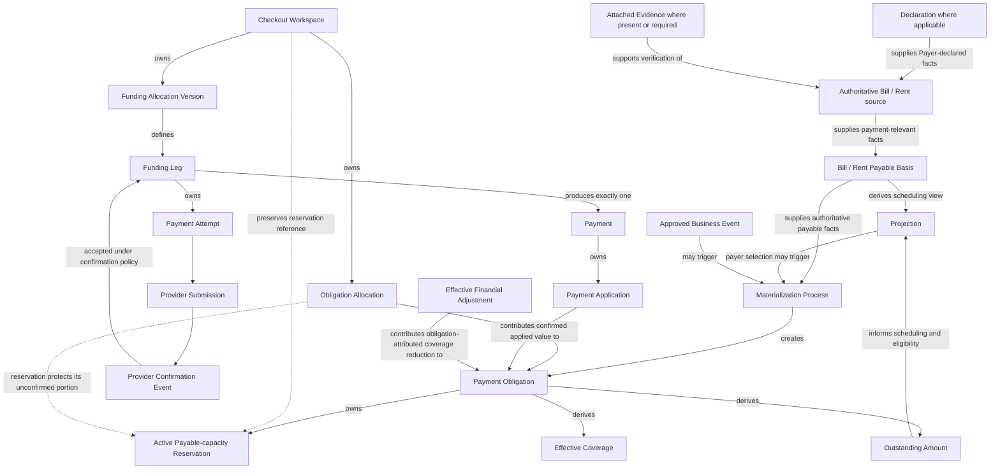

# DOC-09 - Payment Domain Architecture

| Document Control | Details |
| --- | --- |
| **Document ID** | `DOC-09` |
| **Title** | Payment Domain Architecture |
| **Version** | `2.1.2` |
| **Status** | Founder Working Baseline |
| **Owner** | Payments / Product |
| **Reviewers** | Product Lead<br>Engineering Lead<br>Payments Lead<br>Compliance Lead<br>Risk Lead<br>Operations Lead<br>Security Lead |
| **Approvers** | Project Owner<br>Product Lead<br>Payments Lead |
| **Last Updated** | `2026-09-01` |
| **Classification** | Internal |
| **Related Documents** | DOC-00 Documentation Governance<br>DOC-01 Project Charter & Product Positioning<br>DOC-03 Regulatory, PSP & Acquirer Assessment<br>DOC-04 Compliance Certification Roadmap & Control Framework<br>DOC-05 Master PRD & Feature Requirement Index<br>DOC-06 User Journey, UX Flow & Service Blueprint<br>DOC-07 Content, Disclosure & User Authorization Specification<br>DOC-08 Notification, Receipt & Communication Specification<br>DOC-10 Payout & Reconciliation<br>DOC-11 Refund, Cancellation & Chargeback<br>DOC-12 Bill Category, Document AI/OCR & Payee Verification Specification<br>DOC-13 Promotion Engine, Coupon, Voucher, Referral & Membership Specification<br>DOC-14 AML, Anti-Cashout, Fraud, Dynamic Auth & Risk Control Specification<br>DOC-15 Privacy, Data Protection & Record Retention Specification<br>DOC-17 API & Third-party Integration Specification<br>DOC-18 Data Model, Transaction State, Audit Event & Reporting Specification<br>DOC-19 Security, Tokenization, Authentication & Admin Control Specification<br>DOC-20 Testing, UAT & Go-live Checklist<br>DOC-21 Monitoring, Incident Response & Operational SOPs<br>DOC-22 Admin Management Dashboard & Operations Workflow |

---

## 1. Purpose

DOC-09 defines the canonical PayPlus Payment Domain architecture from payment-facing Bill/Rent information through payable obligation, Checkout, funding execution, confirmed Payment and application of confirmed value.

It defines:

- Bill/Rent Payable Basis;
- Projection;
- Materialization;
- Payment Obligation;
- Checkout Workspace;
- Obligation Allocation;
- payable-capacity reservation;
- Funding Allocation;
- Funding Leg;
- Payment Attempt;
- Provider Submission;
- Provider Confirmation Event;
- Payment;
- Payment Application;
- Effective Coverage;
- Outstanding Amount;
- controlled handoffs to downstream domains.

DOC-09 defines business architecture, invariants and semantic conditions. It does not define provider-specific integration, final machine states, persistence schemas, user-facing messages, Settlement, Payout or financial-adjustment workflows.

---

## 2. Domain Boundary

### 2.1 Upstream Concepts

- Attached Evidence supports verification of an authoritative Bill/Rent source where it exists or is required. Bill Tier 1 does not require attached Evidence; Tier 2/3 and Rent follow their accepted Evidence gates. Evidence is not payable.
- A Payer establishes and references the authoritative Bill/Rent source under the applicable owner-governed source and Evidence outcomes. An economic Payee may be an individual or institution/company and need not be a PayPlus User.
- Bill/Rent remains the authoritative business object outside the Payment Domain. DOC-09 does not define source-identity persistence, Evidence verification, source projection, Save, or Archive presentation.

### 2.2 Payment Domain Entry

The Payment Domain receives payment-relevant facts from the authoritative Bill/Rent through the Bill/Rent Payable Basis.

```text
Bill/Rent
    -> supplies payment-relevant facts
Bill/Rent Payable Basis
```

The Payable Basis supports two permitted paths to Materialization:

```text
Normal recurring-payment path

Payable Basis
    -> Projection
    -> payer selects an eligible period
    -> Materialization
    -> Payment Obligation
```

```text
Approved direct-event path

Payable Basis
    -> supplies authoritative payable facts
Approved business event
    -> triggers Materialization
    -> Payment Obligation
```

Projection is the normal user-facing scheduling and selection path. It is not a mandatory predecessor to every Materialization event.

No additional Materialization trigger is authorized by this document.

### 2.3 Payment Execution Boundary

Checkout executes only against Payment Obligations.

It must not execute directly against:

- Evidence;
- Bill/Rent;
- Projection; or
- Bill/Rent Payable Basis.

### 2.4 Downstream Ownership

| Concern | Canonical Owner |
|---|---|
| Settlement, payout and reconciliation | DOC-10 |
| Refund, reversal, cancellation, chargeback and dispute processing | DOC-11 |
| Provider-specific submission, authorization, capture, callback, query and confirmation evidence | DOC-17 |
| Exact technical representation and implementation detail | Deferred to separately authorized future work; DOC-09 retains business semantics only. |
| Security, authentication and technical authorization controls | DOC-19 |
| User-facing Outcomes, Messages and CTAs | DOC-07 |
| Notifications and delivery policy | DOC-08 |
| Operational support and exception handling | DOC-21 |
| Owner-permitted administrative workflow execution | DOC-22 |

---

## 3. Requirement Classification

| Classification | Meaning |
|---|---|
| Architecture Rule | Defines domain ownership, relationships or authoritative boundaries. |
| Domain Invariant | Must remain true regardless of implementation. |
| Product Behaviour | Defines required PayPlus behaviour. |
| MVP Configuration | Approved launch value that may later become configurable. |
| Cross-document Dependency | Requirement completed by another canonical owner. |

Configurable product values must not be treated as permanent architectural constraints.

---

## 4. Accepted Architecture Baseline

| Decision | Canonical Decision |
|---|---|
| `PDA-01` | Payment Obligation is the authoritative materialized payable aggregate. |
| `PDA-02` | Bill/Rent Payable Basis, Projection, Materialization and Payment Obligation remain separate. Materialization is demand-driven. |
| `PDA-03` | Checkout Workspace and Payment Obligation have a many-to-many relationship through Obligation Allocation. |
| `PDA-04` | Payable-capacity reservations protect obligation capacity before confirmed Payment Applications consume it. |
| `PDA-05` | Confirmed value is applied in the payer-approved order, using oldest due first as the default. |
| `PDA-06` | One successfully confirmed Funding Leg produces exactly one Payment. |
| `PDA-07` | DOC-09 is the canonical human-readable owner of Payment Domain architecture. |
| `PDA-08` | Bill Payment admission consumes the approved C1/G1/G2 highest-tier rule without applying it to Rent. |
| `PDA-09` | G1 counts the product-semantic user-initiated Bill payment progression once per Checkout/independent progression, not Funding Legs, Attempts or Payments; DOC-09 does not select its technical representation. |
| `PDA-10` | G2 pre-checks confirmed monthly Bill usage plus proposed obligation-funded value and finalizes usage from actual confirmed obligation-funded value without rewriting immutable Payment facts. |
| `PDA-11` | Tier 2/3 consumes the Founder-updated owner-approved official Bill Evidence framework, treats formal document examples as non-authoritative, excludes communication-originated material, and preserves separate Rent Evidence gates. |

---

## 5. Canonical Terminology

| Term | Definition |
|---|---|
| Bill/Rent Payable Basis | Current, reusable payment-facing representation of an authoritative Bill/Rent containing payment-relevant facts. Relevant Bill/Rent changes may update it without rewriting authoritative materialized Payment Domain facts. |
| Projection | Recalculable user-facing scheduling and selection read model. |
| Materialization | Controlled process that creates a Payment Obligation from authoritative Payable Basis facts. |
| Payment Obligation | Materialized authoritative payable aggregate for a specific payable period or item. |
| Due Amount | Total obligation-applicable value due under a Payment Obligation. |
| Gross Applied Value | Total confirmed obligation-applicable value contributed by accepted Payment Applications. |
| Effective Adjustment Value | Total effective obligation-attributed coverage reduction received from DOC-11. |
| Effective Coverage | Derived portion of the Due Amount that remains effectively covered. |
| Outstanding Amount | Derived unpaid amount remaining after Effective Coverage. |
| Active Reserved Amount | Sum of all active payable-capacity reservations for one Payment Obligation. |
| Available Payable Capacity | Portion of Outstanding Amount not currently protected by active payable-capacity reservations. |
| Checkout Workspace | Execution workspace for one payer payment intent against one Bill/Rent Payable Basis. |
| Checkout Target | Total obligation-applicable amount committed through the Checkout. |
| Obligation Allocation | Checkout-owned allocation of Checkout Target value referencing one Payment Obligation. |
| Payable-capacity Reservation | Payment Obligation-owned protection of payable capacity associated with one Obligation Allocation. |
| Funding Allocation | Checkout-specific allocation of Checkout Target across funding methods. |
| Funding Allocation Version | Auditable version of the funding arrangement for unexecuted value. |
| Funding Leg | Planned execution portion assigned to one funding method. |
| Payment Attempt | One execution attempt for a Funding Leg. |
| Provider Submission | Initiation of a provider-bound Payment Attempt for a Funding Leg. |
| Provider Confirmation Event | Provider-neutral confirmation evidence evaluated under PayPlus confirmation policy. |
| Payment | Immutable confirmed financial fact produced by one successfully confirmed Funding Leg. |
| Payment Application | Immutable application of confirmed obligation value from one Payment to one Payment Obligation. |
| Effective Financial Adjustment | Separate downstream financial fact whose effective obligation-attributed amount reduces Effective Coverage. |
| Effective Payout Destination Snapshot | Immutable authorization-time representation of the effective payee destination governing Payments produced by one Checkout Workspace. |
| Payment Profile | Reusable payer-owned ratio template for allocating Checkout Target across saved cards. |
| Payment Instruction | Deliberate user-created pay-later arrangement. |
| Declaration | Payer factual and intent declaration concerning Category, purpose, amount and Payee/receiving details under DOC-05/DOC-07 policy; it is not Save intent or Payment authorization. |
| Bill Payment Progression | Product-semantic G1 counting unit for one independent user-initiated progression through one Bill Checkout context. It is not a Payment Domain aggregate, technical event, status or schema. |
| C1 | Owner-approved Category single-Payment threshold consumed by DOC-09; policy authority remains with the designated product/risk owner and Category binding with DOC-12. |
| G1 | Maximum five independent Bill Payment Progressions to the same receiving account/authoritative payout destination per Hong Kong calendar month. |
| G2 | Maximum HKD1,000,000 of confirmed obligation-funded Bill value per verified Payer account per Hong Kong calendar month. |

Effective Coverage, Outstanding Amount, Active Reserved Amount and Available Payable Capacity are Payment Obligation-owned derived business values. They are not replacement financial records.

Bill/Rent Payable Basis is reusable and updateable. It is not a frozen snapshot.

No Payable Basis versioning rule is defined or implied.

---

## 6. Canonical Payment Story

```text
Declaration and applicable Evidence support Bill/Rent facts
        |
Bill/Rent supplies payment-relevant facts and Bill Tier/Rent eligibility
        |
Bill/Rent Payable Basis
        |
        +-> Projection
        |       |
        |       +-> payer selects an eligible period
        |               |
        +---------------+-> Materialization
        |
Approved business event
        |
        +------------------> Materialization
                                |
                                v
                        Payment Obligation
                                |
                        Checkout Workspace
                                |
                       Obligation Allocation
                                |
                  payable-capacity reservation
                                |
                         Funding execution
                                |
                         confirmed Payment
                                |
                       Payment Application
                                |
                  Payment Obligation recalculates
                  Effective Coverage and
                  Outstanding Amount
```

A later effective financial adjustment does not rewrite this history. It contributes a coverage reduction to the Payment Obligation, which recalculates Effective Coverage and Outstanding Amount.

---

## 7. Architecture Classification and Genuine Ownership

```text
Upstream Business Domain
├── Evidence
└── Bill/Rent

Payment Domain
├── Bill/Rent Payable Basis
├── Projection
├── Materialization Boundary
├── Payment Obligation
│   ├── Due Amount
│   ├── Effective Coverage
│   ├── Outstanding Amount
│   └── Active payable-capacity reservations
├── Checkout Workspace
│   ├── Checkout Target
│   ├── Obligation Allocations
│   ├── Funding Allocation Versions
│   ├── Funding Legs
│   │   └── Payment Attempts
│   └── Effective Payout Destination Snapshot
└── Payment
    └── Payment Applications

Downstream Domains
├── Settlement / Payout / Reconciliation
├── Financial Adjustments
├── Provider Integration
├── Machine-State and Data Implementation
└── Outcomes / Messages / Notifications
```

This tree expresses classification and genuine aggregate ownership only. It does not express business sequence or mandatory predecessor relationships.

---

## 8. Domain Relationships and Flow



The normal relationship from accepted Provider Confirmation to Payment remains valid even when confirmation arrives late. What changes in the late-confirmation case is automatic Payment Application, not Payment creation.

---

## 9. Aggregate Ownership and Invariants

| Concept | Ownership and Invariant |
|---|---|
| Bill/Rent Payable Basis | References an authoritative Bill/Rent, contains current payment-relevant facts and may update when those authoritative facts change. |
| Projection | Recalculable and non-authoritative. DOC-09 owns its business purpose, inputs and outputs. |
| Materialization | Process boundary that creates Payment Obligation using authoritative Payable Basis facts. |
| Payment Obligation | Owns Due Amount, payable capacity, Gross Applied Value, Effective Adjustment Value, Effective Coverage, Outstanding Amount, Active Reserved Amount, Available Payable Capacity and active reservations. |
| Checkout Workspace | Owns Checkout Target, Obligation Allocations, Funding Allocation Versions and Funding Legs. |
| Obligation Allocation | Owned only by Checkout Workspace and references one Payment Obligation. |
| Reservation | Owned by Payment Obligation and associated with one Obligation Allocation. Checkout may retain its reference. |
| Funding Leg | Owns its Payment Attempts. It does not own a reservation. |
| Payment | Immutable confirmed result of exactly one successfully confirmed Funding Leg. |
| Payment Application | Owned by Payment and represents immutable application to one Payment Obligation. |
| Effective Financial Adjustment | Separate immutable downstream fact owned by DOC-11. |
| Effective Coverage | Derived and owned by Payment Obligation. |
| Outstanding Amount | Derived and owned by Payment Obligation. |
| Active Reserved Amount | Derived and owned by Payment Obligation. |
| Available Payable Capacity | Derived and owned by Payment Obligation. |

No entity may be represented as owned by two aggregates.

---

## 10. Aggregate Internal Structure

```text
Payment Obligation
├── Due Amount
├── Gross Applied Value
├── Effective Adjustment Value
├── Effective Coverage
├── Outstanding Amount
├── Active Reserved Amount
├── Available Payable Capacity
├── accepted Payment Application references
└── Active payable-capacity reservations

Checkout Workspace
├── immutable identity
├── Bill/Rent Payable Basis reference
├── Checkout Target
├── Obligation Allocations
├── payable-capacity reservation references
├── Funding Allocation Versions
├── Funding Legs
├── Effective Payout Destination Snapshot
├── payer-authorization evidence
└── continuation and closure information

Funding Leg
├── obligation-funded amount
├── applicable fee and benefit result
├── payer charge
├── funding-method reference
├── Payment Attempts
└── confirmed Payment reference, when successful

Payment
├── confirmed obligation-funded amount
├── payer charge and applicable commercial results
├── provider-confirmation reference
├── destination-snapshot reference
└── Payment Applications
```

Payment Obligation may retain accepted Payment Application references for calculation and audit. It does not own Payment Application.

---

## 11. Projection and Materialization

### 11.1 Projection Ownership

DOC-09 owns:

- Projection business purpose;
- Projection business semantics;
- required business inputs;
- required business outputs;
- payment-period eligibility meaning;
- scheduling meaning;
- next-period meaning.

Exact technical treatment of Projection is deferred to separately authorized future work. DOC-09 retains the Projection business semantics, inputs and outputs stated here.

### 11.2 Projection Inputs

Projection derives the user-facing payment schedule using:

- Bill/Rent Payable Basis;
- recurrence and due-date rules;
- materialized Payment Obligations;
- Effective Coverage;
- Outstanding Amount;
- confirmed payment history;
- approved period-eligibility rules.

### 11.3 Projection Outputs

Projection must support:

- upcoming billing periods;
- projected payment amounts;
- projected due dates;
- user-selectable payment periods;
- the next suggested payment period;
- updated eligibility after an effective financial adjustment.

### 11.4 Materialization Paths

Payment Obligation Materialization may be triggered by either:

1. payer selection through Projection; or
2. another already approved business event using authoritative facts from Payable Basis.

Projection is the normal recurring-payment path, but not the mandatory predecessor to every Materialization event.

Future periods must not be eagerly materialized merely because they appear in Projection.

### 11.5 Period Selection

For recurring Bill/Rent payment:

- payer may select the current eligible period or immediately next eligible period;
- payer need not complete the current period through PayPlus before selecting the next period because payment may have occurred outside PayPlus;
- payer must not skip the immediately next eligible period and select a later period directly;
- multi-period selection must follow the approved contiguous-period rule.

Where the Category permits Bill prepayment, the selected contiguous-period aggregate is the proposed obligation-funded amount for C1/G2 evaluation. One independent user-initiated prepayment progression counts once under G1 despite multiple selected periods, cards or Funding Legs. Prepayment remains Category-controlled, does not create an Evidence-coverage classifier and does not bypass any gate. Rent remains outside Bill C1/G1/G2.

Eligibility must be recalculated when Effective Coverage or Outstanding Amount changes.

### 11.6 Payable Basis Updates

Relevant changes to the authoritative Bill/Rent may:

- update Bill/Rent Payable Basis; and
- recalculate non-authoritative Projection results.

Such changes must not silently rewrite:

- an already materialized Payment Obligation;
- a locked Checkout Workspace;
- a Payment; or
- a Payment Application.

A change to an already materialized Payment Obligation must occur through an approved controlled change or financial-adjustment process. It must not be inherited automatically from an updated Payable Basis.

This rule does not introduce Payable Basis versioning or an obligation-revision aggregate.

---

## 12. Effective Coverage and Outstanding Amount

For one Payment Obligation:

```text
Gross Applied Value
    = sum of accepted obligation-applicable Payment Applications

Effective Adjustment Value
    = sum of effective obligation-attributed coverage reductions

Applicable Adjustment Effect
    = the portion of Effective Adjustment Value legally attributable to
      existing valid Payment Application coverage, bounded by Gross Applied Value

Effective Coverage
    = max(0, Gross Applied Value - Applicable Adjustment Effect)

Outstanding Amount
    = Due Amount - Effective Coverage
```

Payment Obligation derives these calculation values.

`Effective Adjustment Value` remains the authoritative adjustment fact received from DOC-11. `Applicable Adjustment Effect` is only a bounded calculation input; it is not a new object, status, event or financial record. An adjustment must never make Effective Coverage negative, fabricate a Payment Application, or create fictional obligation coverage. When a confirmed Payment has zero or insufficient valid Applications, only the legally attributable portion may affect coverage arithmetic; any remaining adjustment value remains an authoritative adjustment fact outside that arithmetic under the existing DOC-10/DOC-11 settlement, reconciliation or adjustment boundary.

Example: Payment 100 with zero Applications and an adjustment of 30 produces Effective Coverage 0; the 30 adjustment fact remains outside coverage arithmetic. If valid Applications of 100 later exist and the applicable adjustment effect is 30, Effective Coverage is 70.

The domain must preserve:

```text
0 <= Effective Coverage <= Due Amount
0 <= Outstanding Amount <= Due Amount
```

### 12.1 Semantic Conditions

| Semantic Condition | Derivation |
|---|---|
| Fully Paid | Effective Coverage equals Due Amount. |
| Partially Paid | Effective Coverage is greater than zero and below Due Amount. |
| Unpaid | Effective Coverage equals zero. |

These are semantic business conditions, not final machine-state enums.

### 12.2 Adjustment Effect

When DOC-11 determines that an obligation-attributed adjustment has become effective:

- Payment remains unchanged;
- Payment Application remains unchanged;
- Effective Adjustment Value increases by the full effective adjustment fact, while Applicable Adjustment Effect is calculated separately and remains bounded by valid Gross Applied Value;
- Effective Coverage decreases only by Applicable Adjustment Effect and cannot become negative;
- Outstanding Amount increases only by the same Applicable Adjustment Effect;
- payable capacity reopens on Payment Obligation;
- Projection and payment-period eligibility are recalculated;
- a subsequent eligible Checkout may target reopened Outstanding Amount.

The reason for adjustment does not change this Payment Domain treatment.

An effective adjustment must not:

- reopen the historical Checkout Workspace;
- alter its Checkout Target;
- reactivate released reservations;
- rewrite Funding Legs;
- rewrite Payment; or
- rewrite Payment Applications.

If an active continuable Checkout already exists for the same Payable Basis, it must be resolved under the normal active-Checkout rule before a new Checkout is created.

---

## 13. Checkout Scope and Destination

A Checkout Workspace is scoped to:

- exactly one Bill/Rent Payable Basis;
- Payment Obligations originating from that Payable Basis;
- one effective payee relationship;
- one Effective Payout Destination Snapshot.

The Effective Payout Destination Snapshot must be resolved and frozen no later than final payer authorization.

Every Payment produced by Checkout must preserve a reference to that authorization-time snapshot.

Later changes to Bill/Rent information, intended-Payee facts, or payout configuration must not silently alter an authorized Checkout or confirmed Payment.

Settlement and Payout consume the preserved destination reference. Material post-authorization changes require controlled handling and, where applicable, renewed payer authorization.

---

## 13A. Bills-only Payment Admission and Limit Controls

This section consumes the approved DOC-05/DOC-12/DOC-14 product and control meanings. It does not create a new Payment object, G1 event, state machine, C1 policy owner, Evidence outcome, Tier 3 role or Admin mechanism.

### 13A.1 Limit consumption and precedence

| Limit | DOC-09 consumption |
|---|---|
| C1 | Compare the proposed obligation-funded single Bill Payment amount, including an approved selected-period prepayment aggregate, with the current owner-approved Category value. C1 policy authority belongs to the designated product/risk owner; DOC-12 binds the Category and DOC-22 only executes approved configuration. Exact values, permitted adjustments, configuration representation and operating change details are later owner inputs and do not reopen the settled layering. |
| G1 | Consume the product-semantic count of independent user-initiated Bill payment progressions to the same receiving account/authoritative payout destination in the Hong Kong calendar month. One Checkout progression counts once despite Funding Legs, Payment Attempts, Payments, retries, recovery or continuation. A genuinely new independent progression counts again. |
| G2 | Pre-check confirmed Bill usage for the verified Payer account in the Hong Kong calendar month plus the proposed obligation-funded amount. Final usage records actual successfully confirmed obligation-funded value; payer fees are excluded. |

G1 is not bound by DOC-09 to Payer authorization, Provider Submission, Payment confirmation, a status, an event or a schema. DOC-09 does not select a technical representation of the product invariant. The receiving account/authoritative payout destination is the G1 key and does not redefine economic-Payee identity or the transaction-specific Effective Payout Destination Snapshot.

G2 capacity treatment:

- failed, declined, cancelled-before-confirmation and proven duplicate attempts do not permanently consume usage;
- confirmed Payments remain in their original month after Refund or reversal;
- only confirmed duplicate/error correction restores usage;
- original Tier 3 classification is not retroactively downgraded when actual confirmed value remains below HKD1,000,000; and
- concurrent evaluation must not permit the accepted Tier outcome to be bypassed; DOC-09 does not select a mechanism.

Apply only the highest Tier workflow while retaining all trigger reasons:

```text
G2 -> Tier 3
Otherwise C1 or G1 -> Tier 2
No trigger -> Tier 1
```

### 13A.2 Payment-admission gates

| Scope | DOC-09 admission treatment |
|---|---|
| Bill Tier 1 | Declaration is required; attached Evidence is not. Every other applicable product, risk, legal, security, intended-Payee, destination, provider and Payer-authorization gate remains. |
| Bill Tier 2 | Qualifying owner-approved official Bill Evidence presence is a Payment gate. Acceptance is not normally a Payment gate: Payment may confirm while verification remains pending, but DOC-10 holds Payout until acceptance and all other release gates pass. |
| Bill Tier 3 | Qualifying official Bill Evidence and authorized approval are Payment and Payout gates. Approval is an admission gate before First Provider Submission. |
| Rent | Attached Evidence and the required accepted Evidence outcome remain Payment gates. Bill limits and tiers do not apply. A Rent-specific Declaration cannot replace or defer Evidence. |

The Founder-updated framework permits DOC-12 to approve formal bills, fee notices, school payment notices, statements, invoices and formal historical receipts by Category; examples do not create acceptance. Communication-originated material cannot satisfy, substitute for or contribute to Tier 2/3 mandatory Evidence. Qualifying Evidence and acceptance remain DOC-12-owned. Tier 2 unresolved cases may use exception-only owner-approved review. Category operating lists remain enablement/acceptance inputs and block the affected Category path until supplied. DOC-22 cannot manufacture Evidence, admission or approval truth.

### 13A.3 Prepared Tier 3 Checkout Workspace

A Tier 3 Checkout Workspace may be prepared before approval only to preserve the existing Bill, Payable Basis, proposed Checkout Target, applicable allocations and return context. Before approval it is non-executable:

- no executable Payment authorization may be accepted;
- no Provider Submission may be initiated;
- no confirmed Payment may be produced; and
- no prepared fact may be presented as approval or Payment readiness.

The Tier 3 normative owner boundary is defined: the applicable designated Product/Risk/Compliance/Security owner defines approval, while DOC-22 executes only an approved workflow. Exact operating role assignment, workflow, segregation/dual-control implementation and evidence remain later enablement/implementation/acceptance inputs. They must be completed before Tier 3 enablement, implementation or acceptance. No separate Tier 3 recovery object is introduced.

A material change to approved Category, purpose, amount, economic-Payee or receiving details requires Tier and approval re-evaluation before executable progression. Declaration policy separately determines whether the user change is material and what proportionate reconfirmation is required.

An owner-recorded approval outcome does not itself navigate, Resume, authorize or submit. The Payer remains in, or returns to, the current Bill source context and deliberately invokes `Pay`; the existing Checkout Resolver then performs current revalidation. It may Resume the prepared Workspace only when that Workspace remains active, eligible and continuable. Any subsequent Provider Submission retains its separate fresh Payer authorization. Otherwise the resolver returns the applicable source-owner or historical resolution. This establishes no Tier 3 notification, direct notification-to-Checkout edge, new route, or Payment/Payout state.

### 13A.4 Declaration and Add/Pay boundaries

Declaration is not payer authorization. Unchanged declared facts require no new Declaration, and C1/G1/G2 re-evaluation alone is not a Declaration trigger. DOC-05/DOC-07 own materiality and proportionate reconfirmation for user changes; DOC-09 consumes current declared facts and continues to require separate authorization for every applicable Provider Submission.

Add a Bill applies C1 only as Save admission and does not create G1/G2 usage or reservation. Pay a Bill re-evaluates current C1/G1/G2. Save, no-Save and Archive do not authorize Payment or change the Payment Domain facts.

At Add Bill, the Payer's review and deliberate confirmation of declared material facts precede the separate Save-admission outcome. An owner-confirmed non-material edit uses ordinary Save; a material edit receives the owner-defined proportionate reconfirmation. Current C1/G1/G2 re-evaluation alone does not repeat Declaration. A no-Save outcome does not by itself reject the source or determine current Payment eligibility: any current Payment progression must resolve its own current Tier, Evidence, approval, destination, risk, security and authorization gates.

### 13A.5 Financial-truth boundary

Tier 2 Payout hold, Tier 3 approval, Evidence re-upload/rejection, Refund, case, adjustment and reconciliation must not erase or rewrite confirmed Payment or Payment Application. Tier 2 Payment with ordinary Applications is not the Section 18 confirmed-but-unapplied late-confirmation exception merely because Evidence acceptance is pending. DOC-11 retains Refund/case ownership; this section creates no automatic Refund rule.

For Tier 2 presentation, confirmed Payment is immutable Payment truth; Evidence outcome and DOC-10 Payout hold or release remain separately owned conditions. The Payment Domain does not authorize a universal `Pending`, `Complete`, `Failed`, or `Transfer pending` presentation, ordinary Evidence lifecycle Activity, or a Receipt/Proof claim of unconfirmed Payout completion. DOC-06C/DOC-07 compose the Payer surface from current owner-supplied facts. This handoff does not select a schema, event, security mechanism, configuration, or production-enablement treatment.

---

## 14. Monetary Ownership and Invariants

### 14.1 Checkout Target

Checkout Target represents obligation-applicable value, not total payer charge.

The payer may:

- select the full eligible Available Payable Capacity; or
- lower the intended payment amount.

Checkout Target must not exceed aggregate Available Payable Capacity across selected Payment Obligations.

### 14.2 Allocation and Charge Derivation

```text
sum of Obligation Allocation amounts
    = Checkout Target
```

Once Funding Allocation is complete:

```text
sum of current Funding Leg obligation-funded amounts
    = Checkout Target
```

Payer Charge is derived from:

- Funding Leg obligation-funded amount;
- applicable fee result; and
- applicable benefit result,

under pricing, benefit and rounding rules owned by the relevant commercial, promotion and technical documents.

The following monetary invariant applies:

```text
Funding Leg obligation-funded amount
    is not the same monetary value as
Funding Leg payer charge
```

DOC-09 does not define detailed fee, reward, cashback, subsidy or rounding formulas.

### 14.3 Payment Application Conservation

For each Payment:

```text
sum of obligation-applicable values represented by its Payment Applications
    <= confirmed obligation-funded amount of that Payment
```

Payment Applications must not apply:

- service fees;
- provider charges;
- non-obligation amounts; or
- value exceeding Payment’s confirmed obligation-funded amount.

A Payment may temporarily have zero Payment Applications in the controlled late-confirmation case.

---

## 15. Checkout Target Lock and Funding Changes

Before first Provider Submission:

- Checkout Target may be amended within current payable capacity;
- Obligation Allocations may be recalculated;
- Funding Allocation may be edited;
- affected eligibility, fees, benefits, methods, destination and risk controls must be revalidated.

Checkout Target becomes immutable when first Provider Submission is initiated for any Funding Leg in Checkout Workspace.

From that point:

- Checkout Target must not be increased, reduced or redefined;
- Obligation Allocations must not be increased, reduced or redefined;
- submitted or confirmed Funding Legs must not be rewritten;
- changes may apply only to unexecuted funding arrangements;
- changes must remain within locked Checkout Target;
- prior Funding Allocation Versions must remain auditable;
- affected fees, benefits, methods and risk controls must be revalidated;
- renewed payer authorization is required before revised execution.

Provider Submission is the provider-neutral domain boundary. DOC-17 maps provider-specific mechanics to it.

---

## 16. Payable-Capacity Reservation

Payment Obligation owns payable capacity and active payable-capacity reservations.

Checkout Workspace:

- owns Obligation Allocations;
- preserves applicable reservation references;
- does not own reservations.

Funding Legs do not own reservations.

### 16.1 Aggregate Capacity

For one Payment Obligation:

```text
Active Reserved Amount
    = sum of all active payable-capacity reservations
      for the Payment Obligation

Available Payable Capacity
    = Outstanding Amount - Active Reserved Amount
```

The domain must preserve:

```text
0 <= Active Reserved Amount <= Outstanding Amount

0 <= Available Payable Capacity <= Outstanding Amount
```

A new reservation must not exceed current Available Payable Capacity of the affected Payment Obligation.

### 16.2 Individual Reservation

For a normal active Checkout:

```text
Individual Reserved Amount
    = unconfirmed portion of its associated
      Obligation Allocation
```

An individual reservation:

- is associated with one Obligation Allocation;
- protects capacity on the Payment Obligation referenced by that allocation;
- is consumed or reduced through accepted Payment Applications;
- remains available across unsuccessful attempts while Checkout is continuable;
- is released when confirmed value consumes it, Checkout closes or Checkout expires;
- is not owned or duplicated by Funding Legs.

An effective financial adjustment does not reactivate a consumed or released reservation. It reopens Available Payable Capacity on Payment Obligation.

A subsequent Checkout creates its own reservations.

### 16.3 Controlled Late-Application Reservations

Controlled late application may require one or more new normal reservation instances.

For each approved Obligation Allocation or affected Payment Obligation against which the unapplied Payment will be applied:

- one new reservation is required;
- reservation amount must not exceed current Available Payable Capacity;
- reservation must have a distinct identity from the released historical reservation;
- association with historical Obligation Allocation is retained only for lineage and approved allocation context;
- historical reservation remains released;
- historical Checkout remains closed or expired.

Across all controlled late-application reservations:

```text
sum of new reservation amounts
    <= unapplied confirmed obligation-funded amount
       of the Payment
```

These reservations provide current payable-capacity protection only. They do not restore historical Checkout continuation.

---

## 17. Funding Execution and Provider Confirmation

### 17.1 Funding Leg Execution

- Each Funding Leg may have multiple Payment Attempts.
- An unsuccessful attempt creates no Payment.
- Retry controls remain subject to security, risk and provider rules.
- Initiating first Provider Submission locks Checkout Target and Obligation Allocations.
- Applicable fees, benefits and provider eligibility must be revalidated before each Provider Submission.

### 17.2 Accepted Provider Confirmation

```text
Payment Attempt
    -> Provider Submission
    -> Provider Confirmation Event
    -> PayPlus confirmation-policy acceptance
    -> Funding Leg becomes successfully confirmed
    -> exactly one Payment is created or returned idempotently
```

Checkout Workspace coordinates the journey. Successfully confirmed Funding Leg produces Payment.

Repeated, duplicated or replayed confirmation evidence must not produce duplicate Payments.

DOC-17 owns provider-specific authorization, browser return, callback, webhook, capture, query and confirmation mechanics.

---

## 18. Late Provider Confirmation

### 18.1 Immutable Payment Creation

An accepted Provider Confirmation received after Checkout closure or expiry still:

1. confirms affected Funding Leg;
2. creates, or idempotently returns, exactly one Payment;
3. preserves Payment as an immutable confirmed financial fact.

After a Provider Submission was legitimately initiated under the applicable admission gates, Payment creation must not wait for a later administrative exception review. This late-confirmation rule does not bypass Tier 3 approval before First Provider Submission.

```text
Accepted late Provider Confirmation
    -> Funding Leg becomes successfully confirmed
    -> exactly one Payment is created or returned idempotently
    -> Payment remains unapplied
    -> controlled exception resolution
```

Payment may temporarily have zero Payment Applications.

### 18.2 Automatic Application Prohibition

Where historical reservations have been released, the system must not:

- automatically create Payment Applications;
- revive released reservations;
- silently recreate them as though they remained active;
- reopen historical Checkout Workspace;
- reduce Outstanding Amount without authorized application;
- over-apply any Payment Obligation.

### 18.3 Controlled Application

Where controlled resolution authorizes application:

1. affected Payment Obligations and approved Obligation Allocations must be identified;
2. current Available Payable Capacity must be revalidated for every affected Payment Obligation;
3. one or more new normal reservation instances must be created as required;
4. each reservation must have a distinct identity from its released historical reservation;
5. each reservation must remain within Available Payable Capacity of its affected obligation;
6. total new reservation value must not exceed Payment’s unapplied confirmed obligation-funded amount;
7. new reservations must retain historical Obligation Allocation lineage and controlled-resolution reference;
8. historical Checkout remains closed or expired;
9. authorized Payment Applications consume or reduce new reservations;
10. Payment Applications must reference controlled exception resolution;
11. Payment Application conservation remains enforced;
12. Payment Applications follow payer-approved Obligation Allocation order;
13. where payer approved no different order, default application order is oldest due first.

Historical Obligation Allocation association provides lineage and approved allocation context only. It does not reactivate or amend historical Checkout.

### 18.4 Return of Funds

Where controlled resolution requires return:

- no Payment Application is created;
- Payment remains an immutable confirmed financial fact;
- historical Checkout remains closed or expired;
- historical reservations remain released;
- return, refund or other adjustment processing remains owned by DOC-11 and applicable operational documents.

### 18.5 Settlement and Payout Boundary

While Payment remains unapplied:

- it may enter necessary Settlement and reconciliation handling under DOC-10 because a confirmed provider financial result exists;
- it must not be treated as normal payee payout-eligible value.

Normal payout eligibility requires:

- accepted Payment Applications; or
- another explicit controlled downstream resolution owned by DOC-10 and DOC-11 that does not derive payout amount or readiness from adjustment value outside valid Payment Application coverage.

DOC-09 supplies only the business condition that Payment is confirmed but unapplied. It does not define Settlement timing, payout timing, payout grouping, accounting treatment or return mechanics.

### 18.6 Exception Ownership

DOC-09 owns:

- Payment-creation consequence;
- unapplied-Payment treatment;
- prohibition against automatic application;
- current-capacity revalidation;
- new-reservation requirements;
- application order;
- conservation and over-application controls;
- unapplied-Payment payout boundary.

Detailed provider, reconciliation, operational and administrative handling remains with owners defined in Section 25.

---

## 19. Payment and Payment Application

### 19.1 Payment

A Payment:

- has stable identity;
- is produced by exactly one successfully confirmed Funding Leg;
- represents an immutable confirmed financial fact;
- records confirmed obligation-funded value separately from payer charge;
- preserves Provider Confirmation and destination-snapshot references;
- may temporarily have zero Payment Applications in the late-confirmation case;
- must not be modified by refunds, reversals, cancellations, chargebacks or dispute outcomes.

### 19.2 Payment Application

A Payment Application:

- has stable identity;
- is owned by Payment;
- links one Payment to one Payment Obligation;
- represents one immutable confirmed application of obligation value;
- consumes or reduces an applicable reservation;
- is append-only;
- must not be modified or deleted by a later adjustment.

Payment Applications must be created according to payer-approved Obligation Allocation order.

Where payer has not approved a different order, default application order is oldest due first.

This application-order invariant applies to:

- normal Payment Application creation; and
- controlled late-confirmation application.

Payment Obligation may retain accepted Payment Application references without owning Payment Application.

One Payment may have multiple Payment Applications where confirmed value is applied across multiple Payment Obligations.

Section 14.3 always applies.

---

## 20. Financial Adjustment Boundary

DOC-11 owns:

- adjustment occurrence;
- adjustment type;
- adjustment amount;
- obligation attribution;
- determination of effectiveness;
- refund workflow;
- reversal workflow;
- transaction-cancellation workflow;
- chargeback workflow;
- dispute workflow and outcome.

DOC-09 consumes authoritative effective obligation-attributed coverage reduction and owns:

- preservation of Payment and Payment Application;
- recalculation of Effective Adjustment Value;
- recalculation of Effective Coverage;
- recalculation of Outstanding Amount;
- reopening of Available Payable Capacity;
- recalculation of Projection and payment eligibility;
- eligibility for a subsequent Checkout.

DOC-09 does not define technical representation or a taxonomy for these semantic conditions.

---

## 21. Partial Funding and Checkout Continuation

Partial funding is a normal supported result.

If Checkout Target is HK$1,000 and confirmed obligation-funded value is HK$600:

- Checkout Target remains HK$1,000;
- confirmed Payment and Payment Application records remain authoritative;
- Checkout meets Partially Funded semantic condition;
- HK$400 remains unfunded within that Checkout;
- payer may Continue Payment or Close Checkout.

Checkout Target must not be reduced to HK$600 merely to present completion.

### 21.1 Continuation

- MVP continuation period is 30 days.
- Value may later become admin-configurable.
- Unsuccessful or unexecuted Funding Legs do not erase successful Payments.
- Changes to unexecuted funding arrangements follow Section 15.

### 21.2 Closure and Expiry

Closing or expiring Checkout:

- ends continuation;
- releases unused reservations;
- preserves successful Payments and Payment Applications;
- does not cancel or rewrite confirmed value;
- does not change locked historical Checkout Target.

Only one active continuable Checkout may exist for the same Bill/Rent Payable Basis.

Payer must continue or close that Checkout before starting another one.

A controlled late-confirmation process must not restore continuation to a closed or expired Checkout.

---

## 22. Payment Profile, Funding Allocation and Payment Instruction

### 22.1 Payment Profile

Payment Profile stores reusable card ratios, not final future Checkout amounts.

```text
Payment Profile ratios
    × Checkout Target
    = proposed Funding Allocation amounts
```

Payer may adjust proposed Funding Allocation before Provider Submission.

After first Provider Submission, Section 15 applies.

### 22.2 Payment Instruction

Payment Instruction is a deliberate pay-later arrangement.

An interrupted immediate Checkout remains an incomplete Checkout Workspace and does not automatically become a Payment Instruction.

Instructions route may display both while preserving their separate business meanings.

### 22.3 Instruction `Pay Now` Checkout Resolver

Instruction `Pay Now` invokes the Checkout Resolver. It does not unconditionally create, activate, or resume a predetermined Checkout.

The Checkout Resolver is a domain-resolution operation. It is not a route, screen, Checkout state, machine-state enum, event, Payment Instruction type, Checkout object, Funding Leg, or Provider Submission.

For an authenticated payer, the resolver must:

1. verify that the Payment Instruction remains valid for that payer;
2. resolve the instruction's current Bill/Rent Payable Basis and source/return context;
3. revalidate current Payment Obligation, evidence, eligibility, timing, and applicable control conditions;
4. determine whether an active Checkout exists for the same Payable Basis and, after current revalidation, whether it remains eligible and continuable for Resume;
5. resume that existing Checkout when it remains active, eligible and continuable, and otherwise resolve its current condition before any new Checkout is considered;
6. permit a later eligible Checkout only when no active continuable Checkout exists and current eligibility permits creation; and
7. otherwise return an explicit Payment Instruction or source-owner resolution without creating or reactivating Checkout.

| Resolver result | Payment Domain treatment |
| --- | --- |
| An active Checkout remains eligible and continuable for the same Payable Basis | Resume that existing Checkout after current revalidation. Do not create another Checkout. |
| An active continuable Checkout exists but current conditions do not permit Resume | Resolve the existing Checkout condition explicitly. Do not create a second Checkout while the active continuable Checkout exists. |
| No active continuable Checkout exists and current eligibility permits creation | A later eligible Checkout may be created against the same Payable Basis. Earlier Checkouts remain authoritative in their recorded non-continuable condition. |
| The instruction is stale, withdrawn, expired, ineligible, unavailable, or fails an applicable current control | Return the applicable instruction/source-owner resolution. Do not create, resume, or reactivate Checkout. |

Payment Instruction and Checkout remain separate objects. Invoking the resolver does not convert the instruction into a Checkout, convert an incomplete Checkout into a Payment Instruction, or rewrite either object's recorded history.

Before Resume, creation, or any Provider Submission, applicable obligation, evidence, eligibility, timing, fees, benefits, funding, destination, risk, security, and payer-authorization conditions must be revalidated by their owners. Prior authorization, notification content, delivered-message state, stored quote, provider return, or earlier eligibility evidence must not be treated as current authority.

The resolver does not silently create a Funding Allocation, Funding Leg, Payment Attempt, or Provider Submission and does not carry forward stale payer authorization. Every Provider Submission continues to require applicable payer authorization under Section 23.

---

## 23. Payer Authorization

Payer authorization remains central.

- Declaration is a separate Payer factual/intent assertion and does not authorize Payment.
- Creating Checkout does not authorize payment.
- Setting Payment Profile does not authorize payment.
- Creating Funding Allocation does not authorize payment.
- Provider return alone does not prove successful payment.
- Every Provider Submission requires applicable payer authorization.
- Material changes to unexecuted arrangements after target lock require renewed authorization.
- Resumed Checkout must revalidate current conditions before submission.
- Payment must never auto-submit solely because user returned from another route or completed account activation.
- A prepared Tier 3 Checkout must not accept executable Payment authorization before the required owner approval.

Detailed authentication and security controls remain owned by DOC-19.

---

## 24. Semantic Conditions and Deferred Technical Boundary

DOC-09 defines semantic business conditions rather than final implementation enums.

| Subject | Semantic Meaning |
|---|---|
| Checkout editable | No Provider Submission has been initiated and current eligibility remains valid. |
| Checkout target locked | At least one Provider Submission has been initiated. |
| Checkout partially funded | Confirmed obligation-funded value is greater than zero but below Checkout Target. |
| Checkout fully funded | Confirmed obligation-funded value equals Checkout Target. |
| Checkout closed | Payer deliberately ended continuation. |
| Checkout expired | Permitted continuation period elapsed. |
| Obligation fully paid | Effective Coverage equals Due Amount. |
| Obligation partially paid | Effective Coverage is above zero and below Due Amount. |
| Obligation unpaid | Effective Coverage equals zero. |
| Payment unapplied | Confirmed Payment currently has no accepted Payment Application and is not normal payee payout-eligible value. |

DOC-09 owns Projection business semantics, inputs and outputs.

Exact technical treatment of these semantic conditions and Projection remains deferred to separately authorized future work. DOC-09 does not select a technical recipient.

Status-display reference matrix owns display mapping. DOC-07 owns Outcomes, Messages and CTAs.

---

## 25. Cross-Domain Boundaries

| Boundary | Direction Relative to DOC-09 | DOC-09 Responsibility | Other Canonical Owner |
|---|---|---|---|
| Bill Tier and limits | Inbound product/control policy | Consume approved C1/G1/G2, tier precedence, Declaration and Evidence/approval gates without redefining them or selecting technical G1 representation. | DOC-05 owns product meaning; DOC-12 Evidence and C1 Category binding; DOC-14 risk/approval policy. Exact technical representation remains deferred. |
| Provider Submission | Outbound integration boundary | Define business submission semantics and target-lock consequence. | DOC-17 owns provider mechanics. |
| Provider Confirmation Event | Inbound provider evidence | Define confirmation-policy acceptance and Payment-creation consequences. | DOC-17 owns the provider-neutral observation/evidence contract and any later separately accepted provider-specific contract. |
| Confirmed and applied Payment | Outbound Settlement handoff | Preserve immutable Payment, accepted Payment Applications and destination reference. | DOC-10 owns Settlement and payout processing. |
| Confirmed but unapplied Payment | Shared downstream handling boundary | Supply confirmed-but-unapplied condition and prohibit normal payee payout eligibility. | DOC-10 owns Settlement and reconciliation treatment; DOC-11 owns return or adjustment processing. |
| Effective Financial Adjustment | Inbound from adjustment domain | Consume authoritative obligation-attributed coverage reduction and recalculate Payment Obligation. | DOC-11 owns occurrence, effectiveness, amount and attribution. |
| Settlement and Payout | Outbound downstream boundary | Supply confirmed Payment and destination facts without defining timing or readiness. | DOC-10 owns downstream lifecycle. |
| User Outcome Context | Outbound presentation boundary | Supply semantic condition and decision context. | DOC-07 owns Outcome, Message and CTA. |
| Notification Context | Outbound communication boundary | Supply triggering business result. | DOC-08 owns notification identity, channel and delivery. |
| Late-Confirmation Exception | Shared operational escalation boundary | Prohibit automatic application and require controlled capacity review and new reservations where application is authorized. | DOC-21 owns operational handling; DOC-22 executes only the owner-permitted administrative workflow. |
| Acceptance Testing | Downstream verification specification | Supply testable domain requirements. | DOC-20 owns test and acceptance evidence. |

---

## 26. Audit and Data Requirements

Business invariants and record-meaning handoffs that later authorized work must preserve:

- the business identities and relationships of Payable Basis, Projection context, Payment Obligation, Checkout Workspace, Obligation Allocation, reservation, Funding Allocation Version, Funding Leg, Payment Attempt, Payment and Payment Application;
- the relationship of Provider Submission and Provider Confirmation to the applicable Funding Leg and Payment consequence;
- payer-authorization basis;
- authorization-time Effective Payout Destination Snapshot relationship;
- allocation and reservation history;
- Active Reserved Amount and Available Payable Capacity calculation inputs;
- released historical-reservation history;
- controlled late-application reservation history and its affected Payment Obligation and historical Obligation Allocation lineage;
- controlled exception-resolution basis and aggregate controlled late-reservation amount;
- Payment Application conservation and payer-approved application order;
- Effective Coverage and Outstanding Amount calculation inputs;
- adjustment-effectiveness and obligation-attribution relationships; and
- complete audit history without exposing restricted provider payloads or credentials.

DOC-09 does not select exact technical representation for these business requirements.

---

## 27. Downstream Technical and Operational TBCs

The following remain outside DOC-09 architecture ownership:

- provider-specific submission and confirmation evidence;
- Sicpay and future PSP capabilities;
- authorization, capture, callback, webhook and transaction-query mechanics;
- provider-specific retry and idempotency implementation;
- technical Projection read-model implementation;
- persistence schema and event taxonomy;
- fee, benefit, rounding and accounting formulas;
- Settlement and payout-readiness rules;
- treatment of confirmed but unapplied Payment within Settlement and reconciliation;
- financial-adjustment workflow and effectiveness rules;
- administrative exception screens, permissions and approval roles;
- final user-facing Outcomes, Messages and CTAs;
- notification IDs, channels and delivery rules;
- operational service levels and support procedures.
- C1 Category values, permitted adjustments, configuration representation and operating change details under the settled designated product/risk authority;
- Tier 3 approval role, authority and segregation requirements;
- G1 technical event/representation and cross-rail receiving-destination normalization;
- concurrency mechanism for C1/G1/G2 admission;
- official Bill Evidence qualifying types and owner acceptance rules.

These are downstream specifications, not unresolved DOC-09 architecture decisions.

Legal, Compliance, PSP/acquirer, card-network, Finance, Privacy, Security and Operations confirmations remain affected-path dependencies. They must be resolved before the affected path's enablement, implementation, acceptance, production readiness or launch. A conflict that changes product meaning must be handled under the canonical PayPlus Documentation Development Workflow.

---

## 28. Decision Coverage

| Decision | Implemented In |
|---|---|
| `PDA-01` Payment Obligation authority | Sections 5, 7, 9, 10, 11, 12 and 16 |
| `PDA-02` Basis, Projection, Materialization and Obligation separation | Sections 2, 5, 6, 7, 8, 9 and 11 |
| `PDA-03` many-to-many Obligation Allocation relationship | Sections 8, 9, 10 and 14 |
| `PDA-04` reservation and Payment Application architecture | Sections 8, 9, 10, 14, 16, 18 and 19 |
| `PDA-05` payer-approved application order | Sections 4, 18 and 19 |
| `PDA-06` exactly one Payment per successfully confirmed Funding Leg | Sections 17, 18 and 19 |
| `PDA-07` DOC-09 canonical ownership | Sections 1, 2, 11, 24, 25 and 28 |
| `PDA-08` Bills-only tier admission | Section 13A and Acceptance Criteria 68-75 |
| `PDA-09` product-semantic G1 without Payment-cardinality change | Sections 5, 13A, 24 and 25; technical representation remains deferred. |
| `PDA-10` G2 projected/final confirmed-value usage | Sections 13A, 14, 17-21 and Acceptance Criteria 77-80 |
| `PDA-11` Founder-updated official Bill Evidence and Rent separation | Sections 2, 6, 13A, 25, 27 and Acceptance Criteria 72-75 and 84 |

---

### 28.1 HOME-ROOT Recent Activity Payment Projection

DOC-09 publishes the canonical completed `Payment Complete` and distinct `Partial Payment` outcomes for consumption by the DOC-06B HOME-ROOT Recent Activity contract. A Partial Payment remains a separate completed Payment-domain outcome and is not collapsed into another Payment or supporting event.

Each published outcome supplies its canonical outcome identity, canonical ordering timestamp, canonical amount, and canonical funds-flow direction. These values retain their DOC-09 meaning at the handoff boundary.

Funding events, Provider Submission or confirmation events, Payment Applications, instructions, failures, intermediate states, and general Bill/Rent changes are not completed Payment outcomes merely because they support one.

DOC-09 does not create a cross-domain activity model. DOC-06B is the sole normative owner of Home inclusion/exclusion, cap, ordering, supporting-event deduplication, shared presentation, navigation, entry, and return behavior. DOC-07 owns user-facing outcome expression. DOC-18 provides the distinct business-recording, history, explainability, lineage, audit-meaning and owner-handoff contract; DOC-09 does not select physical-field, event/status or audit representation.

---

## 29. Acceptance Criteria

DOC-09 is satisfied when implementation and downstream specifications demonstrate that:

1. Evidence and the authoritative Bill/Rent source cannot be executed as payment objects.
2. Checkout consumes only Payment Obligations.
3. Projection is the normal scheduling path but not mandatory for every Materialization.
4. Both approved Materialization paths use authoritative Payable Basis facts.
5. No unapproved Materialization trigger is inferred.
6. Projection business semantics remain owned by DOC-09.
7. Relevant Bill/Rent changes may update Payable Basis and recalculate Projection.
8. Payable Basis changes do not silently rewrite materialized Payment Obligations, locked Checkout Workspaces, Payments or Payment Applications.
9. Checkout Workspace owns Obligation Allocations.
10. Payment Obligation does not own Obligation Allocations.
11. Payment Obligation owns payable capacity and active reservations.
12. Payment Obligation owns Effective Coverage and Outstanding Amount.
13. Checkout Target equals sum of Obligation Allocations.
14. Funding Leg obligation-funded amount remains distinct from Funding Leg payer charge.
15. First Provider Submission locks Checkout Target and Obligation Allocations.
16. Only unexecuted funding arrangements may change after locking.
17. Changed funding arrangements remain auditable, revalidated and reauthorized.
18. Active Reserved Amount equals sum of active reservations for one Payment Obligation.
19. Active Reserved Amount does not exceed Outstanding Amount.
20. Available Payable Capacity equals Outstanding Amount minus Active Reserved Amount.
21. Available Payable Capacity cannot be negative.
22. New reservation does not exceed current Available Payable Capacity.
23. Individual reservations remain associated with relevant Obligation Allocations.
24. Funding Legs do not own duplicate reservations.
25. An unsuccessful Payment Attempt creates no Payment.
26. Every accepted Provider Confirmation confirms its Funding Leg.
27. One successfully confirmed Funding Leg produces exactly one Payment.
28. Replayed confirmation evidence returns existing Payment idempotently.
29. Late accepted Provider Confirmation creates or returns Payment before exception review.
30. Late Payment remains unapplied pending controlled resolution.
31. Payment may temporarily have zero Payment Applications.
32. Released historical reservations are never revived.
33. Controlled late application may create one or more new reservations.
34. Each controlled late reservation has identity distinct from released historical reservation.
35. Each controlled late reservation remains within Available Payable Capacity of its affected Payment Obligation.
36. Sum of controlled late reservations does not exceed unapplied confirmed obligation-funded amount of Payment.
37. Controlled late reservations retain lineage without reactivating historical Checkout.
38. Historical Checkout remains closed or expired.
39. Controlled late application records exception-resolution reference.
40. Return of late-confirmed funds creates no Payment Application.
41. Payment Applications follow payer-approved Obligation Allocation order.
42. Default Payment Application order is oldest due first where payer approved no different order.
43. Application order applies to normal and controlled late application.
44. Payment Application totals cannot exceed confirmed obligation-funded Payment value.
45. Payment and Payment Application remain immutable.
46. Effective adjustments do not modify historical Payment or Payment Application.
47. Payment Obligation derives Effective Coverage and Outstanding Amount.
48. Effective adjustments reduce coverage and increase Outstanding Amount.
49. Effective adjustments reopen obligation capacity, not historical Checkout.
50. Projection and eligibility use updated Outstanding Amount.
50A. Applicable Adjustment Effect is no greater than valid Gross Applied Value.
50B. A zero- or insufficient-Application Payment does not fabricate a Payment Application or fictional obligation coverage; any excess adjustment remains an authoritative adjustment fact outside coverage arithmetic under the existing DOC-10/DOC-11 controlled boundary.
51. Effective Payout Destination Snapshot is frozen no later than final payer authorization.
52. Every Payment produced by Checkout preserves destination-snapshot reference.
53. Closing or expiring Checkout preserves confirmed financial facts.
54. Only one active continuable Checkout exists for one Bill/Rent Payable Basis.
55. Unapplied Payment is not normal payee payout-eligible value.
56. Unapplied Payment may still require Settlement and reconciliation handling under DOC-10.
57. Normal payout eligibility requires accepted Payment Applications or explicit controlled downstream resolution that does not derive payout amount or readiness from adjustment value outside valid Payment Application coverage.
58. DOC-09 does not select a machine-state design.
59. Adjustment workflow remains with DOC-11.
60. Outcomes, Messages and CTAs remain with DOC-07.
61. Instruction `Pay Now` invokes the Checkout Resolver rather than unconditionally creating, activating or resuming Checkout.
62. Payment Instruction and Checkout remain separate objects before, during and after resolver execution.
63. An active continuable Checkout for a Payable Basis must be resolved before another Checkout is created; Resume requires current eligibility and continuability.
64. A later eligible Checkout may be created only after no active continuable Checkout remains, without erasing, rewriting, invalidating or reactivating an earlier historical Checkout.
65. Notification content, delivery and stored snapshots do not establish current Checkout eligibility, authorization, Provider Confirmation or payment result.
66. Checkout resolution creates no silent Funding Leg or Provider Submission and carries forward no stale payer authorization.
67. DOC-09 publishes canonical completed Payment Complete and distinct Partial Payment outcomes with their ordering timestamp, amount, and funds-flow direction for the DOC-06B HOME-ROOT handoff; supporting events remain separate non-outcomes, and DOC-06B owns Home selection, ordering, deduplication, sign presentation, navigation, and return behavior.
68. Bill Tier selection executes only the highest of Tier 1/2/3 while preserving all C1/G1/G2 trigger reasons.
69. G1 counts one product-semantic user-initiated Bill payment progression per independent Checkout context despite Funding Legs, Attempts, Payments, retries, recovery or continuation.
70. DOC-09 does not bind G1 to authorization, Provider Submission, Payment confirmation, a status, event or schema.
71. The G1 key is the receiving account/authoritative payout destination and does not redefine economic-Payee identity or the Effective Payout Destination Snapshot.
72. Tier 1 admits a Bill without attached Evidence only when Declaration and every other applicable gate pass.
73. Tier 2 blocks Payment until qualifying official Bill Evidence is present, permits Payment while acceptance is pending where every other gate passes, and keeps Payout release outside DOC-09.
74. Tier 3 permits a prepared but non-executable Checkout Workspace and prohibits executable authorization, Provider Submission and confirmed Payment before owner-approved admission approval.
75. Rent remains outside Bill C1/G1/G2 and tiers; accepted attached Evidence remains a Rent Payment gate and cannot be replaced by Declaration.
76. C1 consumes an owner-approved Category value without assigning policy authority to DOC-09 or DOC-22.
77. G2 pre-check uses confirmed monthly Bill usage plus the proposed obligation-funded amount and excludes payer fees.
78. G2 final usage records actual successfully confirmed obligation-funded value, including partial funding without rewriting Checkout Target.
79. Confirmed Payment remains in original-month G2 usage after Refund/reversal; only confirmed duplicate/error correction restores capacity.
80. Original Tier 3 classification is not retroactively downgraded after a lower final confirmed value.
81. Limit re-evaluation alone does not trigger a Declaration; user changes follow owner-defined materiality and proportionate reconfirmation.
82. Add a Bill applies C1 only and does not reserve G1/G2; Pay a Bill re-evaluates all current limits; prepayment uses its aggregate amount and one G1 progression.
83. Tier 2/3 Evidence and approval outcomes, Payout holds, Refunds, cases, adjustments and reconciliation do not rewrite immutable Payment or Payment Application facts.
84. Tier 2/3 consumes the owner-approved official Bill Evidence framework, treats formal document examples as non-authoritative, excludes communication-originated material, and leaves Category operating lists as later enablement/acceptance inputs without weakening Rent.

---

## Version History

| Version | Date | Author | Change Summary |
| --- | --- | --- | --- |
| 2.1.2 | 2026-09-01 | Product Documentation Team | Removed or qualified sixteen legacy technical-allocation statements while preserving Payment, replay, Payment Application, G1, Evidence/Rent, Payout, external-observation, risk, privacy, security and owner-boundary meaning; no technical recipient or implementation decision selected. |
| 2.1.1 | 2026-08-25 | Product Documentation Team | Aligned the Provider Confirmation handoff with the reviewed DOC-17 provider-neutral External Interaction Contract and DOC-18 representation ownership without changing Payment meaning, provider mechanics, transport, events, schemas, statuses, or implementation. |
| 2.1.0 | 2026-08-22 | Product Documentation Team | Drafted the approved Tier 3 current-context resolver return, proportionate Declaration/Add-versus-Pay boundary, and Tier 2 financial-truth presentation handoff without defining Tier values, security mechanisms, routes, notifications, events, or production enablement. |
| 2.0.0 | 2026-08-18 | Product Documentation Team | Implemented the material Bills-only Payment model and fixed-seat compliance supplement; preserved settled ownership, Evidence decision coverage and immutable facts, neutralized active lifecycle-language ambiguity, and retained the complete receiving-account/authoritative-payout-destination G1 key. |
| 1.2.1 | 2026-08-13 | Product Documentation Team | Bounded effective adjustment impact to valid Payment Application coverage, preserving immutable Payment and adjustment facts and the controlled zero-Application exception without adding a financial object or mechanism. |
| 1.2.0 | 2026-08-12 | Product Documentation Team | Replaced active Request and Link Request payment-domain references with the Payer-established authoritative Bill/Rent source boundary; preserved the accepted Payable Basis, Payment Obligation, Checkout, Funding Leg, immutable Payment, Payment Application, late-confirmation, and downstream-owner invariants. |
| 1.1.2 | 2026-08-05 | Product Documentation Team | Added the bounded HOME-ROOT Recent Activity Payment handoff by publishing canonical Payment Complete and distinct Partial Payment outcome identity, ordering timestamp, amount, and funds-flow direction while retaining Home inclusion, ordering, deduplication, presentation, navigation, and return behavior in DOC-06B. |
| 1.1.1 | 2026-08-04 | Product Documentation Team | Defined Instruction `Pay Now` as invoking the Checkout Resolver, including current validation, active-Checkout precedence, eligible later creation, explicit source-owner resolution, retained history, and no stale authorization or silent funding/submission behavior. |
| 1.1.0 | 2026-07-31 | Product Documentation Team | Established the Founder Working Baseline for the Payment Domain Architecture, including the accepted architecture, canonical terminology, invariants, decision coverage, acceptance criteria, and canonical filename. |
