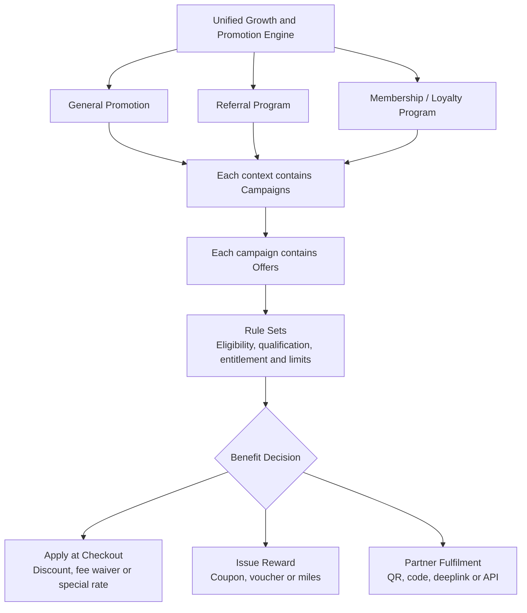

---
document_id: DOC-13
title: Promotion Engine, Coupon, Voucher, Referral & Membership Specification
version: 1.0.0
status: Founder Working Baseline
owner: Growth / Product
reviewers:
  - Product Lead
  - Commercial Lead
  - Finance Lead
  - Payments Lead
  - Risk Lead
  - Compliance Lead
  - Engineering Lead
  - Data Lead
  - Operations Lead
approvers:
  - Project Owner
  - Product Lead
  - Commercial Lead
  - Finance Lead
last_updated: 2026-07-20
classification: Internal
related_documents:
  - DOC-00 Documentation Governance
  - DOC-01 Product Overview & Positioning
  - DOC-02 Business Model & Unit Economics
  - DOC-03 Regulatory, PSP & Acquirer Assessment
  - DOC-04 Compliance Control Framework
  - DOC-05 Master PRD & Feature Requirement Index
  - DOC-06 User Journey, UX Flow & Service Blueprint
  - DOC-07 Content, Disclosure & User Authorization Specification
  - DOC-08 Notification, Receipt & Communication Rules
  - DOC-09 Payment Request, Multi-Funding Source & Settlement
  - DOC-10 Payout & Reconciliation
  - DOC-11 Refund, Cancellation & Chargeback
  - DOC-12 Bill Category, Document AI/OCR & Payee Verification Specification
  - DOC-14 AML, Anti-Cashout, Fraud & Risk Controls
  - DOC-15 Privacy, Data Protection & Record Retention
  - DOC-17 API & Third-party Integration
  - DOC-18 Data Model, Transaction State, Audit Event & Reporting Specification
  - DOC-19 Security, Tokenization & Authentication
  - DOC-20 Testing, UAT & Go-Live Checklist
  - DOC-21 Monitoring, Incident Response & Operations Runbook
  - DOC-22 Admin Management Dashboard Operations Workflow
---

# DOC-13 - Promotion Engine, Coupon, Voucher, Referral & Membership Specification

## 1. Purpose

This document defines PayPlus promotion, coupon, voucher, discount code, card-linked offer, miles reward, referral, member-get-member, membership, and partner-offer rules.

DOC-13 exists to protect checkout, payment quotes, ledger records, partner reconciliation, and user communication from promotion bugs, miscalculation, duplicate reward issuance, unclear eligibility, and uncontrolled campaign cost.

It defines the promotion-engine structure and core data-layer requirements. It does not approve any campaign for launch.

---

## 2. Scope and Ownership

DOC-13 owns:

- campaign, offer, rule, quote, entitlement, instrument, redemption, and fulfilment logic;
- discount, service-fee, card-linked, miles, referral, membership, and external voucher rules;
- eligibility, qualification, entitlement, usage, quota, stacking, funding, and reversal rules;
- promotion quote logic before payer authorization;
- promotion data and audit requirements at business-rule level.

DOC-13 does not own:

| Topic | Owning Document |
| --- | --- |
| MVP feature priority and PRD index | DOC-05 |
| Screen-level UX | DOC-06B, DOC-06D; checkout handoff with DOC-09 |
| User-facing wording and legal disclosure | DOC-07 |
| Notification IDs, channels, and preferences | DOC-08 |
| Payment quote and payer authorization boundary | DOC-09 |
| Payout and reconciliation | DOC-10 |
| Refund, chargeback, reversal, and clawback operations | DOC-11 |
| Fraud, AML, anti-cashout, and abuse risk-control framework | DOC-14 |
| Privacy, consent, retention, and marketing permissions | DOC-15 |
| Partner APIs, files, webhooks, and integration details | DOC-17 |
| Database schema, ledger, events, and warehouse model | DOC-18 |
| Tokenization, PCI, RBAC, and card data security | DOC-19 |
| Testing and go-live acceptance | DOC-20 |
| Monitoring and incident operations | DOC-21 |
| Admin dashboard workflows | DOC-22 |

---

## 3. Current Decision Baseline

| Area | Baseline |
| --- | --- |
| Promotion engine | Required as a unified rule engine; individual campaign launch remains gated. |
| Checkout impact | Promotion impact must be calculated before payer authorization and included in the payment quote. |
| Deferred payment instruction | Promotion quote may be stored with a DOC-09 payment instruction, but eligibility, quota, budget, and instrument status must be revalidated before actual funding submission unless explicit reservation rules apply. |
| Card-linked offers | Selected tokenized payment-card reference or gateway-returned card metadata is preferred; BIN check is supplementary. |
| Service-fee benefits | Service-fee rate changes, reductions, or waivers are calculated before absolute checkout amount discounts. |
| Spending rewards | Accumulated spend rewards track entitlement, not raw card usage. |
| Issued rewards management | Reward instruments from different sources may appear together in DOC-06B `REWARDS-ROOT` under the working label `My Rewards`, with source and instrument type preserved. This must not create a wallet, stored balance, transferable value, or cashout right. |
| MGM and membership | Referral/MGM and membership/tier are separate qualification modules. |
| Asia Miles | Miles reward is supported; API auto-credit is optional and to be confirmed. |
| External vouchers | Framework included; QR, deeplink, code, API, file, webhook, or manual fulfilment may be supported. |
| Stacking | Configurable by offer and campaign, with conservative defaults. |
| Dashboard placement | Featured / What's New / Hot Offer is a DOC-06B dashboard carousel placement. DOC-13 owns campaign, offer, eligibility, entitlement, budget, and reversal logic; DOC-22 owns admin placement controls. |
| Promotion intelligence | Promotion analytics, offer ranking, campaign measurement, and partner reporting must follow DOC-15 data-use tiers and DOC-18 event, lineage, and model-readiness rules. |

---

## 4. Promotion-Engine Structure

PayPlus should use one unified promotion engine.



Each general-promotion, referral, or membership context may contain multiple campaigns. Each campaign may contain multiple offers. An offer may combine multiple rule groups and conditions; the detailed rule families remain defined in Section 5.

The diagram is a business-structure reference, not an app route map. DOC-06B separately governs how users discover offers, manage issued rewards, and enter referral functions.

### 4.1 Campaign

A campaign is the commercial container.

It defines:

- campaign purpose;
- sponsor or funding party;
- display period;
- campaign period;
- claim period, if applicable;
- usage period, if applicable;
- campaign budget;
- campaign quota;
- campaign owner;
- approval status.

Campaign type options include:

- checkout discount campaign;
- service-fee campaign;
- card partner campaign;
- coupon campaign;
- voucher campaign;
- external partner campaign;
- referral / MGM campaign;
- membership / tier campaign;
- miles / points campaign;
- partner-funded campaign;
- PayPlus-funded campaign;
- mixed-funded campaign.

Campaign dates should support:

- always valid;
- fixed start/end;
- recurring period;
- manually paused or resumed;
- separate claim period;
- separate usage period;
- usage expiry based on issue date or claim date.

Campaign expiry should not automatically expire issued rewards unless configured.

### 4.2 Offer

An offer is the rule package under a campaign. A campaign may contain one or more offers.

If one campaign gives different benefits with different mechanics, timing, or fulfilment, each benefit should be a separate offer.

Example:

```text
SIM Credit Card Rent Campaign
  -> Offer A: service fee waiver
  -> Offer B: HK$150 PayPlus coupon after accumulated eligible spend
```

### 4.3 Offer Type

Offer type describes the commercial nature of the offer.

Offer type options include:

- direct checkout discount;
- service fee discount;
- service fee waiver;
- special service fee rate;
- coupon issuance;
- voucher issuance;
- discount code;
- card-linked offer;
- miles / points reward;
- external partner offer;
- referral reward;
- membership / tier benefit;
- spending reward;
- consecutive usage reward;
- first-use reward.

Offer type may combine with eligibility method.

Example:

```text
Card-linked offer + service fee waiver
Referral reward + coupon issuance
Membership tier benefit + special service fee rate
Spending reward + miles reward
```

### 4.4 Application Path

Application path defines how the benefit is delivered.

| Application Path | Meaning | Example |
| --- | --- | --- |
| Direct Checkout Application | Benefit affects checkout immediately through the promotion quote. | Service fee waiver. |
| Instrument Issuance | Coupon, voucher, code, or entitlement is issued for later use. | HK$150 PayPlus coupon. |
| External Partner Fulfilment | Benefit is used outside PayPlus. | Restaurant QR voucher. |
| Miles / Points Fulfilment | Miles or points are recorded and credited later. | Asia Miles reward. |
| Membership Auto-Benefit | Tier benefit applies automatically or unlocks offers. | Gold tier special service fee rate. |

Card-linked fee waivers usually use Direct Checkout Application. Referral rewards and spending rewards usually use Instrument Issuance. Asia Miles rewards usually use Miles / Points Fulfilment.

---

## 5. Rule Families

Rules should be grouped by purpose instead of placing every condition under generic "eligibility".

### 5.1 Eligibility Rules

Eligibility rules answer: **Can this user, request, payment method, or transaction enter the offer?**

Common eligibility dimensions:

- user status;
- KYC/KYB status;
- risk status;
- new or existing user;
- request origin;
- bill category;
- payee type;
- evidence verification status;
- payment method;
- selected payment card or applicable split-payment funding leg;
- card scheme;
- card issuer;
- card type;
- BIN range;
- saved card status;
- membership tier;
- referral status;
- campaign period;
- campaign budget or quota availability.

Card-linked eligibility should prefer the selected tokenized payment-card reference or gateway-returned card metadata. For split payment, evaluation should link to the applicable funding leg. BIN check may support pre-screening and display, but should not be the final proof for checkout discount.

### 5.2 Qualification Rules

Qualification rules answer: **What must be achieved before the user qualifies?**

Examples:

- minimum spend;
- accumulated spend;
- first eligible transaction;
- first eligible category use;
- first eligible card use;
- consecutive month usage;
- accumulated payment amount over a period;
- accumulated transaction count over a period.

Accumulated spend may consist of multiple transactions.

### 5.3 Entitlement Rules

Entitlement rules answer: **When does the user earn or become entitled to the benefit?**

Examples:

- once per calendar month;
- maximum 3 entitlements in 6 months;
- first 1,000 entitled users;
- entitlement only after payment completion;
- entitlement only after settlement;
- entitlement only after refund/chargeback risk window;
- entitlement only if accumulated spend reaches threshold.

Important rule:

```text
For spending-threshold rewards, PayPlus should track whether the user has become
entitled to the benefit in the period, not whether the user has used the card in the period.
```

Example:

```text
Eligible rent payments with the same tokenized SIM credit card accumulate toward
a HK$15,000 monthly spend target. The user may use the card many times.
The user becomes entitled to the reward once the target is reached, but cannot
become entitled to that reward more than once in the same calendar month.
```

### 5.4 Benefit Rules

Benefit rules answer: **What value is given and how is it calculated?**

Benefit targets:

- checkout amount;
- bill or obligation amount;
- PayPlus service fee;
- partner voucher;
- miles / points;
- membership tier benefit.

Benefit methods:

- absolute amount discount;
- percentage discount;
- special service fee rate;
- service fee percentage-point reduction;
- service fee waiver;
- fixed coupon value;
- voucher value;
- miles / points formula;
- tier upgrade or tier benefit.

Service-fee logic:

```text
Payment amount
-> normal service fee rate
-> normal service fee
-> eligible amount cap
-> special rate / rate reduction / waiver
-> final service fee
```

Checkout amount discounts apply after service fee calculation unless the offer explicitly defines another approved order.

### 5.5 Usage / Quota Rules

Usage rules answer: **How often may an already earned or applicable benefit be used?**

Quota rules answer: **How many users, transactions, instruments, or total value may the campaign support?**

Options include:

- total campaign budget;
- total campaign quota;
- first X users;
- first X transactions;
- per-user usage limit;
- per-card usage limit;
- per-offer usage limit;
- per-instrument usage limit;
- per-day usage limit;
- per-calendar-month usage limit;
- rolling-period usage limit;
- campaign-period usage limit;
- once per user;
- once per card;
- maximum N times in X months.

### 5.6 Stacking / Priority Rules

Stacking rules answer: **Can this benefit combine with another benefit?**

Priority rules answer: **Which benefit applies first or wins when there is a conflict?**

For clarity:

- an **offer card** is only the user-interface component used to summarize an offer;
- a **payment card** is a tokenized or newly entered credit/debit card used for funding;
- a **Card Offer** is an offer whose eligibility depends on permitted payment-card attributes;
- a **payment profile** is a saved split-card allocation template, not an individual payment card.

Options include:

- not stackable;
- stackable with selected offer types;
- stackable only within same campaign;
- stackable only across different campaigns;
- stackable with card-linked offer;
- stackable with coupon;
- stackable with membership benefit;
- stackable with referral reward;
- stackable with external voucher;
- auto-apply highest user value;
- auto-apply lowest PayPlus cost;
- user selects one;
- admin-defined priority.

Recommended default:

- service-fee rate, reduction, or waiver benefits apply before absolute checkout amount discounts;
- only one payment-method-sensitive Card Offer may apply to each selected payment card or split-payment funding leg;
- if more than one Card Offer is eligible for the same payment card or funding leg, PayPlus must automatically apply the offer with the highest user value and display the applied offer and benefit;
- highest user value means the highest approved quantified benefit for the current payment context; equal or non-directly-comparable values use a deterministic admin-configured priority until the final valuation method is specified;
- a Card Offer may auto-apply only after eligibility is confirmed against the selected payment card or applicable funding leg;
- the payer does not manually choose between competing payment-method-sensitive Card Offers;
- the applied Card Offer does not consume the separate coupon/voucher selection slot; one eligible user-selected checkout coupon, voucher, or discount code may also apply unless additional same-family stacking is explicitly approved;
- external vouchers do not reduce PayPlus checkout amount unless configured as checkout-funded.

For split-card payment, the one-best-Card-Offer rule applies independently to each funding leg. A card-sensitive benefit normally applies only to the amount funded by the eligible payment card unless the approved offer rules explicitly use the whole payment. Transaction-level caps, quotas, usage limits, and exclusions still apply across all legs.

### 5.7 Funding, Reversal, and Fulfilment Rules

Funding source options:

- PayPlus-funded;
- card partner-funded;
- merchant or partner-funded;
- joint-funded;
- campaign budget-funded;
- reimbursement arrangement;
- to be confirmed.

Reversal / clawback options:

- no reversal;
- reverse on full refund;
- pro-rata reverse on partial refund;
- reverse on chargeback;
- hold reward until risk window ends;
- void unused instrument;
- restore instrument after failed checkout;
- manual review required.

Fulfilment options:

- immediate checkout application;
- issued reward management through DOC-06B `REWARDS-ROOT`;
- QR code generation;
- static partner code;
- unique partner code;
- deeplink;
- API submission;
- batch file;
- webhook confirmation;
- manual upload;
- manual partner portal.

---

## 6. Checkout Calculation and Promotion Quote

DOC-13 owns promotion calculation. DOC-09 owns final payment quote and payer authorization.

Checkout calculation sequence:

1. Start with payment amount.
2. Identify normal PayPlus service fee rate.
3. Calculate normal service fee.
4. Filter eligible offers.
5. Apply qualification and entitlement rules.
6. Determine eligible amount and caps.
7. For each selected payment card or split-payment funding leg, select and auto-apply the single eligible payment-method-sensitive Card Offer with the highest user value.
8. Apply the selected Card Offer's special service fee rate, rate reduction, waiver, or other approved benefit.
9. Calculate final service fee.
10. Apply one eligible user-selected checkout coupon, voucher, or discount code where provided.
11. Apply remaining approved stacking, priority, budget, quota, and usage rules.
12. Produce promotion quote.
13. Pass promotion quote to payment quote.
14. Store applied promotion terms, selection basis, and user-value result for authorization and audit.
15. Revalidate or recalculate before actual funding submission where DOC-09 deferred payment instruction is used.

After the payer selects a payment card or payment profile, DOC-09 checkout must evaluate and display the available promotion result in the same checkout screen or step. The UI must identify the automatically applied Card Offer, allow a separate eligible coupon/voucher/discount selection, and show the recalculated fee, discount, benefit, and final total before authorization. Changing the payment card, profile, funding allocation, amount, or other material eligibility input invalidates the prior promotion quote and triggers re-evaluation.

Material changes require recalculation. Material changes include payment amount, category, payee, evidence status, selected card, card split, service fee, discount, campaign status, usage entitlement, or budget availability.

For DOC-09 deferred payment instructions, the original promotion quote should be retained for audit. PayPlus should not assume campaign quota, budget, coupon/voucher availability, card-linked eligibility, membership status, or reward entitlement remains valid when the user returns to submit payment unless the campaign explicitly reserves that benefit.

Reservation behavior must be configurable:

- no reservation: revalidate and recalculate at submission;
- soft reservation: show expected benefit but revalidate before submission;
- hard reservation: reserve budget, quota, or instrument for a configured expiry window;
- expiry release: release reserved benefit if instruction expires or is cancelled.

Promotion quote should include:

- promotion quote ID;
- request ID;
- payment quote ID;
- campaign ID;
- offer ID;
- instrument ID, if applicable;
- eligibility and qualification result;
- entitlement result;
- benefit target and method;
- payment amount;
- eligible amount;
- normal fee rate;
- normal service fee;
- adjusted fee rate, if applicable;
- waived or reduced fee amount;
- checkout discount amount;
- final service fee;
- total promotion impact;
- funding source and cost bearer;
- reservation status and expiry where applicable;
- rejection reason if not eligible.

---

## 7. Examples

### 7.1 Cathay Mastercard Management Fee Service Fee Waiver

Promotion:

```text
Use Cathay Mastercard to pay management fee for the first time in PayPlus.
Enjoy service fee waiver on eligible amount up to HK$20,000.
```

Case:

```text
User pays HK$25,000 management fee using eligible tokenized Cathay Mastercard.
Normal PayPlus service fee rate is 1.5%.
```

Structure:

```text
Campaign: Cathay Mastercard Management Fee Campaign
Offer: First-use service fee waiver
Offer Type: Card-linked offer + service fee waiver
Application Path: Direct Checkout Application
Eligibility: management fee category, first eligible PayPlus use, tokenized Cathay Mastercard
Benefit: service fee waiver on eligible amount cap HK$20,000
```

Calculation:

```text
Payment amount: HK$25,000
Normal service fee: HK$25,000 x 1.5% = HK$375
Eligible capped amount: HK$20,000
Waived service fee: HK$20,000 x 1.5% = HK$300
Final service fee: HK$5,000 x 1.5% = HK$75
Final checkout total: HK$25,075
```

No coupon is issued.

### 7.2 SIM Credit Card Rent Campaign With Fee Waiver and Coupon Reward

Promotion:

```text
Use SIM credit card on PayPlus to pay rent.
Enjoy service fee waiver with minimum spend HK$5,000 and eligible amount cap HK$20,000.
Receive extra HK$150 PayPlus coupon if eligible spending using the same SIM credit card reaches HK$15,000.
Each user may become entitled to the campaign benefit maximum 3 times in 6 months,
and maximum once per calendar month. No consecutive spending requirement applies.
```

Structure:

```text
Campaign: SIM Credit Card Rent Campaign

Offer A: Service Fee Waiver
Offer Type: Card-linked offer + service fee waiver
Application Path: Direct Checkout Application
Eligibility: rent category, tokenized SIM credit card
Qualification: payment amount >= HK$5,000
Benefit: service fee waiver on eligible amount cap HK$20,000

Offer B: HK$150 PayPlus Coupon
Offer Type: spending reward + coupon issuance
Application Path: Instrument Issuance
Eligibility: rent category, same tokenized SIM credit card
Qualification: accumulated eligible spend reaches HK$15,000 in entitlement period
Entitlement: not already entitled to this coupon in the same calendar month
Benefit: HK$150 PayPlus coupon
```

The card may be used multiple times. The monthly coupon rule checks benefit entitlement, not card usage.

```text
Wrong: user did not use this card this month.
Correct: user has not already become entitled to this benefit this month.
```

---

## 8. Data-Layer Requirements

DOC-13 defines business data requirements. DOC-18 owns final schema.

Promotion, referral, membership, miles, external voucher, partner, card-linked eligibility, and campaign-behavior data must be classified under DOC-15. DOC-18 should store field-level metadata for data class, sensitivity, displayability, masking, retention, owner, approved purpose, access role, audit requirement, source, partner-sharing status, consent/preference dependency, lineage, and model-use eligibility where applicable.

Recommended core objects:

- campaign;
- offer;
- offer rule;
- qualification accumulator;
- benefit entitlement;
- promotion quote;
- promotion quote reservation where applicable;
- benefit application;
- campaign usage;
- reward instrument;
- redemption / fulfilment;
- referral relationship;
- membership account;
- partner fulfilment record;
- budget ledger;
- reversal / clawback record;
- placement exposure and impression/action event;
- campaign measurement or aggregate partner report where approved.

### 8.1 Campaign

Campaign stores the commercial container:

- campaign ID;
- name;
- campaign type;
- sponsor;
- funding source;
- display period;
- campaign period;
- claim period;
- usage period;
- budget;
- quota;
- status;
- approval status;
- owner.

### 8.2 Offer

Offer stores the benefit package:

- offer ID;
- campaign ID;
- offer name;
- offer type;
- application path;
- one or more discovery collection references, such as Card, Pay+, or Partner;
- Featured / Hot placement flag where applicable;
- primary `OFFERS-ROOT` placement;
- category/label references for user-facing filtering;
- key-visual or approved content-asset reference;
- action type and approved destination reference, such as in-app route, redemption, campaign landing page, card application, or external link;
- benefit target;
- benefit method;
- display priority by collection;
- payment-method-sensitive flag;
- application mode, including automatic or user-selected;
- approved user-value amount, method, or deterministic comparison priority;
- stacking group;
- stackable flag;
- funding source;
- cost bearer;
- status.

Each offer displayed in a filterable Pay+ or Partner collection must carry at least one approved category/label reference. Label values and display wording remain to be confirmed. DOC-18 owns the final relational/schema design and DOC-22 owns admin creation, localization, ordering, enablement, and audit controls.

Discovery collection rules:

- one Offer ID may belong to multiple discovery collections where the offer genuinely satisfies each collection's purpose;
- Featured / Hot is a placement flag, not a mutually exclusive offer type;
- different Offer IDs remain distinct even when the same payment card qualifies for each offer;
- the same Offer ID should appear once on a normal `OFFERS-ROOT` rendering, using its configured primary root placement, while remaining available in every relevant complete child collection;
- an approved, audited admin override may intentionally repeat an Offer ID on `OFFERS-ROOT`;
- display priority is configured by collection and must remain separate from stacking or benefit-selection priority.

### 8.3 Offer Rule

Offer rules should be typed and configurable.

Rule types:

- eligibility;
- qualification;
- entitlement;
- benefit;
- usage;
- quota;
- stacking;
- funding;
- reversal;
- fulfilment.

Rule fields should support:

- rule key;
- operator;
- value;
- amount cap;
- count limit;
- period type;
- period start/end;
- status.

### 8.4 Qualification Accumulator

Qualification accumulator tracks progress toward a qualification target.

Required for accumulated spend, transaction count, or consecutive usage rewards.

Fields:

- accumulator ID;
- campaign ID;
- offer ID;
- user ID;
- payment-card token/reference or funding-leg ID, if applicable;
- category;
- period start/end;
- accumulated qualifying amount;
- qualifying transaction count;
- last qualifying transaction ID;
- status.

### 8.5 Benefit Entitlement

Benefit entitlement records that the user has earned a benefit.

Fields:

- entitlement ID;
- campaign ID;
- offer ID;
- user ID;
- entitlement period;
- source transaction ID or accumulator ID;
- entitlement status;
- threshold reached timestamp;
- reward instrument ID, if issued;
- reversal status.

### 8.6 Promotion Quote and Benefit Application

Promotion quote is the pre-authorization calculation result.

Promotion quote reservation records whether a quote benefit is not reserved, softly reserved, or hard reserved for a DOC-09 deferred payment instruction, including expiry and release status.

Benefit application is the actual confirmed use of a benefit after authorization, payment completion, or other configured trigger.

Promotion quote, reservation, and benefit application records must link to campaign, offer, user, request, payment instruction where applicable, funding leg where applicable, payment, funding source, applied amount, and reversal status.

### 8.7 Reward Instrument and Redemption / Fulfilment

Reward instrument exists only when something is issued to the user.

Instrument types:

- coupon;
- voucher;
- discount code;
- invitation code;
- external voucher;
- miles entitlement.

Redemption / fulfilment records later use or delivery, such as checkout redemption, QR redemption, partner API confirmation, manual fulfilment, or Asia Miles crediting.

---

## 9. Card-Linked Promotion Rules

Card-linked offer eligibility should be confirmed against the actual selected payment card and, for split payment, the applicable funding leg before payer authorization.

Preferred method:

```text
Selected tokenized payment-card reference or gateway-returned card metadata.
```

Supplementary method:

```text
BIN check for pre-screening, display, fallback, or admin configuration.
```

Card-linked rules should support:

- card scheme;
- issuer;
- card type;
- BIN range;
- selected payment-card token/reference and applicable funding-leg reference;
- payment channel;
- per-user limits;
- per-card limits;
- accumulated spend;
- entitlement period;
- eligible amount cap;
- campaign budget and quota.

For multi-card payments, the card-linked benefit should apply only to the eligible card-funded portion unless the campaign explicitly states otherwise.

---

## 10. Coupon, Voucher, Miles, Referral, and Membership Rules

DOC-06B `REWARDS-ROOT` may show issued instruments from different earning sources, including referral reward, spending reward, membership reward, or partner campaign. Source metadata and instrument type must remain preserved.

The UI does not need to show every structured field separately. It may show a human-readable summary, key conditions, expiry, status, and expandable terms. DOC-06B owns route/screen placement; DOC-07 owns wording.

Asia Miles rewards should support:

- mileage account number;
- account validation status where available;
- miles formula;
- eligible amount;
- pending, submitted, credited, failed, reversed statuses;
- manual, file, portal, API, webhook, or manual adjustment fulfilment.

If auto-credit is available, DOC-08 must support app communication and notification.

Referral/MGM is separate from membership/tier:

- referral tracks referrer, referee, invitation code/link, attribution, qualifying event, and reward;
- membership tracks usage-oriented tier, payment volume, transaction count, consecutive usage, tier status, and benefits.

Both modules may issue normal reward instruments into `REWARDS-ROOT`.

Membership conversion ratios and tier formulas remain to be confirmed.

---

## 11. Refund, Reversal, Chargeback, and Clawback

Promotion treatment must be configurable and traceable.

Rules should define whether to:

- release reserved rewards after failed checkout;
- restore coupon after cancellation before payment;
- reverse discount after full refund;
- pro-rate discount after partial refund;
- claw back referral reward after chargeback;
- hold miles or referral reward until settlement or risk window ends;
- cancel external voucher after issuance, if partner supports it;
- adjust partner reimbursement after reversal.

Operational handling belongs in DOC-11 and DOC-22.

---

## 12. Risk, Compliance, Privacy, and Security Boundaries

Promotion features must not create wallet, stored-value, cashout, arbitrary transfer, or unrestricted reward balance behavior unless separately assessed and approved. `REWARDS-ROOT` is only a display and management surface for issued reward instruments.

Controls should address:

- coupon brute force;
- duplicate claims;
- referral self-invite;
- referral farming;
- fake accounts;
- card offer abuse;
- multi-card promotion gaming;
- refund or chargeback abuse;
- external voucher resale;
- negative-margin campaign exposure;
- misleading disclosure;
- partner data leakage;
- miles account personal data.

DOC-14 owns risk-control framework, risk routing, and abuse handling boundaries. Final thresholds, monitoring, admin workflow, privacy, consent, partner sharing, tokenization, and access controls belong to DOC-15, DOC-18, DOC-19, DOC-21, and DOC-22.

Promotion data must not be used as a back door for unrestricted profiling, raw user-level partner data sharing, offsite advertising activation, credit scoring, insurance underwriting, or sensitive evidence-based targeting. Offer ranking, placement targeting, campaign lift measurement, and partner reporting should use the minimum necessary data, respect consent and preference rules, preserve lineage, and prefer aggregated or de-identified outputs where partner visibility is needed.

---

## 12.1 Dashboard and Placement Boundaries

DOC-06B defines the designated Home Dashboard flow and places the Featured / What's New / Hot Offer carousel directly under the shortcut grid.

For promotion-related dashboard placement:

- DOC-13 defines campaign, offer, rule, eligibility, entitlement, budget, quota, fulfilment, reversal, and partner-funding behavior;
- DOC-06B defines user-facing dashboard placement and route relationship;
- DOC-08 defines communication, notification, inbox, and message-channel boundaries;
- DOC-15 defines consent, personalization, targeting, data classification, and partner-sharing boundaries;
- DOC-22 defines admin setup, approval, targeting, priority, scheduling, enable/disable, and audit workflow.

A placement slot must not bypass promotion eligibility, budget, quota, consent, privacy, or approval controls.

If future AI or model-assisted ranking is used for offers or placements, DOC-13 should define business eligibility and benefit rules, while DOC-15 defines permitted data use and DOC-18 defines event, feature, model, lineage, and reporting metadata. Human review or approval should remain available for sensitive campaign categories, partner-funded targeting, and exception handling.

---

## 13. Affected and Related Documents

| Document | Required Cross-Check |
| --- | --- |
| DOC-02 | Promotion cost, funding source, commercial gates, margin, tax, and accounting treatment. |
| DOC-05 | Feature index, MVP gating, admin configuration, and promotion requirements. |
| DOC-06B | Coupon/voucher library route placement, MGM/referral placement, membership/reward status UX surfaces, and Featured / What's New / Hot Offer dashboard carousel placement. |
| DOC-07 | Promotion, fee, discount, miles, voucher, eligibility, expiry, and T&C disclosure. |
| DOC-08 | Reward, referral, coupon, voucher, miles, campaign, entitlement, and fulfilment notification events. |
| DOC-09 | Promotion quote, final payment quote, deferred payment instruction revalidation, card-linked eligibility, recalculation, and reauthorization. |
| DOC-10 | Partner reimbursement and promotion settlement/reconciliation where applicable. |
| DOC-11 | Refund, reversal, chargeback, coupon restoration, miles reversal, and clawback. |
| DOC-12 | Keep promotion, referral, membership, and payment behavior data separate from evidence-derived data. |
| DOC-14 | Promotion abuse, referral abuse, fake accounts, coupon farming, card offer gaming, and proportionate reward-hold versus payment-blocking decisions. |
| DOC-15 | Promotion/referral/membership data classification, marketing consent, retention, partner sharing, model-use boundaries, and miles account data. |
| DOC-17 | Partner APIs, voucher redemption, miles API, card metadata, and webhooks. |
| DOC-18 | Campaign, offer, rule, quote, accumulator, entitlement, redemption, ledger, event, lineage, analytics, model-feature metadata, and reporting schema. |
| DOC-19 | Tokenization, payment profile metadata, access control, encryption, and PCI boundaries. |
| DOC-20 | Promotion calculation, entitlement, redemption, and reversal test cases. |
| DOC-21 | Campaign monitoring, abuse alerts, partner failures, and incidents. |
| DOC-22 | Admin setup, approval, override, void, reissue, reconciliation upload, and support workflow. |

---

## 14. Open Questions

| Question ID | Question | Owner | Status |
| --- | --- | --- | --- |
| OQ-13-001 | Which promotion types are MVP versus launch-gated? | Product / Commercial | Open |
| OQ-13-002 | Which approved exceptions, equal-value tie-breaks, or non-monetary valuation methods may vary from the confirmed one-best-Card-Offer plus one checkout coupon/voucher/discount default? | Product / Finance / Risk | Open |
| OQ-13-003 | Which card metadata fields will PSP/acquirer/gateway return for tokenized card eligibility? | Payments / Engineering / Security | Open |
| OQ-13-004 | What normal service fee rates, special rates, fee reductions, and waivers are approved? | Commercial / Finance | Open |
| OQ-13-005 | What campaign budget and approval workflow is required? | Commercial / Finance / Project Owner | Open |
| OQ-13-006 | Are external partner vouchers MVP, pilot, or future only? | Product / Commercial | Open |
| OQ-13-007 | Is Asia Miles auto-credit through API available, or will fulfilment start with manual/batch reconciliation? | Product / Partnerships / Engineering | Open |
| OQ-13-008 | What Asia Miles account validation, consent, and retention rules are required? | Legal / Privacy / Partnerships | Open |
| OQ-13-009 | What referral qualifying event triggers reward approval? | Product / Growth / Risk | Open |
| OQ-13-010 | What refund, chargeback, and risk window applies before referral or miles rewards become final? | Risk / Finance / Operations | Open |
| OQ-13-011 | What membership tier formula, conversion ratio, downgrade rule, and grace period apply? | Product / Growth / Commercial | Open |
| OQ-13-012 | What partner reimbursement, tax, and accounting treatment applies to partner-funded offers? | Finance / Legal / Commercial | Open |
| OQ-13-013 | Which promotion types may be hard-reserved for DOC-09 deferred payment instructions, and what expiry, budget-release, and user-notice rules apply? | Product / Growth / Finance | Open |
| OQ-13-014 | Which promotion, partner, announcement, referral, or feature items may appear in the DOC-06B Featured / What's New / Hot Offer carousel, and what approval, targeting, and consent rules apply? | Product / Growth / Privacy | Open |
| OQ-13-015 | What data may be used for offer ranking, placement personalization, campaign lift measurement, and partner-funded offer reporting? | Product / Growth / Privacy | Open |
| OQ-13-016 | What aggregation, de-identification, report approval, and partner-contract controls are required before campaign performance data is shared externally? | Growth / Privacy / Legal | Open |

---

## 15. Acceptance Criteria

DOC-13 is acceptable when:

- promotion-engine structure is separate from data-layer requirements;
- campaign, offer, offer type, application path, and rule families are clear;
- eligibility, qualification, entitlement, usage, quota, benefit, stacking, funding, reversal, and fulfilment are separated;
- direct checkout benefit and instrument issuance paths are defined;
- accumulated spend rewards track entitlement, not raw card usage;
- checkout calculation sequence is clear;
- deferred payment instruction quote revalidation and reservation boundaries are defined;
- card-linked eligibility prefers the selected tokenized payment-card reference or gateway-returned card metadata, links split-card evaluation to the applicable funding leg, and treats BIN check as supplementary;
- `REWARDS-ROOT` can show issued rewards from different sources while preserving source and instrument type;
- MGM/referral and membership/tier are separate qualification modules;
- Asia Miles reward and external partner fulfilment are covered;
- campaign measurement, partner reporting, consent-aware offer ranking, and model-assisted placement boundaries are traceable to DOC-15 and DOC-18;
- affected documents are clearly marked for follow-up alignment.
- dashboard placement boundaries are clear for the DOC-06B Featured / What's New / Hot Offer carousel without turning DOC-13 into a UI specification.

This document should remain a compact promotion engine specification. It should not become a final campaign plan, pricing sheet, tax memo, partner contract, UI copy deck, API specification, or database schema.

---

## 16. Version History

| Version | Date | Summary |
| --- | --- | --- |
| 1.0.0 | 2026-07-20 | Confirmed multi-collection offer membership, root duplicate suppression boundary, one automatically selected highest-user-value payment-method-sensitive Card Offer per payment card/funding leg, separate eligible coupon/voucher/discount selection, and same-screen DOC-09 checkout recalculation handoff. |
| 0.1.0 | 2026-06-01 | Initial founder working baseline for promotion engine, coupon, voucher, discount code, card-linked offer, Asia Miles reward, referral, membership, external partner voucher, checkout calculation, stacking, usage, data, reversal, and cross-document alignment requirements. |
| 0.2.0 | 2026-06-01 | Rewritten to separate promotion-engine structure from data-layer requirements, add rule families, clarify entitlement versus usage logic for accumulated spend rewards, and preserve tokenized card, service-fee, coupon library, Asia Miles, MGM, membership, and cross-document alignment decisions. |
| 0.3.0 | 2026-06-02 | Aligned promotion abuse wording with DOC-14 by treating DOC-14 as the risk-control framework and clarifying reward-hold versus payment-blocking boundaries. |
| 0.4.0 | 2026-06-02 | Aligned promotion data requirements with DOC-15 by adding data classification, sensitivity, displayability, retention, approved-purpose, and partner-sharing metadata requirements for DOC-18. |
| 0.5.0 | 2026-06-02 | Aligned promotion quote handling with DOC-09 user payment instruction by adding deferred quote revalidation, configurable reservation, expiry release, and payment-instruction linkage. |
| 0.6.0 | 2026-06-02 | Standardized coupon/voucher library wording to avoid stored-value confusion while preserving reward instrument source metadata. |
| 0.7.0 | 2026-06-04 | Aligned promotion placement boundaries with DOC-06 by defining Featured / What's New / Hot Offer carousel ownership split across DOC-06, DOC-08, DOC-13, DOC-15, and DOC-22. |
| 0.8.0 | 2026-06-08 | Added promotion intelligence boundaries for consent-aware offer ranking, campaign measurement, partner reporting, model-use metadata, and privacy-safe aggregation alignment with DOC-15 and DOC-18. |
| 0.9.0 | 2026-07-17 | Added a simplified promotion-engine hierarchy covering general promotions, referral and membership programs, multiple campaigns and offers, rule evaluation, and benefit delivery; added offer discovery-group, category/label, key-visual, and action-destination metadata requirements for DOC-06B offer routes; clarified that the hierarchy is not app route ownership. |
