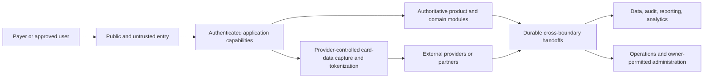

# DOC-16 - Technical Architecture Specification

| Document Control | Details |
| --- | --- |
| **Document ID** | `DOC-16` |
| **Title** | Technical Architecture Specification |
| **Version** | `0.2.0` |
| **Status** | Draft |
| **Owner** | Engineering / Architecture |
| **Reviewers** | Engineering Lead Architecture Lead Payments Lead Security Lead Privacy Lead Data Lead Operations Lead Compliance Lead |
| **Approvers** | Project Owner Engineering Lead Security Lead Compliance Lead |
| **Last Updated** | `2026-08-19` |
| **Classification** | Internal |
| **Related Documents** | DOC-00 Documentation Governance DOC-01 Project Charter & Product Positioning DOC-04 Compliance Control Framework DOC-05 Master PRD & Feature Requirement Index DOC-06 User Journey, UX Flow & Service Blueprint DOC-07 Content, Disclosure & User Authorization Specification DOC-08 Notification, Receipt & Communication Specification DOC-09 Payment Domain Architecture DOC-10 Payout & Reconciliation DOC-11 Refund, Cancellation & Chargeback DOC-12 Bill Category, Document AI/OCR & Payee Verification Specification DOC-13 Promotion Engine, Coupon, Voucher, Referral & Membership Specification DOC-14 AML, Anti-Cashout, Fraud, Dynamic Auth & Risk Control Specification DOC-15 Privacy, Data Protection & Record Retention Specification DOC-17 API & Third-party Integration Specification DOC-18 Data Model, Transaction State, Audit Event & Reporting Specification DOC-19 Security, Tokenization, Authentication & Admin Control Specification DOC-20 Testing, UAT & Go-Live Checklist DOC-21 Monitoring, Incident Response & Operational SOPs DOC-22 Admin Management Dashboard & Operations Workflow DOC-99 ISMS Policy Library |

> This is a Stage 8 Draft. It is not an Approved source of truth and does not establish production readiness, provider approval, regulatory approval, ISO/IEC 27001 certification, PCI DSS compliance, or PCI DSS scope elimination.

## 1. Purpose, scope, and ownership

DOC-16 translates accepted PayPlus product, payment, risk, privacy, compliance, and operational requirements into a vendor-neutral technical architecture posture and owner contracts.

It owns system context, trust boundaries, modular architecture, evidence-based isolation, local transaction and cross-boundary handoff principles, reliability, recovery, reconciliation, observability, technical evidence obligations, and technical owner routing.

It does not define provider APIs, schemas, event names, persistence products, authentication protocols, cryptographic constants, deployment products, implementation code, product routes, user-facing copy, or detailed domain rules.

| DOC-16 owns | Primary owner elsewhere |
| --- | --- |
| Architecture posture, context, trust boundaries, module/deployment principles, handoffs, reliability, recovery, observability, and technical evidence obligations | Product scope and user behavior: DOC-01, DOC-05, DOC-06, DOC-07, DOC-08 |
| Architecture-level payment-data boundary | Payment semantics and monetary invariants: DOC-09 |
| Architecture-level provider and security handoffs | Provider mechanics: DOC-17; data and event implementation: DOC-18; security implementation: DOC-19 |
| Architecture-level privacy, access, retention, and evidence constraints | Privacy policy: DOC-15; acceptance: DOC-20; operations: DOC-21; Admin execution: DOC-22 |

Engineering / Architecture is the primary owner. A handoff is complete only when the receiving owner can define its detail without DOC-16 silently supplying it.

## 2. Accepted inputs and non-reopening rule

### 2.1 Founder decisions implemented

| Decision | Accepted direction | DOC-16 representation |
| --- | --- | --- |
| `DOC16-FD-01` | Risk-isolated modular architecture; cohesive modular core by default; isolate only where evidence justifies it; no full-microservices commitment | Sections 3 and 4 |
| `DOC16-FD-02` | Provider-controlled card-data capture and tokenization; PayPlus systems do not receive, process, transmit, or retain raw PAN or card-verification values under the current provider-controlled boundary | Section 5 |
| `DOC16-FD-03` | Each authoritative owner commits local state and invariants atomically within its own boundary; no cross-owner single transaction; durable retryable idempotent handoffs with correlation, auditability, recovery, and reconciliation | Sections 6 and 7 |
| `DOC16-FD-04` | Engineering / Architecture owns DOC-16; only DOC-16 is writable in this Draft; DOC-17, DOC-18, DOC-19, and all other files are protected | Sections 1, 2, and 10 |

### 2.2 Stage 8 Draft authorization provenance

`DOC16-FD-05` is Stage 8 Draft authorization provenance, not a technical architecture decision or requirement. It authorized only DOC-16 as writable for this Draft; DOC-17, DOC-18, DOC-19, and every other repository file remained protected. It did not authorize Stage 9 Review, Stage 10 or later work, records, Git action, implementation, or external-state change.

### 2.3 Accepted Founder Technical Governance Principle

Founder decides business requirements, product outcomes, acceptable or unacceptable business, financial, compliance, security, and operational risk, material scope/budget/schedule trade-offs, genuine product-versus-technical conflicts, residual-risk acceptance, and lifecycle progression.

Engineering, Architecture, Security, Payments, Data, QA, and Operations translate accepted requirements into implementable technical requirements, recommend a professionally sound solution, evaluate alternatives and failure modes, and accept professional responsibility for technical completeness within their delegated ownership.

Technical work must consider applicable ISO/IEC 27001, PCI DSS, privacy, payment, and regulatory requirements from design outset; minimize sensitive-data and PCI scope where practicable; preserve least privilege, segregation of duties, auditability, data protection, reliability, idempotency, recovery, reconciliation, observability, testability, and operational support.

Technical recommendations must distinguish accepted requirements, assumptions, recommendations, delegated decisions, and unresolved questions. The Founder must not be asked to choose an unanalyzed technical mechanism.

### 2.4 Accepted product and domain constraints

- PayPlus is a controlled bill, fee, rent, and approved-payee payment application, not a wallet, stored-value account, unrestricted peer-to-peer transfer product, cashout/remittance product, lending product, or open money-request marketplace.
- Bill/Rent remains the authoritative source business object. Evidence supports verification and is not itself payable.
- DOC-09 owns Payment Domain semantics from Bill/Rent Payable Basis through Payment Obligation, Checkout Workspace, funding execution, Payment, and Payment Application.
- Checkout executes against Payment Obligations and not directly against Evidence, Bill/Rent, Projection, or Bill/Rent Payable Basis.
- A late provider confirmation does not reopen a closed or expired Checkout and does not automatically create a Payment Application.
- Payment, Payment Application, Settlement, Payout, and adjustment facts remain distinct.
- DOC-16 creates no replacement for retired Request, Linking, Receive, or Receiving Info runtime concepts and creates no new route, status, object, permission, or product behavior.
- Source Archive and projections do not erase or replace canonical source, evidence, payment, or audit facts.

## 3. Architecture posture and trust boundaries

### 3.1 Risk-isolated modular architecture

PayPlus uses a cohesive modular core by default. A separate process, deployment, or security boundary is introduced only when evidence shows a material benefit for sensitivity, payment-data exposure, trust, least privilege, failure isolation, scaling, reliability, compliance evidence, or independent change.

This is not a predefined service catalogue and does not commit PayPlus to full microservices. The absence of evidence for separation is a reason to retain a cohesive module, not a reason to invent a service topology.

For each proposed boundary, Engineering / Architecture should record the problem, owner, evidence, alternatives rejected, business and operational impact, cost and complexity, failure and recovery effect, and later rollback or exit treatment.

### 3.2 Architecture zones

| Zone | Purpose | Boundary rule |
| --- | --- | --- |
| Public and client entry | Receive untrusted input and present approved interaction | Cannot authorize Payment, identity, status, or privileged access. |
| Authenticated application capabilities | Coordinate approved user actions | Must revalidate current owner facts, authorization, eligibility, risk, and privacy controls. |
| Authoritative domain modules | Own accepted product and domain facts and invariants | One primary owner; downstream views cannot silently rewrite truth. |
| Provider-controlled card-data boundary | Keep protected card values outside PayPlus by default | PayPlus handles only provider token/reference values and approved masked metadata where permitted. |
| Privileged operations | Support owner-permitted review, support, incident, and reconciliation work | Least privilege, segregation of duties, revalidation, and audit are required. |
| Data, audit, reporting, and analytics | Preserve lineage and approved-purpose downstream representations | Must not become a competing source of financial or product truth. |

### 3.3 Context view

This view names relationships only. It does not imply that every arrow is asynchronous, that every zone is a separate deployment, or that a handoff is authoritative. Detailed transport, schema, event, provider, and security mechanisms remain with DOC-17, DOC-18, and DOC-19.

### 3.4 Trust-boundary requirements

- Re-evaluate identity, authorization, data sensitivity, approved purpose, and current state at every material boundary.
- A client, notification, redirect, callback, or projection cannot establish an authoritative financial fact by itself.
- A provider observation is evidence to be evaluated under PayPlus policy, not proof of successful Payment by itself.
- Privileged operations require owner permission, current-state revalidation, reason capture where applicable, and audit evidence.
- Boundary failure must preserve committed authoritative facts, stop unsafe transitions, and route recovery or reconciliation to the responsible owner.

## 4. Module interaction and selective isolation

### 4.1 Interaction principles

- Modules interact through owner-approved contracts and controlled handoffs, not shared implicit authority.
- A downstream module may request or represent an owner-controlled action but may not claim success without the owning result.
- A projection or read model may be rebuilt from authoritative inputs where its owner permits; rebuilding must not mutate the source fact.
- Shared infrastructure must not bypass owner boundaries, least privilege, audit, or data classification.
- Technical convenience must not omit payment, evidence, risk, privacy, security, or reconciliation controls from an MVP path.

### 4.2 Isolation evidence

Selective isolation must be supported by evidence for one or more of:

- sensitive or payment-data trust-boundary protection;
- least privilege or segregation-of-duties improvement;
- failure blast-radius reduction or recovery improvement;
- material independent scaling or availability need;
- independent change or deployment need;
- compliance, audit, or evidence separation;
- clearer operational ownership and supportability.

Isolation is not automatically microservices. A later owner may recommend a different boundary when evidence changes, but a material change must return through the applicable lifecycle gate.

## 5. Canonical payment-data boundary

### 5.1 Canonical expression

> Provider-controlled card-data capture and tokenization; PayPlus systems do not receive, process, transmit, or retain raw PAN or card-verification values unless a future separately authorized Proposal explicitly changes that boundary.

Provider token/reference values and approved masked metadata are distinct from raw PAN or card-verification values. A token/reference is an integration reference and does not authorize reconstruction, display, or inference of the protected values.

### 5.2 Architecture requirements

- Prefer provider-controlled capture and tokenization for supported payment-card flows.
- Keep the capture boundary explicit in context, trust-boundary analysis, integration ownership, and later implementation evidence.
- Do not place raw PAN or card-verification values in PayPlus state, logs, traces, analytics, support tools, test fixtures, screenshots, documentation examples, or durable handoffs.
- Pass only the minimum provider-approved information required for an owner-authorized operation.
- Apply the same boundary to normal, failure, retry, support, reconciliation, and audit paths.
- Treat a future request to receive, process, transmit, or retain raw PAN or card-verification values as a new material architecture/security Proposal.

### 5.3 Assurance boundary

Provider-controlled capture is an intended scope-minimization posture. It does not eliminate PayPlus responsibilities and does not establish PCI DSS scope, compliance, certification, or regulatory approval. Final applicability, shared responsibility, provider evidence, payment-page security, controls, tests, and assessment remain later owner work.

## 6. Authoritative transactions and durable handoffs

### 6.1 Local atomic authority

Each authoritative domain owner commits its own local state and invariants atomically within its owned transactional boundary. This is the boundary within which that owner can guarantee the required transition and invariants.

No single database transaction is assumed across independently owned domains, providers, services, or external systems. DOC-16 does not imply a distributed transaction, shared database authority, or atomic provider-plus-PayPlus commit.

### 6.2 Durable cross-boundary handoff

Cross-boundary propagation must use handoffs that are:

- durable across process, network, and consumer failure;
- retryable without causing an unsafe duplicate effect;
- idempotent at the receiving operation or owner-defined boundary;
- correlated to the source operation and owner context;
- auditable for attempt, result, and failure handling;
- recoverable through retry, escalation, compensation, or reconciliation;
- privacy- and security-classified before transfer;
- explicit about whether the content is a command, evidence, notification context, projection input, or operational signal.

The exact API, schema, transport, persistence, idempotency-key model, and event taxonomy are later DOC-17/DOC-18 work, with security treatment in DOC-19. DOC-16 invents none of them.

### 6.3 Handoff truth rule

An asynchronous handoff, event, read model, report, notification, analytics record, or operational projection never replaces the authoritative domain fact and must not silently rewrite upstream truth.

If a handoff is late, duplicated, missing, contradictory, or unavailable:

1. preserve the already committed authoritative fact;
2. evaluate new information under the owner policy;
3. record the receiving result or failure;
4. retry, reconcile, escalate, or compensate only through an owner-permitted path;
5. never infer success merely because a signal was emitted, delivered, returned, or displayed.

### 6.4 Payment application

- Provider Submission is a provider-neutral DOC-09 boundary; provider mechanics remain DOC-17 work.
- Provider return, callback, webhook, query result, or other external observation is evaluated evidence, not success proof by itself.
- Accepted Provider Confirmation must create or idempotently return the DOC-09 Payment result according to its rules.
- A late accepted confirmation may create or return Payment while leaving closed or expired Checkout closed or expired.
- Automatic Payment Application is not inferred from late confirmation; controlled application and capacity treatment remain with DOC-09, DOC-10, and DOC-11.

## 7. Reliability, failure recovery, and reconciliation

### 7.1 Required scenarios

Architecture must cover normal processing, temporary unavailability, timeout and unknown result, duplicate submission, duplicate handoff, late provider evidence, partial completion, stale client or notification action, owner-permitted administration, recovery, reconciliation, support, and incident escalation.

A degraded path may defer a result or reduce availability, but must not bypass authorization, evidence, risk, privacy, payment, or security controls.

### 7.2 Failure handling

| Condition | Required response | Prohibited response |
| --- | --- | --- |
| Local operation fails before commit | Preserve local invariants and permit only owner-approved retry | Emit downstream success or create a partial authoritative fact |
| Handoff is delayed or unavailable | Retain sufficient intent/evidence for retry, monitoring, escalation, or reconciliation | Treat delivery absence as source failure or rewrite source truth |
| Duplicate handoff or provider result | Apply receiving-owner idempotent handling | Create duplicate Payment, financial effect, or privileged action |
| Provider result is unknown | Preserve known PayPlus state and reconcile before unsafe resubmission | Treat timeout or browser return as success |
| Late accepted confirmation | Apply DOC-09 late-confirmation rules | Reopen Checkout or automatically create Application |
| Projection is stale | Revalidate against current authoritative state | Use stale projection to authorize Payment, payout, risk release, or privileged access |
| Reconciliation finds contradiction | Preserve source facts, record discrepancy, and route to owner | Silently overwrite authoritative or immutable facts |
| Admin action is requested | Check permission, actor, current state, reason, and audit requirements | Grant generic Admin disposition authority |

### 7.3 Reconciliation principle

Reconciliation compares independently held facts or representations and routes differences for owner resolution. It is not permission to mutate an authoritative fact without the upstream owner's accepted rule. Discrepancies and resolutions remain traceable.

## 8. Observability, auditability, and evidence

Material paths must provide later evidence of the responsible owner and boundary, authoritative result, handoff or projection status, applied security or access control, and recovery, reconciliation, or escalation treatment.

Correlation and causation relationships should connect authoritative operations, provider evidence, handoffs, projections, and operational resolution. Exact identifiers, fields, event taxonomy, logging design, and reporting structures remain DOC-17, DOC-18, DOC-19, and DOC-21 work.

Auditability must preserve that an action, decision, handoff, failure, recovery, reconciliation, or access occurred without copying prohibited or unnecessary sensitive values into logs or analytics. Raw PAN or card-verification values must not appear in logs, traces, audit payloads, analytics, test data, support exports, or handoff content.

| Architecture requirement | Later evidence expected | Primary owners |
| --- | --- | --- |
| Trust and ownership boundary | Architecture review, access/control configuration, boundary tests, audit evidence | DOC-16, DOC-19, DOC-20, DOC-21 |
| Provider-controlled card-data boundary | Provider responsibility, integration, prohibited-value tests, security review, PCI assessment inputs | DOC-17, DOC-19, DOC-20, Compliance |
| Local authoritative transaction | Owner transaction tests, duplicate/late/failure scenarios, immutable fact evidence | DOC-09, DOC-18, DOC-20, DOC-21 |
| Durable handoff | Retry, idempotency, correlation, failure, recovery, monitoring, and reconciliation evidence | DOC-17, DOC-18, DOC-20, DOC-21 |
| Least privilege and segregation of duties | Access matrix, authorization tests, privileged-action audit evidence | DOC-19, DOC-20, DOC-21, DOC-22 |
| Expiry and indefinite retention separation | Classification and access/masking controls; expiry tests; monitoring, incident, support, and operational evidence that expiry preserves the record/audit fact | DOC-15 (retention), DOC-18, DOC-19, DOC-20, DOC-21 (monitoring, incident, support, and operational evidence) |

## 9. Data, retention, and access

### 9.1 Data minimization

Architecture must minimize data crossing each boundary and preserve DOC-15 classification, approved purpose, displayability, masking, retention, owner, lineage, partner-sharing, and model-use constraints. DOC-16 does not decide whether a field is personal, payment, evidence, risk, KYC/KYB, operational, derived, or restricted data.

### 9.2 Operational expiry versus indefinite record retention

| Concern | DOC-16 rule |
| --- | --- |
| Operational usability | Tokens, sessions, attempts, authorizations, idempotency windows, Checkout workspaces, temporary capabilities, and other operational mechanisms may expire, close, invalidate, become unusable, or require restart under owner policy. |
| Record and audit fact | Expiry, closure, invalidation, or restart must not mean deletion, purge, destruction, anonymisation, de-identification, or loss of the related record or audit fact. |
| Founder retention rule | Indefinite retention remains the accepted product/governance direction, subject to DOC-15 and Legal/Privacy confirmation of lawful scope, required exceptions, restricted data classes and prohibited sensitive-data boundaries. |
| Secret minimization | Indefinite record retention does not require indefinite retention of ephemeral secrets, credentials, one-time values, or prohibited/unnecessary raw sensitive values. Retain the permitted record or audit fact separately from secret material that is not required. |
| Access and representation | Indefinite retention does not grant indefinite visibility. Approved access, masking, least privilege, legal hold, correction, security, privacy, and representation controls continue to apply. |

### 9.3 Privileged access

- Identify the actor, capability, approved purpose, and minimum data required at each boundary.
- Revalidate privileged actions against current authority and record audit evidence.
- Support, risk, compliance, and Admin views must preserve owner masking and must not expose raw PAN or card-verification values.
- DOC-22 executes only owner-permitted actions and does not define product, payment, privacy, security, risk, notification, or retention policy.

## 10. Security & Compliance by Design

Every DOC-16 architecture decision must consider applicable ISO/IEC 27001-aligned information-security controls, PCI DSS requirements where applicable, privacy and approved-purpose access, payment authorization, evidence, payee verification, risk, anti-cashout, reconciliation, audit, supplier/shared responsibility, secure development, change control, incident response, recovery, observability, and testability.

Security principles:

- minimize sensitive-data and payment-data exposure by design;
- re-evaluate identity, authorization, classification, and purpose at trust boundaries;
- enforce least privilege and segregation of duties;
- do not copy credentials, secrets, one-time values, raw PAN, or card-verification values into logs, analytics, handoffs, examples, or test data;
- fail closed for authorization and sensitive access while preserving safe recovery;
- preserve auditability without exposing restricted values;
- treat provider and partner responsibilities as shared-responsibility boundaries;
- require security review for changes affecting trust, payment-data exposure, authentication, authorization, secrets, privileged operations, or potential PCI scope.

DOC-16 must not claim ISO/IEC 27001 certification, PCI DSS compliance, PCI DSS scope elimination, regulatory approval, provider approval, production readiness, implementation completion, or successful control operation from documentation design alone.

## 11. Deployment and environment principles

DOC-16 does not select a cloud vendor, runtime, database, message broker, container/orchestration platform, PSP/acquirer, exact service count, or numerical SLO/RTO/RPO value. These are delegated technical decisions unless their material cost, schedule, scope, or residual-risk effect requires Founder acceptance.

Later selections must preserve environment separation, controlled promotion, least privilege, secret minimization, traceable configuration, safe recovery or rollback, observability, audit evidence, provider responsibility evidence, classification, masking, retention, and testability.

A code, configuration, provider, infrastructure, or deployment change that affects an accepted DOC-16 boundary must map to the relevant owner, security, privacy, compliance, test, operational, and evidence requirements. This Draft authorizes no implementation, infrastructure creation, provider onboarding, or release.

## 12. Cross-document owner contracts

| Owner | DOC-16 handoff | DOC-16 must not define |
| --- | --- | --- |
| DOC-01 / DOC-05 | Product identity, MVP boundaries, actors, business requirements, and prohibited-product rules | New product scope, commercial rules, or outcomes |
| DOC-06 family | Routes, journeys, user actions, display, failure, and handoffs | New routes, screens, user-facing statuses, or UX behavior |
| DOC-07 / DOC-08 | Outcome, Message, CTA, authorization, notification, delivery, and preference contracts | Copy, disclosure, notification policy, or delivery mechanics |
| DOC-09 | Payment Domain ownership, semantic conditions, invariants, Provider Submission/Confirmation meaning, Payment, Application, Checkout, and instruction boundaries | Provider mechanics, schemas, machine states, payout timing, or new payment semantics |
| DOC-10 / DOC-11 | Settlement, payout, reconciliation, refund, cancellation, dispute, chargeback, reversal, and adjustment handoffs | Downstream financial lifecycle or adjustment policy |
| DOC-12 / DOC-14 | Evidence, verification, risk, AML, fraud, and control boundaries | Evidence rules, risk thresholds, or compliance decisions |
| DOC-15 | Classification, masking, approved-purpose access, retention, deletion/legal hold, and privacy boundaries | Privacy policy or replacement retention duration |
| DOC-17 | Provider-specific APIs, capture, authorization, callbacks, queries, credentials, data transfer, and environments | Provider names, capabilities, API contracts, or integration schemas |
| DOC-18 | Data model, machine states, event/audit taxonomy, lineage, persistence, reporting, and idempotency representation | Schemas, event names, fields, database products, or reporting implementation |
| DOC-19 | Authentication, tokenization mechanisms, encryption, secrets, sessions, access, rate limits, PCI, and security controls | Security constants, protocols, credentials, or final PCI scope determination |
| DOC-20 / DOC-21 | Test, UAT, monitoring, incident, support, escalation, and operational evidence | Test cases, release approval, runbooks, or incident policy |
| DOC-22 | Owner-permitted administrative execution, queues, review, overrides, and access logging | Admin policy, generic disposition authority, or domain truth |
| DOC-99 | ISMS policy, secure development, supplier, access, cryptography, logging, and incident-policy references | ISMS policy content or certification conclusion |

## 13. Technical delegation and Founder escalation

### 13.1 Delegated technical decisions

Technical owners may analyze and recommend cloud/hosting/runtime, physical isolation, provider mechanics, PCI assessment method, data and event representation, security mechanisms, availability/recovery targets, deployment/release mechanisms, and evidence formats within their ownership. They must state the recommendation, rationale, alternatives rejected, business impact, risk if rejected, standards considered, evidence required later, and delegated choices.

### 13.2 Founder escalation triggers

Escalate through the applicable Proposal or approval gate only when a matter changes accepted business/product requirements, materially changes scope/budget/schedule/commercial trade-offs, requires material residual-risk acceptance, exposes an unresolved conflict that professional owners cannot resolve, requires an exception to the accepted payment-data or trust boundary, creates a new owner or governance decision, or has a material cost/schedule/scope/residual-risk effect that belongs to the Founder.

Do not escalate ordinary technical choices merely because they are important. Do not hide a material Founder decision as an implementation detail.

### 13.3 Future technical decision format

If a genuine unresolved technical decision later needs Founder input, record: Business requirement; Professional recommendation; Why recommended; Alternatives rejected; Business impact; Risk if rejected; Standards considered; Evidence required later; Founder decision required; Technical decisions delegated. This format is applied within the owning document or handoff and does not create a new governance layer.

## 14. Assumptions and open questions

| ID | Assumption or question | Owner and later route |
| --- | --- | --- |
| `ASM16-001` | Accepted product and payment requirements remain the authoritative inputs in Section 2.4. | Product and domain owners; material change returns through the lifecycle. |
| `ASM16-002` | Provider-controlled card-data capture and tokenization remains the default. | DOC-09, DOC-17, DOC-19, Payments, and Security; exception requires a new Proposal. |
| `ASM16-003` | DOC-17, DOC-18, and DOC-19 define detailed mechanisms later; DOC-16 does not invent them. | Respective technical owners. |
| `ASM16-004` | Indefinite retention remains the accepted product/governance direction subject to DOC-15 and Legal/Privacy lawful-scope, exception, restricted-class and prohibited-sensitive-data controls, while secret minimization still applies. | DOC-15, DOC-18, and DOC-19. |
| `OQ-16-001` | What cloud, hosting, runtime, and environment strategy satisfies the architecture and evidence requirements? | Engineering / Architecture; DOC-16 and DOC-21. |
| `OQ-16-002` | What evidence threshold justifies a separate process, deployment, or security boundary? | Engineering / Architecture / Security / Operations; DOC-16. |
| `OQ-16-003` | Which provider and integration mechanics implement the accepted payment-data boundary? | Payments / Engineering / Security; DOC-17 and DOC-19. |
| `OQ-16-004` | What final payment-card data environment scope and PCI assessment method apply? | Security / Compliance / Payments; DOC-17/DOC-19 and assessment. |
| `OQ-16-005` | What data, persistence, machine-state, event, correlation, and reporting representation implements these contracts? | Engineering / Data; DOC-18. |
| `OQ-16-006` | What availability, recovery, monitoring, incident, support, and reconciliation evidence is required for each later release? | Engineering / Operations / QA; DOC-20/DOC-21. |
| `OQ-16-007` | What authentication, access, secret, session, encryption, and privileged-operation mechanisms implement the boundaries? | Security / Engineering; DOC-19. |
| `OQ-16-008` | Does a later technical selection create a material Founder cost, schedule, scope, or residual-risk decision? | Engineering / Architecture / Project Owner; return to Proposal or approval if triggered. |

These items are owner-backed deferred detail, not permission to invent answers in DOC-16.

## 15. Decision coverage and acceptance criteria

| Decision or input | Prose and tables | Diagram or handoff | Acceptance IDs |
| --- | --- | --- | --- |
| `DOC16-FD-01` | Sections 3 and 4 | Sections 3.3, 4.2, and 12 | `ARC16-AC-001`, `ARC16-AC-002` |
| `DOC16-FD-02` | Section 5 and owner contracts | Sections 3.3, 5.3, and 12 | `ARC16-AC-003`, `ARC16-AC-008` |
| `DOC16-FD-03` | Sections 6 through 8 | Sections 6.3, 6.4, 7, and 12 | `ARC16-AC-004`, `ARC16-AC-005`, `ARC16-AC-006` |
| `DOC16-FD-04` | Sections 1, 2, and 12 | Sections 3.3 and 12 | `ARC16-AC-007` |
| `DOC16-FD-05` Stage 8 Draft authorization provenance, not an architecture requirement | Section 2.2 and Section 16 | DOC-16-only writable boundary; DOC-17 through DOC-19 and all other files protected | `ARC16-AC-007`, `ARC16-AC-009` |
| Founder Technical Governance Principle | Sections 2.3 and 13 | Sections 12 and 13 | `ARC16-AC-007`, `ARC16-AC-008` |
| Expiry and retention clarification | Section 9.2 | Sections 8 and 9 | `ARC16-AC-006` |
| Non-invention boundary | Sections 1, 5.2, 6.2, 10, 11, and 12 | DOC-17 provider/API handoff; DOC-18 schema/event/persistence handoff; DOC-19 security-implementation handoff | `ARC16-AC-009` |

| ID | Acceptance criterion |
| --- | --- |
| `ARC16-AC-001` | DOC-16 states a cohesive modular core by default and evidence-driven isolation without committing to full microservices. |
| `ARC16-AC-002` | Context and trust boundaries cover public/client, authenticated, authoritative domain, provider-controlled card-data, privileged operations, and data/audit/analytics concerns without inventing deployments. |
| `ARC16-AC-003` | The canonical provider-controlled card-data capture and tokenization boundary is consistent, distinguishes provider token/reference values and approved masked metadata, and prohibits raw PAN or card-verification values in PayPlus systems by default. |
| `ARC16-AC-004` | Each authoritative owner is assigned local atomicity and invariant responsibility, with no assumed cross-domain, provider, service, or external single transaction. |
| `ARC16-AC-005` | Cross-boundary handoffs are durable, retryable, idempotent, correlated, auditable, recoverable, and reconcilable, and never replace or silently rewrite authoritative truth. |
| `ARC16-AC-006` | Normal, duplicate, timeout, late-confirmation, failure, recovery, reconciliation, stale-projection, administrative, operational-expiry, and indefinite-retention paths are addressed. |
| `ARC16-AC-007` | Owner contracts, protected scope, technical delegation, Founder escalation triggers, assumptions, open questions, and later routing are explicit. |
| `ARC16-AC-008` | Security & Compliance by Design covers least privilege, segregation of duties, minimization, ISO/IEC 27001 and PCI DSS consideration, shared responsibility, and no certification/compliance claims from design alone. |
| `ARC16-AC-009` | DOC-16 invents no provider mechanics, API contracts, schemas, event names, persistence products, security constants, routes, statuses, permissions, or implementation completion. |

## 16. Draft boundary and handoff

This Draft is intended to hand off to Stage 9 Primary Review only after the required independent read-only challenge in the task context and a separate Stage 9 authorization. Stage 9 must independently confirm or refute substantive completeness against the accepted Proposal, Founder authorization, and authoritative owner documents.

No new Founder decision is introduced. Provider selection and mechanics, PCI assessment, data/event representation, security mechanisms, infrastructure, numerical availability/recovery targets, and operational evidence remain delegated or open with the owners in Section 14.

`DOC16-FD-05` is recorded only as Stage 8 Draft authorization provenance. It did not authorize Stage 9 Review, Stage 10 or later work, DOC-17 through DOC-19 edits, records, Git action, implementation, or production use.

## 16A. Bills-tier architecture handoffs

DOC-16 consumes the accepted Bills Tier 1/2/3, C1/G1/G2 and highest-tier precedence semantics without defining their product policy. DOC-09 remains the owner of Payment admission and Checkout execution; DOC-12 owns Evidence qualification; DOC-14 owns risk outcomes; DOC-10 owns destination and Payout; and DOC-18 owns later technical representation. A Tier 3 Checkout Workspace may be prepared as non-executable context before owner-approved Evidence and approval; no executable authorization, Provider Submission or confirmed Payment may occur before that admission boundary. C1/G1/G2 evaluation and correction handoffs must preserve local authority, durable asynchronous handoff, idempotency, auditability and reconciliation without this document selecting concurrency, normalization, queue, event, schema or algorithm mechanisms.

## Version History
| Version | Date | Owner | Change |
| --- | --- | --- | --- |
| 0.2.0 | 2026-08-19 | Stage 11 Alignment: synchronized accepted Bills-tier, Rent, owner-handoff, projection, retention and non-invention meaning without adding implementation detail. | Stage 11 alignment evidence |
| `0.1.1` | `2026-08-14` | Engineering / Architecture | Stage 8 bounded traceability correction: recorded `DOC16-FD-05` only as DOC-16-only Draft authorization provenance, with no Stage 9, Stage 10 or later, DOC-17 through DOC-19, records, Git, or implementation authority; mapped `ARC16-AC-009` to existing non-invention requirements and DOC-17/DOC-18/DOC-19 handoffs; added DOC-21 monitoring, incident, support, and operational evidence handoff without transferring DOC-15 retention ownership. |
| `0.1.0` | `2026-08-14` | Engineering / Architecture | Stage 8 Draft implementing accepted `DOC16-FD-01` through `DOC16-FD-04` and the Founder Technical Governance Principle; established architecture, trust-boundary, payment-data, transaction/handoff, reliability, evidence, security/compliance, retention, owner-contract, delegation, and acceptance requirements. |
