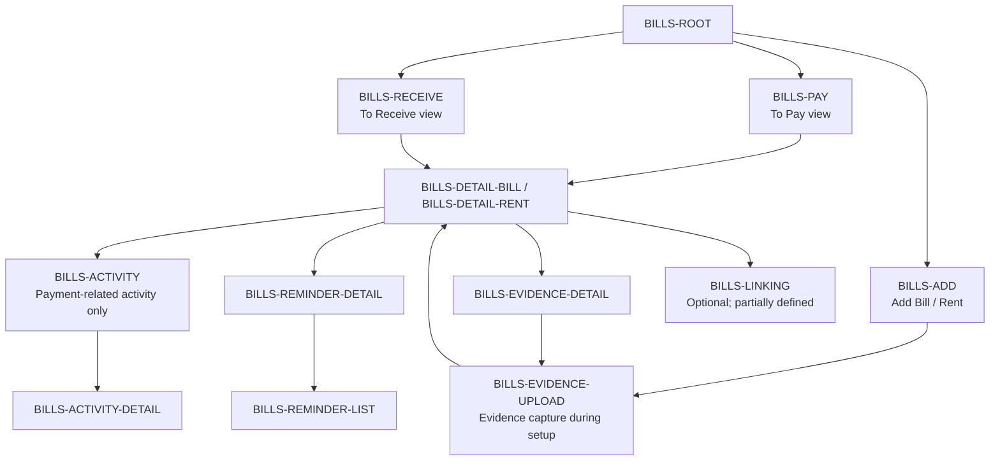
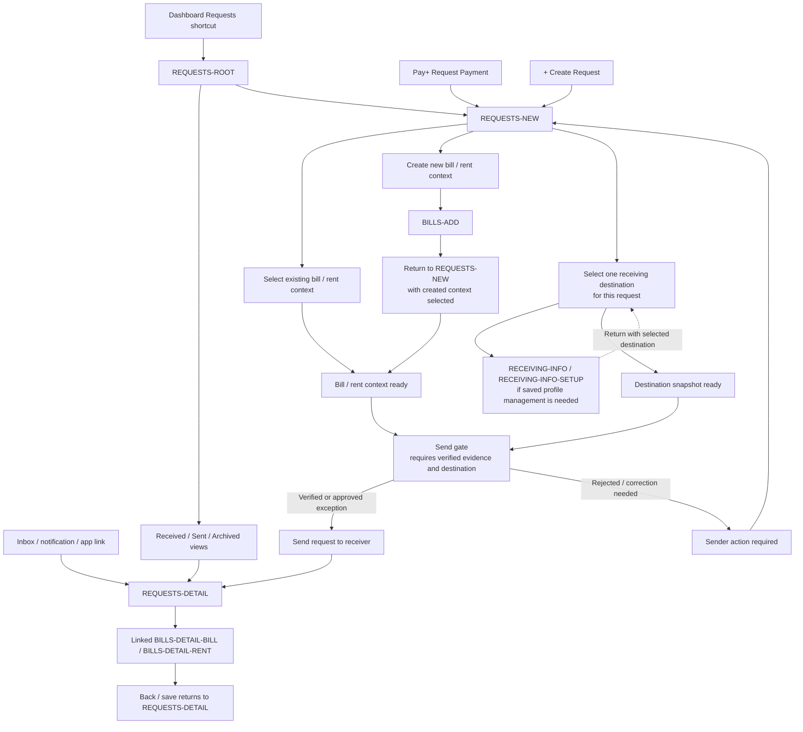
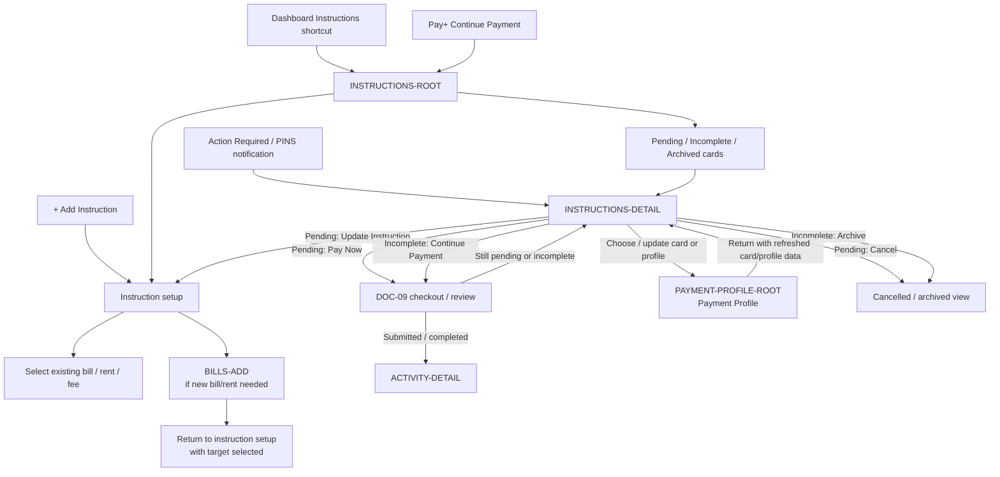
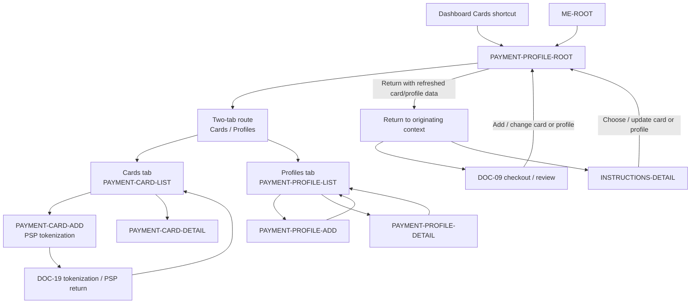
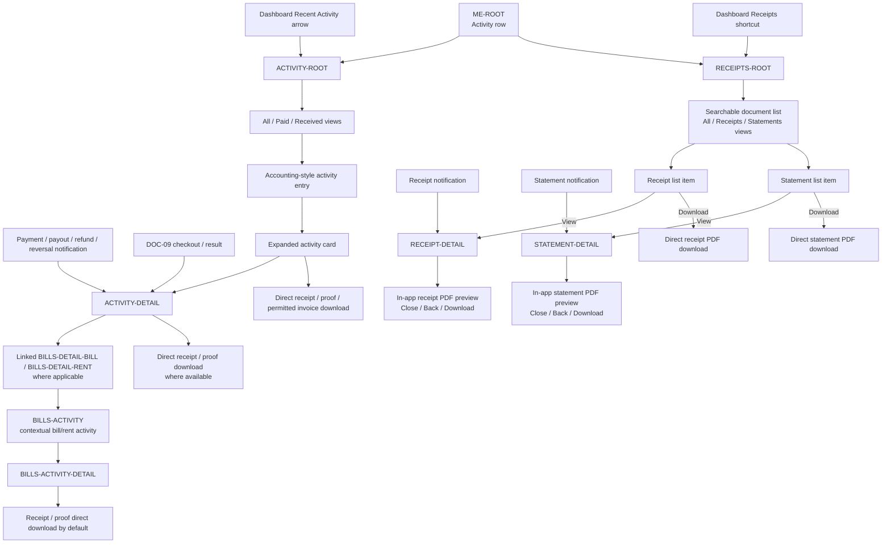
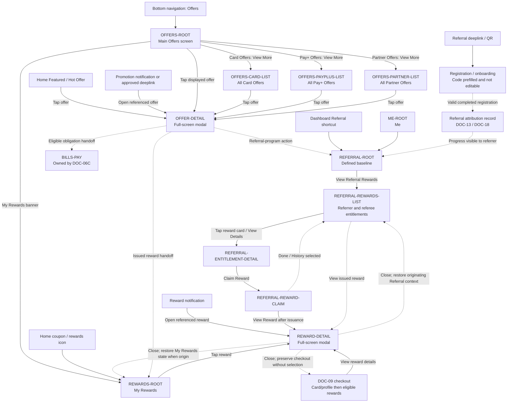

# PayPlus App Product Destination and Navigation Transition Map

Status: Discussion reference / IA alignment aid  
Owner: DOC-06B  
Last updated: 2026-07-26

These Mermaid diagrams show the current working relationship between bottom navigation, the Pay+ action sheet, the eight dashboard shortcuts, stable product destinations, and major route transitions.

The map is split into layers so that navigation actions, destination hierarchy, Bills-route ownership, and Requests-route ownership are not mixed into one unreadable graph.

It is not final UI design, visual design, component specification, or implementation source of truth. If this diagram conflicts with formal `DOC-XX` documents, the formal documents prevail.

The canonical destination inventory and definition status are maintained in `docs/traceability/route-register.md`.

## 1. Main Navigation Map

This diagram shows only how users enter major areas. It does not try to show every sub-route.

```mermaid
flowchart TD
  NAV["Bottom Navigation"]

  NAV --> HOME["Home"]
  NAV --> BILLS["Bills"]
  NAV --> PAYPLUS["Pay+"]
  NAV --> OFFERS["Offers"]
  NAV --> ME["ME-ROOT<br/>Me"]

  HOME --> HNOTICE["Important Notice / Action Required"]
  HOME --> HSHORTCUTS["Shortcut Grid<br/>8 MVP shortcuts"]
  HOME --> HFEATURED["Featured / What's New / Hot Offer"]
  HOME --> HUPCOMING["Upcoming Bills / Rent"]
  HOME --> HRECENT["Recent Activity"]

  PAYPLUS --> PACTIONS["Pay+ Action Sheet"]
  PACTIONS --> BPAY["BILLS-PAY<br/>Pay Bill / Fee or Pay Rent"]
  PACTIONS --> BADD["BILLS-ADD<br/>Add Bill / Rent"]
  PACTIONS --> INSTRUCTIONS["INSTRUCTIONS-ROOT<br/>Payment Instructions / Continue Payment"]
  PACTIONS --> RNEW["REQUESTS-NEW<br/>Request Payment"]

  HSHORTCUTS --> REQROOT["REQUESTS-ROOT<br/>Requests"]
  HSHORTCUTS --> INSTRUCTIONS
  HSHORTCUTS --> BROOT["BILLS-ROOT<br/>Bills & Tenancies"]
  HSHORTCUTS --> RECEIPTS["RECEIPTS-ROOT<br/>Receipts & Statements"]
  HSHORTCUTS --> REMINDERS["BILLS-REMINDER-LIST<br/>Reminders"]
  HSHORTCUTS --> PPROOT["PAYMENT-PROFILE-ROOT<br/>Cards / Payment Profile"]
  HSHORTCUTS --> REFERRAL["REFERRAL-ROOT<br/>Defined baseline"]
  HSHORTCUTS --> MORE["More<br/>Shortcut management / overflow<br/>Route detail pending"]

  HRECENT --> ACTIVITYROOT["ACTIVITY-ROOT<br/>Activity"]

  OFFERS --> OFFERSROOT["OFFERS-ROOT<br/>Offer discovery"]
  HFEATURED --> OFFERDETAIL["OFFER-DETAIL<br/>when the item is an offer"]
```

## 2. Bills Route Handoff

This diagram shows the Bills route family owned by DOC-06C.

## 3. Requests Route Handoff

This diagram shows the Requests route family owned by DOC-06B and its handoff to Bills routes.

The two incoming lines to the send gate are required prerequisites, not alternative paths: the request needs both an eligible bill/rent context with verified evidence and a selected destination snapshot before delivery.

## 4. Instructions Route Handoff

This diagram shows the Payment Instructions route shell owned by DOC-06B and its handoff to DOC-09 checkout/payment.

## 5. Payment Profile Route Handoff

This diagram shows the Payment Profile route shell owned by DOC-06B, including the confirmed two-tab `Cards` / `Profiles` baseline and its handoff to DOC-09 checkout/payment and DOC-19 tokenization/security.

## 6. Activity and Receipts Route Handoff

This diagram separates event/lifecycle activity from receipt and statement files.

## 7. Offers and Rewards Route Handoff

This diagram separates promotion discovery, issued-reward management, and referral participation. It also shows the Referral registration-attribution handoff without treating sharing as a known-recipient invitation. `BILLS-PAY` is shown only as a cross-route destination and is not part of the Offers route family.

## 8. Me Route Handoff

This diagram shows the permanent `ME-ROOT` account-control route and its confirmed destination relationships. It does not define the detailed UI inside child routes. Dashboard shortcut management and More are intentionally excluded because they are separate from the Me route.

```mermaid
flowchart TD
  NAV["Bottom navigation Me"] --> MROOT["ME-ROOT<br/>Permanent mixed-role route"]

  MROOT --> ACTION["Action Required<br/>Hidden when empty"]
  MROOT --> ACCOUNT["Account Information"]
  MROOT --> SECURITY["Security & Privacy"]
  MROOT --> BILLS["Bills & Tenancies"]
  MROOT --> PAYMENTS["Payments & Records"]
  MROOT --> BENEFITS["Rewards & Programs"]
  MROOT --> REFERRAL["Referral Program"]
  MROOT --> PREFS["Preferences & Settings"]
  MROOT --> SUPPORT["Help & Support"]
  MROOT --> ABOUT["About PayPlus"]
  MROOT --> LOGOUT["Log Out<br/>Bottom button"]

  ACCOUNT --> APROFILE["ACCOUNT-PROFILE"]
  APROFILE --> IDVERIFY["IDENTITY-VERIFICATION<br/>Reusable controlled flow"]
  IDVERIFY -. "Back / Cancel / completion" .-> APROFILE
  SECURITY --> ASECURITY["ACCOUNT-SECURITY"]
  ASECURITY --> PASSCODE["PAYMENT-PASSCODE-SETTINGS"]
  PASSCODE -. "Back / completion" .-> ASECURITY
  SECURITY --> PRIVACY["PRIVACY-DATA-CONTROLS"]
  PRIVACY -. "Permitted profile edit<br/>or account closure" .-> APROFILE
  BILLS --> BROOT["BILLS-ROOT"]

  PAYMENTS --> PPROOT["PAYMENT-PROFILE-ROOT"]
  PAYMENTS --> RECEIVE["RECEIVING-INFO<br/>Private reusable profile library"]
  RECEIVE --> RECEIVELIST["RECEIVING-INFO-LIST<br/>Initial rendered screen"]
  RECEIVELIST --> RECEIVEDETAIL["RECEIVING-INFO-DETAILS"]
  RECEIVELIST --> RECEIVESETUP["RECEIVING-INFO-SETUP"]
  RECEIVEDETAIL --> RECEIVESETUP
  RECEIVESETUP -. "Save / Cancel / originating-context return" .-> RECEIVELIST
  PAYMENTS --> AROOT["ACTIVITY-ROOT<br/>Payer and payee activity"]
  PAYMENTS --> RROOT["RECEIPTS-ROOT"]
  PAYMENTS --> ARCHIVE["ARCHIVED-EVIDENCE-LIST<br/>Archived Documents"]

  BENEFITS --> REWARDS["REWARDS-ROOT"]
  BENEFITS -. "Hidden until defined and enabled" .-> MEMBERSHIP["Membership destination TBC"]
  REFERRAL --> REFROOT["REFERRAL-ROOT"]

  PREFS --> NOTIFY["NOTIFICATION-SETTINGS"]
  PRIVACY -. "Notification-channel settings" .-> NOTIFY
  PREFS --> SELECTORS["Language / Theme<br/>Selection sheets"]
  SUPPORT --> SUPROOT["SUPPORT-ROOT"]
  ABOUT --> ABOUTROOT["ABOUT-ROOT"]
  ABOUT --> TERMS["TERMS-ROOT"]
  LOGOUT --> AUTH["Pre-logon / login<br/>Protected history cleared"]

  RETURN["Child route closes or returns<br/>Restore Me position"] -.-> MROOT
```

