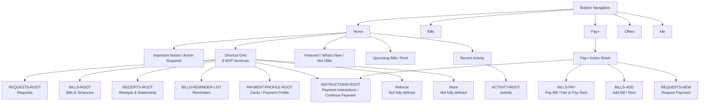
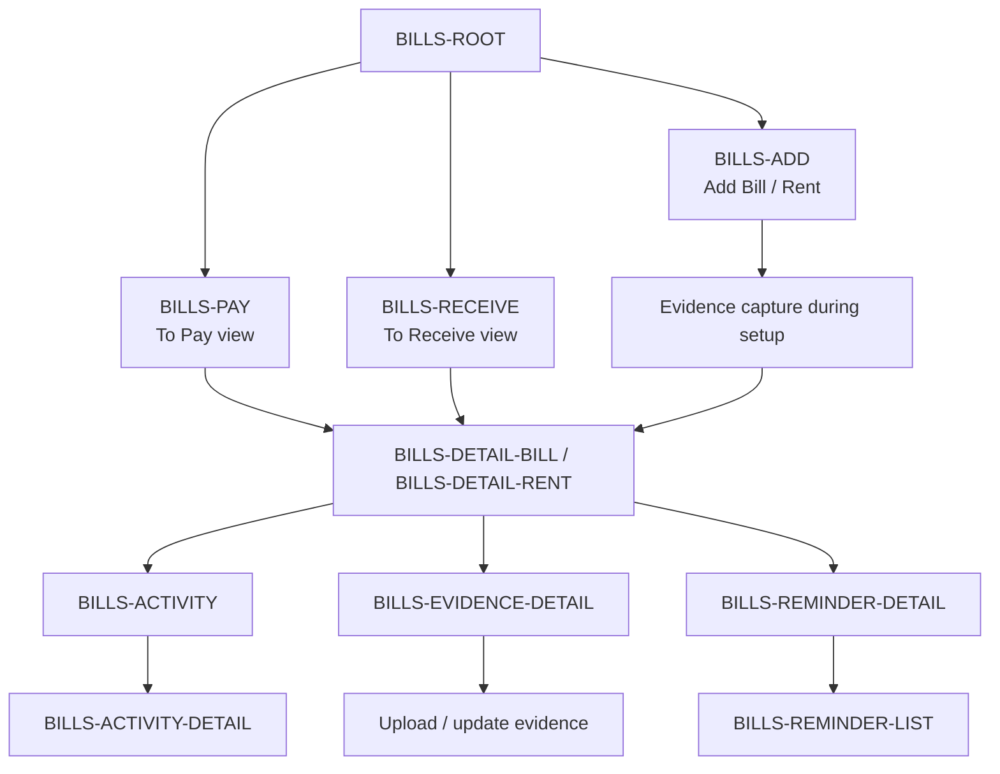
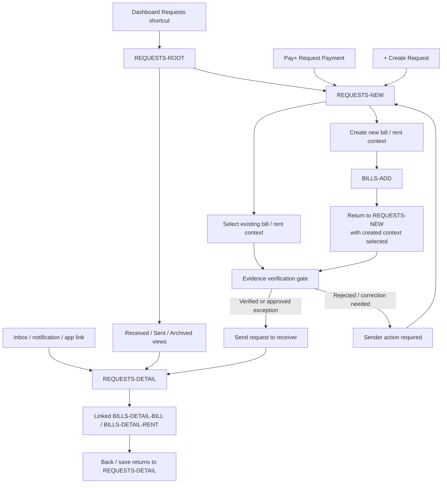
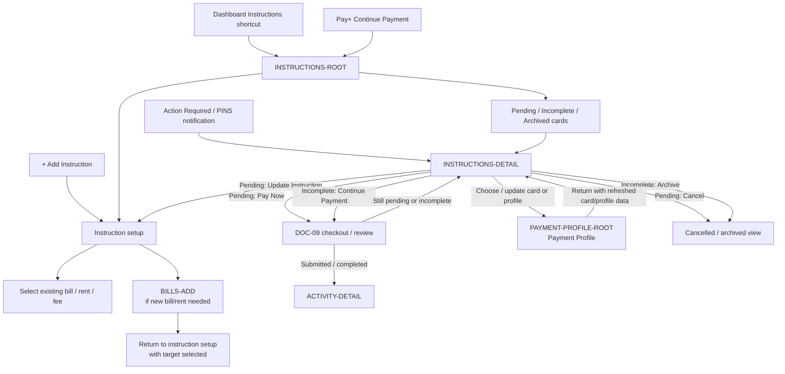
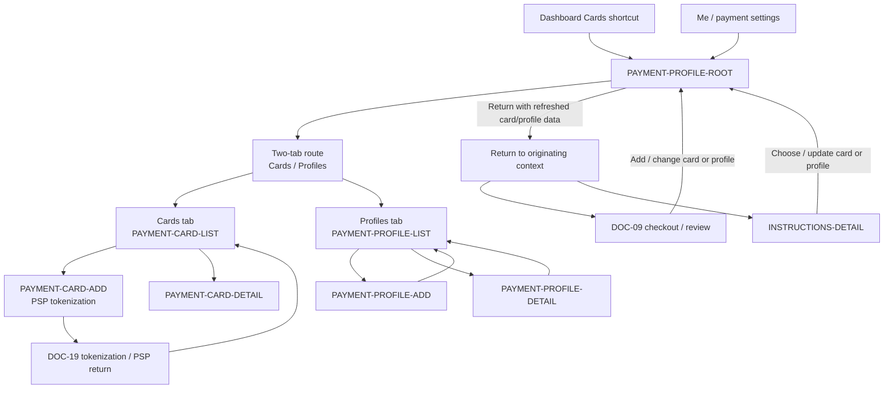
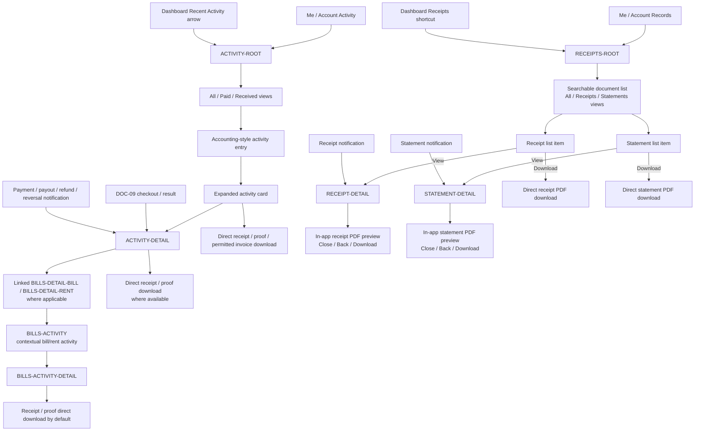

# PayPlus App Route Entry Map

Status: Discussion reference / IA alignment aid  
Owner: DOC-06B  
Last updated: 2026-07-14

These Mermaid diagrams show the current working relationship between bottom navigation, the Pay+ action sheet, the eight dashboard shortcuts, and major route handoffs.

The map is split into layers so that navigation entry points, Bills-route ownership, and Requests-route ownership are not mixed into one unreadable graph.

It is not final UI design, visual design, component specification, or implementation source of truth. If this diagram conflicts with formal `DOC-XX` documents, the formal documents prevail.

## 1. Main Entry Map

This diagram shows only how users enter major areas. It does not try to show every sub-route.

## 2. Bills Route Handoff

This diagram shows the Bills route family owned by DOC-06C.

## 3. Requests Route Handoff

This diagram shows the Requests route family owned by DOC-06B and its handoff to Bills routes.

## 4. Instructions Route Handoff

This diagram shows the Payment Instructions route shell owned by DOC-06B and its handoff to DOC-09 checkout/payment.

## 5. Payment Profile Route Handoff

This diagram shows the Payment Profile route shell owned by DOC-06B, including the confirmed two-tab `Cards` / `Profiles` baseline and its handoff to DOC-09 checkout/payment and DOC-19 tokenization/security.

## 6. Activity and Receipts Route Handoff

This diagram separates event/lifecycle activity from receipt and statement files.

