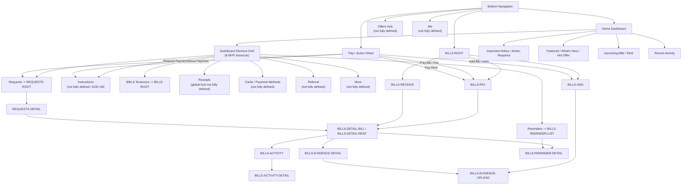

# PayPlus App Route Entry Map

Status: Discussion reference / IA alignment aid  
Owner: DOC-06B  
Last updated: 2026-07-02

This Mermaid diagram shows the current working relationship between bottom navigation, the Pay+ action sheet, the eight dashboard shortcuts, and major route handoffs.

It is not final UI design, visual design, component specification, or implementation source of truth. If this diagram conflicts with formal `DOC-XX` documents, the formal documents prevail.

