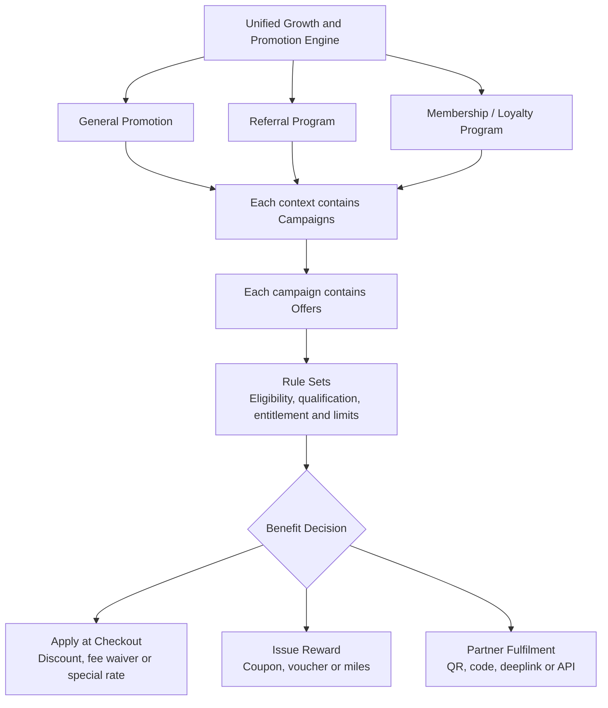

# PayPlus Promotion-Engine Structure

Status: Business-structure reference

Owner: DOC-13

Last updated: 2026-07-17

This diagram duplicates the promotion-engine structure defined in DOC-13 for convenient visual reference. DOC-13 remains the authoritative source. If this file conflicts with DOC-13, DOC-13 prevails.

Each general-promotion, referral, or membership context may contain multiple campaigns. Each campaign may contain multiple offers. An offer may combine multiple rule groups and conditions.

This is a business-structure diagram, not an app navigation map. DOC-06B and `payplus-app-route-entry-map.md` separately govern how users discover offers, manage issued rewards, and enter referral functions.
