# PayPlus Promotion-Engine Structure

Status: Business-structure reference

Owner: DOC-13

Last updated: 2026-07-20

This diagram duplicates the promotion-engine structure defined in DOC-13 for convenient visual reference. DOC-13 remains the authoritative source. If this file conflicts with DOC-13, DOC-13 prevails.

```mermaid
flowchart TD
    ENGINE["Unified Growth and Promotion Engine"]

    GENERAL["General Promotion"]
    REFERRAL["Referral Program"]
    MEMBERSHIP["Membership / Loyalty Program"]

    CAMPAIGNS["Each context contains Campaigns"]
    OFFERS["Each campaign contains Offers"]
    COLLECTIONS["Discovery Membership<br/>Card, Pay+ and/or Partner<br/>Featured / Hot placement flag"]
    RULES["Rule Sets<br/>Eligibility, qualification, entitlement and limits"]
    DECISION{"Benefit Decision"}

    CARD_CANDIDATES["Eligible Payment-Method-Sensitive<br/>Card Offers per payment card / funding leg"]
    BEST_CARD["Auto-Select One Card Offer<br/>Highest user value"]
    USER_INSTRUMENT["Separate User Selection<br/>One eligible checkout coupon, voucher or discount"]
    CHECKOUT["Promotion Quote<br/>Apply stacking, caps, quotas and final calculation"]
    REWARD["Issue Reward<br/>Coupon, voucher or miles"]
    PARTNER["Partner Fulfilment<br/>QR, code, deeplink or API"]

    ENGINE --> GENERAL
    ENGINE --> REFERRAL
    ENGINE --> MEMBERSHIP

    GENERAL --> CAMPAIGNS
    REFERRAL --> CAMPAIGNS
    MEMBERSHIP --> CAMPAIGNS

    CAMPAIGNS --> OFFERS
    OFFERS --> COLLECTIONS
    OFFERS --> RULES
    RULES --> DECISION

    DECISION --> CARD_CANDIDATES
    CARD_CANDIDATES --> BEST_CARD
    BEST_CARD --> CHECKOUT
    DECISION --> USER_INSTRUMENT
    USER_INSTRUMENT --> CHECKOUT
    DECISION --> REWARD
    DECISION --> PARTNER
```

Each general-promotion, referral, or membership context may contain multiple campaigns. Each campaign may contain multiple offers. An offer may combine multiple rule groups and conditions and may belong to multiple discovery collections without duplicating the underlying Offer ID.

For each payment card or split-payment funding leg, only one eligible payment-method-sensitive Card Offer applies. PayPlus automatically selects the Card Offer with the highest user value and displays it in checkout. A separate eligible checkout coupon, voucher, or discount may also be selected before the promotion quote is finalized.

This is a business-structure diagram, not an app navigation map. DOC-06B and `routes/payplus-offers-rewards-referral-route-map.md` separately govern how users discover offers, manage issued rewards, and enter referral functions.
