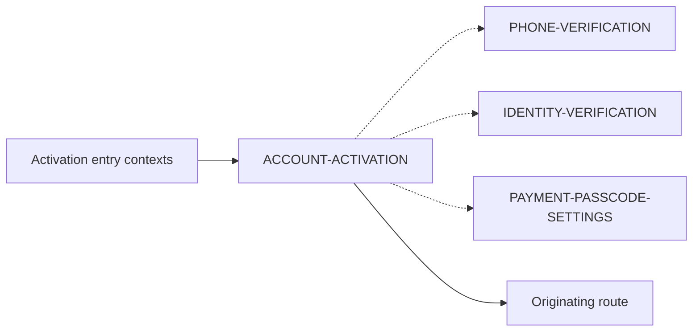

# PayPlus Account Activation Route Map

Status: Current discussion reference
Owner: DOC-06B
Last updated: 2026-07-29

This route-family map shows Account Activation as an orchestration route. It invokes only the missing setup steps and does not become the canonical parent of the reusable account-control routes.

Activation entry contexts are post-registration setup, the Home setup banner, and a blocked financial action. Dotted arrows represent contextual handoffs rather than route ownership.

`PHONE-VERIFICATION` and `IDENTITY-VERIFICATION` are canonically under `ACCOUNT-PROFILE`. `PAYMENT-PASSCODE-SETTINGS` is canonically under `ACCOUNT-SECURITY`.

When opened from Account Activation, each child returns to `ACCOUNT-ACTIVATION` with refreshed completion state. When opened from its canonical parent, it returns to that parent. After all activation requirements pass, PayPlus returns to `HOME-ROOT` or to the revalidated originating financial route.

Set, Retry, Processing, Update, Change, and Reset are internal modes or screen states within the three reusable child flows. They are not additional destinations and therefore do not add nodes to this map.

Each child-flow result maps to a business Outcome and permitted Resolution Strategy before user-facing Message/CTA or notification selection. That decision logic does not change this route hierarchy.
