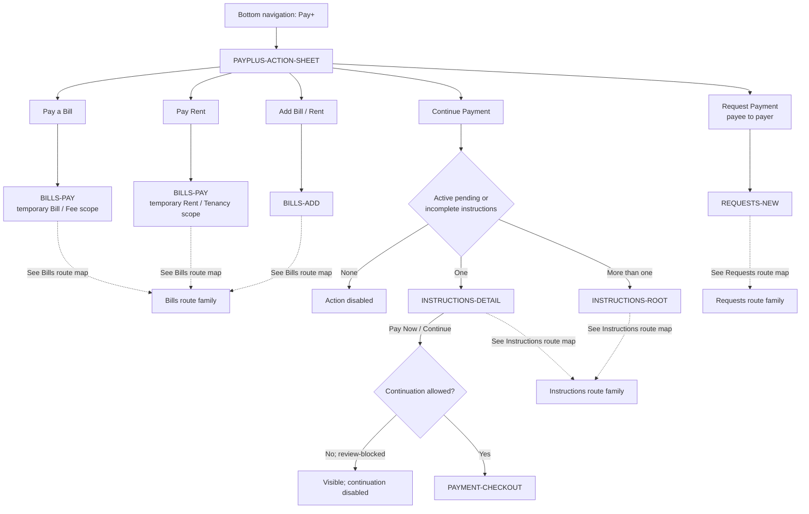

# PayPlus Action Sheet Route Map

Status: Current discussion reference
Owner: DOC-06B
Last updated: 2026-07-27

This map owns the five `PAYPLUS-ACTION-SHEET` handoffs. Destination internals belong to their route-family maps. It defines behavior, not final visual design.

`Request Payment` is the payee-to-payer request action. Optional payer-to-payee linking starts from an approved bill/rent or linking context and is not a Pay+ action-sheet destination.
