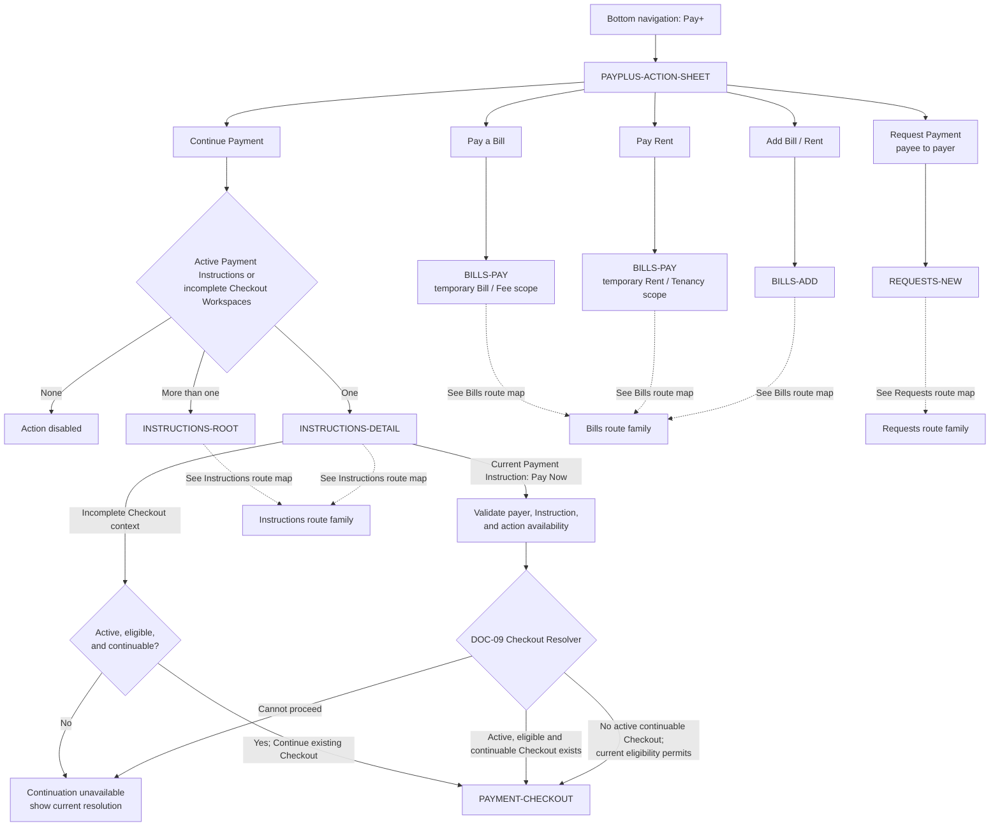

# PayPlus Action Sheet Route Map

Status: Current discussion reference
Owner: DOC-06B
Last updated: 2026-08-04

This map owns the five `PAYPLUS-ACTION-SHEET` handoffs. Destination internals belong to their route-family maps. It defines behavior, not final visual design.

`Request Payment` is the payee-to-payer request action. Optional payer-to-payee linking starts from an approved bill/rent or linking context and is not a Pay+ action-sheet destination.

After `Continue Payment` reaches `INSTRUCTIONS-DETAIL`, only an incomplete Checkout that remains active, eligible, and continuable may follow the connected continuation edge to the existing `PAYMENT-CHECKOUT`.

When a current Payment Instruction exposes `Pay Now`, `INSTRUCTIONS-DETAIL` validates the payer, Instruction, and action before invoking the DOC-09 Checkout Resolver. The resolver resumes the existing Checkout when it remains active, eligible, and continuable; permits a later eligible Checkout only when no active continuable Checkout exists; and otherwise returns the current unavailable resolution. Payment Instruction and Checkout remain separate, and resolver entry does not carry stale authorization or silently create funding or submission activity.
