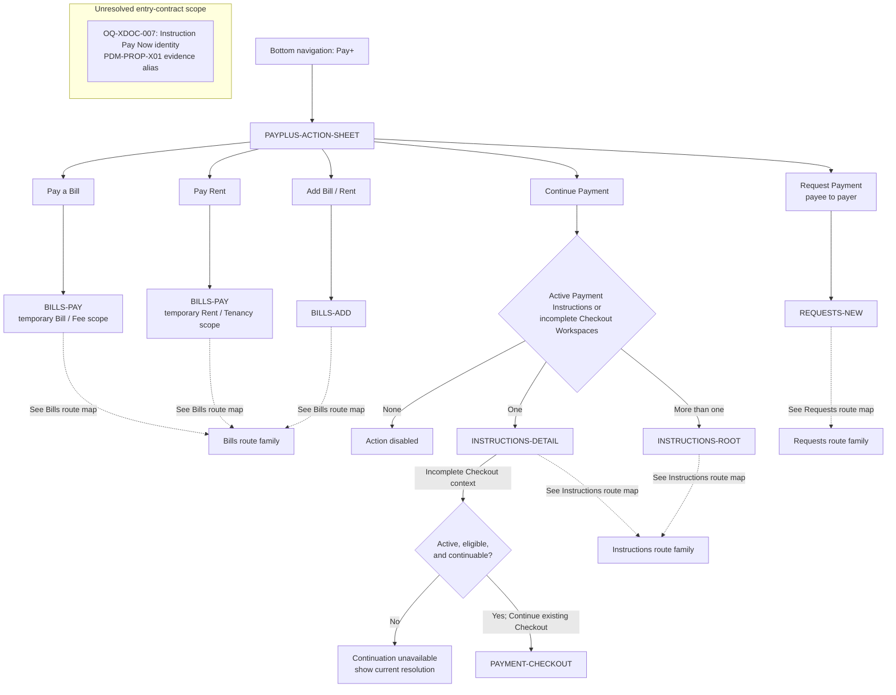

# PayPlus Action Sheet Route Map

Status: Current discussion reference
Owner: DOC-06B
Last updated: 2026-08-03

This map owns the five `PAYPLUS-ACTION-SHEET` handoffs. Destination internals belong to their route-family maps. It defines behavior, not final visual design.

`Request Payment` is the payee-to-payer request action. Optional payer-to-payee linking starts from an approved bill/rent or linking context and is not a Pay+ action-sheet destination.

After `Continue Payment` reaches `INSTRUCTIONS-DETAIL`, only an incomplete Checkout that remains active, eligible, and continuable may follow the connected edge to the existing `PAYMENT-CHECKOUT`. A Payment Instruction may expose `Pay Now`, but its creates/activates/resumes identity contract remains unresolved under `OQ-XDOC-007`; the unconnected annotation records that exclusion without deciding it.
