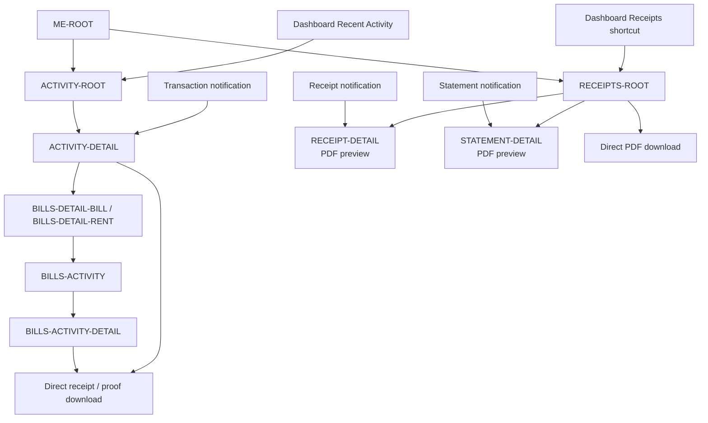

# PayPlus Activity and Receipts Route Map

Status: Current discussion reference
Owner: DOC-06B / DOC-06C
Last updated: 2026-07-26

```mermaid
flowchart TD
  RECENT["Dashboard Recent Activity"] --> ACTROOT["ACTIVITY-ROOT"]
  ME["ME-ROOT"] --> ACTROOT
  NOTIFY["Transaction notification"] --> ACTDETAIL["ACTIVITY-DETAIL"]
  ACTROOT --> ACTDETAIL
  ACTDETAIL --> BILLDETAIL["BILLS-DETAIL-BILL / BILLS-DETAIL-RENT"]
  ACTDETAIL --> DOWNLOAD["Direct receipt / proof download"]

  SHORTCUT["Dashboard Receipts shortcut"] --> RECEIPTS["RECEIPTS-ROOT"]
  ME --> RECEIPTS
  RECEIPTS --> RECEIPT["RECEIPT-DETAIL<br/>PDF preview"]
  RECEIPTS --> STATEMENT["STATEMENT-DETAIL<br/>PDF preview"]
  RECEIPTS --> DIRECT["Direct PDF download"]

  RECEIPTNOTIFY["Receipt notification"] --> RECEIPT
  STATEMENTNOTIFY["Statement notification"] --> STATEMENT

  BILLDETAIL --> BILLACTIVITY["BILLS-ACTIVITY"]
  BILLACTIVITY --> BILLACTIVITYDETAIL["BILLS-ACTIVITY-DETAIL"]
  BILLACTIVITYDETAIL --> DOWNLOAD
```
