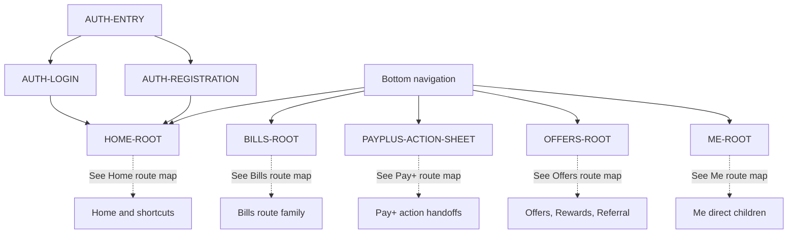

# PayPlus App Route Map

Status: Current discussion reference
Level: 0 - app navigation
Owner: DOC-06B
Last updated: 2026-07-27

This map shows only primary app entry and direct global destinations. Detailed route trees belong to the route-family maps in this folder. The canonical destination inventory is `docs/traceability/route-register.md`.

