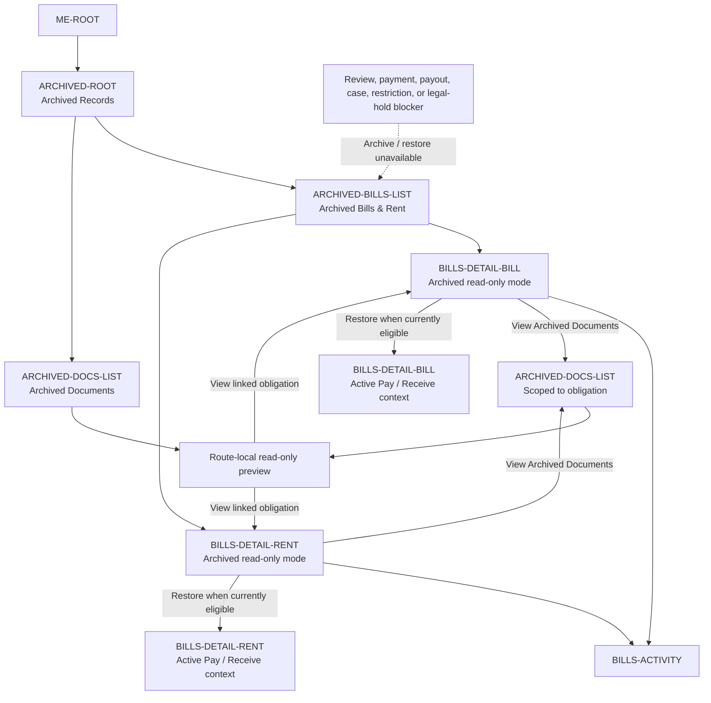

# PayPlus Archive Route Map

Status: Current discussion reference
Owner: DOC-06B / DOC-06C
Last updated: 2026-07-26

This map owns the Archive route family. Archive is a per-user visibility projection; the route register and owning documents remain authoritative.

