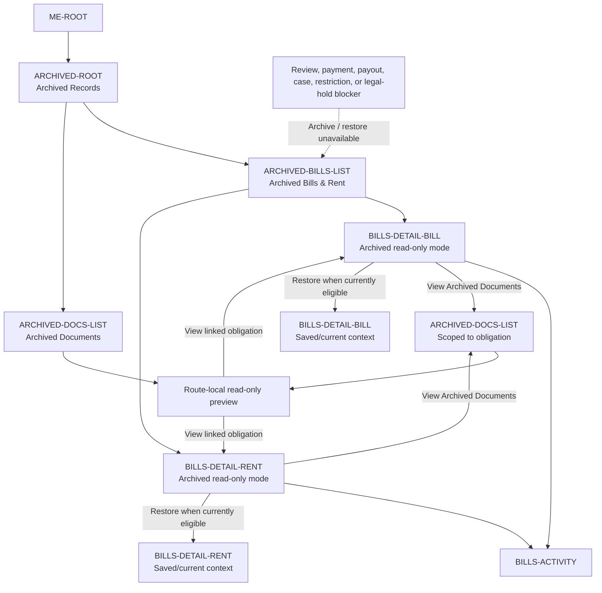

# PayPlus Archive Route Map

Status: Current discussion reference
Owner: DOC-06B / DOC-06C
Last updated: 2026-08-19

This map owns the Archive route family. Saved/current sources move to the Saved/Archived presentation; Archived is not readiness or a financial state and is excluded from the active/current list. History-only sources after confirmed Payment without Save are not Saved/current or Saved/Archived. Archive is non-erasing; the route register and owning documents remain authoritative. Bills and Rent retain their separate Evidence rules.

