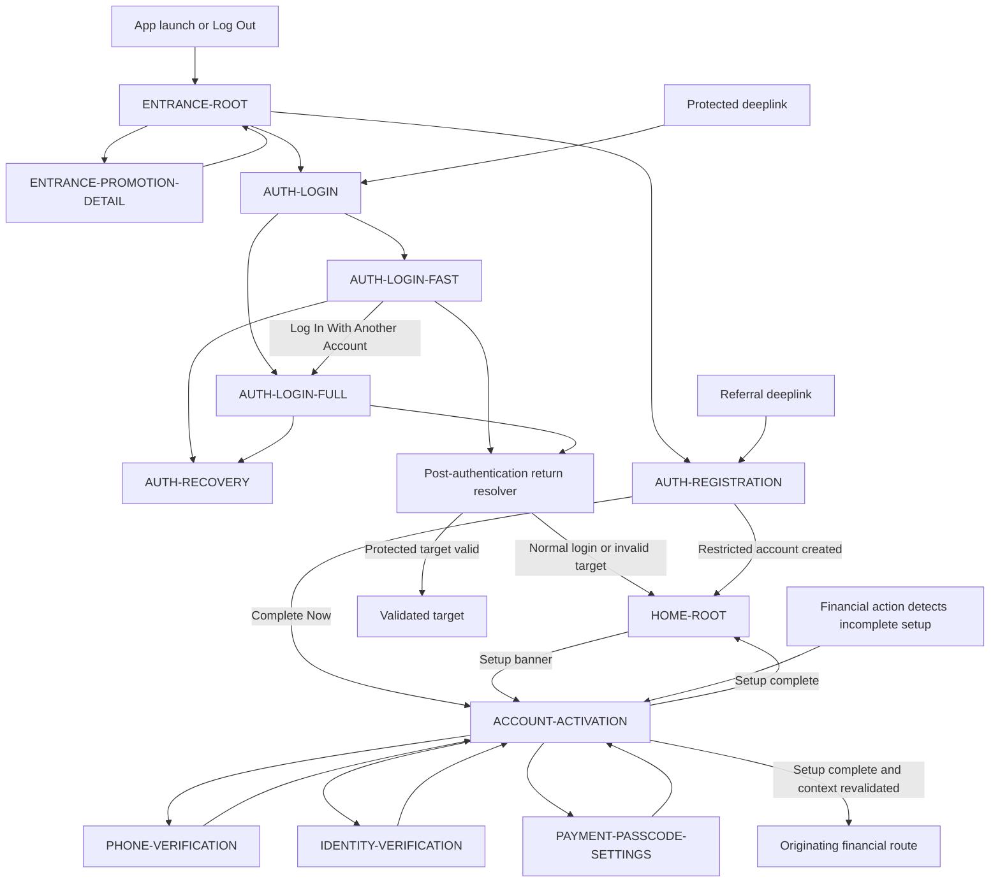

# PayPlus Entrance and Authentication Route Map

Status: Current discussion reference
Owner: DOC-06B
Last updated: 2026-07-28

This route-family map shows the approved Entrance, Login, Registration, Recovery, and Account Activation destinations and their material handoffs. Detailed provider, verification, passcode, security, and message behavior remains in the owning documents.

