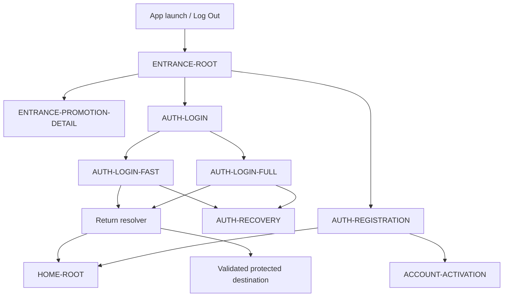

# PayPlus Entrance and Authentication Route Map

Status: Current discussion reference
Owner: DOC-06B
Last updated: 2026-07-28

This route-family map shows the approved Entrance, Login, Registration, Recovery, post-authentication return, and Account Activation handoff. The separate Account Activation map explains the contextual verification and passcode handoffs without changing their canonical parentage.

