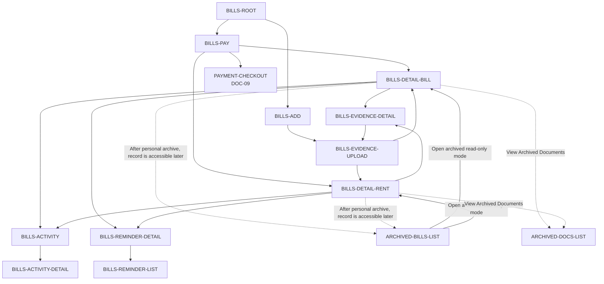

# PayPlus Bills Route Map

Status: Current discussion reference
Owner: DOC-06C
Last updated: 2026-07-26

This map owns the current Bills route family and shows only material external handoffs. Checkout and source Archive retain their own owners; retired Requests, Linking, Receive, and Receiving Info runtime is not represented.

