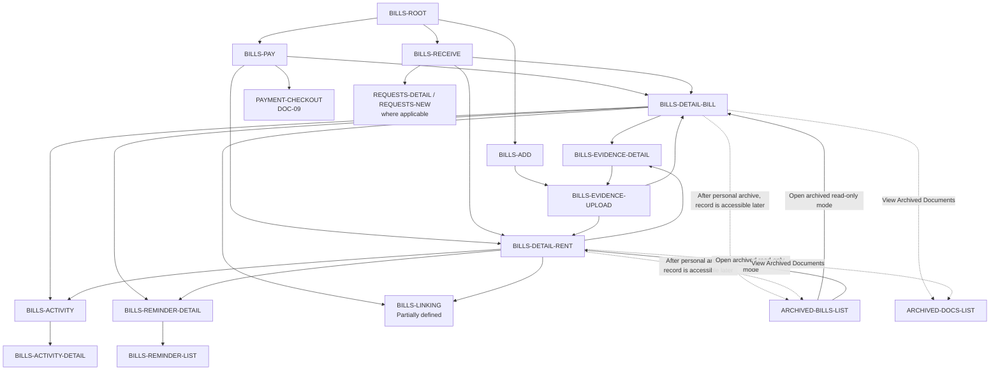

# PayPlus Bills Route Map

Status: Current discussion reference
Owner: DOC-06C
Last updated: 2026-07-26

This map owns the Bills route family and shows only material external handoffs. Checkout, Archive, Requests, and Receiving Info retain their own owners.

