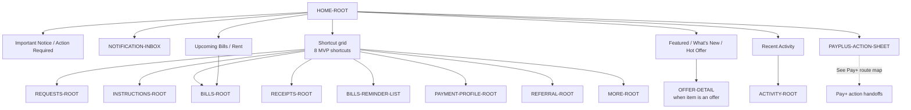

# PayPlus Home Route Map

Status: Current discussion reference
Owner: DOC-06B
Last updated: 2026-07-27

This map owns Home sections and the eight MVP shortcuts. Pay+ action-sheet handoffs and destination internals belong to their route-family maps.

