# PayPlus Home Route Map

Status: Current discussion reference
Owner: DOC-06B
Last updated: 2026-08-06

This map projects the DOC-06B Home presentation and navigation baseline against the route register; it does not independently own behavior. Home has a default and maximum of 8 shortcuts, with up to 7 configurable entries plus protected `More`; the effective set may contain fewer configurable entries. Greeting is presentation-only and has no navigation action. Pay+ and destination internals belong to their route-family maps.

```mermaid
flowchart TD
  HOME["HOME-ROOT"] -->|"Inbox utility"| INBOX["NOTIFICATION-INBOX"]
  HOME -->|"Rewards utility"| REWARDS["REWARDS-ROOT"]
  HOME --> NOTICE["Important Notice"]
  HOME --> SHORTCUTS["Shortcut grid<br/>1-8 effective entries<br/>More protected and final"]
  HOME --> HOTOFFER["Home Hot Offer"]
  HOME --> UPCOMING["Upcoming Bills / Rent"]
  HOME --> RECENT["Recent Activity"]

  NOTICE -->|"Body"| NOTICEDETAIL["NOTIFICATION-DETAIL"]
  NOTICE -->|"Action Button"| SOURCEDEST["Source-provided destination<br/>(existing route-register ID)"]
  NOTICEDETAIL -->|"Close: another eligible notice"| INBOX
  NOTICEDETAIL -->|"Close: no other eligible notice"| HOME
  INBOX -. "Back / defined return" .-> HOME
  REWARDS -. "Return" .-> HOME

  SHORTCUTS --> REQUESTS["REQUESTS-ROOT"]
  SHORTCUTS --> INSTRUCTIONS["INSTRUCTIONS-ROOT"]
  SHORTCUTS --> BILLS["BILLS-ROOT"]
  SHORTCUTS --> RECEIPTS["RECEIPTS-ROOT"]
  SHORTCUTS --> REMINDERS["BILLS-REMINDER-LIST"]
  SHORTCUTS --> PROFILE["PAYMENT-PROFILE-ROOT"]
  SHORTCUTS --> REFERRAL["REFERRAL-ROOT"]
  SHORTCUTS --> MORE["MORE-ROOT"]

  HOTOFFER -->|"Card / CTA"| OFFER["OFFER-DETAIL"]
  OFFER -. "Return to Home / prior carousel position" .-> HOME
  UPCOMING -->|"Pay Now; source route revalidates"| BILLSPAY["BILLS-PAY"]
  UPCOMING -->|"View Details: Bill"| BILLDETAIL["BILLS-DETAIL-BILL"]
  UPCOMING -->|"View Details: Rent"| RENTDETAIL["BILLS-DETAIL-RENT"]
  RECENT -->|"View More"| ACTIVITY["ACTIVITY-ROOT"]
  RECENT -->|"Item"| ACTIVITYDETAIL["ACTIVITY-DETAIL"]
  ACTIVITY -->|"Item"| ACTIVITYDETAIL
  ACTIVITYDETAIL -. "Return to Home origin" .-> HOME
  ACTIVITYDETAIL -. "Return to Activity origin" .-> ACTIVITY

  HOME --> PAYPLUS["PAYPLUS-ACTION-SHEET"]
  PAYPLUS -. "See Pay+ route map" .-> PAYPLUSHANDOFFS["Pay+ action handoffs"]
  INBOX -. "See Notifications route map" .-> NOTIFICATIONFAMILY["Notifications route family"]
```

