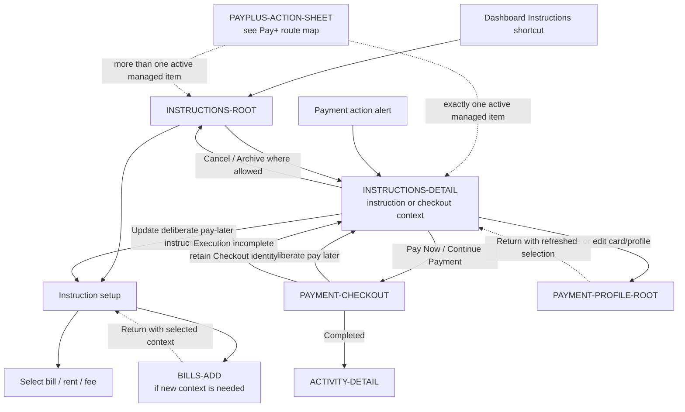

# PayPlus Payment Instructions Route Map

Status: Current discussion reference
Owner: DOC-06B / DOC-09
Last updated: 2026-07-31

```mermaid
flowchart TD
  SHORTCUT["Dashboard Instructions shortcut"] --> ROOT["INSTRUCTIONS-ROOT"]
  PAYPLUS["PAYPLUS-ACTION-SHEET<br/>see Pay+ route map"] -. "more than one active managed item" .-> ROOT
  PAYPLUS -. "exactly one active managed item" .-> DETAIL
  ALERT["Payment action alert"] --> DETAIL["INSTRUCTIONS-DETAIL<br/>instruction or checkout context"]
  ROOT --> DETAIL
  ROOT --> SETUP["Instruction setup"]

  SETUP --> SELECT["Select bill / rent / fee"]
  SETUP --> ADD["BILLS-ADD<br/>if new context is needed"]
  ADD -. "Return with selected context" .-> SETUP

  DETAIL -->|"Pay Now / Continue Payment"| CHECKOUT["PAYMENT-CHECKOUT"]
  DETAIL -->|"Choose or edit card/profile"| PROFILE["PAYMENT-PROFILE-ROOT"]
  PROFILE -. "Return with refreshed selection" .-> DETAIL
  DETAIL -->|"Update deliberate pay-later instruction"| SETUP
  DETAIL -->|"Cancel / Archive where allowed"| ROOT

  CHECKOUT -->|"Deliberate pay later"| DETAIL
  CHECKOUT -->|"Execution incomplete<br/>retain Checkout identity"| DETAIL
  CHECKOUT -->|"Completed"| ACTIVITY["ACTIVITY-DETAIL"]
```
