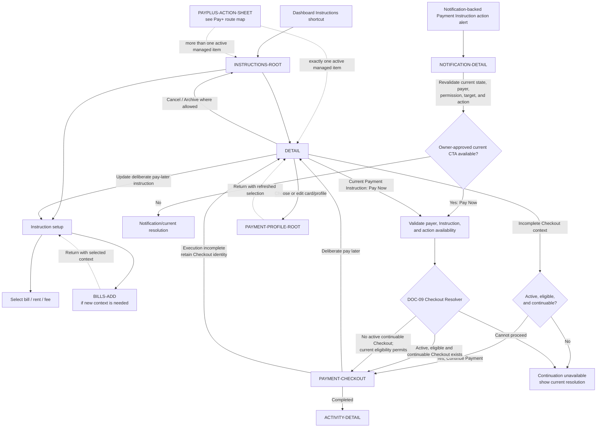

# PayPlus Payment Instructions Route Map

Status: Current discussion reference
Owner: DOC-06B / DOC-09
Last updated: 2026-08-04

A notification-backed Payment Instruction action alert always enters `NOTIFICATION-DETAIL`. Only after current state, authenticated payer, permission, target, and action availability are revalidated may an owner-approved current `Pay Now` CTA invoke the DOC-09 Checkout Resolver. No notification edge enters `INSTRUCTIONS-DETAIL` or `PAYMENT-CHECKOUT` directly.

Instruction `Pay Now` does not predetermine Checkout identity. The resolver resumes an existing Checkout only when it remains active, eligible, and continuable; permits a later eligible Checkout only when no active continuable Checkout exists; and otherwise returns the applicable current resolution. Payment Instruction and Checkout remain separate, retained historical Checkouts are not reactivated, and resolver entry does not carry stale authorization or silently create a Funding Leg, Payment Attempt, or Provider Submission. The connected `Continue Payment` edge remains limited to an existing active, eligible, and continuable Checkout.
