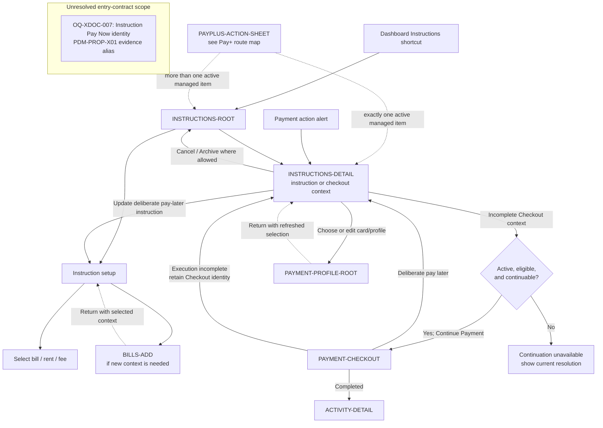

# PayPlus Payment Instructions Route Map

Status: Current discussion reference
Owner: DOC-06B / DOC-09
Last updated: 2026-08-03

`Instruction Pay Now` remains an unconnected unresolved-scope annotation. This map does not decide whether that action creates, activates, or resumes Checkout. Only an existing Checkout that remains active, eligible, and continuable may follow the connected `Continue Payment` edge.
