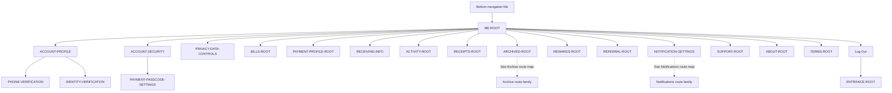

# PayPlus Me Route Map

Status: Current discussion reference
Owner: DOC-06B
Last updated: 2026-07-28

This parent map shows direct Me child destinations and the three material account-control handoffs under Account Profile and Account Security. It intentionally does not duplicate deeper child-route flows.

Phone-verification modes, identity capture/processing/result states, and payment-passcode Set/Change/Reset modes remain inside their reusable child flows. They are not separate route nodes.
