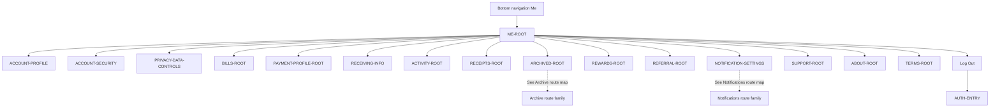

# PayPlus Me Route Map

Status: Current discussion reference
Owner: DOC-06B
Last updated: 2026-07-27

This parent map stops at direct Me child destinations. It intentionally does not duplicate each child's internal tree.

