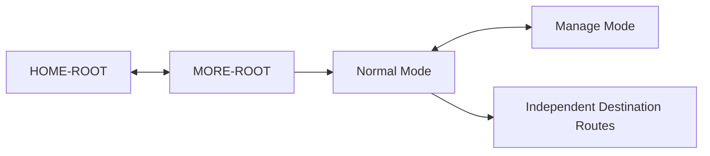

# PayPlus More Route and Mode Map

Status: Current discussion reference
Owner: DOC-06B
Last updated: 2026-07-27

This map shows only the `MORE-ROOT` route boundary, its two internal screen modes, and its generic handoff to independently owned destinations. Shortcut sections and management actions are UI behavior defined in DOC-06B, not routes or diagram nodes.

