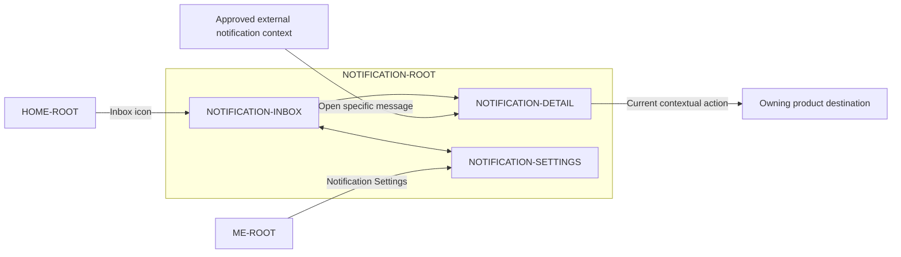

# PayPlus Notifications Route Map

Status: Current discussion reference
Owner: DOC-06B / DOC-08
Last updated: 2026-07-27

This map shows the Notifications route family and its material external entries and handoffs. `NOTIFICATION-LIST` and `NOTIFICATION-CARD` are components inside Inbox, and Archived is an Inbox filter.

