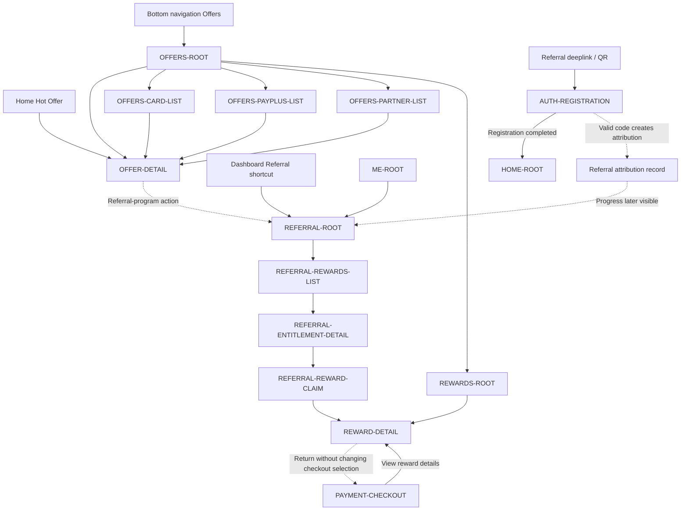

# PayPlus Offers, Rewards, and Referral Route Map

Status: Current discussion reference
Owner: DOC-06B / DOC-13
Last updated: 2026-08-06

```mermaid
flowchart TD
  NAV["Bottom navigation Offers"] --> OFFERS["OFFERS-ROOT"]
  HOME["Home Hot Offer"] --> OFFERDETAIL["OFFER-DETAIL"]
  OFFERS --> OFFERDETAIL
  OFFERS --> CARDLIST["OFFERS-CARD-LIST"]
  OFFERS --> PAYPLUSLIST["OFFERS-PAYPLUS-LIST"]
  OFFERS --> PARTNERLIST["OFFERS-PARTNER-LIST"]
  CARDLIST --> OFFERDETAIL
  PAYPLUSLIST --> OFFERDETAIL
  PARTNERLIST --> OFFERDETAIL

  OFFERS --> REWARDS["REWARDS-ROOT"]
  REWARDS --> REWARDDETAIL["REWARD-DETAIL"]
  CHECKOUT["PAYMENT-CHECKOUT"] -->|"View reward details"| REWARDDETAIL
  REWARDDETAIL -. "Return without changing checkout selection" .-> CHECKOUT

  SHORTCUT["Dashboard Referral shortcut"] --> REFERRAL["REFERRAL-ROOT"]
  ME["ME-ROOT"] --> REFERRAL
  OFFERDETAIL -. "Referral-program action" .-> REFERRAL
  REFERRAL --> REFLIST["REFERRAL-REWARDS-LIST"]
  REFLIST --> REFDETAIL["REFERRAL-ENTITLEMENT-DETAIL"]
  REFDETAIL --> CLAIM["REFERRAL-REWARD-CLAIM"]
  CLAIM --> REWARDDETAIL

  REFLINK["Referral deeplink / QR"] --> REGISTER["AUTH-REGISTRATION"]
  REGISTER -->|"Registration completed"| HOMEDEST["HOME-ROOT"]
  REGISTER -. "Valid code creates attribution" .-> ATTRIBUTION["Referral attribution record"]
  ATTRIBUTION -. "Progress later visible" .-> REFERRAL
```
