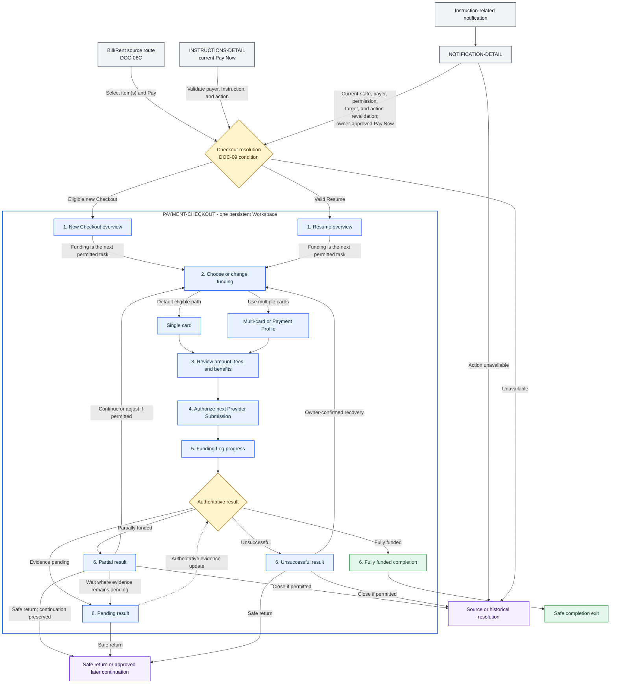

# PayPlus Payment Checkout Route Map

Status: Current discussion reference
Owner: DOC-06B for route-level UI/UX; DOC-09 for Payment Domain architecture
Last updated: 2026-08-19

This derived diagram projects the reviewed payer-visible `PAYMENT-CHECKOUT` journey from DOC-06B Section 5.20. DOC-06B remains the primary source for adaptive presentation behavior, DOC-09 remains authoritative for payment-domain facts and invariants, and the route register remains authoritative for destination identity and definition status.

The projection is not a mandatory fixed wizard, a route hierarchy, a machine-state model, or a source of new payment requirements. The numbered nodes are replaceable Workspace presentations that may overlap, combine, or be skipped according to the authoritative Checkout condition and the payer's current permitted task.

## Interpretation

- `PAYMENT-CHECKOUT` is the only registered route/flow group in the blue Workspace boundary. Its numbered nodes and funding/result nodes are adaptive internal presentations, not child routes, domain objects, machine states, or a required universal screen order.
- Bill admission consumes the accepted C1/G1/G2 and highest-tier handoff. Tier 2 requires qualifying official Bill Evidence presence before Payment; acceptance may remain pending while Payout is held. Tier 3 may preserve this Workspace as prepared context but remains non-executable before Evidence and approval, with no executable authorization or Provider Submission.
- G1 is the product-semantic receiving-account/authoritative-payout-destination progression handoff and G2 consumes proposed pre-check versus actual confirmed value; neither is a technical Payment-record or route-state definition.
- Rent follows its separate mandatory attached-Evidence and acceptance-before-Payment rule and does not use Bill Tier 1/2/3 semantics.
- Amber diamonds are owner-controlled domain or evidence conditions used to select a valid presentation; they are not payer-visible screens or new status definitions. Grey and purple nodes are source, historical-resolution, or safe-exit handoffs outside ordinary Checkout composition and do not create a destination that is absent from the route register.
- Intentional Resume proceeds to Funding only when Funding is the next permitted task. Otherwise DOC-06B's decision map and Minimum Adaptive UI Contract restore the applicable Review, progress, pending, result, or safe-return presentation after required revalidation.
- Approved Card, Payment Profile, provider, 3DS, reauthentication, and application handoffs return to the safest valid presentation only after the checks owned by the applicable domain, provider, and security documents; the diagram intentionally leaves that detailed resolution in DOC-06B.
- Fully funded completion is terminal and exposes no Funding, Continue, adjust, retry, wait, or Close Checkout action. Pending evidence exposes no retry or alternate-funding submission while evidence remains unresolved. Partial and unsuccessful results expose only owner- and condition-permitted actions.
- Late confirmation remains outside ordinary Checkout continuation and follows DOC-09's independent controlled-resolution treatment.
- Instruction `Pay Now` invokes the DOC-09 Checkout Resolver rather than predetermining new-versus-Resume identity. An existing Checkout resumes only when it remains active, eligible, and continuable; a later eligible Checkout may begin only when no active continuable Checkout exists; otherwise the payer receives the applicable source or historical resolution.
- Every instruction-related notification enters `NOTIFICATION-DETAIL` first. Notification content and delivery do not establish current eligibility or result; only after current-state, payer, permission, target, and action-availability revalidation may an owner-approved current CTA invoke the same resolver. There is no notification-to-Checkout bypass edge.
- Payment Instruction and Checkout remain separate. Earlier Checkouts remain authoritative in their recorded non-continuable condition and are not reactivated or rewritten. Resolver entry carries no stale authorization and silently creates no Funding Allocation, Funding Leg, Payment Attempt, or Provider Submission.

## References

- [DOC-06B Section 5.20](../../01-product/doc-06b-navigation-ia-route-taxonomy.md)
- [DOC-09 Payment Domain Architecture](../../02-payment-domain/doc-09-payment-domain-architecture.md)
- [Product Destination Register](../../traceability/route-register.md)
- [Open Questions Register](../../traceability/open-questions-register.md)
