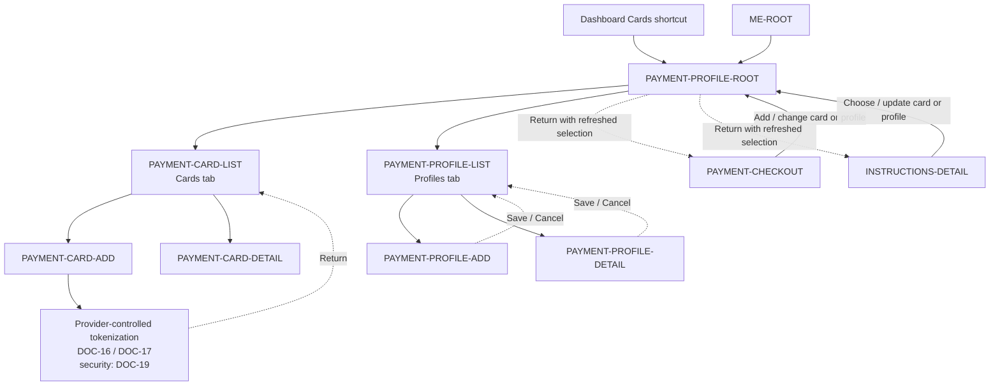

# PayPlus Payment Profile Route Map

Status: Current discussion reference
Owner: DOC-06B / DOC-09
Last updated: 2026-08-21

```mermaid
flowchart TD
  SHORTCUT["Dashboard Cards shortcut"] --> ROOT["PAYMENT-PROFILE-ROOT"]
  ME["ME-ROOT"] --> ROOT
  CHECKOUT["PAYMENT-CHECKOUT"] -->|"Add / change card or profile"| ROOT
  INSTRUCTION["INSTRUCTIONS-DETAIL"] -->|"Choose / update card or profile"| ROOT

  ROOT --> CARDS["PAYMENT-CARD-LIST<br/>Cards tab"]
  ROOT --> PROFILES["PAYMENT-PROFILE-LIST<br/>Profiles tab"]
  CARDS --> ADDCARD["PAYMENT-CARD-ADD"]
  CARDS --> CARDDETAIL["PAYMENT-CARD-DETAIL"]
  ADDCARD --> TOKEN["Provider-controlled tokenization<br/>DOC-16 / DOC-17<br/>security: DOC-19"]
  TOKEN -. "Return" .-> CARDS

  PROFILES --> ADDPROFILE["PAYMENT-PROFILE-ADD"]
  PROFILES --> PROFILEDETAIL["PAYMENT-PROFILE-DETAIL"]
  ADDPROFILE -. "Save / Cancel" .-> PROFILES
  PROFILEDETAIL -. "Save / Cancel" .-> PROFILES

  ROOT -. "Return with refreshed selection" .-> CHECKOUT
  ROOT -. "Return with refreshed selection" .-> INSTRUCTION
```
