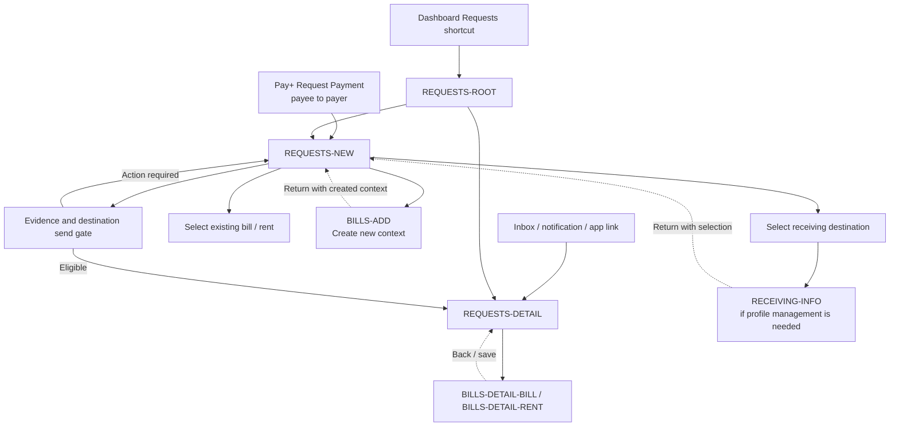

# PayPlus Requests Route Map

Status: Current discussion reference
Owner: DOC-06B
Last updated: 2026-07-27

```mermaid
flowchart TD
  SHORTCUT["Dashboard Requests shortcut"] --> ROOT["REQUESTS-ROOT"]
  NOTIFY["Inbox / notification / app link"] --> DETAIL["REQUESTS-DETAIL"]
  PAYPLUS["Pay+ Request Payment<br/>payee to payer"] --> NEW["REQUESTS-NEW"]

  ROOT --> DETAIL
  ROOT --> NEW
  NEW --> SELECT["Select existing bill / rent"]
  NEW --> ADD["BILLS-ADD<br/>Create new context"]
  ADD -. "Return with created context" .-> NEW
  NEW --> DEST["Select receiving destination"]
  DEST --> RECEIVING["RECEIVING-INFO<br/>if profile management is needed"]
  RECEIVING -. "Return with selection" .-> NEW
  NEW --> GATE["Evidence and destination send gate"]
  GATE -->|"Eligible"| DETAIL
  GATE -->|"Action required"| NEW
  DETAIL --> BILLDETAIL["BILLS-DETAIL-BILL / BILLS-DETAIL-RENT"]
  BILLDETAIL -. "Back / save" .-> DETAIL
```
