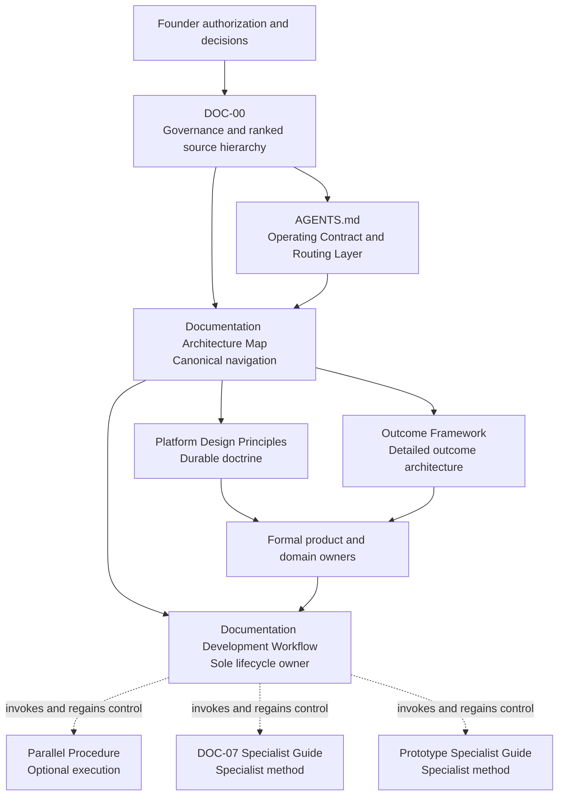

# PayPlus Documentation Architecture Map

## 1. Purpose and Scope

This map is the canonical navigation artifact for the PayPlus documentation operating architecture. It identifies authority, concept ownership, task routing, directory responsibility, and allowed dependencies without redefining governance, lifecycle gates, product rules, or subject frameworks.

## 2. Authority and Dependency Diagram

Arrows show permitted authority, routing, or reference dependency. They do not transfer subject ownership.

## 3. Canonical Ownership Matrix

| Concern | Sole canonical owner | Must not own |
| --- | --- | --- |
| Documentation governance and ranked source precedence | [DOC-00](../00-foundation/doc-00-documentation-governance.md) | Product behavior or lifecycle execution |
| Repository operating contract and routing | [`AGENTS.md`](../../AGENTS.md) | Ranked precedence or lifecycle stages and gates |
| Documentation architecture navigation | This Architecture Map | Governance, lifecycle gates, or subject rules |
| Complete Documentation Lifecycle and lifecycle gates | [Documentation Development Workflow](payplus-documentation-development-workflow.md) | Product/domain rules or specialist methods |
| Durable platform and product design doctrine | [Platform Design Principles](../00-foundation/payplus-platform-design-principles.md) | Detailed outcome mappings or lifecycle rules |
| Outcome → Resolution Strategy → Message/CTA → Notification architecture | [Outcome Framework](../00-foundation/payplus-outcome-message-notification-framework.md) | Route rules, approved copy, delivery policy, or lifecycle rules |
| Parallel execution mechanics | [Parallel-Agent Documentation Procedure](payplus-parallel-agent-documentation-procedure.md) | Proposal, approval, validation, Git, records, push, or completion authority |
| DOC-07 authoring method and specialist checks | [DOC-07 Specialist Guide](payplus-doc-07-design-specification-specialist-guide.md) | Source business rules, notification delivery, event schema, or lifecycle authority |
| Prototype method and specialist checks | [Prototype Specialist Guide](payplus-prototype-design-validation-specialist-guide.md) | Product requirements, general validation, Git, or lifecycle authority |
| Product and domain requirements | Applicable formal `DOC-XX` or governed register | Documentation governance or lifecycle rules |

## 4. Task-Routing Matrix

| Trigger | Start with | Add when applicable | Control returns to |
| --- | --- | --- | --- |
| Any documentation task or Git/records action | `AGENTS.md`, DOC-00, primary owner, Documentation Development Workflow | Relevant subject framework | Documentation Development Workflow |
| Parallel agents, workstreams, review swarm, or worktrees | Documentation Development Workflow | Parallel Procedure | Named canonical lifecycle stage |
| DOC-07 Outcome, Resolution, Message, disclosure, copy, or CTA work | Documentation Development Workflow and owning route/domain document | Outcome Framework and DOC-07 Specialist Guide | Named canonical lifecycle stage |
| Prototype planning, build, review, validation, status change, or retirement | Documentation Development Workflow and source owner | Prototype Specialist Guide; Parallel Procedure only if authorized | Named canonical lifecycle stage |
| Material outcome, unavailable/recovery path, CTA, or notification relationship | Owning route/domain document through the Documentation Development Workflow | Platform Design Principles and Outcome Framework | Owning document and canonical lifecycle |
| Governance, document status, metadata, approval role, or source conflict | DOC-00 through the Documentation Development Workflow | Architecture Map for navigation only | Documentation Development Workflow |

## 5. Non-Duplication Rules

- One material concept has one primary owner and one authoritative definition.
- Only DOC-00 may rank sources or define documentation governance.
- Only the Documentation Development Workflow may define lifecycle stages, gates, roles, lifecycle validation, Git treatment, records treatment, push, or completion.
- A procedure or specialist guide may add methods and evidence only; it must return lifecycle control to the Documentation Development Workflow.
- A routing or navigation document may point to an owner but must not reproduce the owner's detailed rules.
- No document may redefine another document's product, domain, platform, outcome, notification, data, security, testing, operations, or admin framework.

## 6. Directory Ownership Rules

| Directory | Owns |
| --- | --- |
| `docs/00-foundation/` | DOC-00 through DOC-04 formal foundation documents, Platform Design Principles, and Outcome Framework |
| `docs/documentation-system/` | Documentation operating architecture: this map, canonical lifecycle workflow, optional procedures, and specialist documentation guides |
| Product/domain/technical directories | Formal requirements and specifications assigned by DOC-00 and the relevant owner |
| `docs/traceability/`, `docs/diagrams/`, and `docs/prototypes/` | Governed projections, registers, visual aids, and artifacts that derive from formal owners |

Files must be placed according to what they own, not merely where they were first drafted.

## 7. Allowed Dependency and Reference Directions

- DOC-00 may govern every documentation artifact; no artifact may override DOC-00.
- `AGENTS.md` and this map may route to canonical owners but may not define their detailed rules.
- The Documentation Development Workflow may invoke procedures and specialist guides and must regain lifecycle control afterward.
- Procedures and specialist guides may reference DOC-00, the canonical workflow, formal owners, Platform Design Principles, and the Outcome Framework.
- Platform Design Principles and the Outcome Framework may reference formal owners and each other where responsibilities remain distinct.
- Formal and derived documents may reference their owners; derived artifacts must not become upstream authority.
- Circular ownership is prohibited. Bidirectional references are allowed only when each direction has a distinct routing, invocation, or handoff purpose.

## 8. Adding Future Operating Documents

Before adding a workflow, procedure, framework, or specialist guide:

1. identify the single concept it will own and the existing owners it must not duplicate;
2. classify it correctly:
   - **workflow** only for an end-to-end lifecycle with unique authority;
   - **procedure** for an optional execution method inside a workflow;
   - **framework** for a reusable subject model or doctrine;
   - **specialist guide** for task-specific authoring, build, or review methods;
3. confirm no existing owner already covers the concern;
4. define its invocation trigger, inputs, outputs, prohibited ownership, and return path;
5. place operating workflows, procedures, and specialist documentation guides in `docs/documentation-system/`;
6. place durable product or subject frameworks with the applicable foundation or domain owner;
7. update this map, the Documentation System README, `AGENTS.md`, DOC-00 where governance discovery changes, and `docs/README.md` in one governed change;
8. process the addition through the Documentation Development Workflow.

No new document may create a second ranked hierarchy, a competing Documentation Lifecycle, or an implicit approval path.
